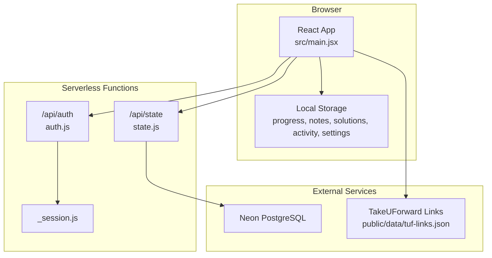
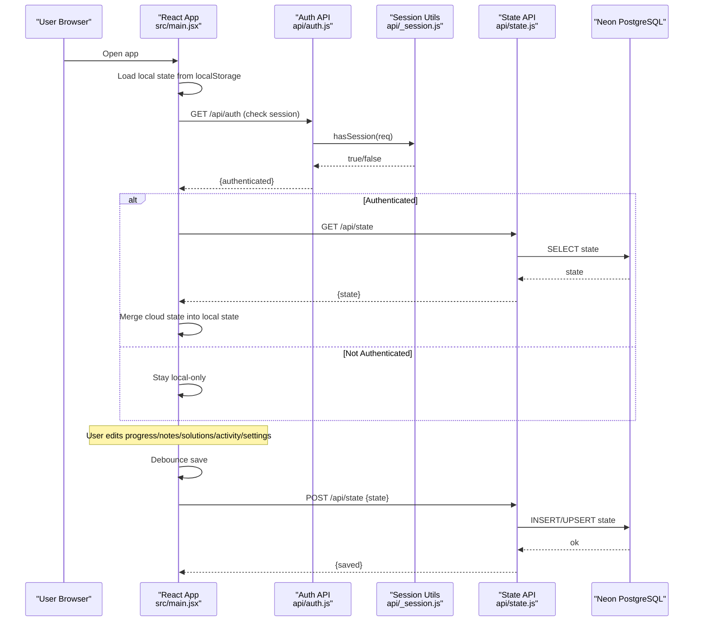
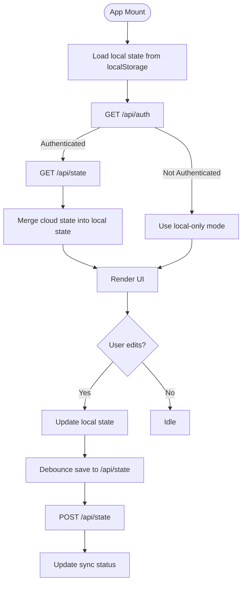
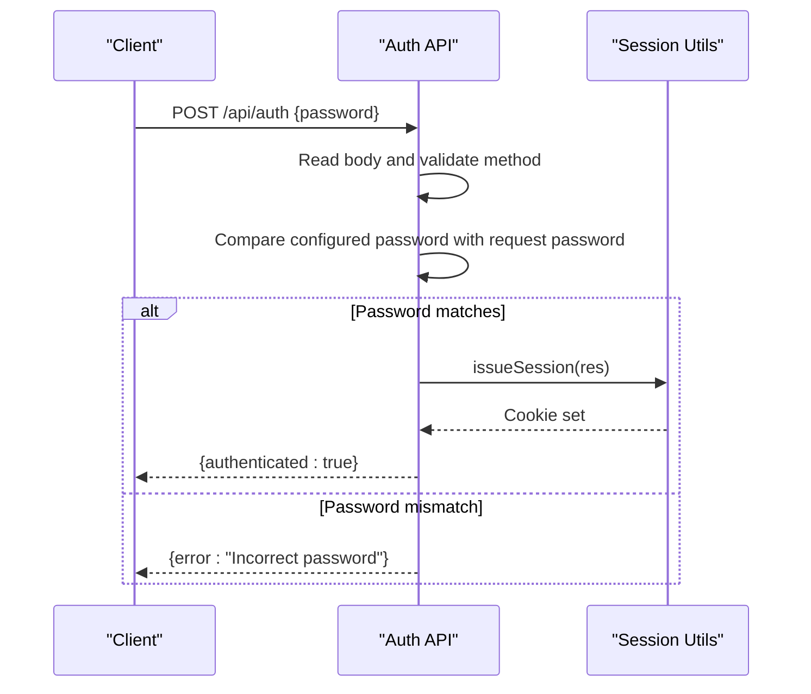
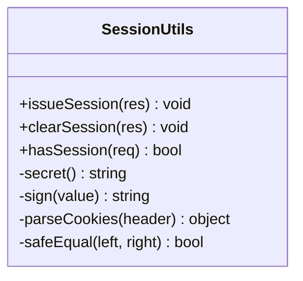
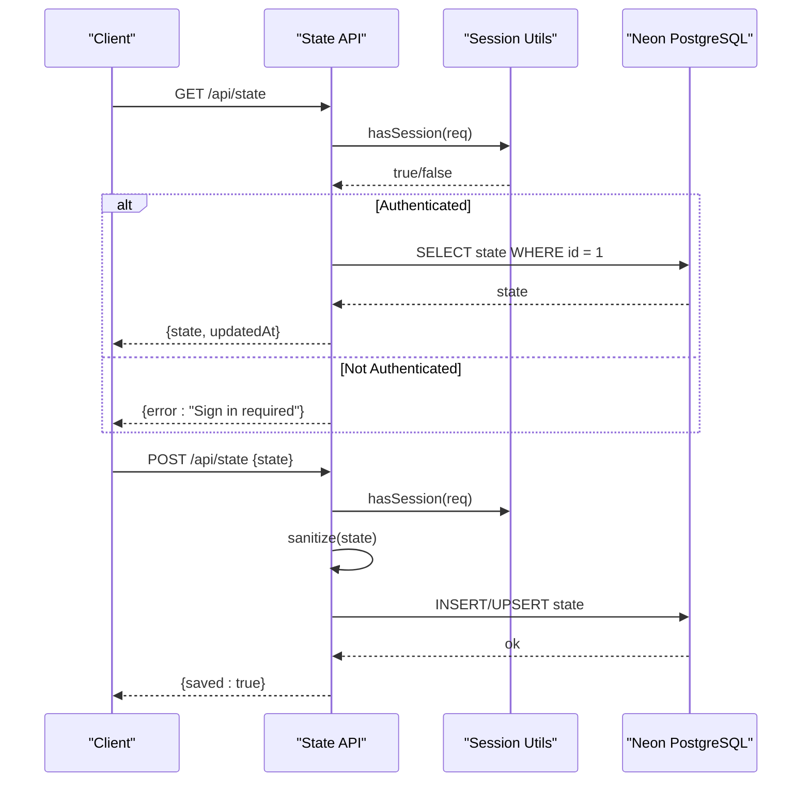
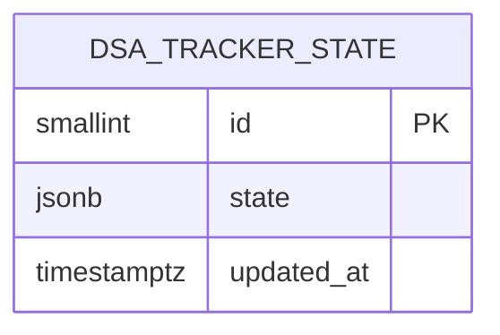
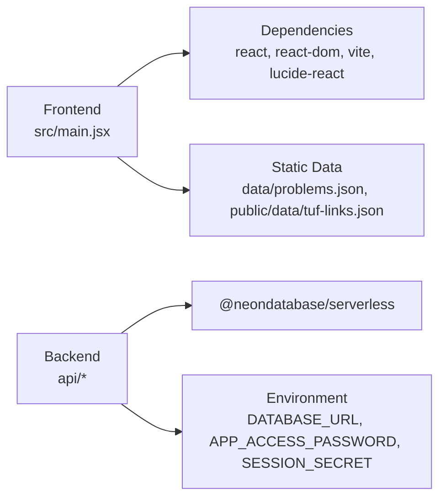
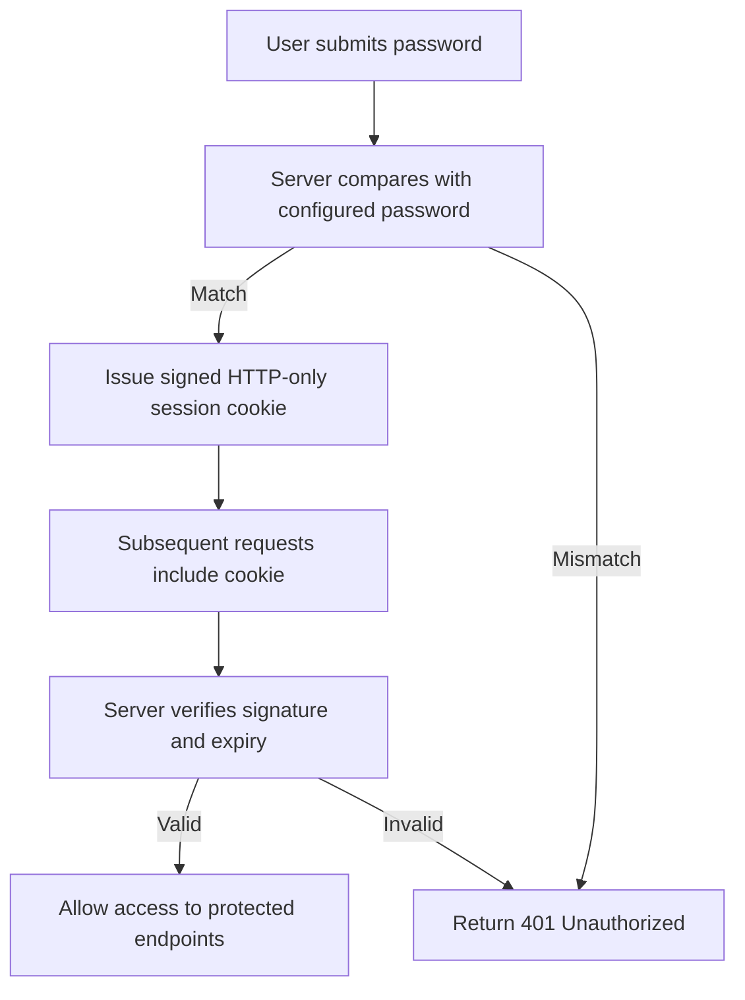

# Architecture Overview

<cite>
**Referenced Files in This Document**
- [src/main.jsx](file://src/main.jsx)
- [api/auth.js](file://api/auth.js)
- [api/_session.js](file://api/_session.js)
- [api/state.js](file://api/state.js)
- [package.json](file://package.json)
- [README.md](file://README.md)
- [data/problems.json](file://data/problems.json)
- [public/data/tuf-links.json](file://public/data/tuf-links.json)
</cite>

## Table of Contents
1. [Introduction](#introduction)
2. [Project Structure](#project-structure)
3. [Core Components](#core-components)
4. [Architecture Overview](#architecture-overview)
5. [Detailed Component Analysis](#detailed-component-analysis)
6. [Dependency Analysis](#dependency-analysis)
7. [Performance Considerations](#performance-considerations)
8. [Security Model](#security-model)
9. [Scalability and Reliability](#scalability-and-reliability)
10. [Troubleshooting Guide](#troubleshooting-guide)
11. [Conclusion](#conclusion)

## Introduction
DSA Tracker is a local-first React application that helps users practice, track, revise, and master problems from the Striver A2Z DSA sheet. It runs entirely offline by default using bundled problem data and browser storage for progress, notes, solutions, activity, and settings. Optional cloud synchronization persists state to a Neon PostgreSQL database via serverless functions when the user connects with an app password. The system integrates with TakeUForward links to provide external references for problems.

## Project Structure
The project is organized into:
- Frontend: React + Vite application under src/ and public/, with all UI logic in a single main component file.
- Backend: Serverless API routes under api/ handling authentication and cloud sync.
- Data: Curated problem sets and mappings under data/ and public/data/.
- Scripts: Utilities to prepare datasets and extract TakeUForward links.

**Diagram sources**
- [src/main.jsx:47-173](file://src/main.jsx#L47-L173)
- [api/auth.js:8-23](file://api/auth.js#L8-L23)
- [api/_session.js:29-51](file://api/_session.js#L29-L51)
- [api/state.js:23-50](file://api/state.js#L23-L50)
- [public/data/tuf-links.json:1-20](file://public/data/tuf-links.json#L1-L20)

**Section sources**
- [src/main.jsx:1-173](file://src/main.jsx#L1-L173)
- [package.json:1-21](file://package.json#L1-L21)
- [README.md:1-59](file://README.md#L1-L59)

## Core Components
- Frontend entrypoint and UI: The entire React application is implemented in a single file with multiple components (App, Dashboard, Roadmap, Revision, Patterns, Analytics, Problem, SettingsPage). It manages local state via localStorage and optional cloud sync.
- Authentication endpoint: Validates a single app password and issues an HTTP-only session cookie.
- Session utilities: Signs and verifies cookies using HMAC with a secret, enforces expiration, and supports clearing sessions.
- State persistence endpoint: Reads/writes a JSONB document representing user state to Neon PostgreSQL after sanitization and session validation.

Key responsibilities:
- Local-first state: All user data is persisted in the browser first; cloud sync is opt-in and asynchronous.
- Cloud sync: Periodically saves the current local state to the server if authenticated; loads initial state on sign-in.
- External integrations: Loads TakeUForward links and LeetCode URLs for problem context.

**Section sources**
- [src/main.jsx:29-114](file://src/main.jsx#L29-L114)
- [api/auth.js:8-23](file://api/auth.js#L8-L23)
- [api/_session.js:1-54](file://api/_session.js#L1-L54)
- [api/state.js:1-50](file://api/state.js#L1-L50)

## Architecture Overview
The system follows a local-first architecture with optional cloud synchronization:
- The React UI reads and writes to localStorage for immediate responsiveness.
- On sign-in, the client authenticates with the server, receives an HTTP-only session cookie, and loads any existing cloud state to merge with local data.
- Changes are debounced and periodically saved to the server while maintaining local copies.
- The server validates requests using session cookies and persists data to Neon PostgreSQL.

**Diagram sources**
- [src/main.jsx:64-113](file://src/main.jsx#L64-L113)
- [api/auth.js:8-23](file://api/auth.js#L8-L23)
- [api/_session.js:41-51](file://api/_session.js#L41-L51)
- [api/state.js:23-50](file://api/state.js#L23-L50)

## Detailed Component Analysis

### Frontend Application (src/main.jsx)
- Single-file React application with multiple functional components:
  - App: Root component managing global state, routing between pages, and orchestrating cloud sync.
  - Dashboard: Summarizes stats, due revisions, next problems, and weak areas.
  - Roadmap: Groups problems by topic and pattern with filters and sorting.
  - Revision: Displays due and upcoming revisions based on spaced repetition schedule.
  - Patterns: Visualizes completion per pattern with external solution links.
  - Analytics: Aggregates status, confidence, difficulty, and activity metrics.
  - Problem: Per-problem editing of notes, solutions, metadata, and revision scheduling.
  - SettingsPage: Handles export/import/reset and cloud sync connection/disconnection.

Data flow highlights:
- Local state hooks persist to localStorage automatically.
- Cloud state is loaded on startup if authenticated; changes are debounced and saved to /api/state.
- External resources (problems, solutions, TakeUForward links) are fetched from static JSON files.

**Diagram sources**
- [src/main.jsx:47-114](file://src/main.jsx#L47-L114)
- [src/main.jsx:156-173](file://src/main.jsx#L156-L173)

**Section sources**
- [src/main.jsx:47-173](file://src/main.jsx#L47-L173)
- [src/main.jsx:175-609](file://src/main.jsx#L175-L609)

### Authentication Endpoint (api/auth.js)
- Supports GET to check session status, DELETE to clear session, and POST to authenticate with an app password.
- Uses constant-time comparison to prevent timing attacks.
- Issues an HTTP-only session cookie upon successful authentication.

**Diagram sources**
- [api/auth.js:8-23](file://api/auth.js#L8-L23)
- [api/_session.js:29-34](file://api/_session.js#L29-L34)

**Section sources**
- [api/auth.js:1-24](file://api/auth.js#L1-L24)

### Session Management (api/_session.js)
- Creates signed cookies using HMAC-SHA256 with a server-side secret.
- Parses cookies, verifies signatures, and checks expiration.
- Supports issuing and clearing sessions with appropriate flags (HttpOnly, SameSite, Secure in production).

**Diagram sources**
- [api/_session.js:1-54](file://api/_session.js#L1-L54)

**Section sources**
- [api/_session.js:1-54](file://api/_session.js#L1-L54)

### State Persistence Endpoint (api/state.js)
- Requires a valid session; otherwise returns 401.
- Sanitizes incoming state to ensure only expected fields are persisted.
- Uses Neon serverless driver to create or read a single-row JSONB record representing the user’s tracker state.
- Upserts state on POST to maintain last-write-wins semantics.

**Diagram sources**
- [api/state.js:23-50](file://api/state.js#L23-L50)
- [api/_session.js:41-51](file://api/_session.js#L41-L51)

**Section sources**
- [api/state.js:1-51](file://api/state.js#L1-L51)

### Data Models and Integrations
- Problems dataset: Bundled JSON array with identifiers, titles, topics, patterns, difficulties, and optional URLs.
- TakeUForward links: Mapping from problem IDs to external resource URLs used within the UI.
- Database schema: Single-row JSONB table storing progress, notes, solutions, activity, and settings.

**Diagram sources**
- [api/state.js:28-44](file://api/state.js#L28-L44)

**Section sources**
- [data/problems.json:1-200](file://data/problems.json#L1-L200)
- [public/data/tuf-links.json:1-200](file://public/data/tuf-links.json#L1-L200)
- [api/state.js:28-44](file://api/state.js#L28-L44)

## Dependency Analysis
- Frontend dependencies: React, ReactDOM, Vite, Lucide icons.
- Backend dependencies: Neon serverless driver for PostgreSQL.
- Integration points:
  - Static JSON assets for problems and TakeUForward links.
  - Environment variables for secrets and database URL.

**Diagram sources**
- [package.json:12-19](file://package.json#L12-L19)
- [api/state.js:1-2](file://api/state.js#L1-L2)
- [src/main.jsx:7-10](file://src/main.jsx#L7-L10)

**Section sources**
- [package.json:1-21](file://package.json#L1-L21)
- [api/state.js:1-5](file://api/state.js#L1-L5)
- [src/main.jsx:7-10](file://src/main.jsx#L7-L10)

## Performance Considerations
- Local-first design ensures fast UI interactions without network latency.
- Debounced cloud saves reduce unnecessary network calls and server load.
- Single-row JSONB storage simplifies reads/writes and avoids complex queries.
- Static data bundling eliminates runtime fetch overhead for problem lists.

[No sources needed since this section provides general guidance]

## Security Model
- Password-based authentication: A single app password is validated server-side using constant-time comparison to mitigate timing attacks.
- Session cookies: Signed with HMAC using a server-side secret; HttpOnly and SameSite=Lax; Secure flag enabled in production environments.
- Input sanitization: Incoming state is sanitized to allow only known fields before persistence.
- Secrets management: DATABASE_URL, APP_ACCESS_PASSWORD, and SESSION_SECRET are environment variables not exposed to the client.

**Diagram sources**
- [api/auth.js:16-22](file://api/auth.js#L16-L22)
- [api/_session.js:29-51](file://api/_session.js#L29-L51)

**Section sources**
- [api/auth.js:1-24](file://api/auth.js#L1-L24)
- [api/_session.js:1-54](file://api/_session.js#L1-L54)
- [api/state.js:12-21](file://api/state.js#L12-L21)

## Scalability and Reliability
- Stateless serverless functions scale horizontally with demand.
- Single-user design reduces contention; last-write-wins behavior handles concurrent edits gracefully.
- Neon PostgreSQL provides managed scaling and reliability for the persistent state store.
- Local-first approach minimizes dependency on backend availability for core functionality.

[No sources needed since this section provides general guidance]

## Troubleshooting Guide
Common issues and resolutions:
- Cloud sync unavailable: Ensure DATABASE_URL is configured and accessible; verify session cookie presence.
- Authentication failures: Confirm APP_ACCESS_PASSWORD matches the value entered in Settings; check for correct environment configuration.
- Session expired: Re-authenticate via Settings to refresh the session cookie.
- Data loss risk: Export backups regularly; local storage is device/browser specific.

**Section sources**
- [README.md:35-59](file://README.md#L35-L59)
- [api/state.js:23-50](file://api/state.js#L23-L50)
- [api/auth.js:8-23](file://api/auth.js#L8-L23)

## Conclusion
DSA Tracker combines a responsive local-first React interface with optional cloud synchronization backed by Neon PostgreSQL. Its architecture emphasizes security through signed session cookies and input sanitization, simplicity via a single-row JSONB store, and extensibility through static data and external link integrations. The system is designed for a single user, prioritizing privacy and ease of use while providing robust tracking, revision scheduling, and analytics.

[No sources needed since this section summarizes without analyzing specific files]