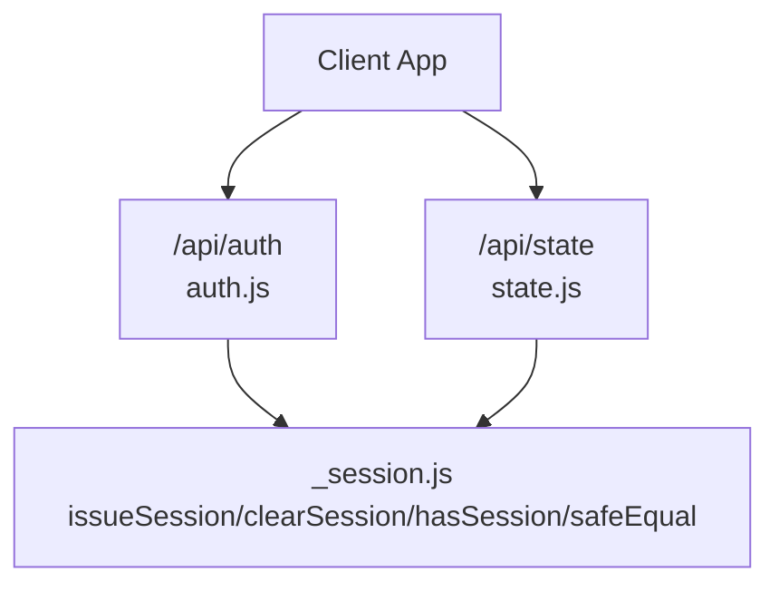
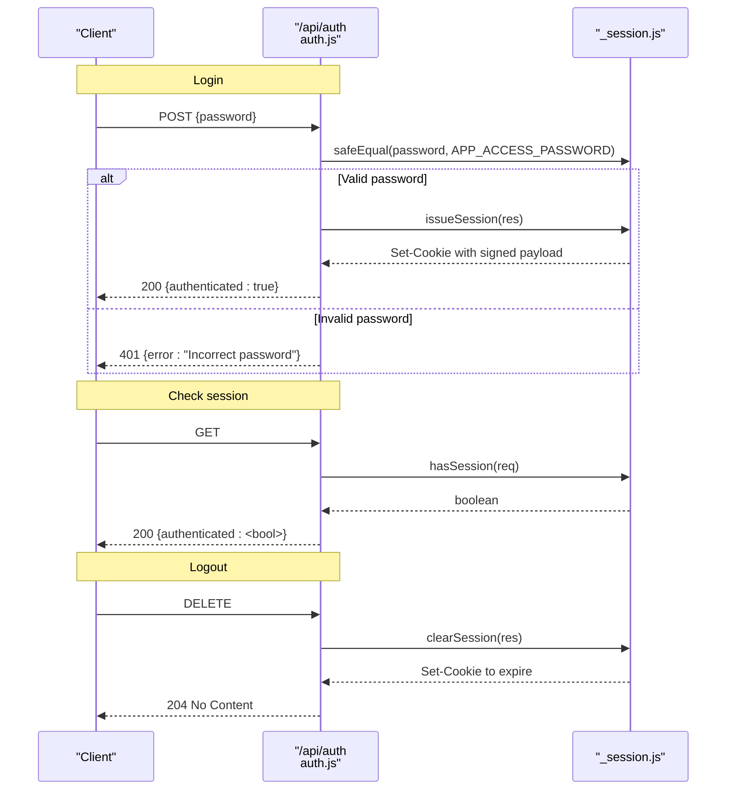
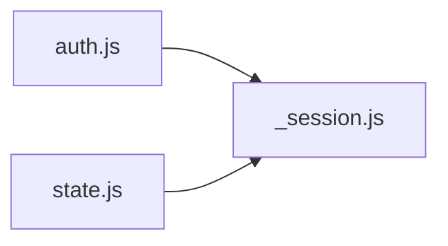

# Authentication System

<cite>
**Referenced Files in This Document**
- [auth.js](file://api/auth.js)
- [_session.js](file://api/_session.js)
- [state.js](file://api/state.js)
- [README.md](file://README.md)
</cite>

## Table of Contents
1. [Introduction](#introduction)
2. [Project Structure](#project-structure)
3. [Core Components](#core-components)
4. [Architecture Overview](#architecture-overview)
5. [Detailed Component Analysis](#detailed-component-analysis)
6. [Dependency Analysis](#dependency-analysis)
7. [Performance Considerations](#performance-considerations)
8. [Troubleshooting Guide](#troubleshooting-guide)
9. [Conclusion](#conclusion)
10. [Appendices](#appendices)

## Introduction
This document explains the authentication system implemented for the application. It covers:
- Password-based login via POST /api/auth
- Session checking via GET /api/auth
- Logout via DELETE /api/auth
- Secure password verification using a timing-safe comparison to prevent timing attacks
- Session creation and cookie management
- Security considerations including environment variables, session expiration, and protection against common vulnerabilities
- Example client-side usage patterns and error response formats

## Project Structure
The authentication logic is split across two primary files:
- api/auth.js: HTTP route handler for authentication endpoints
- api/_session.js: Session utilities (cookie signing, validation, expiration checks)

A protected resource endpoint demonstrates how sessions are enforced:
- api/state.js: Requires a valid session before accessing cloud state

**Diagram sources**
- [auth.js:8-23](file://api/auth.js#L8-L23)
- [_session.js:23-51](file://api/_session.js#L23-L51)
- [state.js:23-26](file://api/state.js#L23-L26)

**Section sources**
- [auth.js:1-23](file://api/auth.js#L1-L23)
- [_session.js:1-54](file://api/_session.js#L1-L54)
- [state.js:1-51](file://api/state.js#L1-L51)

## Core Components
- Authentication handler (POST/GET/DELETE): Validates credentials, issues or clears sessions, and reports current authentication status.
- Session module: Creates signed cookies with expiration, validates incoming sessions, and provides timing-safe string comparison.
- Protected resource guard: Enforces session presence on sensitive endpoints.

Key responsibilities:
- POST /api/auth: Accepts a password, verifies it securely, and sets an HttpOnly session cookie on success.
- GET /api/auth: Returns whether the current request has a valid session.
- DELETE /api/auth: Clears the session cookie to log out.
- hasSession: Parses and validates the session cookie signature and expiration.
- safeEqual: Prevents timing side-channel attacks during password comparison.

**Section sources**
- [auth.js:8-23](file://api/auth.js#L8-L23)
- [_session.js:23-51](file://api/_session.js#L23-L51)
- [state.js:23-26](file://api/state.js#L23-L26)

## Architecture Overview
The authentication flow uses a simple password gate followed by a signed, expiring session cookie. Subsequent requests carry this cookie; the server validates its signature and expiry before granting access.

**Diagram sources**
- [auth.js:8-23](file://api/auth.js#L8-L23)
- [_session.js:29-51](file://api/_session.js#L29-L51)

## Detailed Component Analysis

### Authentication Handler (/api/auth)
- POST /api/auth
  - Reads the JSON body and extracts the password field.
  - Compares the provided password with the configured secret using a timing-safe function.
  - On success, issues a session cookie and returns a success response.
  - On failure, returns an unauthorized response.
- GET /api/auth
  - Returns whether the current request has a valid session.
- DELETE /api/auth
  - Clears the session cookie and responds with no content.

Security notes:
- Uses a timing-safe comparison to avoid leaking information about the correct password through timing differences.
- Does not store passwords in memory beyond the request scope.
- Returns minimal error details to avoid leaking configuration state.

**Section sources**
- [auth.js:3-23](file://api/auth.js#L3-L23)

### Session Module (_session.js)
- secure password comparison
  - safeEqual converts both inputs to buffers and compares them using a constant-time algorithm after ensuring equal length.
- session creation
  - issueSession builds a base64url-encoded payload containing an expiration timestamp, signs it with HMAC-SHA256 using a server-only secret, and sets an HttpOnly cookie with SameSite=Lax and Max-Age set to 30 days. In Vercel environments, the Secure flag is added.
- session validation
  - hasSession parses the cookie, splits into payload and signature, recomputes the signature, and checks that the expiration time is still in the future. Any parsing or validation failure results in false.
- session clearing
  - clearSession sets the same cookie with Max-Age=0 to expire it immediately.

Cookie attributes:
- Name: dsa_tracker_session
- Path: /
- HttpOnly: true
- SameSite: Lax
- Max-Age: 30 days
- Secure: enabled when running on Vercel

Environment requirements:
- SESSION_SECRET must be present; otherwise, signing fails.
- VERCEL environment variable toggles Secure cookie behavior.

**Section sources**
- [_session.js:6-14](file://api/_session.js#L6-L14)
- [_session.js:16-27](file://api/_session.js#L16-L27)
- [_session.js:29-39](file://api/_session.js#L29-L39)
- [_session.js:41-51](file://api/_session.js#L41-L51)

### Protected Resource Guard (/api/state)
- Enforces authentication by calling hasSession at the start of the handler.
- If no valid session is present, returns an unauthorized response.
- Proceeds to interact with the database only after successful session validation.

This pattern ensures that sensitive operations require a verified session cookie.

**Section sources**
- [state.js:1-26](file://api/state.js#L1-L26)

### Flowchart: Session Validation

**Diagram sources**
- [_session.js:41-51](file://api/_session.js#L41-L51)

## Dependency Analysis
- auth.js depends on _session.js for:
  - safeEqual
  - issueSession
  - clearSession
  - hasSession
- state.js depends on _session.js for:
  - hasSession

**Diagram sources**
- [auth.js:1](file://api/auth.js#L1)
- [state.js:2](file://api/state.js#L2)
- [_session.js:53-54](file://api/_session.js#L53-L54)

**Section sources**
- [auth.js:1](file://api/auth.js#L1)
- [state.js:1-3](file://api/state.js#L1-L3)
- [_session.js:53-54](file://api/_session.js#L53-L54)

## Performance Considerations
- Timing-safe comparison avoids early exits based on character mismatches, preventing timing side channels at the cost of constant-time processing.
- Session validation performs HMAC recomputation and JSON parsing per request; ensure these operations remain lightweight.
- Cookie size is small (base64url payload plus signature), minimizing overhead.

[No sources needed since this section provides general guidance]

## Troubleshooting Guide
Common issues and resolutions:
- Missing SESSION_SECRET
  - Symptom: Signing or validation fails; may throw an error indicating the secret is not configured.
  - Resolution: Provide SESSION_SECRET in your environment.
- Incorrect or missing APP_ACCESS_PASSWORD
  - Symptom: Login always fails with an incorrect password error.
  - Resolution: Ensure APP_ACCESS_PASSWORD is set and matches what clients send.
- Browser does not send cookies
  - Symptom: GET /api/auth returns unauthenticated even after login.
  - Resolution: Verify cookies are allowed, not blocked by privacy settings, and that requests include credentials if cross-origin.
- CORS and credentials
  - When making authenticated requests from a browser, ensure the server allows credentials and the client includes credentials in fetch calls.
- Session expired
  - Symptom: Subsequent requests return unauthenticated.
  - Resolution: Re-authenticate to obtain a new session cookie.

**Section sources**
- [_session.js:6-14](file://api/_session.js#L6-L14)
- [auth.js:16-22](file://api/auth.js#L16-L22)
- [state.js:23-26](file://api/state.js#L23-L26)

## Conclusion
The authentication system implements a simple yet secure model:
- A single shared password gates access.
- Successful login issues a signed, expiring, HttpOnly cookie.
- Subsequent requests validate the cookie’s signature and expiration.
- Logging out clears the session cookie.
This design balances simplicity with strong security practices such as timing-safe comparisons, HMAC-signed payloads, and strict cookie attributes.

[No sources needed since this section summarizes without analyzing specific files]

## Appendices

### API Endpoints Summary
- POST /api/auth
  - Request body: JSON object with a password field
  - Success: 200 with authenticated flag
  - Failure: 401 with error message
- GET /api/auth
  - Success: 200 with authenticated flag indicating current session validity
- DELETE /api/auth
  - Success: 204 No Content; session cookie cleared

Error response examples:
- 401 Unauthorized: { "error": "Incorrect password" }
- 401 Unauthorized (protected resource): { "error": "Sign in required" }
- 405 Method Not Allowed: { "error": "Method not allowed" }

**Section sources**
- [auth.js:8-23](file://api/auth.js#L8-L23)
- [state.js:23-26](file://api/state.js#L23-L26)

### Environment Variables
- APP_ACCESS_PASSWORD: Strong password used to authenticate users. Must be set in server environment.
- SESSION_SECRET: Random secret used to sign session cookies. Must be set in server environment.
- DATABASE_URL: Required for protected data endpoints.
- VERCEL: Optional flag enabling Secure cookie attribute in hosted environments.

Configuration guidance:
- Do not expose secrets to the client; keep them server-only.
- Use a sufficiently long random value for SESSION_SECRET.

**Section sources**
- [README.md:35-52](file://README.md#L35-L52)
- [_session.js:6-14](file://api/_session.js#L6-L14)
- [auth.js:16-18](file://api/auth.js#L16-L18)
- [state.js:25](file://api/state.js#L25)

### Client-Side Usage Examples
General steps:
- Login
  - Send a POST request to /api/auth with a JSON body containing the password.
  - On success, the browser will receive a Set-Cookie header with an HttpOnly cookie.
- Check session
  - Send a GET request to /api/auth. The response indicates whether a valid session exists.
- Logout
  - Send a DELETE request to /api/auth to clear the session cookie.

Important notes:
- Include credentials in fetch calls when making cross-origin requests so cookies are sent automatically.
- Handle 401 responses by prompting the user to log in again.

Example patterns (conceptual):
- Fetch with credentials:
  - Use fetch with credentials: "include" to ensure cookies are included.
- Error handling:
  - On 401, redirect to login or prompt for credentials.
  - On network errors, retry with backoff or inform the user.

[No sources needed since this section provides conceptual guidance]

### Security Considerations
- Timing attacks: Mitigated by using a timing-safe comparison for password verification.
- Cookie security:
  - HttpOnly prevents JavaScript access to the session cookie.
  - SameSite=Lax reduces CSRF risk for top-level navigations.
  - Secure flag is enabled in production hosting environments.
- Expiration: Sessions expire after a fixed duration; re-authentication is required afterward.
- Single-user model: The app is designed for one user sharing a single password; do not share the password.
- Secret management: Keep APP_ACCESS_PASSWORD and SESSION_SECRET in server-only environment variables.

**Section sources**
- [_session.js:23-39](file://api/_session.js#L23-L39)
- [README.md:35-52](file://README.md#L35-L52)