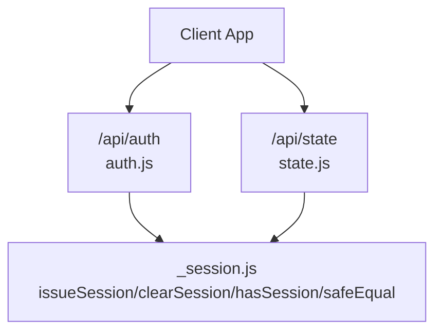
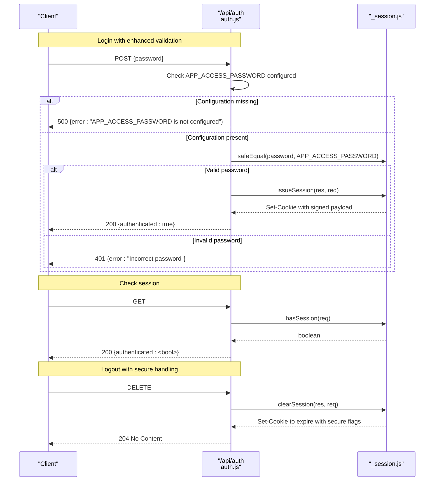
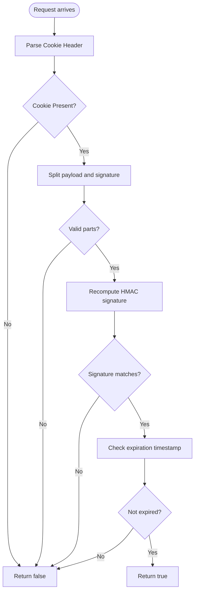
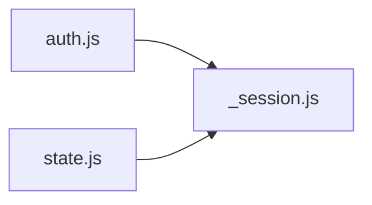

# Authentication System

<cite>
**Referenced Files in This Document**
- [auth.js](file://api/auth.js)
- [_session.js](file://api/_session.js)
- [state.js](file://api/state.js)
- [README.md](file://README.md)
</cite>

## Update Summary
**Changes Made**
- Enhanced error handling for missing APP_ACCESS_PASSWORD configuration variable
- Improved session creation/destruction with proper error handling and graceful offline scenario support
- Updated logout functionality to support secure cookie handling in various environments
- Added comprehensive error response formats for configuration issues

## Table of Contents
1. [Introduction](#introduction)
2. [Project Structure](#project-structure)
3. [Core Components](#core-components)
4. [Architecture Overview](#architecture-overview)
5. [Detailed Component Analysis](#detailed-component-analysis)
6. [Dependency Analysis](#dependency-analysis)
7. [Performance Considerations](#performance-considerations)
8. [Troubleshooting Guide](#troubleshooting-guide)
9. [Conclusion](#conclusion)
10. [Appendices](#appendices)

## Introduction
This document explains the authentication system implemented for the application. It covers:
- Password-based login via POST /api/auth with enhanced configuration validation
- Session checking via GET /api/auth
- Logout via DELETE /api/auth with improved error handling
- Secure password verification using a timing-safe comparison to prevent timing attacks
- Session creation and cookie management with robust error handling
- Security considerations including environment variables, session expiration, and protection against common vulnerabilities
- Example client-side usage patterns and comprehensive error response formats

## Project Structure
The authentication logic is split across two primary files:
- api/auth.js: HTTP route handler for authentication endpoints with enhanced error handling
- api/_session.js: Session utilities (cookie signing, validation, expiration checks)

A protected resource endpoint demonstrates how sessions are enforced:
- api/state.js: Requires a valid session before accessing cloud state

**Diagram sources**
- [auth.js:8-29](file://api/auth.js#L8-L29)
- [_session.js:23-57](file://api/_session.js#L23-L57)
- [state.js:42-45](file://api/state.js#L42-L45)

**Section sources**
- [auth.js:1-30](file://api/auth.js#L1-L30)
- [_session.js:1-60](file://api/_session.js#L1-L60)
- [state.js:1-66](file://api/state.js#L1-L66)

## Core Components
- Authentication handler (POST/GET/DELETE): Validates credentials with enhanced configuration checking, issues or clears sessions with proper error handling, and reports current authentication status.
- Session module: Creates signed cookies with expiration, validates incoming sessions, provides timing-safe string comparison, and handles secure cookie attributes based on request context.
- Protected resource guard: Enforces session presence on sensitive endpoints.

Key responsibilities:
- POST /api/auth: Accepts a password, validates APP_ACCESS_PASSWORD configuration, verifies it securely with enhanced error handling, and sets an HttpOnly session cookie on success.
- GET /api/auth: Returns whether the current request has a valid session.
- DELETE /api/auth: Clears the session cookie with proper secure cookie handling and responds with no content.
- hasSession: Parses and validates the session cookie signature and expiration with graceful error handling.
- safeEqual: Prevents timing side-channel attacks during password comparison.

**Section sources**
- [auth.js:8-29](file://api/auth.js#L8-L29)
- [_session.js:23-57](file://api/_session.js#L23-L57)
- [state.js:42-45](file://api/state.js#L42-L45)

## Architecture Overview
The authentication flow uses a simple password gate followed by a signed, expiring session cookie. The system includes enhanced error handling for configuration issues and supports graceful degradation in various deployment scenarios.

**Diagram sources**
- [auth.js:8-29](file://api/auth.js#L8-L29)
- [_session.js:35-45](file://api/_session.js#L35-L45)

## Detailed Component Analysis

### Authentication Handler (/api/auth)
- POST /api/auth
  - Reads the JSON body and extracts the password field.
  - **Enhanced**: Checks if APP_ACCESS_PASSWORD is configured before proceeding with authentication.
  - Compares the provided password with the configured secret using a timing-safe function.
  - **Enhanced**: Wraps session creation in try-catch to handle SESSION_SECRET configuration issues gracefully.
  - On success, issues a session cookie and returns a success response.
  - On failure, returns appropriate error responses (401 for wrong password, 500 for configuration issues).
- GET /api/auth
  - Returns whether the current request has a valid session.
- DELETE /api/auth
  - **Enhanced**: Now accepts both res and req parameters to handle secure cookie settings properly.
  - Clears the session cookie with appropriate secure flags and responds with no content.

Security notes:
- Uses a timing-safe comparison to avoid leaking information about the correct password through timing differences.
- Does not store passwords in memory beyond the request scope.
- Returns minimal error details to avoid leaking configuration state.
- **Enhanced**: Provides specific error messages for configuration issues to aid in debugging.

**Updated** Enhanced error handling for missing APP_ACCESS_PASSWORD and improved session creation error handling.

**Section sources**
- [auth.js:3-29](file://api/auth.js#L3-L29)

### Session Module (_session.js)
- secure password comparison
  - safeEqual converts both inputs to buffers and compares them using a constant-time algorithm after ensuring equal length.
- session creation
  - **Enhanced**: issueSession builds a base64url-encoded payload containing an expiration timestamp, signs it with HMAC-SHA256 using a server-only secret, and sets an HttpOnly cookie with SameSite=Lax and Max-Age set to 30 days. In Vercel environments or HTTPS requests, the Secure flag is added automatically.
- session validation
  - hasSession parses the cookie, splits into payload and signature, recomputes the signature, and checks that the expiration time is still in the future. Any parsing or validation failure results in false.
- session clearing
  - **Enhanced**: clearSession now accepts both res and req parameters to determine secure cookie flags based on the request context, supporting graceful offline scenarios.

Cookie attributes:
- Name: dsa_tracker_session
- Path: /
- HttpOnly: true
- SameSite: Lax
- Max-Age: 30 days
- Secure: enabled when running on Vercel or HTTPS requests

Environment requirements:
- SESSION_SECRET must be present; otherwise, signing fails with a descriptive error.
- VERCEL environment variable toggles Secure cookie behavior.
- **Enhanced**: APP_ACCESS_PASSWORD is now validated at the API layer before authentication attempts.

**Updated** Improved secure cookie handling and enhanced error handling throughout the session management functions.

**Section sources**
- [_session.js:6-14](file://api/_session.js#L6-L14)
- [_session.js:16-27](file://api/_session.js#L16-L27)
- [_session.js:29-45](file://api/_session.js#L29-L45)
- [_session.js:47-57](file://api/_session.js#L47-L57)

### Protected Resource Guard (/api/state)
- Enforces authentication by calling hasSession at the start of the handler.
- If no valid session is present, returns an unauthorized response.
- Proceeds to interact with the database only after successful session validation.

This pattern ensures that sensitive operations require a verified session cookie.

**Section sources**
- [state.js:42-45](file://api/state.js#L42-L45)

### Flowchart: Session Validation

**Diagram sources**
- [_session.js:47-57](file://api/_session.js#L47-L57)

## Dependency Analysis
- auth.js depends on _session.js for:
  - safeEqual
  - issueSession
  - clearSession
  - hasSession
- state.js depends on _session.js for:
  - hasSession

**Diagram sources**
- [auth.js:1](file://api/auth.js#L1)
- [state.js:2](file://api/state.js#L2)
- [_session.js:59-60](file://api/_session.js#L59-L60)

**Section sources**
- [auth.js:1](file://api/auth.js#L1)
- [state.js:1-3](file://api/state.js#L1-L3)
- [_session.js:59-60](file://api/_session.js#L59-L60)

## Performance Considerations
- Timing-safe comparison avoids early exits based on character mismatches, preventing timing side channels at the cost of constant-time processing.
- Session validation performs HMAC recomputation and JSON parsing per request; ensure these operations remain lightweight.
- Cookie size is small (base64url payload plus signature), minimizing overhead.
- **Enhanced**: Configuration validation happens once per request, avoiding unnecessary processing when required environment variables are missing.

## Troubleshooting Guide
Common issues and resolutions:
- Missing SESSION_SECRET
  - Symptom: Signing or validation fails; may throw an error indicating the secret is not configured.
  - Resolution: Provide SESSION_SECRET in your environment.
- **Enhanced**: Missing or incorrect APP_ACCESS_PASSWORD
  - Symptom: Login always fails with "APP_ACCESS_PASSWORD is not configured" error.
  - Resolution: Ensure APP_ACCESS_PASSWORD is set in your environment variables.
- Browser does not send cookies
  - Symptom: GET /api/auth returns unauthenticated even after login.
  - Resolution: Verify cookies are allowed, not blocked by privacy settings, and that requests include credentials if cross-origin.
- CORS and credentials
  - When making authenticated requests from a browser, ensure the server allows credentials and the client includes credentials in fetch calls.
- Session expired
  - Symptom: Subsequent requests return unauthenticated.
  - Resolution: Re-authenticate to obtain a new session cookie.
- **Enhanced**: Secure cookie issues in development
  - Symptom: Cookies not being set or sent in local development.
  - Resolution: Ensure you're using HTTPS or configure your development environment to simulate HTTPS headers.

**Updated** Added troubleshooting guidance for enhanced error handling and secure cookie configuration.

**Section sources**
- [_session.js:6-14](file://api/_session.js#L6-L14)
- [auth.js:16-27](file://api/auth.js#L16-L27)
- [state.js:42-45](file://api/state.js#L42-L45)

## Conclusion
The authentication system implements a simple yet secure model with enhanced error handling:
- A single shared password gates access with proper configuration validation.
- Successful login issues a signed, expiring, HttpOnly cookie with secure attribute handling.
- Subsequent requests validate the cookie's signature and expiration.
- Logging out clears the session cookie with proper secure cookie handling.
- **Enhanced**: Comprehensive error handling for configuration issues and graceful degradation in various deployment scenarios.
This design balances simplicity with strong security practices such as timing-safe comparisons, HMAC-signed payloads, strict cookie attributes, and robust error handling.

## Appendices

### API Endpoints Summary
- POST /api/auth
  - Request body: JSON object with a password field
  - Success: 200 with authenticated flag
  - Failure: 401 with error message or 500 for configuration issues
- GET /api/auth
  - Success: 200 with authenticated flag indicating current session validity
- DELETE /api/auth
  - Success: 204 No Content; session cookie cleared

Error response examples:
- 401 Unauthorized: { "error": "Incorrect password" }
- 500 Internal Server Error: { "error": "APP_ACCESS_PASSWORD is not configured" }
- 500 Internal Server Error: { "error": "SESSION_SECRET is not configured" }
- 401 Unauthorized (protected resource): { "error": "Sign in required" }
- 405 Method Not Allowed: { "error": "Method not allowed" }

**Updated** Added new error response formats for enhanced error handling.

**Section sources**
- [auth.js:8-29](file://api/auth.js#L8-L29)
- [state.js:42-45](file://api/state.js#L42-L45)

### Environment Variables
- APP_ACCESS_PASSWORD: Strong password used to authenticate users. Must be set in server environment.
- SESSION_SECRET: Random secret used to sign session cookies. Must be set in server environment.
- DATABASE_URL: Required for protected data endpoints.
- VERCEL: Optional flag enabling Secure cookie attribute in hosted environments.

Configuration guidance:
- Do not expose secrets to the client; keep them server-only.
- Use a sufficiently long random value for SESSION_SECRET.
- **Enhanced**: Ensure all required environment variables are properly configured before deployment.

**Updated** Enhanced configuration guidance for better deployment reliability.

**Section sources**
- [README.md:35-52](file://README.md#L35-L52)
- [_session.js:6-14](file://api/_session.js#L6-L14)
- [auth.js:16-18](file://api/auth.js#L16-L18)
- [state.js:44](file://api/state.js#L44)

### Client-Side Usage Examples
General steps:
- Login
  - Send a POST request to /api/auth with a JSON body containing the password.
  - Handle configuration errors (500 status) by prompting user to check server configuration.
  - On success, the browser will receive a Set-Cookie header with an HttpOnly cookie.
- Check session
  - Send a GET request to /api/auth. The response indicates whether a valid session exists.
- Logout
  - Send a DELETE request to /api/auth to clear the session cookie.

Important notes:
- Include credentials in fetch calls when making cross-origin requests so cookies are sent automatically.
- Handle 401 responses by prompting the user to log in again.
- **Enhanced**: Handle 500 responses by displaying configuration error messages to users.

Example patterns (conceptual):
- Fetch with credentials:
  - Use fetch with credentials: "include" to ensure cookies are included.
- Error handling:
  - On 401, redirect to login or prompt for credentials.
  - On 500 configuration errors, display appropriate error messages.
  - On network errors, retry with backoff or inform the user.

**Updated** Enhanced error handling guidance for configuration issues.

[No sources needed since this section provides conceptual guidance]

### Security Considerations
- Timing attacks: Mitigated by using a timing-safe comparison for password verification.
- Cookie security:
  - HttpOnly prevents JavaScript access to the session cookie.
  - SameSite=Lax reduces CSRF risk for top-level navigations.
  - Secure flag is enabled in production hosting environments and HTTPS requests.
- Expiration: Sessions expire after a fixed duration; re-authentication is required afterward.
- Single-user model: The app is designed for one user sharing a single password; do not share the password.
- Secret management: Keep APP_ACCESS_PASSWORD and SESSION_SECRET in server-only environment variables.
- **Enhanced**: Configuration validation prevents authentication attempts when required secrets are missing, reducing attack surface.

**Updated** Enhanced security considerations for configuration validation and secure cookie handling.

**Section sources**
- [_session.js:23-45](file://api/_session.js#L23-L45)
- [README.md:35-52](file://README.md#L35-L52)