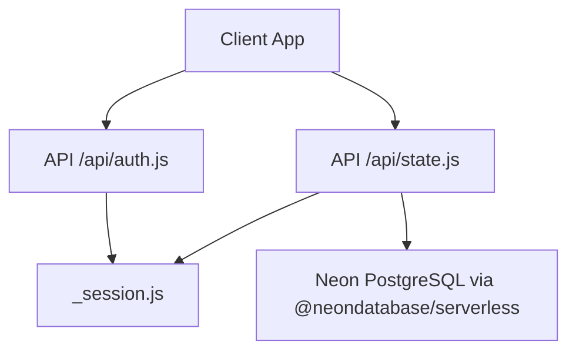
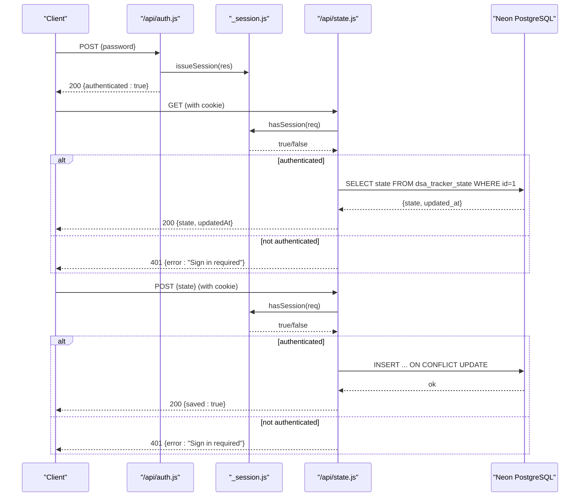
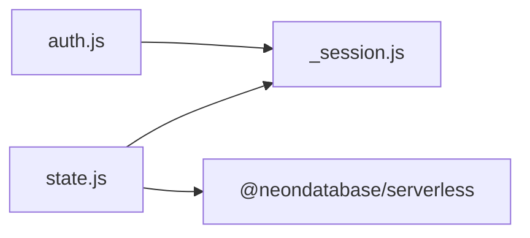

# Backend Services

<cite>
**Referenced Files in This Document**
- [auth.js](file://api/auth.js)
- [state.js](file://api/state.js)
- [_session.js](file://api/_session.js)
- [package.json](file://package.json)
- [README.md](file://README.md)
</cite>

## Table of Contents
1. [Introduction](#introduction)
2. [Project Structure](#project-structure)
3. [Core Components](#core-components)
4. [Architecture Overview](#architecture-overview)
5. [Detailed Component Analysis](#detailed-component-analysis)
6. [Dependency Analysis](#dependency-analysis)
7. [Performance Considerations](#performance-considerations)
8. [Troubleshooting Guide](#troubleshooting-guide)
9. [Conclusion](#conclusion)
10. [Appendices](#appendices)

## Introduction
This document describes the serverless backend services that provide authentication, session management, and state synchronization for the DSA Tracker application. The backend is implemented as Vercel Functions under the api/ directory and integrates with a Neon PostgreSQL database to persist user state. It uses a single-user model secured by an app password and HTTP-only signed cookies.

## Project Structure
The backend consists of three serverless functions:
- Authentication endpoint (login/logout/check)
- State synchronization endpoint (read/write user state)
- Shared session utilities (cookie handling, HMAC signing, validation)

**Diagram sources**
- [auth.js:1-23](file://api/auth.js#L1-L23)
- [state.js:1-51](file://api/state.js#L1-L51)
- [_session.js:1-54](file://api/_session.js#L1-L54)

**Section sources**
- [README.md:35-52](file://README.md#L35-L52)
- [package.json:12-18](file://package.json#L12-L18)

## Core Components
- Authentication API: Validates an app password and issues or clears an HTTP-only session cookie; also exposes a check endpoint to determine if a valid session exists.
- State Sync API: Requires a valid session, reads or writes a JSONB record to Neon Postgres, sanitizes inputs, and returns standardized responses.
- Session Utilities: Implements secure cookie issuance, parsing, HMAC signing, timing-safe comparisons, and expiration checks.

Key security measures:
- Password comparison uses timing-safe equality to prevent timing attacks.
- Sessions are stored in HttpOnly cookies with HMAC signatures and expiration.
- State persistence requires a valid session and sanitized input.

**Section sources**
- [auth.js:1-23](file://api/auth.js#L1-L23)
- [state.js:1-51](file://api/state.js#L1-L51)
- [_session.js:1-54](file://api/_session.js#L1-L54)

## Architecture Overview
The system follows a simple request/response flow:
- Clients call /api/auth to authenticate using an app password. On success, the server sets an HttpOnly signed cookie.
- Subsequent calls to /api/state must include the session cookie. The server validates the session before reading/writing data.
- Data is persisted in a single-row JSONB table in Neon Postgres.

**Diagram sources**
- [auth.js:8-22](file://api/auth.js#L8-L22)
- [state.js:23-49](file://api/state.js#L23-L49)
- [_session.js:29-51](file://api/_session.js#L29-L51)

## Detailed Component Analysis

### Authentication API (/api/auth.js)
Responsibilities:
- GET: Returns whether the current request has a valid session.
- POST: Accepts a password from the request body, compares it securely against the configured app password, and issues a session cookie on success.
- DELETE: Clears the session cookie.
- Enforces allowed methods and returns appropriate status codes.

Security considerations:
- Uses timing-safe comparison for passwords to mitigate timing attacks.
- Issues an HttpOnly, SameSite=Lax cookie with a fixed Max-Age and optional Secure flag when deployed on Vercel.

Error handling:
- 401 for incorrect password or missing configuration.
- 405 for unsupported methods.
- 204 on successful logout.

Request/Response examples:
- POST /api/auth
  - Request body: { "password": "<APP_ACCESS_PASSWORD>" }
  - Success response: 200 { "authenticated": true }
  - Error response: 401 { "error": "Incorrect password" }
- GET /api/auth
  - Response: 200 { "authenticated": boolean }
- DELETE /api/auth
  - Response: 204 No Content

**Section sources**
- [auth.js:1-23](file://api/auth.js#L1-L23)
- [_session.js:23-39](file://api/_session.js#L23-L39)

### State Synchronization API (/api/state.js)
Responsibilities:
- Requires a valid session for all operations.
- Ensures DATABASE_URL is configured.
- Creates the target table if it does not exist.
- GET: Returns the current state and last updated timestamp.
- POST: Sanitizes incoming state and persists it to Neon Postgres as JSONB.

Input validation and sanitization:
- Normalizes the incoming object to ensure only expected top-level keys are retained.
- Merges settings with defaults to guarantee consistent schema.

Database operations:
- Uses Neon’s serverless client to run SQL.
- Persists a single row identified by a fixed primary key.

Error handling:
- 401 if no valid session.
- 405 for unsupported methods.
- 500 if DATABASE_URL is missing or database errors occur.

Request/Response examples:
- GET /api/state
  - Response: 200 { "state": <object|null>, "updatedAt": <ISO timestamp|null> }
- POST /api/state
  - Request body: { "state": { "progress": {...}, "notes": {...}, "solutions": {...}, "activity": {...}, "settings": { "dailyGoal": number, "theme": string } } }
  - Response: 200 { "saved": true }

Notes:
- If no prior state exists, GET may return null state and null updatedAt.
- The table is created automatically on first use.

**Section sources**
- [state.js:1-51](file://api/state.js#L1-L51)

### Session Management Utilities (/api/_session.js)
Responsibilities:
- Cookie name and lifetime constants.
- Secret retrieval from environment variables.
- HMAC-SHA256 signing of payloads.
- Cookie parsing from headers.
- Timing-safe equality comparison.
- Issuing and clearing session cookies.
- Validating sessions by verifying signature and expiration.

Security measures:
- SESSION_SECRET is required; missing secret throws an error at runtime.
- Cookies are HttpOnly and SameSite=Lax; Secure flag is added when running on Vercel.
- Payload includes an expiration time; expired sessions are rejected.
- All comparisons use timing-safe techniques where applicable.

Cookie lifecycle:
- Issue: Encodes an expiration payload, signs it, and sets a cookie with Max-Age set to 30 days.
- Validate: Parses cookie, verifies signature, decodes payload, and checks expiration.
- Clear: Sets cookie with Max-Age=0 to expire it immediately.

**Section sources**
- [_session.js:1-54](file://api/_session.js#L1-L54)

## Dependency Analysis
External dependencies and integration points:
- Neon PostgreSQL client (@neondatabase/serverless) used to connect to the database and execute SQL.
- Node.js crypto module for HMAC signing and timing-safe comparisons.
- Environment variables:
  - DATABASE_URL: Neon connection string.
  - APP_ACCESS_PASSWORD: Single-user app password for authentication.
  - SESSION_SECRET: Secret used to sign session cookies.
  - VERCEL: Optional flag used to enable Secure cookie attribute in production deployments.

Module relationships:
- auth.js depends on _session.js for session creation and validation.
- state.js depends on _session.js for session validation and on Neon for persistence.

Potential coupling:
- Tight coupling between state.js and the specific table schema; changes to schema require updates to the SQL statements.
- Session logic is centralized in _session.js, promoting reuse and consistency across endpoints.

**Diagram sources**
- [auth.js:1-23](file://api/auth.js#L1-L23)
- [state.js:1-51](file://api/state.js#L1-L51)
- [_session.js:1-54](file://api/_session.js#L1-L54)

**Section sources**
- [package.json:12-18](file://package.json#L12-L18)
- [README.md:39-48](file://README.md#L39-L48)

## Performance Considerations
- Database access is minimal: one row per user, reducing contention and simplifying queries.
- Input sanitization ensures predictable schema and avoids unnecessary processing.
- Session validation is lightweight: HMAC verification and expiration check are constant-time operations relative to payload size.
- Using Neon’s serverless client enables efficient connections suitable for function execution environments.

[No sources needed since this section provides general guidance]

## Troubleshooting Guide
Common issues and resolutions:
- Missing DATABASE_URL: The state endpoint returns a 500 error indicating configuration is required. Ensure DATABASE_URL is set in your deployment environment.
- Incorrect or missing APP_ACCESS_PASSWORD: Authentication will fail with a 401 error. Verify the environment variable and client-provided password match.
- Missing SESSION_SECRET: Session utilities will throw an error at runtime. Generate a strong random value and configure it in your environment.
- Invalid or tampered session cookie: Validation fails due to signature mismatch or expiration; re-authenticate to obtain a new session.
- Method not allowed: Only GET/POST for state and GET/POST/DELETE for auth are supported; other methods receive a 405 response.

Operational tips:
- Use vercel dev to test API routes locally alongside the frontend.
- For local testing, ensure environment variables are available to the Vercel CLI.
- Export data regularly using the app’s export feature as a backup strategy.

**Section sources**
- [state.js:23-49](file://api/state.js#L23-L49)
- [auth.js:8-22](file://api/auth.js#L8-L22)
- [_session.js:6-14](file://api/_session.js#L6-L14)
- [README.md:52-58](file://README.md#L52-L58)

## Conclusion
The backend provides a compact, secure, and serverless solution for single-user authentication and cloud-synced state. It leverages Neon PostgreSQL for persistence, employs robust session handling with HMAC-signed cookies, and enforces strict input validation. With clear environment configuration and straightforward API contracts, it supports reliable cross-device synchronization while maintaining security best practices.

[No sources needed since this section summarizes without analyzing specific files]

## Appendices

### API Endpoint Specifications
- Authentication
  - POST /api/auth
    - Request: { "password": "<APP_ACCESS_PASSWORD>" }
    - Responses:
      - 200 { "authenticated": true }
      - 401 { "error": "Incorrect password" }
      - 405 { "error": "Method not allowed" }
  - GET /api/auth
    - Response: 200 { "authenticated": boolean }
  - DELETE /api/auth
    - Response: 204 No Content
- State Synchronization
  - GET /api/state
    - Response: 200 { "state": <object|null>, "updatedAt": <ISO timestamp|null> }
    - Errors: 401 { "error": "Sign in required" }, 405 { "error": "Method not allowed" }, 500 { "error": "DATABASE_URL is not configured" }
  - POST /api/state
    - Request: { "state": { "progress": {...}, "notes": {...}, "solutions": {...}, "activity": {...}, "settings": { "dailyGoal": number, "theme": string } } }
    - Response: 200 { "saved": true }
    - Errors: 401 { "error": "Sign in required" }, 405 { "error": "Method not allowed" }, 500 { "error": "Unable to save cloud data" }

### Security Considerations
- Use a strong APP_ACCESS_PASSWORD and keep it secret.
- Generate a high-entropy SESSION_SECRET for cookie signing.
- Ensure HTTPS is enforced in production so Secure cookies are effective.
- Limit exposure of secrets by storing them as environment variables in your deployment platform.

### Deployment Notes
- Deploy as a Vite project; the api/ directory is automatically deployed as Vercel Functions.
- Configure DATABASE_URL, APP_ACCESS_PASSWORD, and SESSION_SECRET in your environment.
- For local development of API routes, use vercel dev after linking the project.

**Section sources**
- [README.md:35-52](file://README.md#L35-L52)
- [package.json:12-18](file://package.json#L12-L18)