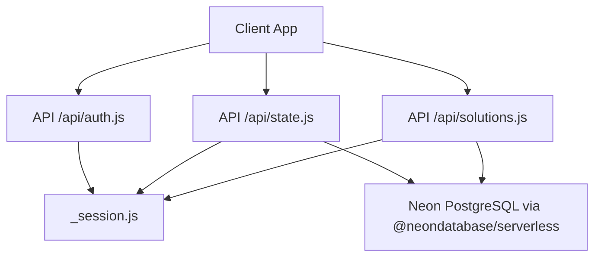
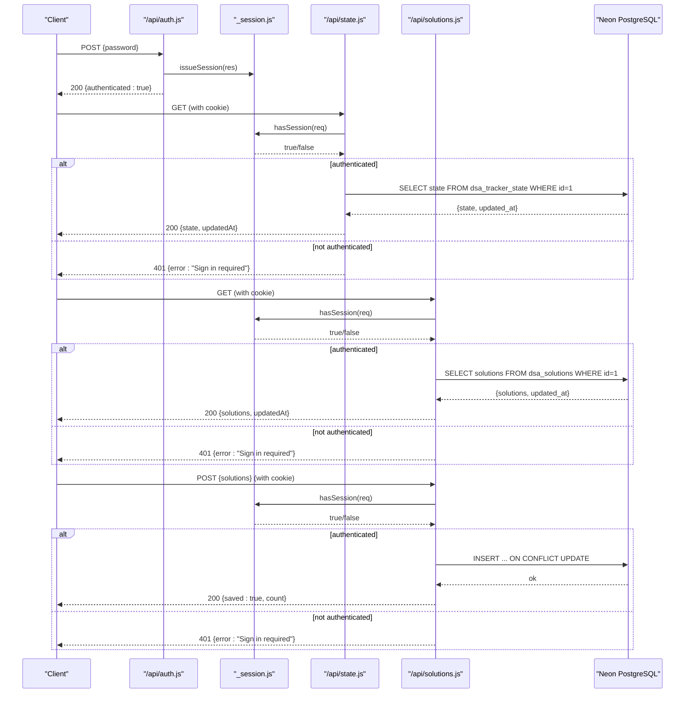
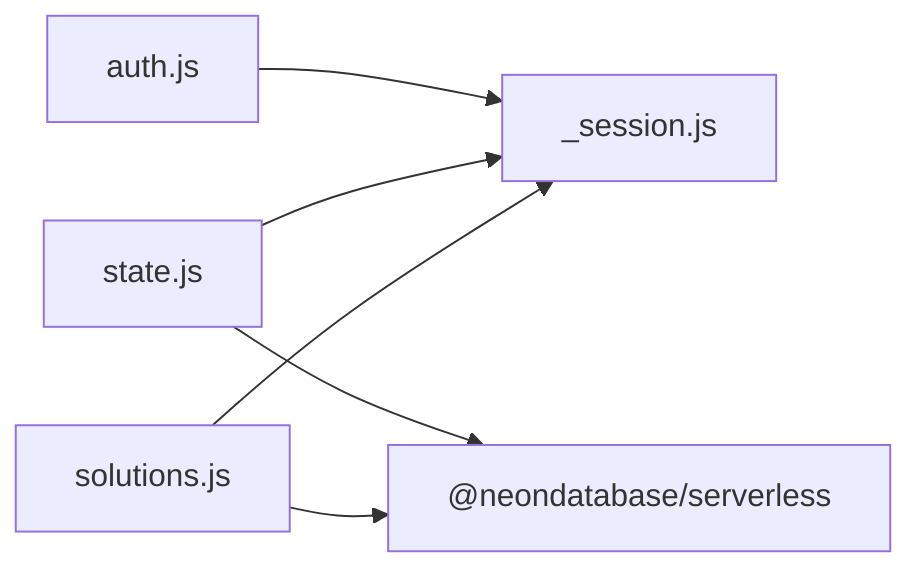

# Backend Services

<cite>
**Referenced Files in This Document**
- [auth.js](file://api/auth.js)
- [state.js](file://api/state.js)
- [solutions.js](file://api/solutions.js)
- [_session.js](file://api/_session.js)
- [package.json](file://package.json)
- [README.md](file://README.md)
</cite>

## Update Summary
**Changes Made**
- Added comprehensive documentation for the new Solutions API endpoints (GET/POST /api/solutions)
- Updated architecture diagrams to include the solutions endpoint
- Enhanced API endpoint specifications with solutions endpoint details
- Added database schema information for the dsa_solutions table
- Updated dependency analysis to include solutions endpoint integration

## Table of Contents
1. [Introduction](#introduction)
2. [Project Structure](#project-structure)
3. [Core Components](#core-components)
4. [Architecture Overview](#architecture-overview)
5. [Detailed Component Analysis](#detailed-component-analysis)
6. [Dependency Analysis](#dependency-analysis)
7. [Performance Considerations](#performance-considerations)
8. [Troubleshooting Guide](#troubleshooting-guide)
9. [Conclusion](#conclusion)
10. [Appendices](#appendices)

## Introduction
This document describes the serverless backend services that provide authentication, session management, state synchronization, and solution persistence for the DSA Tracker application. The backend is implemented as Vercel Functions under the api/ directory and integrates with a Neon PostgreSQL database to persist user state and authored solutions. It uses a single-user model secured by an app password and HTTP-only signed cookies.

## Project Structure
The backend consists of four serverless functions:
- Authentication endpoint (login/logout/check)
- State synchronization endpoint (read/write user state)
- Solutions persistence endpoint (read/write user-authored solutions)
- Shared session utilities (cookie handling, HMAC signing, validation)

**Diagram sources**
- [auth.js:1-30](file://api/auth.js#L1-L30)
- [state.js:1-67](file://api/state.js#L1-L67)
- [solutions.js:1-68](file://api/solutions.js#L1-L68)
- [_session.js:1-60](file://api/_session.js#L1-L60)

**Section sources**
- [README.md:35-52](file://README.md#L35-L52)
- [package.json:12-18](file://package.json#L12-L18)

## Core Components
- Authentication API: Validates an app password and issues or clears an HTTP-only session cookie; also exposes a check endpoint to determine if a valid session exists.
- State Sync API: Requires a valid session, reads or writes a JSONB record to Neon Postgres, sanitizes inputs, and returns standardized responses.
- Solutions API: Requires a valid session, persists user-authored solution libraries to Neon Postgres with input sanitization and size validation.
- Session Utilities: Implements secure cookie issuance, parsing, HMAC signing, timing-safe comparisons, and expiration checks.

Key security measures:
- Password comparison uses timing-safe equality to prevent timing attacks.
- Sessions are stored in HttpOnly cookies with HMAC signatures and expiration.
- State and solutions persistence require valid sessions and sanitized input.
- Solutions library includes strict input validation and size limits.

**Section sources**
- [auth.js:1-30](file://api/auth.js#L1-L30)
- [state.js:1-67](file://api/state.js#L1-L67)
- [solutions.js:1-68](file://api/solutions.js#L1-L68)
- [_session.js:1-60](file://api/_session.js#L1-L60)

## Architecture Overview
The system follows a simple request/response flow:
- Clients call /api/auth to authenticate using an app password. On success, the server sets an HttpOnly signed cookie.
- Subsequent calls to /api/state and /api/solutions must include the session cookie. The server validates the session before reading/writing data.
- Data is persisted in separate tables in Neon Postgres: one for tracker state and one for solution libraries.

**Diagram sources**
- [auth.js:8-29](file://api/auth.js#L8-L29)
- [state.js:43-66](file://api/state.js#L43-L66)
- [solutions.js:40-67](file://api/solutions.js#L40-L67)
- [_session.js:47-57](file://api/_session.js#L47-L57)

## Detailed Component Analysis

### Authentication API (/api/auth.js)
Responsibilities:
- GET: Returns whether the current request has a valid session.
- POST: Accepts a password from the request body, compares it securely against the configured app password, and issues a session cookie on success.
- DELETE: Clears the session cookie.
- Enforces allowed methods and returns appropriate status codes.

Security considerations:
- Uses timing-safe comparison for passwords to mitigate timing attacks.
- Issues an HttpOnly, SameSite=Lax cookie with a fixed Max-Age and optional Secure flag when deployed on Vercel.

Error handling:
- 401 for incorrect password or missing configuration.
- 405 for unsupported methods.
- 204 on successful logout.

Request/Response examples:
- POST /api/auth
  - Request body: { "password": "<APP_ACCESS_PASSWORD>" }
  - Success response: 200 { "authenticated": true }
  - Error response: 401 { "error": "Incorrect password" }
- GET /api/auth
  - Response: 200 { "authenticated": boolean }
- DELETE /api/auth
  - Response: 204 No Content

**Section sources**
- [auth.js:1-30](file://api/auth.js#L1-L30)
- [_session.js:35-45](file://api/_session.js#L35-L45)

### State Synchronization API (/api/state.js)
Responsibilities:
- Requires a valid session for all operations.
- Ensures DATABASE_URL is configured.
- Creates the target table if it does not exist.
- GET: Returns the current state and last updated timestamp.
- POST: Sanitizes incoming state and persists it to Neon Postgres as JSONB.

Input validation and sanitization:
- Normalizes the incoming object to ensure only expected top-level keys are retained.
- Merges settings with defaults to guarantee consistent schema.

Database operations:
- Uses Neon's serverless client to run SQL.
- Persists a single row identified by a fixed primary key.

Error handling:
- 401 if no valid session.
- 405 for unsupported methods.
- 500 if DATABASE_URL is missing or database errors occur.

Request/Response examples:
- GET /api/state
  - Response: 200 { "state": <object|null>, "updatedAt": <ISO timestamp|null> }
- POST /api/state
  - Request body: { "state": { "progress": {...}, "notes": {...}, "solutions": {...}, "activity": {...}, "settings": { "dailyGoal": number, "theme": string } } }
  - Response: 200 { "saved": true }

Notes:
- If no prior state exists, GET may return null state and null updatedAt.
- The table is created automatically on first use.

**Section sources**
- [state.js:1-67](file://api/state.js#L1-L67)

### Solutions Persistence API (/api/solutions.js)
**New Feature** - Added to support persistent storage of user-authored solutions

Responsibilities:
- Requires a valid session for all operations.
- Ensures DATABASE_URL is configured.
- Creates the dsa_solutions table if it does not exist.
- GET: Returns the current solution library and last updated timestamp.
- POST: Sanitizes incoming solution library and persists it to Neon Postgres as JSONB.

Input validation and sanitization:
- Strictly validates solution library structure using regex pattern matching for problem IDs.
- Limits entries to maximum 5000 problems and 24 approaches per problem.
- Only accepts properly formatted solution objects with approach arrays.
- Enforces maximum payload size of 3MB to prevent abuse.

Database operations:
- Uses Neon's serverless client to run SQL.
- Persists solution library in a dedicated dsa_solutions table with JSONB format.
- Uses upsert pattern to handle both insert and update operations.

Error handling:
- 401 if no valid session.
- 405 for unsupported methods.
- 400 if no valid solution entries in payload.
- 413 if solution library exceeds size limit.
- 500 if DATABASE_URL is missing or database errors occur.

Request/Response examples:
- GET /api/solutions
  - Response: 200 { "solutions": <object|null>, "updatedAt": <ISO timestamp|null> }
- POST /api/solutions
  - Request body: { "solutions": { "a2z-1": { "approaches": [...] }, "a2z-2": { "approaches": [...] } } }
  - Response: 200 { "saved": true, "count": <number_of_entries> }
  - Error responses:
    - 400 { "error": "No valid solution entries in payload" }
    - 413 { "error": "Solution library is too large" }

Database Schema:
- Table: dsa_solutions
- Columns: id (SMALLINT, PRIMARY KEY, CHECK id = 1), solutions (JSONB), updated_at (TIMESTAMPTZ)

**Section sources**
- [solutions.js:1-68](file://api/solutions.js#L1-L68)

### Session Management Utilities (/api/_session.js)
Responsibilities:
- Cookie name and lifetime constants.
- Secret retrieval from environment variables.
- HMAC-SHA256 signing of payloads.
- Cookie parsing from headers.
- Timing-safe equality comparison.
- Issuing and clearing session cookies.
- Validating sessions by verifying signature and expiration.

Security measures:
- SESSION_SECRET is required; missing secret throws an error at runtime.
- Cookies are HttpOnly and SameSite=Lax; Secure flag is added when running on Vercel.
- Payload includes an expiration time; expired sessions are rejected.
- All comparisons use timing-safe techniques where applicable.

Cookie lifecycle:
- Issue: Encodes an expiration payload, signs it, and sets a cookie with Max-Age set to 30 days.
- Validate: Parses cookie, verifies signature, decodes payload, and checks expiration.
- Clear: Sets cookie with Max-Age=0 to expire it immediately.

**Section sources**
- [_session.js:1-60](file://api/_session.js#L1-L60)

## Dependency Analysis
External dependencies and integration points:
- Neon PostgreSQL client (@neondatabase/serverless) used to connect to the database and execute SQL.
- Node.js crypto module for HMAC signing and timing-safe comparisons.
- Environment variables:
  - DATABASE_URL: Neon connection string.
  - APP_ACCESS_PASSWORD: Single-user app password for authentication.
  - SESSION_SECRET: Secret used to sign session cookies.
  - VERCEL: Optional flag used to enable Secure cookie attribute in production deployments.

Module relationships:
- auth.js depends on _session.js for session creation and validation.
- state.js depends on _session.js for session validation and on Neon for persistence.
- solutions.js depends on _session.js for session validation and on Neon for persistence.

Potential coupling:
- Tight coupling between state.js and the specific table schema; changes to schema require updates to the SQL statements.
- Tight coupling between solutions.js and the dsa_solutions table schema.
- Session logic is centralized in _session.js, promoting reuse and consistency across endpoints.

**Diagram sources**
- [auth.js:1-30](file://api/auth.js#L1-L30)
- [state.js:1-67](file://api/state.js#L1-L67)
- [solutions.js:1-68](file://api/solutions.js#L1-L68)
- [_session.js:1-60](file://api/_session.js#L1-L60)

**Section sources**
- [package.json:12-18](file://package.json#L12-L18)
- [README.md:39-48](file://README.md#L39-L48)

## Performance Considerations
- Database access is minimal: one row per user for both state and solutions, reducing contention and simplifying queries.
- Input sanitization ensures predictable schema and avoids unnecessary processing.
- Session validation is lightweight: HMAC verification and expiration check are constant-time operations relative to payload size.
- Using Neon's serverless client enables efficient connections suitable for function execution environments.
- Solutions library includes size limits (3MB max) and entry limits (5000 problems, 24 approaches each) to prevent performance degradation.
- Table creation is cached per cold start to avoid repeated CREATE TABLE operations.

## Troubleshooting Guide
Common issues and resolutions:
- Missing DATABASE_URL: The state and solutions endpoints return a 500 error indicating configuration is required. Ensure DATABASE_URL is set in your deployment environment.
- Incorrect or missing APP_ACCESS_PASSWORD: Authentication will fail with a 401 error. Verify the environment variable and client-provided password match.
- Missing SESSION_SECRET: Session utilities will throw an error at runtime. Generate a strong random value and configure it in your environment.
- Invalid or tampered session cookie: Validation fails due to signature mismatch or expiration; re-authenticate to obtain a new session.
- Method not allowed: Only GET/POST for state and solutions, and GET/POST/DELETE for auth are supported; other methods receive a 405 response.
- Solutions payload too large: Solutions endpoint returns 413 error if the solution library exceeds 3MB. Reduce the number of solutions or approaches.
- Invalid solution format: Solutions endpoint returns 400 error if no valid solution entries are found in the payload. Ensure proper formatting with problem IDs matching the a2z-XXX pattern.

Operational tips:
- Use vercel dev to test API routes locally alongside the frontend.
- For local testing, ensure environment variables are available to the Vercel CLI.
- Export data regularly using the app's export feature as a backup strategy.
- Monitor database performance for large solution libraries.

**Section sources**
- [state.js:43-66](file://api/state.js#L43-L66)
- [solutions.js:40-67](file://api/solutions.js#L40-L67)
- [auth.js:8-29](file://api/auth.js#L8-L29)
- [_session.js:6-14](file://api/_session.js#L6-L14)
- [README.md:52-58](file://README.md#L52-L58)

## Conclusion
The backend provides a compact, secure, and serverless solution for single-user authentication, cloud-synced state, and persistent solution storage. It leverages Neon PostgreSQL for persistence, employs robust session handling with HMAC-signed cookies, and enforces strict input validation. With clear environment configuration and straightforward API contracts, it supports reliable cross-device synchronization while maintaining security best practices. The addition of the solutions API endpoint enables users to persist their authored solutions alongside their progress tracking data.

## Appendices

### API Endpoint Specifications
- Authentication
  - POST /api/auth
    - Request: { "password": "<APP_ACCESS_PASSWORD>" }
    - Responses:
      - 200 { "authenticated": true }
      - 401 { "error": "Incorrect password" }
      - 405 { "error": "Method not allowed" }
  - GET /api/auth
    - Response: 200 { "authenticated": boolean }
  - DELETE /api/auth
    - Response: 204 No Content
- State Synchronization
  - GET /api/state
    - Response: 200 { "state": <object|null>, "updatedAt": <ISO timestamp|null> }
    - Errors: 401 { "error": "Sign in required" }, 405 { "error": "Method not allowed" }, 500 { "error": "DATABASE_URL is not configured" }
  - POST /api/state
    - Request: { "state": { "progress": {...}, "notes": {...}, "solutions": {...}, "activity": {...}, "settings": { "dailyGoal": number, "theme": string } } }
    - Response: 200 { "saved": true }
    - Errors: 401 { "error": "Sign in required" }, 405 { "error": "Method not allowed" }, 500 { "error": "Unable to save cloud data" }
- Solutions Persistence
  - GET /api/solutions
    - Response: 200 { "solutions": <object|null>, "updatedAt": <ISO timestamp|null> }
    - Errors: 401 { "error": "Sign in required" }, 405 { "error": "Method not allowed" }, 500 { "error": "DATABASE_URL is not configured" }
  - POST /api/solutions
    - Request: { "solutions": { "a2z-1": { "approaches": [...] }, "a2z-2": { "approaches": [...] } } }
    - Response: 200 { "saved": true, "count": <number_of_entries> }
    - Errors: 401 { "error": "Sign in required" }, 400 { "error": "No valid solution entries in payload" }, 405 { "error": "Method not allowed" }, 413 { "error": "Solution library is too large" }, 500 { "error": "Unable to save solution library" }

### Security Considerations
- Use a strong APP_ACCESS_PASSWORD and keep it secret.
- Generate a high-entropy SESSION_SECRET for cookie signing.
- Ensure HTTPS is enforced in production so Secure cookies are effective.
- Limit exposure of secrets by storing them as environment variables in your deployment platform.
- Solutions library includes strict input validation to prevent injection attacks.
- Size limits prevent denial-of-service attacks through oversized payloads.

### Deployment Notes
- Deploy as a Vite project; the api/ directory is automatically deployed as Vercel Functions.
- Configure DATABASE_URL, APP_ACCESS_PASSWORD, and SESSION_SECRET in your environment.
- For local development of API routes, use vercel dev after linking the project.
- The solutions endpoint requires additional database permissions to create and manage the dsa_solutions table.

### Database Schema
- dsa_tracker_state: Stores user progress, notes, activity, and settings
  - id: SMALLINT PRIMARY KEY CHECK (id = 1)
  - state: JSONB
  - updated_at: TIMESTAMPTZ DEFAULT NOW()
- dsa_solutions: Stores user-authored solution libraries
  - id: SMALLINT PRIMARY KEY CHECK (id = 1)
  - solutions: JSONB
  - updated_at: TIMESTAMPTZ DEFAULT NOW()

**Section sources**
- [README.md:35-52](file://README.md#L35-L52)
- [package.json:12-18](file://package.json#L12-L18)
- [solutions.js:28-38](file://api/solutions.js#L28-L38)