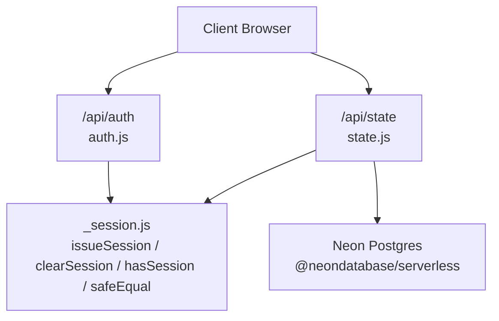
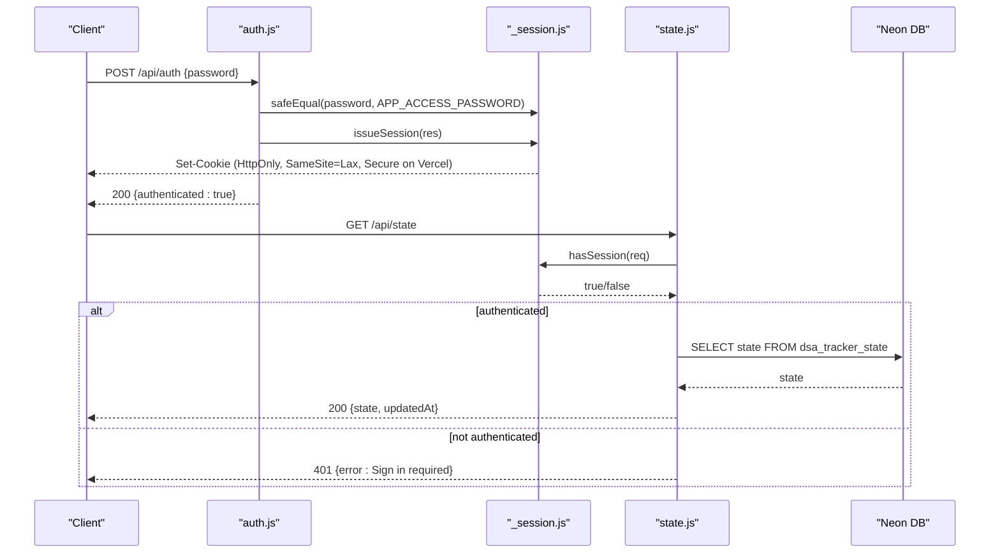
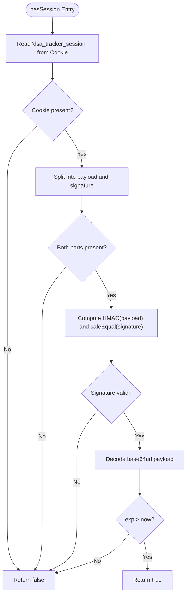
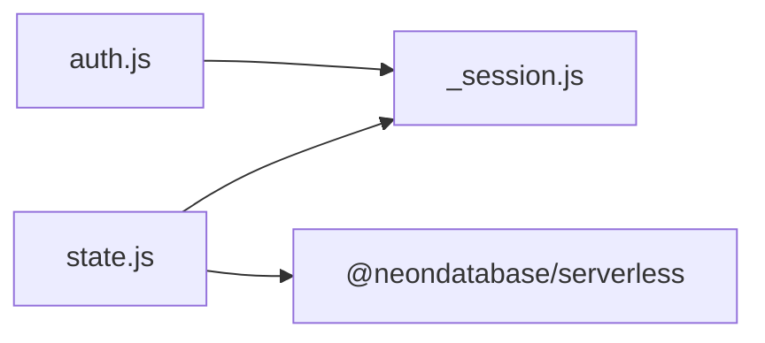

# Session Management

<cite>
**Referenced Files in This Document**
- [_session.js](file://api/_session.js)
- [auth.js](file://api/auth.js)
- [state.js](file://api/state.js)
- [README.md](file://README.md)
- [package.json](file://package.json)
</cite>

## Table of Contents
1. [Introduction](#introduction)
2. [Project Structure](#project-structure)
3. [Core Components](#core-components)
4. [Architecture Overview](#architecture-overview)
5. [Detailed Component Analysis](#detailed-component-analysis)
6. [Dependency Analysis](#dependency-analysis)
7. [Performance Considerations](#performance-considerations)
8. [Troubleshooting Guide](#troubleshooting-guide)
9. [Conclusion](#conclusion)
10. [Appendices](#appendices)

## Introduction
This document explains the session management utilities that provide secure, cookie-based authentication for the application’s serverless API routes. The implementation uses HMAC-SHA256 signing to prevent tampering, enforces expiration times, and sets strict cookie attributes to mitigate common web attacks. It also documents how sessions are validated and used to protect state persistence endpoints.

## Project Structure
The session logic is implemented as a small set of Node.js modules under the api directory:
- _session.js: Core session utilities (issuance, validation, clearing, signing, safe comparison).
- auth.js: Authentication route handler using the session utilities.
- state.js: State persistence route that requires an authenticated session.



**Diagram sources**
- [auth.js:1-24](file://api/auth.js#L1-L24)
- [state.js:1-51](file://api/state.js#L1-L51)
- [_session.js:1-54](file://api/_session.js#L1-L54)

**Section sources**
- [_session.js:1-54](file://api/_session.js#L1-L54)
- [auth.js:1-24](file://api/auth.js#L1-L24)
- [state.js:1-51](file://api/state.js#L1-L51)

## Core Components
- hasSession(req): Validates the presence and integrity of the session cookie and checks expiration. Returns a boolean indicating whether the request is authenticated.
- issueSession(res): Creates a new session by generating an expiring payload, signing it with HMAC-SHA256, and setting a secure, HttpOnly cookie.
- clearSession(res): Terminates the session by clearing the cookie.
- safeEqual(left, right): Performs constant-time string comparison to avoid timing side-channel attacks.

Key security properties:
- Tamper prevention: Each cookie value includes a base64url-encoded payload followed by a dot and an HMAC signature. Any modification invalidates the signature.
- Expiration handling: The payload contains an expiration timestamp; expired cookies are rejected.
- Cookie attributes: HttpOnly prevents client-side script access; SameSite=Lax mitigates CSRF; Secure flag is enabled on Vercel deployments to enforce HTTPS-only transmission.

**Section sources**
- [_session.js:12-14](file://api/_session.js#L12-L14)
- [_session.js:23-27](file://api/_session.js#L23-L27)
- [_session.js:29-34](file://api/_session.js#L29-L34)
- [_session.js:36-39](file://api/_session.js#L36-L39)
- [_session.js:41-51](file://api/_session.js#L41-L51)

## Architecture Overview
The session flow integrates across three files:
- Authentication: POST /api/auth validates a password and issues a signed session cookie. GET /api/auth returns whether a valid session exists. DELETE /api/auth clears the session.
- Protected state: GET/POST /api/state require a valid session via hasSession before reading or writing data to the database.



**Diagram sources**
- [auth.js:8-23](file://api/auth.js#L8-L23)
- [_session.js:29-51](file://api/_session.js#L29-L51)
- [state.js:23-45](file://api/state.js#L23-L45)

## Detailed Component Analysis

### Session Cookie Format and Signing
- Payload: JSON containing an expiration timestamp (exp), encoded as base64url.
- Signature: HMAC-SHA256 over the payload using a secret from SESSION_SECRET, then base64url-encoded.
- Cookie value: payload.signature
- Parsing and verification: Split on dot, verify signature with safeEqual, decode payload, and compare exp against current time.

Security notes:
- Using base64url avoids URL-unsafe characters and simplifies storage in cookies.
- HMAC ensures integrity; any change to payload or signature fails verification.
- Constant-time comparison prevents timing-based leakage during signature checks.

**Section sources**
- [_session.js:12-14](file://api/_session.js#L12-L14)
- [_session.js:23-27](file://api/_session.js#L23-L27)
- [_session.js:41-51](file://api/_session.js#L41-L51)

### hasSession: Validation Flow
- Reads the cookie named dsa_tracker_session.
- Splits into payload and signature.
- Recomputes the HMAC signature and compares using safeEqual.
- Decodes payload and checks if exp is greater than current time.
- Returns false on any parsing or validation error.



**Diagram sources**
- [_session.js:41-51](file://api/_session.js#L41-L51)

**Section sources**
- [_session.js:41-51](file://api/_session.js#L41-L51)

### issueSession: Creation Flow
- Builds a JSON payload with exp set to current time plus MAX_AGE_SECONDS.
- Encodes payload to base64url.
- Signs payload with HMAC-SHA256 using SESSION_SECRET.
- Sets cookie with name dsa_tracker_session, Path=/, HttpOnly, SameSite=Lax, Max-Age=MAX_AGE_SECONDS, and Secure when running on Vercel.

```mermaid
sequenceDiagram
participant A as "auth.js"
participant S as "_session.js"
participant R as "Response"
A->>S : issueSession(res)
S->>S : Build payload { exp }
S->>S : sign(payload)
S->>R : Set-Cookie : dsa_tracker_session=payload.sig; Path=/; HttpOnly; SameSite=Lax; Max-Age=...; Secure(on Vercel)
```

**Diagram sources**
- [auth.js:16-22](file://api/auth.js#L16-L22)
- [_session.js:29-34](file://api/_session.js#L29-L34)

**Section sources**
- [_session.js:29-34](file://api/_session.js#L29-L34)
- [auth.js:16-22](file://api/auth.js#L16-L22)

### clearSession: Termination Flow
- Clears the session cookie by setting its value to empty and Max-Age=0 with the same path and attributes.

```mermaid
sequenceDiagram
participant A as "auth.js"
participant S as "_session.js"
participant R as "Response"
A->>S : clearSession(res)
S->>R : Set-Cookie : dsa_tracker_session=; Path=/; HttpOnly; SameSite=Lax; Max-Age=0; Secure(on Vercel)
```

**Diagram sources**
- [auth.js:10-13](file://api/auth.js#L10-L13)
- [_session.js:36-39](file://api/_session.js#L36-L39)

**Section sources**
- [_session.js:36-39](file://api/_session.js#L36-L39)
- [auth.js:10-13](file://api/auth.js#L10-L13)

### safeEqual: Constant-Time Comparison
- Converts both inputs to buffers and compares lengths first.
- Uses crypto.timingSafeEqual to compare buffers without leaking timing information.
- Ensures length equality to avoid early exits that could leak length differences.

Security note:
- Prevents timing side-channels when comparing secrets such as passwords or signatures.

**Section sources**
- [_session.js:23-27](file://api/_session.js#L23-L27)

### Cross-Domain and CSRF/XSS Considerations
- SameSite=Lax: Reduces risk of cross-site request forgery by allowing top-level navigations while blocking most cross-site submitters.
- HttpOnly: Prevents JavaScript access to the cookie, mitigating XSS-based theft.
- Secure (on Vercel): Ensures cookies are only sent over HTTPS, protecting against interception.
- Note: For stricter CSRF protection in APIs, consider adding additional CSRF tokens for state-changing requests beyond the default SameSite behavior.

**Section sources**
- [_session.js:32-34](file://api/_session.js#L32-L34)
- [_session.js:37-38](file://api/_session.js#L37-L38)

### Session Storage Format
- Cookie value structure: base64url({ "exp": <unix ms> }).base64url(HMAC-SHA256(secret, payload))
- Only the expiration timestamp is stored in the cookie; no user identifiers or sensitive data are included.
- This design minimizes exposure and reduces attack surface.

**Section sources**
- [_session.js:30-31](file://api/_session.js#L30-L31)
- [_session.js:45-47](file://api/_session.js#L45-L47)

## Dependency Analysis
- auth.js depends on _session.js for session lifecycle functions and safe comparison.
- state.js depends on _session.js for session validation and on @neondatabase/serverless for cloud persistence.
- package.json lists runtime dependencies including Neon serverless client and React tooling.



**Diagram sources**
- [auth.js:1](file://api/auth.js#L1)
- [state.js:1-2](file://api/state.js#L1-L2)
- [package.json:12-18](file://package.json#L12-L18)

**Section sources**
- [auth.js:1-24](file://api/auth.js#L1-L24)
- [state.js:1-51](file://api/state.js#L1-L51)
- [package.json:1-21](file://package.json#L1-L21)

## Performance Considerations
- HMAC computation and base64url encoding are lightweight and suitable for serverless environments.
- safeEqual ensures constant-time comparisons without branching on input length mismatches after initial check.
- Cookie size remains small due to minimal payload (only expiration), reducing bandwidth overhead.

[No sources needed since this section provides general guidance]

## Troubleshooting Guide
Common issues and resolutions:
- Missing SESSION_SECRET: The signing function throws an error if SESSION_SECRET is not configured. Ensure it is set in environment variables.
- Incorrect password: Authentication will fail if the provided password does not match APP_ACCESS_PASSWORD. Use safeEqual to avoid timing leaks.
- Expired session: If the cookie’s exp is in the past, hasSession returns false. Re-authenticate to obtain a fresh session.
- Database not configured: The state endpoint returns an error if DATABASE_URL is missing. Configure Neon connection string in environment variables.
- Local vs production cookie flags: On Vercel, the Secure flag is added automatically; locally, cookies may be sent over HTTP unless explicitly configured.

Operational tips:
- Use vercel dev to test API routes locally with Vercel Functions.
- Keep SESSION_SECRET strong and unique per deployment.
- Avoid sharing APP_ACCESS_PASSWORD; it grants full access to sync capabilities.

**Section sources**
- [_session.js:6-10](file://api/_session.js#L6-L10)
- [auth.js:16-22](file://api/auth.js#L16-L22)
- [state.js:23-26](file://api/state.js#L23-L26)
- [README.md:35-52](file://README.md#L35-L52)

## Conclusion
The session management utilities implement a compact, secure, and efficient approach to authentication for serverless API routes. By combining HMAC-signed cookies, strict cookie attributes, and constant-time comparisons, the system protects against common threats like tampering, XSS, and CSRF. The design keeps session payloads minimal and defers sensitive state to a protected backend store, ensuring scalability and safety in production.

[No sources needed since this section summarizes without analyzing specific files]

## Appendices

### Configuration Options
- SESSION_SECRET: Required for HMAC signing. Must be a strong, random value.
- APP_ACCESS_PASSWORD: Used to authenticate users before issuing a session.
- DATABASE_URL: Required for cloud state persistence via Neon.
- VERCEL: Environment flag used to enable Secure cookie attribute on Vercel deployments.

Best practices:
- Generate SESSION_SECRET with a cryptographically secure method.
- Store secrets in environment variables or platform secret managers.
- Restrict API access to authenticated sessions using hasSession at the start of protected handlers.
- Deploy over HTTPS to ensure Secure cookies are enforced.

**Section sources**
- [_session.js:6-10](file://api/_session.js#L6-L10)
- [_session.js:32-34](file://api/_session.js#L32-L34)
- [auth.js:16-22](file://api/auth.js#L16-L22)
- [state.js:23-26](file://api/state.js#L23-L26)
- [README.md:35-52](file://README.md#L35-L52)