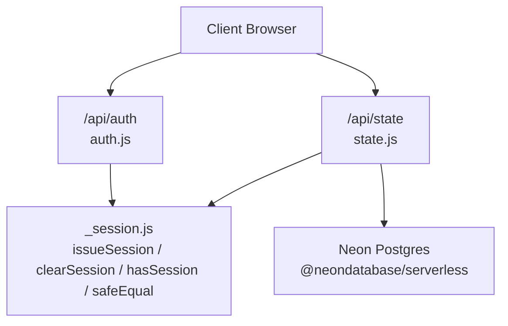
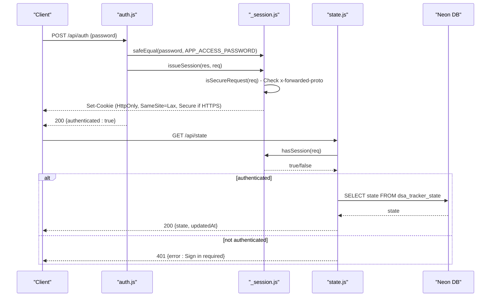
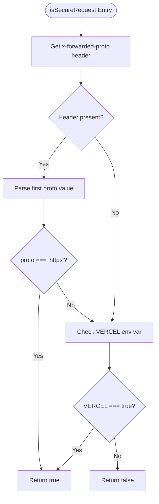
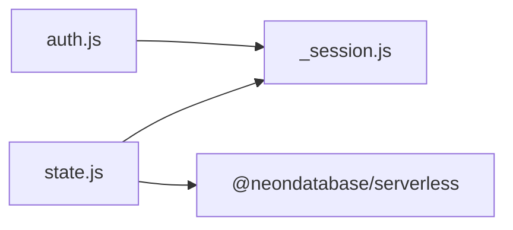

# Session Management

<cite>
**Referenced Files in This Document**
- [_session.js](file://api/_session.js)
- [auth.js](file://api/auth.js)
- [state.js](file://api/state.js)
- [README.md](file://README.md)
- [package.json](file://package.json)
</cite>

## Update Summary
**Changes Made**
- Enhanced HTTPS detection through x-forwarded-proto header support for reverse proxy deployments
- Updated isSecureRequest function to intelligently determine Secure cookie flag based on actual request protocol
- Improved cross-domain security considerations for deployments behind Vercel and other reverse proxies

## Table of Contents
1. [Introduction](#introduction)
2. [Project Structure](#project-structure)
3. [Core Components](#core-components)
4. [Architecture Overview](#architecture-overview)
5. [Detailed Component Analysis](#detailed-component-analysis)
6. [Dependency Analysis](#dependency-analysis)
7. [Performance Considerations](#performance-considerations)
8. [Troubleshooting Guide](#troubleshooting-guide)
9. [Conclusion](#conclusion)
10. [Appendices](#appendices)

## Introduction
This document explains the session management utilities that provide secure, cookie-based authentication for the application's serverless API routes. The implementation uses HMAC-SHA256 signing to prevent tampering, enforces expiration times, and sets strict cookie attributes to mitigate common web attacks. It also documents how sessions are validated and used to protect state persistence endpoints.

## Project Structure
The session logic is implemented as a small set of Node.js modules under the api directory:
- _session.js: Core session utilities (issuance, validation, clearing, signing, safe comparison).
- auth.js: Authentication route handler using the session utilities.
- state.js: State persistence route that requires an authenticated session.



**Diagram sources**
- [auth.js:1-30](file://api/auth.js#L1-L30)
- [state.js:1-66](file://api/state.js#L1-L66)
- [_session.js:1-60](file://api/_session.js#L1-L60)

**Section sources**
- [_session.js:1-60](file://api/_session.js#L1-L60)
- [auth.js:1-30](file://api/auth.js#L1-L30)
- [state.js:1-66](file://api/state.js#L1-L66)

## Core Components
- hasSession(req): Validates the presence and integrity of the session cookie and checks expiration. Returns a boolean indicating whether the request is authenticated.
- issueSession(res, req): Creates a new session by generating an expiring payload, signing it with HMAC-SHA256, and setting a secure, HttpOnly cookie with intelligent HTTPS detection.
- clearSession(res, req): Terminates the session by clearing the cookie with appropriate security flags.
- safeEqual(left, right): Performs constant-time string comparison to avoid timing side-channel attacks.
- isSecureRequest(req): **Enhanced** Determines if the request should use Secure cookie flag by checking x-forwarded-proto header for reverse proxy deployments or falling back to VERCEL environment variable.

Key security properties:
- Tamper prevention: Each cookie value includes a base64url-encoded payload followed by a dot and an HMAC signature. Any modification invalidates the signature.
- Expiration handling: The payload contains an expiration timestamp; expired cookies are rejected.
- Cookie attributes: HttpOnly prevents client-side script access; SameSite=Lax mitigates CSRF; Secure flag is intelligently enabled based on actual request protocol.

**Updated** The isSecureRequest function now supports reverse proxy deployments by checking the x-forwarded-proto header before falling back to environment-based detection.

**Section sources**
- [_session.js:12-14](file://api/_session.js#L12-L14)
- [_session.js:23-27](file://api/_session.js#L23-L27)
- [_session.js:29-33](file://api/_session.js#L29-L33)
- [_session.js:35-45](file://api/_session.js#L35-L45)
- [_session.js:47-57](file://api/_session.js#L47-L57)

## Architecture Overview
The session flow integrates across three files with enhanced HTTPS detection:
- Authentication: POST /api/auth validates a password and issues a signed session cookie with appropriate security flags. GET /api/auth returns whether a valid session exists. DELETE /api/auth clears the session.
- Protected state: GET/POST /api/state require a valid session via hasSession before reading or writing data to the database.



**Diagram sources**
- [auth.js:8-29](file://api/auth.js#L8-L29)
- [_session.js:29-45](file://api/_session.js#L29-L45)
- [state.js:42-65](file://api/state.js#L42-L65)

## Detailed Component Analysis

### Session Cookie Format and Signing
- Payload: JSON containing an expiration timestamp (exp), encoded as base64url.
- Signature: HMAC-SHA256 over the payload using a secret from SESSION_SECRET, then base64url-encoded.
- Cookie value: payload.signature
- Parsing and verification: Split on dot, verify signature with safeEqual, decode payload, and compare exp against current time.

Security notes:
- Using base64url avoids URL-unsafe characters and simplifies storage in cookies.
- HMAC ensures integrity; any change to payload or signature fails verification.
- Constant-time comparison prevents timing-based leakage during signature checks.

**Section sources**
- [_session.js:12-14](file://api/_session.js#L12-L14)
- [_session.js:35-39](file://api/_session.js#L35-L39)
- [_session.js:47-57](file://api/_session.js#L47-L57)

### hasSession: Validation Flow
- Reads the cookie named dsa_tracker_session.
- Splits into payload and signature.
- Recomputes the HMAC signature and compares using safeEqual.
- Decodes payload and checks if exp is greater than current time.
- Returns false on any parsing or validation error.


**Diagram sources**
- [_session.js:47-57](file://api/_session.js#L47-L57)

**Section sources**
- [_session.js:47-57](file://api/_session.js#L47-L57)

### issueSession: Creation Flow
- Builds a JSON payload with exp set to current time plus MAX_AGE_SECONDS.
- Encodes payload to base64url.
- Signs payload with HMAC-SHA256 using SESSION_SECRET.
- Sets cookie with name dsa_tracker_session, Path=/, HttpOnly, SameSite=Lax, Max-Age=MAX_AGE_SECONDS, and Secure when HTTPS is detected.

```mermaid
sequenceDiagram
participant A as "auth.js"
participant S as "_session.js"
participant R as "Response"
A->>S : issueSession(res, req)
S->>S : Build payload { exp }
S->>S : isSecureRequest(req) - Check x-forwarded-proto
S->>S : sign(payload)
S->>R : Set-Cookie : dsa_tracker_session=payload.sig; Path=/; HttpOnly; SameSite=Lax; Max-Age=...; Secure(if HTTPS)
```

**Diagram sources**
- [auth.js:22-28](file://api/auth.js#L22-L28)
- [_session.js:35-40](file://api/_session.js#L35-L40)

**Section sources**
- [_session.js:35-40](file://api/_session.js#L35-L40)
- [auth.js:22-28](file://api/auth.js#L22-L28)

### clearSession: Termination Flow
- Clears the session cookie by setting its value to empty and Max-Age=0 with the same path and attributes.

```mermaid
sequenceDiagram
participant A as "auth.js"
participant S as "_session.js"
participant R as "Response"
A->>S : clearSession(res, req)
S->>S : isSecureRequest(req) - Check x-forwarded-proto
S->>R : Set-Cookie : dsa_tracker_session=; Path=/; HttpOnly; SameSite=Lax; Max-Age=0; Secure(if HTTPS)
```

**Diagram sources**
- [auth.js:10-12](file://api/auth.js#L10-L12)
- [_session.js:42-45](file://api/_session.js#L42-L45)

**Section sources**
- [_session.js:42-45](file://api/_session.js#L42-L45)
- [auth.js:10-12](file://api/auth.js#L10-L12)

### safeEqual: Constant-Time Comparison
- Converts both inputs to buffers and compares lengths first.
- Uses crypto.timingSafeEqual to compare buffers without leaking timing information.
- Ensures length equality to avoid early exits that could leak length differences.

Security note:
- Prevents timing side-channels when comparing secrets such as passwords or signatures.

**Section sources**
- [_session.js:23-27](file://api/_session.js#L23-L27)

### Enhanced HTTPS Detection: isSecureRequest Function
**New** The isSecureRequest function provides intelligent HTTPS detection for modern deployment scenarios:

- **Primary Detection**: Checks the `x-forwarded-proto` header from reverse proxies (like Vercel) to determine if the original client request was HTTPS.
- **Fallback Detection**: Falls back to checking the `VERCEL` environment variable for traditional Vercel deployments.
- **Reverse Proxy Support**: Handles comma-separated values in x-forwarded-proto headers by taking the first value.
- **Case Insensitive**: Normalizes protocol strings to lowercase for reliable comparison.



**Diagram sources**
- [_session.js:29-33](file://api/_session.js#L29-L33)

**Section sources**
- [_session.js:29-33](file://api/_session.js#L29-L33)

### Cross-Domain and CSRF/XSS Considerations
- SameSite=Lax: Reduces risk of cross-site request forgery by allowing top-level navigations while blocking most cross-site submitters.
- HttpOnly: Prevents JavaScript access to the cookie, mitigating XSS-based theft.
- **Enhanced Secure Flag**: Now intelligently enables Secure cookie attribute based on actual request protocol detection, ensuring HTTPS-only transmission in reverse proxy environments.
- Note: For stricter CSRF protection in APIs, consider adding additional CSRF tokens for state-changing requests beyond the default SameSite behavior.

**Updated** The Secure cookie flag is now automatically determined based on the actual request protocol rather than just deployment environment, providing better security for reverse proxy deployments.

**Section sources**
- [_session.js:35-40](file://api/_session.js#L35-L40)
- [_session.js:42-45](file://api/_session.js#L42-L45)
- [_session.js:29-33](file://api/_session.js#L29-L33)

### Session Storage Format
- Cookie value structure: base64url({ "exp": <unix ms> }).base64url(HMAC-SHA256(secret, payload))
- Only the expiration timestamp is stored in the cookie; no user identifiers or sensitive data are included.
- This design minimizes exposure and reduces attack surface.

**Section sources**
- [_session.js:36-37](file://api/_session.js#L36-L37)
- [_session.js:47-57](file://api/_session.js#L47-L57)

## Dependency Analysis
- auth.js depends on _session.js for session lifecycle functions and safe comparison.
- state.js depends on _session.js for session validation and on @neondatabase/serverless for cloud persistence.
- package.json lists runtime dependencies including Neon serverless client and React tooling.



**Diagram sources**
- [auth.js:1](file://api/auth.js#L1)
- [state.js:1-2](file://api/state.js#L1-L2)
- [package.json:12-18](file://package.json#L12-L18)

**Section sources**
- [auth.js:1-30](file://api/auth.js#L1-L30)
- [state.js:1-66](file://api/state.js#L1-L66)
- [package.json:1-20](file://package.json#L1-L20)

## Performance Considerations
- HMAC computation and base64url encoding are lightweight and suitable for serverless environments.
- safeEqual ensures constant-time comparisons without branching on input length mismatches after initial check.
- Cookie size remains small due to minimal payload (only expiration), reducing bandwidth overhead.
- **Enhanced** HTTPS detection adds minimal overhead by checking request headers and environment variables.

## Troubleshooting Guide
Common issues and resolutions:
- Missing SESSION_SECRET: The signing function throws an error if SESSION_SECRET is not configured. Ensure it is set in environment variables.
- Incorrect password: Authentication will fail if the provided password does not match APP_ACCESS_PASSWORD. Use safeEqual to avoid timing leaks.
- Expired session: If the cookie's exp is in the past, hasSession returns false. Re-authenticate to obtain a fresh session.
- Database not configured: The state endpoint returns an error if DATABASE_URL is missing. Configure Neon connection string in environment variables.
- **Enhanced** Local vs production cookie flags: The Secure flag is now automatically determined based on actual request protocol. In reverse proxy environments, ensure proper x-forwarded-proto header configuration.

Operational tips:
- Use vercel dev to test API routes locally with Vercel Functions.
- Keep SESSION_SECRET strong and unique per deployment.
- Avoid sharing APP_ACCESS_PASSWORD; it grants full access to sync capabilities.
- **New** For reverse proxy deployments, ensure x-forwarded-proto header is properly set to indicate HTTPS when clients connect via HTTPS.

**Section sources**
- [_session.js:6-10](file://api/_session.js#L6-L10)
- [auth.js:16-28](file://api/auth.js#L16-L28)
- [state.js:42-45](file://api/state.js#L42-L45)
- [README.md:35-59](file://README.md#L35-L59)

## Conclusion
The session management utilities implement a compact, secure, and efficient approach to authentication for serverless API routes. By combining HMAC-signed cookies, strict cookie attributes, and constant-time comparisons, the system protects against common threats like tampering, XSS, and CSRF. The enhanced HTTPS detection through x-forwarded-proto header support ensures proper security flag configuration in modern reverse proxy deployments like Vercel. The design keeps session payloads minimal and defers sensitive state to a protected backend store, ensuring scalability and safety in production.

## Appendices

### Configuration Options
- SESSION_SECRET: Required for HMAC signing. Must be a strong, random value.
- APP_ACCESS_PASSWORD: Used to authenticate users before issuing a session.
- DATABASE_URL: Required for cloud state persistence via Neon.
- VERCEL: Environment flag used as fallback for Secure cookie attribute detection when x-forwarded-proto header is not available.

Best practices:
- Generate SESSION_SECRET with a cryptographically secure method.
- Store secrets in environment variables or platform secret managers.
- Restrict API access to authenticated sessions using hasSession at the start of protected handlers.
- Deploy over HTTPS to ensure Secure cookies are enforced.
- **New** For reverse proxy deployments, ensure proper x-forwarded-proto header configuration to enable automatic HTTPS detection.

**Section sources**
- [_session.js:6-10](file://api/_session.js#L6-L10)
- [_session.js:29-33](file://api/_session.js#L29-L33)
- [auth.js:16-28](file://api/auth.js#L16-L28)
- [state.js:42-45](file://api/state.js#L42-L45)
- [README.md:35-59](file://README.md#L35-L59)