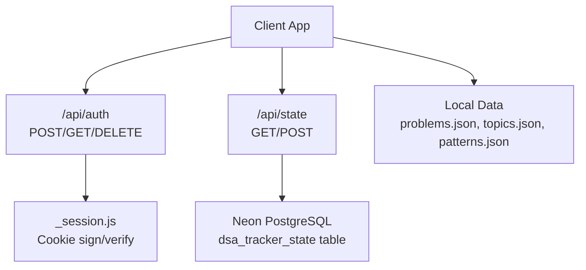
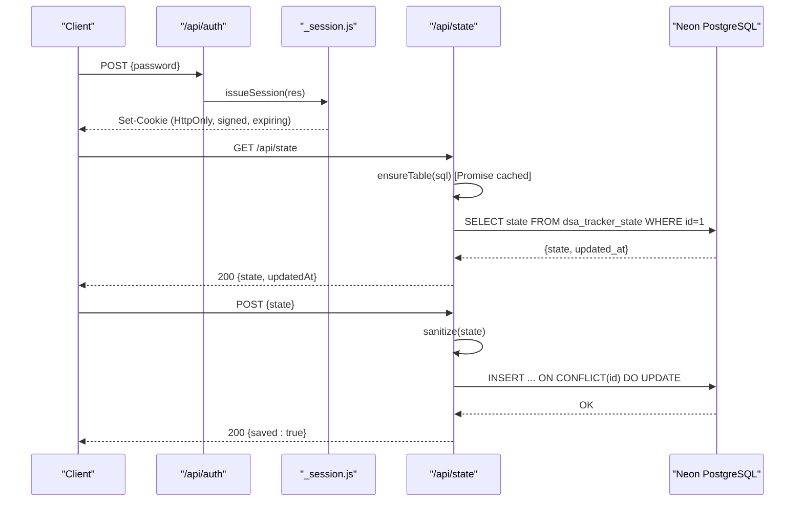
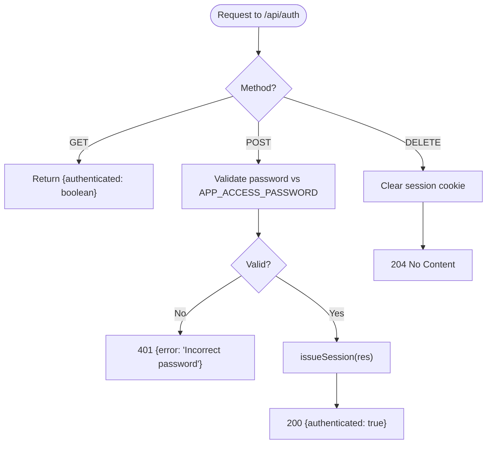
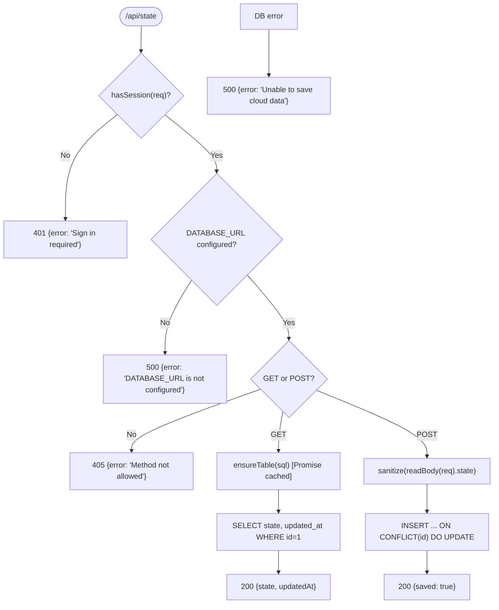
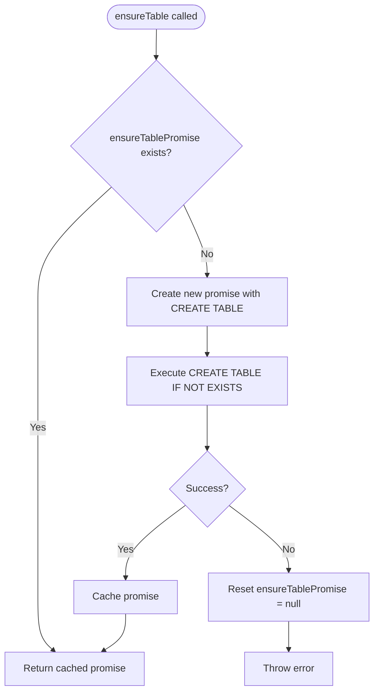
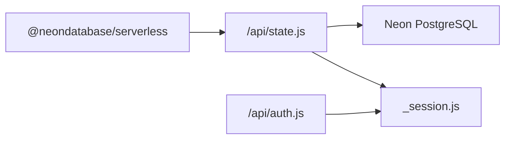

# State Synchronization API

<cite>
**Referenced Files in This Document**
- [state.js](file://api/state.js)
- [auth.js](file://api/auth.js)
- [_session.js](file://api/_session.js)
- [package.json](file://package.json)
- [README.md](file://README.md)
- [problems.json](file://data/problems.json)
- [topics.json](file://data/topics.json)
- [patterns.json](file://data/patterns.json)
</cite>

## Update Summary
**Changes Made**
- Updated Database Operations section to document improved connection reliability with promise-based table creation
- Enhanced Performance Considerations to address serverless cold start optimization
- Added detailed explanation of ensureTable function's promise caching mechanism
- Updated troubleshooting guide with serverless-specific considerations

## Table of Contents
1. [Introduction](#introduction)
2. [Project Structure](#project-structure)
3. [Core Components](#core-components)
4. [Architecture Overview](#architecture-overview)
5. [Detailed Component Analysis](#detailed-component-analysis)
6. [Dependency Analysis](#dependency-analysis)
7. [Performance Considerations](#performance-considerations)
8. [Troubleshooting Guide](#troubleshooting-guide)
9. [Conclusion](#conclusion)
10. [Appendices](#appendices)

## Introduction
This document describes the state synchronization API that persists a single user's progress, notes, solutions, activity, and settings to a Neon PostgreSQL database via Vercel serverless functions. The primary endpoint is POST /api/state (with GET support for retrieval). It enforces authentication via an HTTP-only session cookie and uses input sanitization to ensure only allowed fields are persisted. The system is designed for one-user scenarios with last-write-wins conflict resolution and optimized for serverless environments with improved connection reliability.

## Project Structure
The API consists of three serverless function files:
- Authentication and session management: api/auth.js and api/_session.js
- State persistence: api/state.js

Data schemas for problems, topics, and patterns are provided as static JSON files under data/.

**Diagram sources**
- [state.js:23-49](file://api/state.js#L23-L49)
- [auth.js:8-23](file://api/auth.js#L8-L23)
- [_session.js:29-51](file://api/_session.js#L29-L51)

**Section sources**
- [state.js:1-66](file://api/state.js#L1-L66)
- [auth.js:1-30](file://api/auth.js#L1-L30)
- [_session.js:1-60](file://api/_session.js#L1-L60)
- [package.json:12-18](file://package.json#L12-L18)
- [README.md:35-54](file://README.md#L35-L54)

## Core Components
- Authentication and session:
  - POST /api/auth authenticates using APP_ACCESS_PASSWORD and issues an HTTP-only session cookie.
  - GET /api/auth returns current authentication status.
  - DELETE /api/auth clears the session cookie.
  - Session validation uses HMAC-SHA256 signing and expiration checks.
- State persistence:
  - GET /api/state retrieves the stored state and updated timestamp.
  - POST /api/state sanitizes and upserts the entire state into Neon PostgreSQL.
  - Input is sanitized to a fixed schema: progress, notes, solutions, activity, settings, filters, collapse.

Key behaviors:
- Requires valid session for state operations.
- Creates the dsa_tracker_state table on first use if missing with promise-based caching to prevent concurrent attempts.
- Uses ON CONFLICT to perform idempotent upserts.
- Returns standardized error responses for invalid methods, missing configuration, or database errors.

**Section sources**
- [auth.js:8-23](file://api/auth.js#L8-L23)
- [_session.js:29-51](file://api/_session.js#L29-L51)
- [state.js:23-66](file://api/state.js#L23-L66)

## Architecture Overview
The API follows a simple request-response flow with strong input validation and a single-row JSONB store per user.

**Diagram sources**
- [auth.js:8-23](file://api/auth.js#L8-L23)
- [_session.js:29-51](file://api/_session.js#L29-L51)
- [state.js:23-66](file://api/state.js#L23-L66)

## Detailed Component Analysis

### Authentication and Session Management
- Password verification:
  - Compares client-provided password against APP_ACCESS_PASSWORD using constant-time comparison to prevent timing attacks.
- Session cookie:
  - Issues a signed, HttpOnly cookie with expiration set to 30 days.
  - Verifies signature and expiration on each request.
- Endpoints:
  - GET /api/auth returns authenticated status.
  - POST /api/auth sets the session cookie upon successful login.
  - DELETE /api/auth clears the session cookie.

**Diagram sources**
- [auth.js:8-23](file://api/auth.js#L8-L23)
- [_session.js:29-51](file://api/_session.js#L29-L51)

**Section sources**
- [auth.js:1-30](file://api/auth.js#L1-L30)
- [_session.js:1-60](file://api/_session.js#L1-L60)

### State Synchronization Endpoint (/api/state)
- Access control:
  - Requires a valid session; otherwise returns 401.
- Configuration check:
  - Requires DATABASE_URL; otherwise returns 500.
- Allowed methods:
  - GET and POST; other methods return 405.
- Database initialization:
  - Ensures dsa_tracker_state table exists with id (smallint), state (jsonb), updated_at (timestamptz).
  - **Updated**: Uses promise-based caching to prevent multiple concurrent table creation attempts during cold starts.
- GET behavior:
  - Returns the stored state and updated_at timestamp.
- POST behavior:
  - Reads and sanitizes the request body to a fixed shape.
  - Upserts the state row with id=1, updating state and updated_at.
  - Returns { saved: true } on success.

Input validation and sanitization:
- Only top-level keys progress, notes, solutions, activity, settings, filters, collapse are preserved.
- Each expected key must be an object; non-objects are coerced to empty objects.
- settings merges defaults (dailyGoal, theme) with any provided values.

Conflict resolution:
- Single-row design with id=1 ensures deterministic upserts.
- Last write wins; updated_at reflects the latest change.

Error handling:
- Missing session: 401.
- Missing DATABASE_URL: 500.
- Unsupported method: 405.
- Database errors: 500 with generic error message.

**Diagram sources**
- [state.js:23-66](file://api/state.js#L23-L66)

**Section sources**
- [state.js:1-66](file://api/state.js#L1-L66)

### Promise-Based Table Creation Optimization
**New** The ensureTable function implements a sophisticated promise caching mechanism specifically designed for serverless environments:

- **Promise Caching**: A module-level `ensureTablePromise` variable caches the table creation promise for the lifetime of the server instance.
- **Cold Start Protection**: Prevents multiple concurrent CREATE TABLE attempts during serverless cold starts by returning the same promise to all concurrent requests.
- **Automatic Retry**: If the initial table creation fails, the promise is reset to null, allowing subsequent requests to retry the operation.
- **Error Handling**: Failed promises are caught and logged, then cleared to enable retry on next request.

**Diagram sources**
- [state.js:25-40](file://api/state.js#L25-L40)

**Section sources**
- [state.js:25-40](file://api/state.js#L25-L40)

### Data Models and Schemas

#### Request/Response Schemas
- POST /api/state request body:
  - state: object
    - progress: object (user progress keyed by problem id)
    - notes: object (notes keyed by problem id)
    - solutions: object (saved solutions keyed by problem id)
    - activity: object (activity logs or counters)
    - settings: object
      - dailyGoal: number (default applied if missing)
      - theme: string (default applied if missing)
    - filters: object (additional filtering criteria)
    - collapse: object (UI state for collapsible sections)
- POST /api/state response:
  - 200: { saved: true }
  - 401: { error: "Sign in required" }
  - 405: { error: "Method not allowed" }
  - 500: { error: "DATABASE_URL is not configured" } or { error: "Unable to save cloud data" }
- GET /api/state response:
  - 200: { state: object | null, updatedAt: string | null }

Note: The server sanitizes incoming state to the above structure before persisting.

**Section sources**
- [state.js:4-23](file://api/state.js#L4-L23)
- [state.js:23-66](file://api/state.js#L23-L66)

#### Problems, Topics, Patterns
- Problems:
  - Array of problem entries with fields including id, title, topic, pattern, difficulty, status, url, videoUrl.
- Topics:
  - List of topic names used to group problems.
- Patterns:
  - Mapping from topic to arrays of subcategory patterns.

These datasets define the canonical problem catalog and organization used by the application. They are not part of the synced state but inform how progress and analytics are structured.

**Section sources**
- [problems.json:1-200](file://data/problems.json#L1-L200)
- [topics.json:1-20](file://data/topics.json#L1-L20)
- [patterns.json:1-91](file://data/patterns.json#L1-L91)

### Database Operations with Neon PostgreSQL
- Connection:
  - Uses @neondatabase/serverless with DATABASE_URL environment variable.
- Schema:
  - Table dsa_tracker_state with columns:
    - id: SMALLINT PRIMARY KEY CHECK (id = 1)
    - state: JSONB NOT NULL
    - updated_at: TIMESTAMPTZ NOT NULL DEFAULT NOW()
- Operations:
  - **Updated**: CREATE TABLE IF NOT EXISTS executed once per cold start with promise caching to prevent concurrent attempts.
  - SELECT for GET requests.
  - INSERT ... ON CONFLICT (id) DO UPDATE for POST requests to upsert the single row.

**Section sources**
- [state.js:25-66](file://api/state.js#L25-L66)
- [package.json:12-14](file://package.json#L12-L14)

### Conflict Resolution Strategy
- Single-row model:
  - All user state is stored in one row identified by id=1.
- Upsert semantics:
  - ON CONFLICT replaces the entire state and updates updated_at.
- Concurrency:
  - Last write wins; no merge logic is performed server-side.
  - Clients should debounce saves and avoid concurrent edits across devices to minimize conflicts.

**Section sources**
- [state.js:30-66](file://api/state.js#L30-L66)
- [README.md:54-55](file://README.md#L54-L55)

## Dependency Analysis
- External dependencies:
  - @neondatabase/serverless for serverless Postgres access.
- Internal modules:
  - _session.js provides session utilities used by both auth and state endpoints.
- Environment variables:
  - DATABASE_URL: Neon connection string.
  - APP_ACCESS_PASSWORD: Shared secret for authentication.
  - SESSION_SECRET: Secret used to sign session cookies.

**Diagram sources**
- [package.json:12-14](file://package.json#L12-L14)
- [state.js:1-2](file://api/state.js#L1-L2)
- [auth.js:1-2](file://api/auth.js#L1-L2)

**Section sources**
- [package.json:12-14](file://package.json#L12-L14)
- [state.js:1-2](file://api/state.js#L1-L2)
- [auth.js:1-2](file://api/auth.js#L1-L2)

## Performance Considerations
- Minimal payload:
  - Entire state is serialized as JSONB; keep payloads small by limiting history and large blobs.
- Debounced writes:
  - Save after short delays to reduce database load and avoid unnecessary conflicts.
- Single-row contention:
  - High concurrency can cause frequent upserts; consider client-side batching.
- **Updated Serverless Optimization**: 
  - First request may incur table creation overhead; subsequent calls reuse the existing promise cache within the same server instance.
  - Promise-based table creation prevents race conditions during cold starts where multiple concurrent requests might attempt table creation simultaneously.
  - Failed table creation attempts automatically reset the cache, enabling retry on subsequent requests without manual intervention.

[No sources needed since this section provides general guidance]

## Troubleshooting Guide
Common issues and resolutions:
- 401 Sign in required:
  - Ensure you have successfully logged in via POST /api/auth and that the session cookie is present.
- 405 Method not allowed:
  - Only GET and POST are supported on /api/state.
- 500 DATABASE_URL is not configured:
  - Verify DATABASE_URL is set in your deployment environment.
- 500 Unable to save cloud data:
  - Indicates a database connectivity or query error. Check Neon service status and credentials.
  - **Updated**: In serverless environments, this may indicate a failed table creation attempt during cold start; the system will automatically retry on subsequent requests.
- Session not persisting:
  - Confirm SESSION_SECRET is set and consistent across deployments.
  - Ensure cookies are accepted by the browser and not blocked by privacy settings.

Operational tips:
- Use GET /api/state to verify the current persisted state and timestamp.
- After making changes, wait briefly before syncing again to avoid redundant writes.
- For local testing, run Vercel Functions locally with vercel dev.
- **Updated**: Monitor for cold start performance; initial requests may be slower due to table creation, but subsequent requests benefit from promise caching.

**Section sources**
- [state.js:23-66](file://api/state.js#L23-L66)
- [auth.js:8-23](file://api/auth.js#L8-L23)
- [_session.js:29-51](file://api/_session.js#L29-L51)
- [README.md:35-54](file://README.md#L35-L54)

## Conclusion
The state synchronization API provides a secure, minimal, and robust mechanism to persist a single user's tracker state to Neon PostgreSQL. It enforces strict input validation, uses a single-row JSONB model for simplicity, and relies on last-write-wins conflict resolution. With the addition of promise-based table creation optimization, the API is now more resilient in serverless environments, preventing concurrent table creation attempts during cold starts while maintaining reliable database connectivity. The combination of proper environment configuration, careful client-side debouncing, and serverless optimizations supports reliable cross-device synchronization for the DSA Tracker.

[No sources needed since this section summarizes without analyzing specific files]

## Appendices

### API Reference Summary
- POST /api/auth
  - Request: { password: string }
  - Response: 200 { authenticated: true }, 401 { error: "Incorrect password" }, 405 { error: "Method not allowed" }
- GET /api/auth
  - Response: 200 { authenticated: boolean }
- DELETE /api/auth
  - Response: 204 No Content
- GET /api/state
  - Response: 200 { state: object | null, updatedAt: string | null }
- POST /api/state
  - Request: { state: { progress, notes, solutions, activity, settings, filters, collapse } }
  - Response: 200 { saved: true }, 401, 405, 500

**Section sources**
- [auth.js:8-23](file://api/auth.js#L8-L23)
- [state.js:23-66](file://api/state.js#L23-L66)

### Example Sync Workflow
- Connect device:
  - POST /api/auth with APP_ACCESS_PASSWORD to obtain session cookie.
- Load state:
  - GET /api/state to retrieve persisted state and timestamp.
- Update progress:
  - Modify local state (e.g., mark a problem complete).
  - Debounce and POST /api/state with the full sanitized state.
- Multi-device usage:
  - On another device, log in and GET /api/state to fetch the latest server state.
  - Subsequent saves overwrite previous versions; last write wins.

[No sources needed since this diagram shows conceptual workflow, not actual code structure]

### Serverless Cold Start Optimization Details
**New** The promise-based table creation implementation provides several key benefits for serverless deployments:

- **Race Condition Prevention**: Multiple concurrent requests during cold start share the same table creation promise, preventing duplicate CREATE TABLE statements.
- **Automatic Recovery**: Failed table creation attempts reset the cache, allowing automatic retry on subsequent requests.
- **Memory Efficiency**: The promise cache is maintained at module scope, providing optimal memory usage within serverless function instances.
- **Performance Impact**: Eliminates the need for explicit locking mechanisms or database-level coordination for table creation.

**Section sources**
- [state.js:25-40](file://api/state.js#L25-L40)