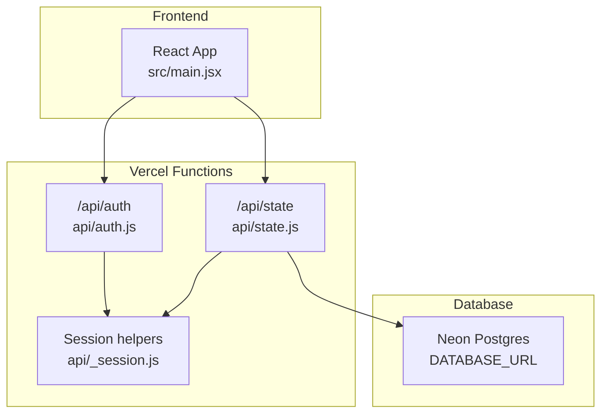
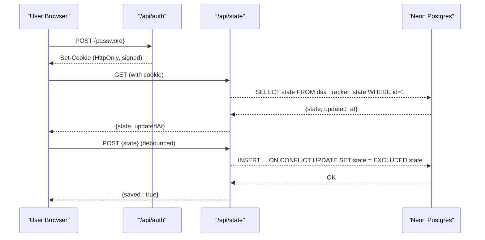
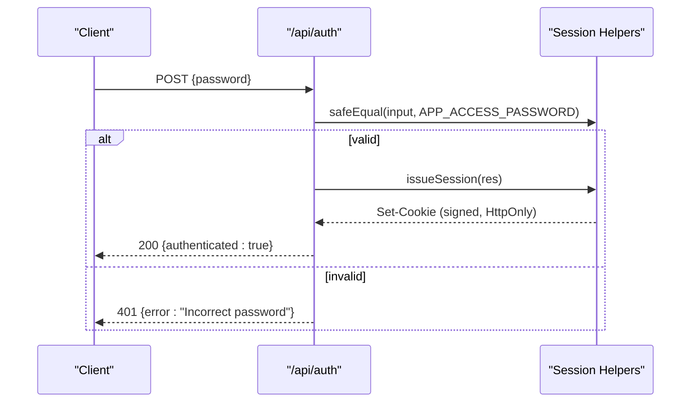
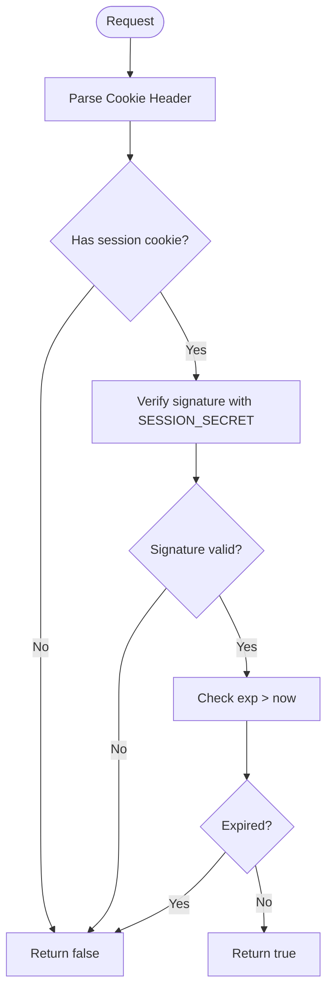
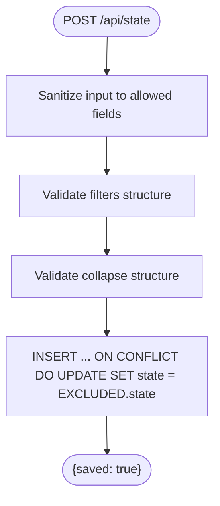
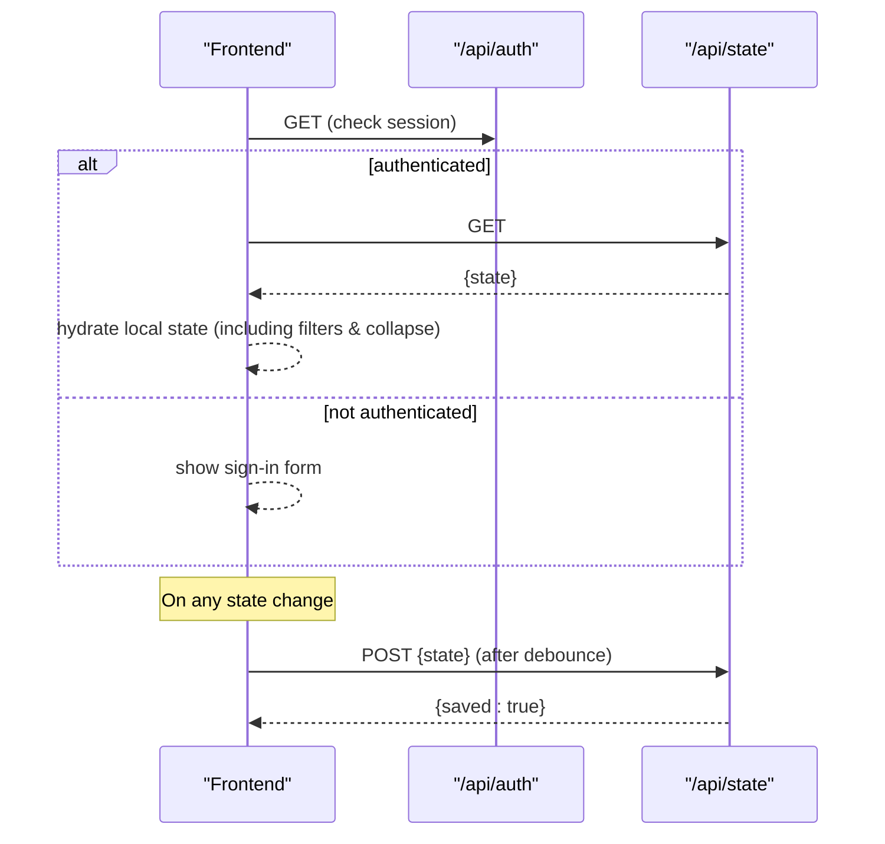
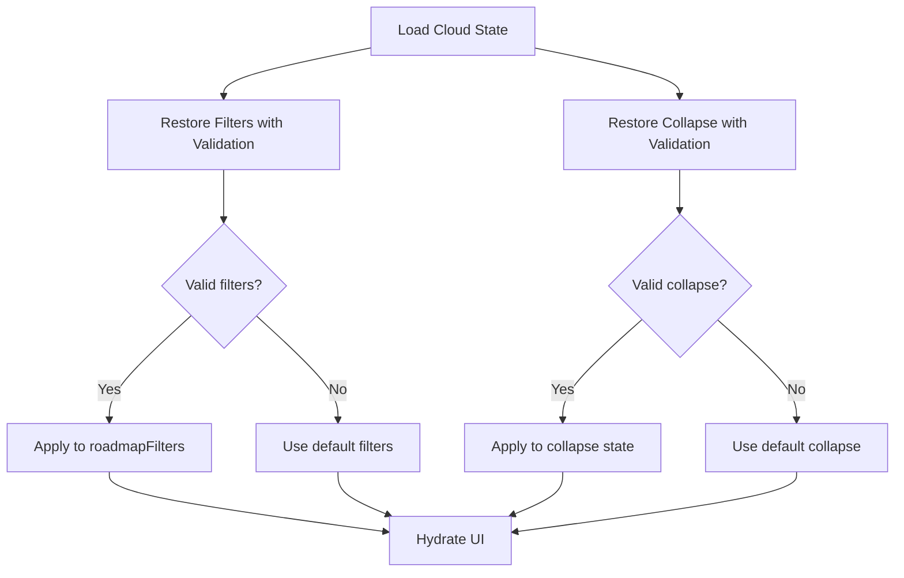
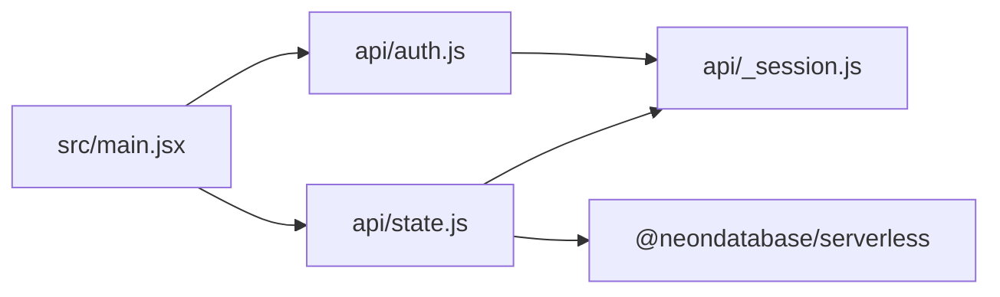

# Cloud Synchronization

<cite>
**Referenced Files in This Document**
- [README.md](file://README.md)
- [package.json](file://package.json)
- [api/auth.js](file://api/auth.js)
- [api/_session.js](file://api/_session.js)
- [api/state.js](file://api/state.js)
- [src/main.jsx](file://src/main.jsx)
</cite>

## Update Summary
**Changes Made**
- Updated state synchronization section to document new filters and collapse properties
- Enhanced cloudState() function documentation to include roadmapFilters and collapse state
- Updated loadCloudState() documentation to show proper sanitization of new state properties
- Added detailed explanation of filter and collapse state management
- Updated troubleshooting guide with sync-related issues for new properties

## Table of Contents
1. [Introduction](#introduction)
2. [Project Structure](#project-structure)
3. [Core Components](#core-components)
4. [Architecture Overview](#architecture-overview)
5. [Detailed Component Analysis](#detailed-component-analysis)
6. [Dependency Analysis](#dependency-analysis)
7. [Performance Considerations](#performance-considerations)
8. [Troubleshooting Guide](#troubleshooting-guide)
9. [Conclusion](#conclusion)
10. [Appendices](#appendices)

## Introduction
This document explains the cloud synchronization feature for the DSA Tracker application. It covers:
- One-user-per-account design with password-based authentication and secure session management
- Vercel deployment setup with Neon database integration and environment variables
- Data synchronization protocol, conflict resolution strategy (last-write-wins), and offline-first behavior
- Security considerations for passwords, sessions, and data storage
- Troubleshooting common sync issues and backup/recovery procedures

The system is intentionally simple: a single shared app password authenticates one user across devices, and all state is persisted to a Neon Postgres database via serverless functions. **Updated**: State synchronization now includes filters and collapse properties alongside progress, notes, solutions, activity, and settings data.

## Project Structure
The cloud sync feature spans server-side API routes and client-side orchestration:
- Serverless API routes under api/ handle authentication and state persistence
- The React frontend under src/main.jsx manages local state, sync triggers, and UI flows
- Environment configuration and deployment instructions are documented in README.md
- Dependencies include Neon serverless driver for database access

**Diagram sources**
- [src/main.jsx:64-113](file://src/main.jsx#L64-L113)
- [api/auth.js:1-24](file://api/auth.js#L1-L24)
- [api/state.js:1-51](file://api/state.js#L1-L51)
- [api/_session.js:1-54](file://api/_session.js#L1-L54)

**Section sources**
- [README.md:35-54](file://README.md#L35-L54)
- [package.json:12-18](file://package.json#L12-L18)

## Core Components
- Authentication endpoint: validates a single app password and issues an HTTP-only session cookie
- Session utilities: sign/verify cookies, safe comparison, expiration handling
- State endpoint: reads/writes JSONB state to Neon with sanitization and last-write-wins semantics
- Frontend sync engine: loads cloud state on connect, debounced saves after edits, and handles auth flow

Key responsibilities:
- Enforce one-user-per-account by sharing a single app password
- Protect sessions with signed cookies and short-lived expiry
- Persist only whitelisted fields to prevent schema drift or injection
- Provide offline-first UX with local storage and background sync
- **Updated**: Handle filters and collapse state synchronization with proper validation and sanitization

**Section sources**
- [api/auth.js:1-24](file://api/auth.js#L1-L24)
- [api/_session.js:1-54](file://api/_session.js#L1-L54)
- [api/state.js:1-51](file://api/state.js#L1-L51)
- [src/main.jsx:64-113](file://src/main.jsx#L64-L113)

## Architecture Overview
The sync architecture follows an offline-first model:
- Local state is always authoritative on the device
- On connect, the server's latest state is loaded into the browser
- After edits, changes are saved with a debounce to reduce network calls
- Conflicts are resolved server-side using last-write-wins on a single-row record

**Diagram sources**
- [src/main.jsx:64-113](file://src/main.jsx#L64-L113)
- [api/auth.js:8-23](file://api/auth.js#L8-L23)
- [api/state.js:23-49](file://api/state.js#L23-L49)

## Detailed Component Analysis

### Authentication Flow
- The client sends a POST to /api/auth with the app password
- The server compares the provided password against the configured secret using constant-time comparison
- On success, it sets an HTTP-only, signed session cookie with expiration
- Subsequent requests include the cookie; unauthenticated requests are rejected

**Diagram sources**
- [api/auth.js:8-23](file://api/auth.js#L8-L23)
- [api/_session.js:23-34](file://api/_session.js#L23-L34)

**Section sources**
- [api/auth.js:1-24](file://api/auth.js#L1-L24)
- [api/_session.js:6-34](file://api/_session.js#L6-L34)

### Session Management
- Cookies are signed using HMAC-SHA256 with a server-side secret
- Expiration is enforced by embedding an exp timestamp in the payload
- Safe comparison prevents timing attacks when validating passwords and signatures
- In production deployments (e.g., Vercel), Secure flag is applied automatically

**Diagram sources**
- [api/_session.js:16-51](file://api/_session.js#L16-L51)

**Section sources**
- [api/_session.js:1-54](file://api/_session.js#L1-L54)

### State Persistence and Conflict Resolution
- The state endpoint enforces a strict schema by sanitizing inputs to known fields
- Data is stored as JSONB in a single-row table identified by a fixed primary key
- Writes use upsert semantics: insert if missing, otherwise update the existing row
- Conflict resolution is last-write-wins because there is only one row per account
- **Updated**: Sanitization now includes filters and collapse properties with proper validation

**Diagram sources**
- [api/state.js:12-45](file://api/state.js#L12-L45)

**Section sources**
- [api/state.js:1-51](file://api/state.js#L1-L51)

### Frontend Sync Orchestration
- On first load, the app checks authentication status and loads cloud state if authenticated
- User can connect by entering the app password; successful login triggers a cloud state load
- Edits trigger a debounced save to minimize network overhead
- Sync status reflects checking, syncing, synced, error, or signed-out states
- **Updated**: cloudState() function now includes filters and collapse properties in the synchronized state

**Diagram sources**
- [src/main.jsx:64-113](file://src/main.jsx#L64-L113)

**Section sources**
- [src/main.jsx:64-113](file://src/main.jsx#L64-L113)

### Filter and Collapse State Management
- **Filters**: Store user preferences for topic, status, difficulty, pattern, confidence, favorites, and sort order
- **Collapse**: Track UI state for collapsed topics and patterns to maintain user interface preferences
- Both properties are sanitized before saving to ensure data integrity and prevent schema drift
- LoadCloudState properly restores these properties with validation to handle malformed data gracefully

**Diagram sources**
- [src/main.jsx:156-170](file://src/main.jsx#L156-L170)

**Section sources**
- [src/main.jsx:80-101](file://src/main.jsx#L80-L101)
- [src/main.jsx:156-170](file://src/main.jsx#L156-L170)

### Offline-First Behavior
- All user data is kept in localStorage on the device
- Cloud sync augments local data but does not replace it unless explicitly connected
- Export/import provides portable backups independent of cloud connectivity
- **Updated**: Backup and restore functionality now includes filters and collapse state

**Section sources**
- [src/main.jsx:29-33](file://src/main.jsx#L29-L33)
- [src/main.jsx:144-146](file://src/main.jsx#L144-L146)
- [src/main.jsx:257-258](file://src/main.jsx#L257-L258)

## Dependency Analysis
- Frontend depends on Vercel Functions endpoints for auth and state
- Serverless functions depend on Neon serverless driver for database operations
- Session security depends on a strong SESSION_SECRET and proper environment configuration
- Deployment relies on Vercel's automatic function discovery from the api/ directory

**Diagram sources**
- [src/main.jsx:64-113](file://src/main.jsx#L64-L113)
- [api/auth.js:1-24](file://api/auth.js#L1-L24)
- [api/state.js:1-51](file://api/state.js#L1-L51)
- [package.json:12-18](file://package.json#L12-L18)

**Section sources**
- [package.json:12-18](file://package.json#L12-L18)

## Performance Considerations
- Debounced saves reduce unnecessary writes and network calls during rapid edits
- Single-row JSONB storage simplifies locking and avoids complex conflict resolution logic
- Sanitization minimizes payload size and reduces risk of storing extraneous data
- Stateless session verification keeps server CPU usage low
- **Updated**: Filter and collapse state are lightweight boolean/string values that add minimal overhead

## Troubleshooting Guide

Common issues and resolutions:
- Cannot connect to cloud sync
  - Ensure DATABASE_URL is set in Vercel environment variables
  - Confirm Neon database is created and accessible
  - Use vercel dev to test API routes locally before deploying

- Incorrect password errors
  - Verify APP_ACCESS_PASSWORD matches what is entered in Settings
  - Remember that the same password must be used across all devices

- Session not persisting
  - Confirm SESSION_SECRET is set and consistent across environments
  - Check that cookies are accepted by the browser and not blocked by extensions

- Sync shows error or unavailable
  - Inspect network tab for failed fetches to /api/state
  - Validate that the request includes the session cookie

- **Updated**: Filter or collapse state not syncing
  - Check browser console for validation errors in sanitizeFilters or sanitizeCollapse functions
  - Verify that filter values match expected enum values (topic, status, difficulty, etc.)
  - Ensure collapse state structure contains valid topic and pattern keys

Backup and recovery:
- Export your data regularly from Settings to maintain a local backup
- Import a previously exported file to restore progress, notes, solutions, activity, settings, filters, and collapse state
- If you reset local data while connected, re-connect to reload the latest cloud state

**Section sources**
- [README.md:35-54](file://README.md#L35-L54)
- [src/main.jsx:586-605](file://src/main.jsx#L586-L605)
- [src/main.jsx:80-101](file://src/main.jsx#L80-L101)

## Conclusion
The cloud synchronization feature provides a simple, secure, and reliable way to keep your DSA Tracker data consistent across devices. It uses a one-user-per-account model with password-based authentication, signed HTTP-only sessions, and last-write-wins conflict resolution backed by Neon Postgres. The offline-first design ensures usability without internet access, while periodic sync keeps everything in harmony. **Enhanced**: The system now synchronizes filters and collapse state along with core tracker data, ensuring complete user experience consistency across devices. Follow the setup steps, configure secrets securely, and use export/import for robust backup and recovery.

## Appendices

### Setup Checklist for Vercel + Neon
- Create or connect a Neon Postgres database in Vercel Storage
- Add environment variables:
  - DATABASE_URL: Neon pooled connection string
  - APP_ACCESS_PASSWORD: strong password used by all devices
  - SESSION_SECRET: random 32+ character value generated securely
- Deploy the project; Vercel will auto-discover functions under api/
- On first device, open Settings → Cloud sync and enter the app password
- Connect additional devices with the same password to share state

**Section sources**
- [README.md:35-54](file://README.md#L35-L54)

### Security Notes
- Passwords are compared using constant-time equality to mitigate timing attacks
- Sessions are signed with HMAC and stored in HttpOnly cookies
- Only whitelisted fields are persisted to prevent schema drift or injection
- Keep secrets out of client code; they belong in server environment variables
- **Updated**: Filter and collapse state validation prevents malicious data injection through UI preferences

**Section sources**
- [api/auth.js:16-22](file://api/auth.js#L16-L22)
- [api/_session.js:6-14](file://api/_session.js#L6-L14)
- [api/state.js:12-21](file://api/state.js#L12-L21)

### State Schema Reference
The synchronized state object includes:
- `progress`: Problem completion status and revision tracking
- `notes`: Learning notes for each problem
- `solutions`: Personal solution approaches and implementations
- `activity`: Daily activity counts for streak tracking
- `settings`: User preferences like daily goals and theme
- **Updated**: `filters`: Roadmap filtering preferences (topic, status, difficulty, pattern, confidence, favorites, sort)
- **Updated**: `collapse`: UI state for collapsed topics and patterns

**Section sources**
- [api/state.js:4-22](file://api/state.js#L4-L22)
- [src/main.jsx:155](file://src/main.jsx#L155)