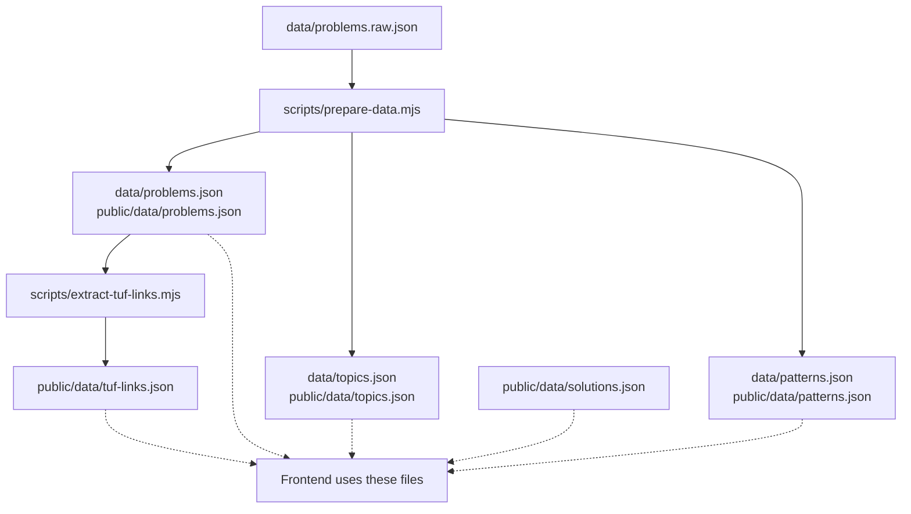
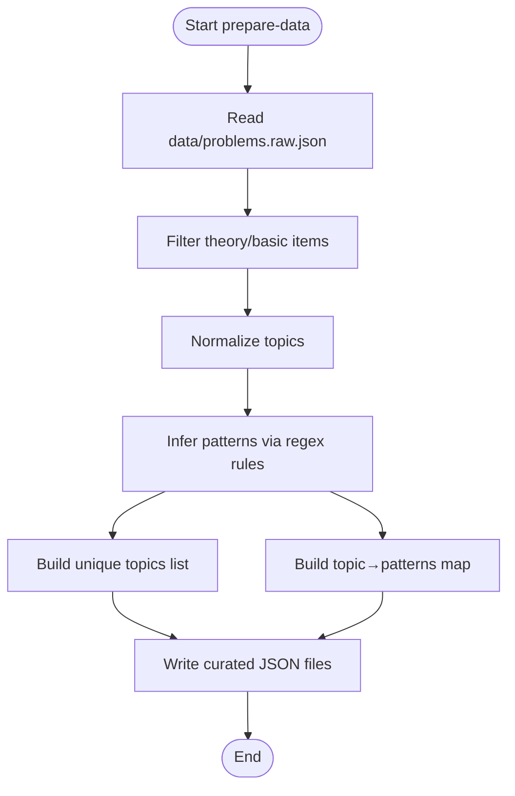
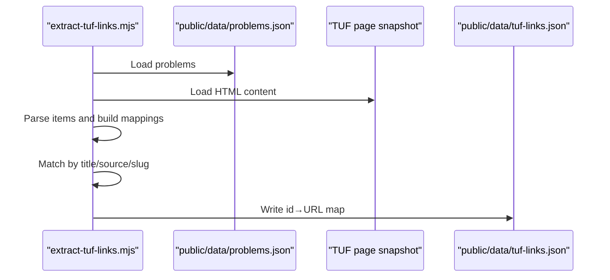
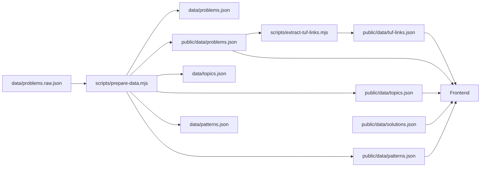

# Data Management

<cite>
**Referenced Files in This Document**
- [problems.json](file://data/problems.json)
- [topics.json](file://data/topics.json)
- [patterns.json](file://data/patterns.json)
- [problems.raw.json](file://data/problems.raw.json)
- [prepare-data.mjs](file://scripts/prepare-data.mjs)
- [extract-tuf-links.mjs](file://scripts/extract-tuf-links.mjs)
- [solutions.json](file://public/data/solutions.json)
- [tuf-links.json](file://public/data/tuf-links.json)
- [README.md](file://README.md)
</cite>

## Table of Contents
1. Introduction
2. Project Structure
3. Core Components
4. Architecture Overview
5. Detailed Component Analysis
6. Dependency Analysis
7. Performance Considerations
8. Troubleshooting Guide
9. Conclusion
10. Appendices

## Introduction
This document explains the data management system that powers the DSA tracker. It covers:
- The curated problem catalog structure and how problems are organized by topic, pattern, and difficulty.
- How topics and patterns are defined and maintained.
- The data processing pipeline that transforms raw data into curated datasets.
- Solution templates and external link management.
- Validation rules, schema definitions, and migration procedures.
- The relationship between static data and dynamic user progress tracking.

## Project Structure
The repository separates raw source data from curated outputs:
- Raw input: data/problems.raw.json contains the full A2Z sheet (including theory and language basics).
- Curated outputs:
  - data/problems.json and public/data/problems.json: filtered and normalized problem list with topic, pattern, difficulty, status, links.
  - data/topics.json and public/data/topics.json: canonical topic labels derived from the curated problems.
  - data/patterns.json and public/data/patterns.json: mapping of each topic to its subcategory patterns.
- Scripts:
  - scripts/prepare-data.mjs: builds curated datasets from raw data.
  - scripts/extract-tuf-links.mjs: extracts TakeUForward editorial URLs for problems.
- Public assets:
  - public/data/solutions.json: solution templates keyed by problem id.
  - public/data/tuf-links.json: editorial links keyed by problem id.



**Diagram sources**
- [prepare-data.mjs:1-7](file://scripts/prepare-data.mjs#L1-L7)
- [prepare-data.mjs:706-748](file://scripts/prepare-data.mjs#L706-L748)
- [extract-tuf-links.mjs:1-69](file://scripts/extract-tuf-links.mjs#L1-L69)

**Section sources**
- [README.md:5-19](file://README.md#L5-L19)
- [prepare-data.mjs:1-7](file://scripts/prepare-data.mjs#L1-L7)

## Core Components
- Problem catalog (problems.json): Array of problem objects with fields id, title, topic, pattern, difficulty, status, url, videoUrl.
- Topics (topics.json): Canonical list of topic labels used across the app.
- Patterns (patterns.json): For each topic, a list of subcategory patterns (e.g., Graphs → BFS/DFS Problems, Topo Sort, Shortest Path).
- Solutions (solutions.json): Keyed by problem id; each entry includes approaches with metadata (id, title, level, time, space, explanation) and code snippets in multiple languages.
- External links (tuf-links.json): Maps problem id to TakeUForward editorial URL.

Key behaviors:
- Theory and basic language-intro items are filtered out during preparation.
- Topic names are normalized to a canonical set.
- Pattern assignment is rule-based using title/topic keywords.
- Status defaults to "Not Started" for all problems in the curated dataset.

**Section sources**
- [problems.json:1-120](file://data/problems.json#L1-L120)
- [topics.json:1-20](file://data/topics.json#L1-L20)
- [patterns.json:1-91](file://data/patterns.json#L1-L91)
- [solutions.json:1-13](file://public/data/solutions.json#L1-L13)
- [tuf-links.json:1-409](file://public/data/tuf-links.json#L1-L409)

## Architecture Overview
The data pipeline has two main stages:
1. Prepare curated datasets from raw data.
2. Extract editorial links for problems.

```mermaid
sequenceDiagram
participant Dev as "Developer"
participant Prep as "prepare-data.mjs"
participant FS as "File System"
participant Links as "extract-tuf-links.mjs"
Dev->>Prep : Run npm run prepare-data
Prep->>FS : Read data/problems.raw.json
Prep->>Prep : Filter theory/basic items
Prep->>Prep : Normalize topics and infer patterns
Prep->>FS : Write data/problems.json
Prep->>FS : Write public/data/problems.json
Prep->>FS : Write data/topics.json
Prep->>FS : Write public/data/topics.json
Prep->>FS : Write data/patterns.json
Prep->>FS : Write public/data/patterns.json
Dev->>Links : Run extract-tuf-links.mjs
Links->>FS : Read public/data/problems.json
Links->>FS : Read TUF page snapshot (external)
Links->>FS : Write public/data/tuf-links.json
```

**Diagram sources**
- [prepare-data.mjs:706-748](file://scripts/prepare-data.mjs#L706-L748)
- [extract-tuf-links.mjs:1-69](file://scripts/extract-tuf-links.mjs#L1-L69)

## Detailed Component Analysis

### Problem Catalog Schema and Organization
- Each problem object includes:
  - id: stable identifier (e.g., a2z-055).
  - title: human-readable problem name.
  - topic: canonical topic label (from topics.json).
  - pattern: subcategory under the topic (from patterns.json).
  - difficulty: Easy/Medium/Hard.
  - status: default "Not Started".
  - url: optional external problem link.
  - videoUrl: optional video reference.

Topic organization:
- topics.json defines the canonical topic set used throughout the app.
- problems.json entries must reference one of these topics.

Pattern classification:
- patterns.json maps each topic to its allowed subcategories.
- During preparation, patterns are inferred from titles using keyword rules. Unmatched problems receive a fallback pattern.

Difficulty levels:
- Difficulty is preserved from raw data and remains unchanged in the curated output.

Validation rules:
- Theory and basic items are excluded based on topic or title heuristics.
- Topic normalization ensures consistent labeling.
- Pattern inference uses regex rules per topic; unmatched items are flagged.

Migration procedure:
- To rebuild curated datasets from raw data, run the preparation script.
- After updating raw data or rules, re-run the script to regenerate outputs.

**Section sources**
- [problems.json:1-120](file://data/problems.json#L1-L120)
- [topics.json:1-20](file://data/topics.json#L1-L20)
- [patterns.json:1-91](file://data/patterns.json#L1-L91)
- [prepare-data.mjs:8-18](file://scripts/prepare-data.mjs#L8-L18)
- [prepare-data.mjs:20-53](file://scripts/prepare-data.mjs#L20-L53)
- [prepare-data.mjs:59-704](file://scripts/prepare-data.mjs#L59-L704)
- [prepare-data.mjs:711-748](file://scripts/prepare-data.mjs#L711-L748)

### Topics and Patterns Definitions
- topics.json enumerates canonical topics such as Sorting, Arrays, Binary Search, Strings, Linked List, Recursion, Bit Manipulation, Stack & Queue, Sliding Window, Heaps, Greedy, Binary Trees, BST, Graphs, Dynamic Programming, Tries, Advanced Strings.
- patterns.json lists subcategories per topic. Examples:
  - Graphs: Learning, BFS / DFS Problems, Topo Sort, Shortest Path, MST / Disjoint Set, Other Algorithms.
  - Binary Search: BS on 1D Arrays, BS on Search Space, BS on 2D Arrays.
  - Dynamic Programming: 1D DP, 2D / Grid DP, DP on Subsequences, DP on Strings, DP on Stocks, DP on LIS, MCM / Partition DP, DP on Squares.

These definitions guide both UI grouping and automated pattern inference.

**Section sources**
- [topics.json:1-20](file://data/topics.json#L1-L20)
- [patterns.json:1-91](file://data/patterns.json#L1-L91)

### Data Processing Pipeline (prepare-data.mjs)
The preparation script performs:
- Filtering: Removes theory and basic items based on topic/title heuristics.
- Normalization: Maps varied topic strings to canonical labels.
- Pattern inference: Uses regex rules per topic to assign subcategories.
- Output generation: Writes curated problems, topics, and patterns to both internal and public directories.



**Diagram sources**
- [prepare-data.mjs:706-748](file://scripts/prepare-data.mjs#L706-L748)

**Section sources**
- [prepare-data.mjs:8-18](file://scripts/prepare-data.mjs#L8-L18)
- [prepare-data.mjs:20-53](file://scripts/prepare-data.mjs#L20-L53)
- [prepare-data.mjs:59-704](file://scripts/prepare-data.mjs#L59-L704)
- [prepare-data.mjs:706-748](file://scripts/prepare-data.mjs#L706-L748)

### Solution Templates (solutions.json)
- Structure: Map from problem id to an object containing an array of approaches.
- Each approach includes:
  - id: unique approach identifier.
  - title: descriptive name.
  - level: e.g., Optimal.
  - time: complexity notation.
  - space: complexity notation.
  - explanation: concise description.
  - code: object with implementations in multiple languages (e.g., java, csharp).

Usage:
- Frontend can display solutions per problem, including multiple approaches and code samples.

**Section sources**
- [solutions.json:1-13](file://public/data/solutions.json#L1-L13)

### External Link Management (tuf-links.json)
- Structure: Map from problem id to TakeUForward editorial URL.
- Extraction process:
  - Reads curated problems.
  - Parses a TUF page snapshot to find editorial links.
  - Matches by normalized title, original source URL, or slug.
  - Falls back to constructing an editorial URL when necessary.



**Diagram sources**
- [extract-tuf-links.mjs:1-69](file://scripts/extract-tuf-links.mjs#L1-L69)

**Section sources**
- [extract-tuf-links.mjs:1-69](file://scripts/extract-tuf-links.mjs#L1-L69)
- [tuf-links.json:1-409](file://public/data/tuf-links.json#L1-L409)

### Relationship Between Static Data and Dynamic User Progress Tracking
- Static data:
  - problems.json, topics.json, patterns.json define the catalog and organization.
  - solutions.json provides learning resources.
  - tuf-links.json provides editorial references.
- Dynamic progress:
  - Each problem includes a status field (default "Not Started").
  - The README notes that progress, notes, revisions, favorites, activity, saved solutions, and settings are kept locally until Cloud sync is connected.
  - When cloud sync is enabled, local state can be persisted to a database and synchronized across devices.

Implications:
- The frontend reads static catalogs to render problems grouped by topic and pattern.
- User interactions update the status and other dynamic fields in local storage or synced state.
- Rebuilding static data does not affect user progress unless the problem ids change.

**Section sources**
- [problems.json:1-120](file://data/problems.json#L1-L120)
- [README.md:5-19](file://README.md#L5-L19)
- [README.md:35-54](file://README.md#L35-L54)

## Dependency Analysis
- prepare-data.mjs depends on:
  - data/problems.raw.json (input).
  - Regex rules for topic normalization and pattern inference.
  - Outputs: data/problems.json, public/data/problems.json, data/topics.json, public/data/topics.json, data/patterns.json, public/data/patterns.json.
- extract-tuf-links.mjs depends on:
  - public/data/problems.json (to iterate problems).
  - An external TUF page snapshot (provided separately).
  - Output: public/data/tuf-links.json.
- Frontend consumes:
  - public/data/problems.json, public/data/topics.json, public/data/patterns.json, public/data/solutions.json, public/data/tuf-links.json.



**Diagram sources**
- [prepare-data.mjs:1-7](file://scripts/prepare-data.mjs#L1-L7)
- [prepare-data.mjs:706-748](file://scripts/prepare-data.mjs#L706-L748)
- [extract-tuf-links.mjs:1-69](file://scripts/extract-tuf-links.mjs#L1-L69)

**Section sources**
- [prepare-data.mjs:1-7](file://scripts/prepare-data.mjs#L1-L7)
- [extract-tuf-links.mjs:1-69](file://scripts/extract-tuf-links.mjs#L1-L69)

## Performance Considerations
- Filtering and normalization are linear in the number of raw problems.
- Pattern inference applies multiple regex checks per problem; keeping rules concise improves performance.
- Writing outputs occurs once per run; consider batching if scaling to larger datasets.
- Link extraction parses HTML; ensure the snapshot size is reasonable to avoid long processing times.

[No sources needed since this section provides general guidance]

## Troubleshooting Guide
Common issues and resolutions:
- Missing raw dataset:
  - Symptom: Preparation fails with an error indicating expected local dataset.
  - Resolution: Ensure data/problems.raw.json exists and contains a valid array of problems.
- Unmatched patterns:
  - Symptom: Console warns about unmatched patterns after preparation.
  - Resolution: Add or adjust regex rules in the pattern inference section to cover new titles.
- Incorrect topic labels:
  - Symptom: Topics appear inconsistent in outputs.
  - Resolution: Update normalization mapping to include new topic variants.
- Editorial links missing:
  - Symptom: Some problems lack editorial URLs in tuf-links.json.
  - Resolution: Verify matching logic by title/source/slug; update normalization or provide explicit mappings if needed.

**Section sources**
- [prepare-data.mjs:706-709](file://scripts/prepare-data.mjs#L706-L709)
- [prepare-data.mjs:750-767](file://scripts/prepare-data.mjs#L750-L767)
- [extract-tuf-links.mjs:27-69](file://scripts/extract-tuf-links.mjs#L27-L69)

## Conclusion
The data management system provides a robust, offline-first pipeline to curate and organize the A2Z problem set. It enforces consistent topics and patterns, generates solution templates and editorial links, and supports local progress tracking with optional cloud synchronization. Maintaining the raw dataset and updating rules in the preparation script ensures the curated outputs remain accurate and useful.

[No sources needed since this section summarizes without analyzing specific files]

## Appendices

### Schema Definitions
- Problem object fields:
  - id: string (unique identifier).
  - title: string.
  - topic: string (must match topics.json).
  - pattern: string (must match patterns.json for the given topic).
  - difficulty: string (Easy/Medium/Hard).
  - status: string (default "Not Started").
  - url: string (optional).
  - videoUrl: string (optional).
- Topics:
  - Array of canonical topic strings.
- Patterns:
  - Object mapping topic to array of pattern strings.
- Solutions:
  - Map from problem id to approaches array; each approach includes id, title, level, time, space, explanation, and code object with language keys.
- TUF links:
  - Map from problem id to editorial URL string.

**Section sources**
- [problems.json:1-120](file://data/problems.json#L1-L120)
- [topics.json:1-20](file://data/topics.json#L1-L20)
- [patterns.json:1-91](file://data/patterns.json#L1-L91)
- [solutions.json:1-13](file://public/data/solutions.json#L1-L13)
- [tuf-links.json:1-409](file://public/data/tuf-links.json#L1-L409)