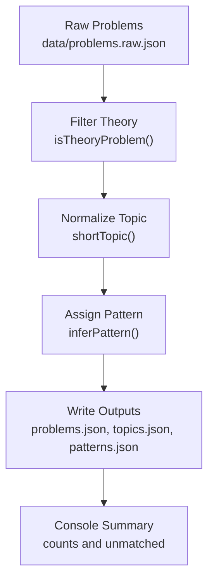
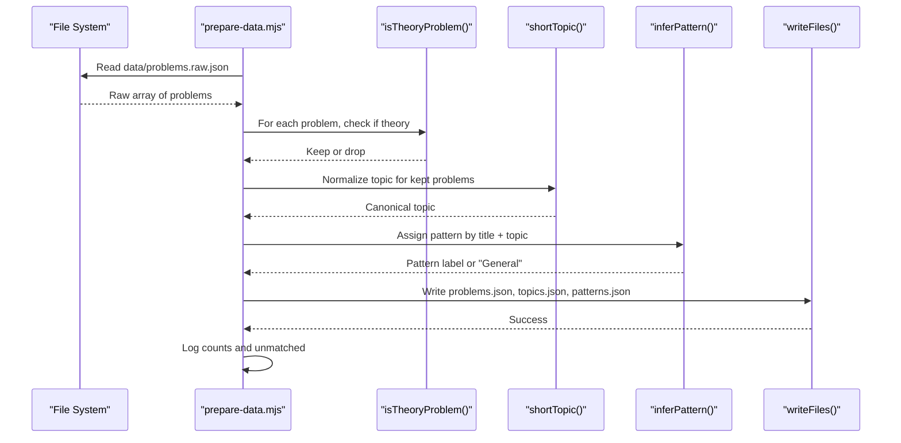
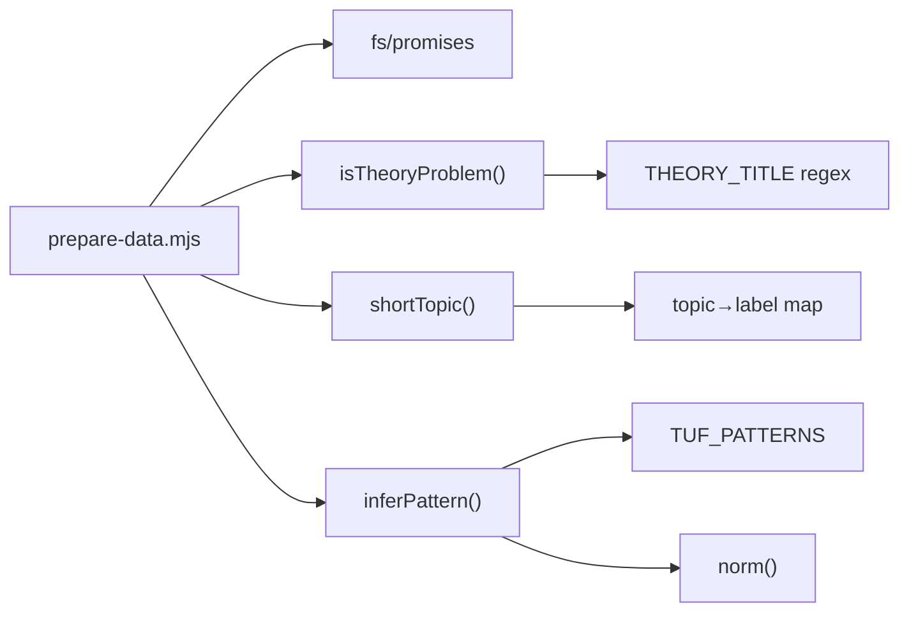

# Data Processing Pipeline

<cite>
**Referenced Files in This Document**
- [prepare-data.mjs](file://scripts/prepare-data.mjs)
- [problems.raw.json](file://data/problems.raw.json)
- [problems.json](file://data/problems.json)
- [topics.json](file://data/topics.json)
- [patterns.json](file://data/patterns.json)
- [README.md](file://README.md)
</cite>

## Table of Contents
1. [Introduction](#introduction)
2. [Project Structure](#project-structure)
3. [Core Components](#core-components)
4. [Architecture Overview](#architecture-overview)
5. [Detailed Component Analysis](#detailed-component-analysis)
6. [Dependency Analysis](#dependency-analysis)
7. [Performance Considerations](#performance-considerations)
8. [Troubleshooting Guide](#troubleshooting-guide)
9. [Conclusion](#conclusion)

## Introduction
This document explains the data processing pipeline implemented in prepare-data.mjs that transforms raw problem entries from problems.raw.json into a curated set of outputs: problems.json, topics.json, and patterns.json. The script filters out theory/introductory content, normalizes topics, assigns TakeUForward A2Z subcategory patterns based on title heuristics, preserves difficulty and links, and writes consistent output files to both data and public/data directories. It also prints summary statistics and unmatched pattern warnings for maintainability.

## Project Structure
The pipeline operates within a small dataset workspace:
- Input: data/problems.raw.json (raw problem list)
- Outputs:
  - data/problems.json and public/data/problems.json (curated problems)
  - data/topics.json and public/data/topics.json (unique normalized topics)
  - data/patterns.json and public/data/patterns.json (per-topic pattern catalog)

**Diagram sources**
- [prepare-data.mjs:1-768](file://scripts/prepare-data.mjs#L1-L768)

**Section sources**
- [README.md:5-19](file://README.md#L5-L19)
- [prepare-data.mjs:1-10](file://scripts/prepare-data.mjs#L1-L10)

## Core Components
- Theory filter: Removes language intros and Learn-the-basics items using title/topic rules.
- Topic normalization: Maps varied topic strings to canonical labels (e.g., “binary search trees” → “BST”).
- Pattern assignment: Matches normalized titles against TakeUForward A2Z subcategories per topic using regex rules.
- Output generation: Writes curated problems, unique topics, and per-topic pattern catalogs to multiple locations.
- Validation and diagnostics: Validates input size and logs unmatched patterns and per-topic distribution.

**Section sources**
- [prepare-data.mjs:8-18](file://scripts/prepare-data.mjs#L8-L18)
- [prepare-data.mjs:20-53](file://scripts/prepare-data.mjs#L20-L53)
- [prepare-data.mjs:55-704](file://scripts/prepare-data.mjs#L55-L704)
- [prepare-data.mjs:706-768](file://scripts/prepare-data.mjs#L706-L768)

## Architecture Overview
End-to-end flow from raw input to curated outputs:

**Diagram sources**
- [prepare-data.mjs:706-768](file://scripts/prepare-data.mjs#L706-L768)

## Detailed Component Analysis

### Input Validation and Filtering
- Reads the raw dataset and asserts it is an array with at least 100 entries; otherwise throws an error indicating expected local dataset.
- Filters out theory/intro problems:
  - Drops any item whose topic matches “Learn the basics”.
  - Drops items whose title matches a comprehensive set of theory-related patterns (e.g., “input output”, “cpp basics”, “for loops”, “theory with…”, “pattern N”, etc.).
  - Drops any item whose title contains the word “theory”.

This ensures only practice-oriented problems proceed to transformation.

**Section sources**
- [prepare-data.mjs:8-18](file://scripts/prepare-data.mjs#L8-L18)
- [prepare-data.mjs:706-713](file://scripts/prepare-data.mjs#L706-L713)

### Topic Normalization
- Applies shortTopic to map diverse topic strings to canonical labels:
  - Examples include mapping “binary search trees” or “bst” to “BST”; “dynamic programming” to “Dynamic Programming”; “linked.?list” to “Linked List”; “strings [basic” to “Strings”; “^strings$” to “Advanced Strings”; etc.
- If no rule matches, the original topic string is preserved.

Normalization improves grouping and UI display consistency across the app.

**Section sources**
- [prepare-data.mjs:20-44](file://scripts/prepare-data.mjs#L20-L44)

### Title Normalization Helper
- The norm function lowercases text, removes apostrophe variants, strips non-alphanumeric characters, collapses whitespace, and trims.
- Used to robustly match titles against pattern rules regardless of casing or punctuation differences.

**Section sources**
- [prepare-data.mjs:46-53](file://scripts/prepare-data.mjs#L46-L53)

### Pattern Assignment Algorithm
- Uses TUF_PATTERNS, a structured map of topic → subcategory buckets → regex rules.
- For each problem:
  - Normalizes its title via norm().
  - Looks up the bucket for its normalized topic.
  - Iterates through buckets and returns the first matching subcategory name when any rule matches.
  - If no match, assigns “General”.
- This implements a deterministic, ordered heuristic classification aligned with TakeUForward A2Z subcategories.

Examples of matched categories include Sorting-I/II, Arrays Easy/Medium/Hard, Binary Search subcategories, Strings tiers, Linked List tiers, Recursion tiers, Bit Manipulation tiers, Stack & Queue tiers, Sliding Window tiers, Heaps tiers, Greedy tiers, Binary Trees tiers, BST tiers, Graphs tiers, Dynamic Programming tiers, and Tries tiers.

**Section sources**
- [prepare-data.mjs:55-704](file://scripts/prepare-data.mjs#L55-L704)

### Problem Transformation and Output Generation
- Transforms each filtered problem into a curated record containing:
  - id, title, topic (normalized), pattern (assigned), difficulty (preserved), status (“Not Started”), url (preserved or empty), videoUrl (preserved or empty).
- Builds:
  - topics: unique normalized topics across all problems.
  - patternsByTopic: per-topic arrays of distinct assigned patterns.
- Writes outputs to both data/ and public/data/:
  - problems.json (array of curated problems)
  - topics.json (array of unique topics)
  - patterns.json (object mapping topic to pattern list)
- Ensures directories exist before writing.

**Section sources**
- [prepare-data.mjs:711-748](file://scripts/prepare-data.mjs#L711-L748)

### Diagnostics and Unmatched Handling
- After processing, computes:
  - Total prepared count and number removed.
  - Count of unmatched problems (pattern == “General”) and lists them by topic/title.
  - Per-topic breakdown of assigned patterns with counts.
- These logs help maintainers identify gaps in pattern rules and verify coverage.

**Section sources**
- [prepare-data.mjs:750-768](file://scripts/prepare-data.mjs#L750-L768)

### Data Integrity and Edge Cases
- Input validation: Exits early with an error if the dataset is not an array or too small, preventing silent corruption.
- Theory filtering: Prevents non-practice content from polluting the curated sheet.
- Topic normalization: Reduces fragmentation and ensures stable grouping.
- Pattern fallback: “General” captures edge cases where no rule matched; these are logged for review.
- URL handling: Preserves existing URLs; missing values become empty strings rather than nulls, keeping schema consistent.
- Deterministic ordering: Pattern matching uses ordered buckets; first match wins, ensuring reproducibility.

[No sources needed since this section summarizes behavior already cited above]

## Dependency Analysis
Internal dependencies within the script:
- isTheoryProblem depends on THEORY_TITLE regex and topic checks.
- shortTopic depends on a fixed mapping of regexes to canonical labels.
- inferPattern depends on TUF_PATTERNS and norm.
- Main pipeline composes these functions and performs I/O.

External dependencies:
- Node.js fs/promises for file system operations.

**Diagram sources**
- [prepare-data.mjs:1-10](file://scripts/prepare-data.mjs#L1-L10)
- [prepare-data.mjs:8-18](file://scripts/prepare-data.mjs#L8-L18)
- [prepare-data.mjs:20-53](file://scripts/prepare-data.mjs#L20-L53)
- [prepare-data.mjs:55-704](file://scripts/prepare-data.mjs#L55-L704)

**Section sources**
- [prepare-data.mjs:1-10](file://scripts/prepare-data.mjs#L1-L10)
- [prepare-data.mjs:8-18](file://scripts/prepare-data.mjs#L8-L18)
- [prepare-data.mjs:20-53](file://scripts/prepare-data.mjs#L20-L53)
- [prepare-data.mjs:55-704](file://scripts/prepare-data.mjs#L55-L704)

## Performance Considerations
- Single-pass transformations: Filtering, mapping, and aggregation run in O(n) over the dataset size.
- Regex-heavy matching: Pattern assignment applies multiple regex tests per problem; complexity grows with number of rules but remains linear per problem due to early exit on first match.
- File I/O: Writes three JSON files twice (data and public/data); ensure disk space and permissions are adequate.
- Memory: Loads entire raw dataset into memory; acceptable for typical dataset sizes.

[No sources needed since this section provides general guidance]

## Troubleshooting Guide
Common issues and resolutions:
- Error: Expected local dataset at data/problems.raw.json
  - Cause: Input file missing or malformed (not an array or fewer than 100 entries).
  - Action: Ensure data/problems.raw.json exists and contains a valid JSON array with sufficient entries.
- Many unmatched patterns (pattern == “General”)
  - Cause: Titles do not match any rule in TUF_PATTERNS for their topic.
  - Action: Review console warnings listing unmatched titles; consider adding new regex rules under the appropriate topic bucket.
- Unexpected topics in topics.json
  - Cause: shortTopic did not normalize a topic to a known label.
  - Action: Add a mapping rule in shortTopic to canonicalize the topic.
- Missing or incorrect URLs/videoUrls
  - Cause: Original entries had empty fields.
  - Action: Update data/problems.raw.json with correct links; re-run the pipeline.

**Section sources**
- [prepare-data.mjs:706-709](file://scripts/prepare-data.mjs#L706-L709)
- [prepare-data.mjs:750-768](file://scripts/prepare-data.mjs#L750-L768)

## Conclusion
The prepare-data.mjs pipeline provides a robust, deterministic transformation from raw problem data to a curated, well-structured dataset suitable for offline use and frontend consumption. It enforces data quality by filtering theory content, standardizing topics, assigning meaningful patterns, and preserving essential metadata. Diagnostic logging supports ongoing maintenance and expansion of pattern rules as new problems are added.

[No sources needed since this section summarizes without analyzing specific files]