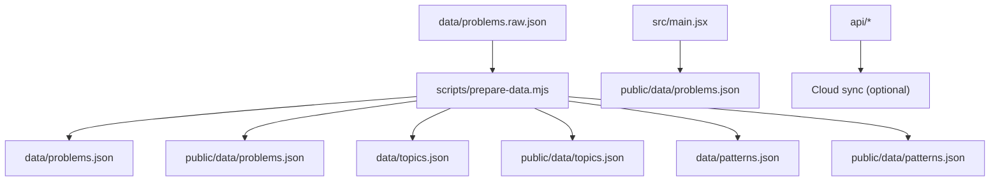
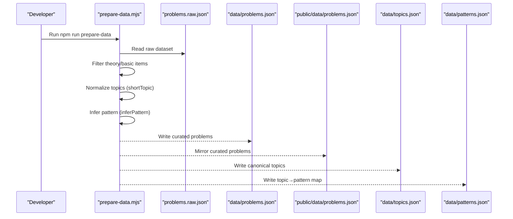
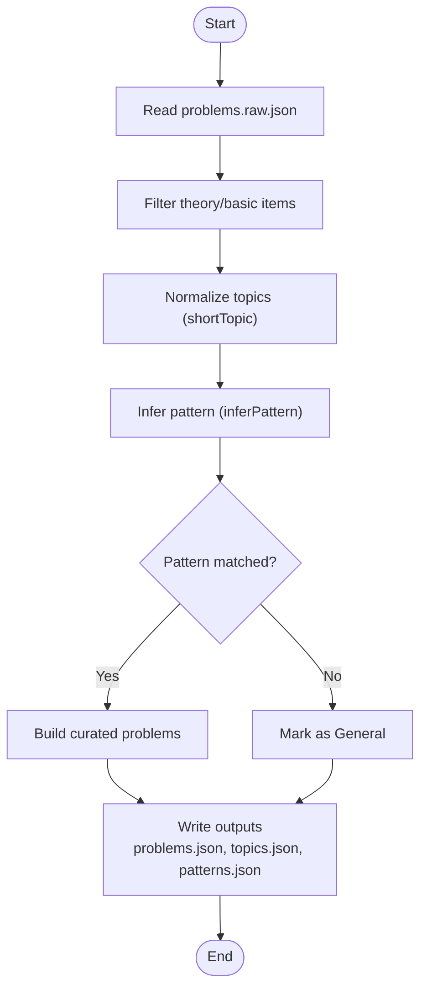
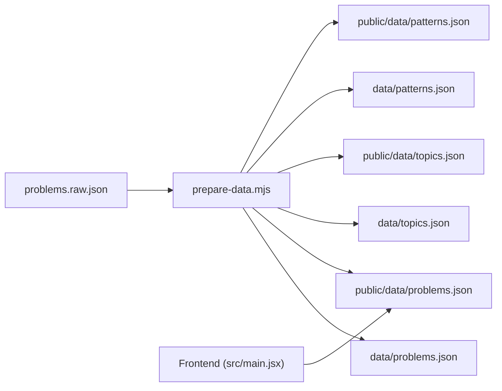

# Problem Catalog System

<cite>
**Referenced Files in This Document**
- [problems.json](file://data/problems.json)
- [topics.json](file://data/topics.json)
- [patterns.json](file://data/patterns.json)
- [problems.raw.json](file://data/problems.raw.json)
- [prepare-data.mjs](file://scripts/prepare-data.mjs)
- [README.md](file://README.md)
</cite>

## Table of Contents
1. [Introduction](#introduction)
2. [Project Structure](#project-structure)
3. [Core Components](#core-components)
4. [Architecture Overview](#architecture-overview)
5. [Detailed Component Analysis](#detailed-component-analysis)
6. [Dependency Analysis](#dependency-analysis)
7. [Performance Considerations](#performance-considerations)
8. [Troubleshooting Guide](#troubleshooting-guide)
9. [Conclusion](#conclusion)
10. [Appendices](#appendices)

## Introduction
This document explains the problem catalog system used by the DSA Tracker. The system curates a large set of Data Structures and Algorithms problems, classifies them by topic and algorithmic pattern, and tracks difficulty and user progress. It is designed to be fully offline for development and builds, with data bundled into the application.

Key characteristics:
- Curated problem list with over 4000 entries after processing raw input.
- Topic classification aligned with TakeUForward A2Z topics (e.g., Arrays, Sorting, Binary Search, Strings, Linked List, Recursion, Bit Manipulation, Stack & Queue, Sliding Window, Heaps, Greedy, Binary Trees, BST, Graphs, Dynamic Programming, Tries, Advanced Strings).
- Pattern classification derived from official subcategory patterns (e.g., “BS on 1D Arrays”, “Sliding Window”, “Two Pointers”-style groupings via arrays), enabling structured learning paths.
- Difficulty levels: Easy, Medium, Hard.
- Each problem includes id, title, topic, pattern, difficulty, status, url, and videoUrl.

**Section sources**
- [README.md:1-59](file://README.md#L1-L59)

## Project Structure
The repository organizes data under data/ and mirrors it into public/data/ for bundling. A script transforms raw input into curated outputs and generates topic and pattern catalogs.

**Diagram sources**
- [prepare-data.mjs:1-768](file://scripts/prepare-data.mjs#L1-L768)
- [README.md:1-59](file://README.md#L1-L59)

**Section sources**
- [README.md:1-59](file://README.md#L1-L59)
- [prepare-data.mjs:1-768](file://scripts/prepare-data.mjs#L1-L768)

## Core Components
- problems.json: Array of problem objects with fields id, title, topic, pattern, difficulty, status, url, videoUrl.
- topics.json: Canonical list of accepted topics used across the catalog.
- patterns.json: Mapping from each topic to its allowed subcategory patterns.
- prepare-data.mjs: Transformation pipeline that filters theory content, normalizes topics, infers patterns, and writes outputs.

Data schema highlights:
- id: Unique identifier per problem (e.g., a2z-xxx).
- title: Human-readable problem name.
- topic: One of the canonical topics from topics.json.
- pattern: Subcategory within the topic (from patterns.json).
- difficulty: One of Easy, Medium, Hard.
- status: User progress state (default Not Started).
- url: External link to the problem source.
- videoUrl: Optional video explanation link.

Examples of categorization:
- Sorting problems are grouped under patterns like “Sorting-I” and “Sorting-II”.
- Binary Search problems are categorized into “BS on 1D Arrays”, “BS on Search Space”, and “BS on 2D Arrays”.
- Arrays problems use difficulty-based patterns (“Easy”, “Medium”, “Hard”) as subcategories.

Difficulty progression:
- Problems span Easy → Medium → Hard, both as explicit difficulty and sometimes as pattern labels (especially in Arrays).

Relationship between topics and patterns:
- topics.json defines the universe of topics.
- patterns.json enumerates valid patterns per topic.
- prepare-data.mjs enforces this relationship by mapping raw inputs to normalized topics and inferring patterns based on title keywords.

**Section sources**
- [problems.json:1-800](file://data/problems.json#L1-L800)
- [topics.json:1-20](file://data/topics.json#L1-L20)
- [patterns.json:1-91](file://data/patterns.json#L1-L91)
- [prepare-data.mjs:55-704](file://scripts/prepare-data.mjs#L55-L704)

## Architecture Overview
The data pipeline reads raw problems, filters out theory/intro items, normalizes topics, infers patterns, and writes curated outputs. The app consumes the curated JSON files directly without network calls during dev/build.

**Diagram sources**
- [prepare-data.mjs:1-768](file://scripts/prepare-data.mjs#L1-L768)
- [README.md:1-59](file://README.md#L1-L59)

## Detailed Component Analysis

### problems.json: Problem Catalog Schema
- Structure: JSON array of problem objects.
- Fields:
  - id: Stable unique key.
  - title: Display name; used for pattern inference.
  - topic: Must match one entry in topics.json.
  - pattern: Must be listed under the problem’s topic in patterns.json.
  - difficulty: One of Easy, Medium, Hard.
  - status: Default Not Started; updated by user interactions.
  - url: External reference to the problem statement.
  - videoUrl: Optional educational resource link.

Categorization examples:
- Sorting: “Selection Sort”, “Bubble Sort”, “Insertion Sorting” mapped to “Sorting-I”; “Merge Sorting”, “Recursive Bubble Sort”, “Quick Sorting” mapped to “Sorting-II”.
- Binary Search: “Search X in sorted array”, “Lower Bound”, “Upper Bound” mapped to “BS on 1D Arrays”; “Find square root of a number”, “Koko eating bananas” mapped to “BS on Search Space”.
- Arrays: Many problems labeled with difficulty-based patterns such as “Easy”, “Medium”, “Hard”.

Progression and relationships:
- Difficulty levels provide a learning curve.
- Patterns group problems by algorithmic approach or technique, complementing topic classification.

**Section sources**
- [problems.json:1-800](file://data/problems.json#L1-L800)

### topics.json: Topic Classification
- Canonical list of topics used throughout the catalog.
- Includes core areas: Sorting, Arrays, Binary Search, Strings, Linked List, Recursion, Bit Manipulation, Stack & Queue, Sliding Window, Heaps, Greedy, Binary Trees, BST, Graphs, Dynamic Programming, Tries, Advanced Strings.

Usage:
- Enforced by the transformation script to normalize incoming topics.
- Used to generate the pattern catalog and UI grouping.

**Section sources**
- [topics.json:1-20](file://data/topics.json#L1-L20)

### patterns.json: Pattern Classification
- Maps each topic to its allowed subcategory patterns.
- Examples:
  - Sorting: “Sorting-I”, “Sorting-II”
  - Binary Search: “BS on 1D Arrays”, “BS on Search Space”, “BS on 2D Arrays”
  - Strings: “Basic & Easy Strings”, “Medium Strings”
  - Linked List: “1D Linked List”, “Doubly Linked List”, “Medium LL”, “Medium DLL”, “Hard LL”
  - Dynamic Programming: “1D DP”, “2D / Grid DP”, “DP on Subsequences”, “DP on Strings”, “DP on Stocks”, “DP on LIS”, “MCM / Partition DP”, “DP on Squares”
  - Others include Sliding Window, Heaps, Greedy, Binary Trees, BST, Graphs, Tries, Advanced Strings.

Purpose:
- Provides consistent grouping for learning paths and filtering.
- Ensures problems are tagged with recognized techniques rather than free-form strings.

**Section sources**
- [patterns.json:1-91](file://data/patterns.json#L1-L91)

### prepare-data.mjs: Transformation Pipeline
Responsibilities:
- Reads raw dataset from data/problems.raw.json.
- Filters out theory and basic intro items using title/topic heuristics.
- Normalizes topics via shortTopic mapping (e.g., “binary search trees” → “BST”).
- Infers patterns via inferPattern using keyword rules per topic.
- Writes curated problems to data/problems.json and public/data/problems.json.
- Generates topics.json and patterns.json from processed data.

Key behaviors:
- Theory filtering: Removes entries with topics like “Learn the basics” and titles matching known theory patterns.
- Topic normalization: Collapses variant names to canonical topics.
- Pattern inference: Uses regex rules per topic to assign subcategory patterns; unmatched problems receive “General”.
- Output mirroring: Ensures both internal and public bundles contain identical curated data.

**Diagram sources**
- [prepare-data.mjs:1-768](file://scripts/prepare-data.mjs#L1-L768)

**Section sources**
- [prepare-data.mjs:1-768](file://scripts/prepare-data.mjs#L1-L768)

### Adding New Problems: Best Practices
To maintain consistency when adding new problems:
- Add entries to data/problems.raw.json with required fields: id, title, topic, difficulty, url, videoUrl.
- Ensure topic matches a canonical topic in topics.json; if not, update shortTopic mapping in prepare-data.mjs to normalize it.
- If the problem belongs to an existing pattern, ensure its title matches the corresponding regex rule in TUF_PATTERNS within prepare-data.mjs so inferPattern assigns the correct pattern.
- If introducing a new pattern:
  - Add the pattern name to patterns.json under the appropriate topic.
  - Add regex rules in prepare-data.mjs to detect the new pattern reliably.
- Re-run the preparation script to regenerate curated outputs:
  - npm run prepare-data
- Verify outputs:
  - Check data/problems.json for correct fields and pattern assignment.
  - Confirm data/topics.json and data/patterns.json reflect changes.
  - Ensure public/data copies are updated.

Consistency checks:
- Avoid free-form pattern strings; always use values defined in patterns.json.
- Keep id uniqueness across the dataset.
- Maintain difficulty values strictly as Easy, Medium, Hard.
- Provide url and/or videoUrl where possible to support learning resources.

**Section sources**
- [prepare-data.mjs:55-704](file://scripts/prepare-data.mjs#L55-L704)
- [prepare-data.mjs:706-768](file://scripts/prepare-data.mjs#L706-L768)
- [README.md:11-15](file://README.md#L11-L15)

## Dependency Analysis
The system has clear separation between raw data, transformation logic, and curated outputs consumed by the application.

Observations:
- Single source of truth: problems.raw.json feeds the pipeline.
- Outputs are duplicated to internal and public directories for build-time bundling.
- No runtime dependencies on external services for data loading; optional cloud sync exists separately.

**Diagram sources**
- [prepare-data.mjs:1-768](file://scripts/prepare-data.mjs#L1-L768)
- [README.md:1-59](file://README.md#L1-L59)

**Section sources**
- [prepare-data.mjs:1-768](file://scripts/prepare-data.mjs#L1-L768)
- [README.md:1-59](file://README.md#L1-L59)

## Performance Considerations
- Dataset size: With 4000+ problems, JSON parsing and rendering should be optimized in the frontend (pagination, virtualization, lazy loading).
- Filtering and sorting: Use efficient client-side indexing by topic, pattern, and difficulty to minimize re-renders.
- Bundle size: Since data is bundled, consider splitting datasets by feature or lazy-loading sections if needed.
- Offline-first design reduces network overhead but increases initial payload; balance completeness with performance.

[No sources needed since this section provides general guidance]

## Troubleshooting Guide
Common issues and resolutions:
- Unmatched patterns:
  - Symptom: Some problems get assigned “General” pattern.
  - Cause: Title does not match any regex rule in TUF_PATTERNS for its topic.
  - Resolution: Add or adjust regex rules in prepare-data.mjs to capture the problem’s title accurately.
- Incorrect topic normalization:
  - Symptom: Topic appears differently than expected.
  - Cause: Missing or incorrect mapping in shortTopic function.
  - Resolution: Update shortTopic mappings to align with canonical topics in topics.json.
- Duplicate or missing IDs:
  - Symptom: Conflicts or lost entries.
  - Cause: Manual edits introduced duplicates or removed IDs.
  - Resolution: Ensure unique ids and validate dataset integrity before running the script.
- Output mismatch between data and public folders:
  - Symptom: Frontend shows stale data.
  - Cause: Scripts did not write to public/data or build cache issue.
  - Resolution: Re-run npm run prepare-data and rebuild the app.

Validation tips:
- After running prepare-data, inspect console output for counts and unmatched patterns.
- Spot-check a few problems in data/problems.json to confirm fields and pattern assignments.
- Ensure topics.json and patterns.json remain consistent with actual data.

**Section sources**
- [prepare-data.mjs:706-768](file://scripts/prepare-data.mjs#L706-L768)

## Conclusion
The problem catalog system provides a robust, offline-first foundation for organizing and tracking a large set of DSA problems. By separating raw input from curated outputs and enforcing topic and pattern classifications through a deterministic pipeline, it ensures consistency and scalability. Following the guidelines for adding and maintaining data will keep the catalog accurate and useful for learners progressing from Easy to Hard across diverse algorithmic patterns.

[No sources needed since this section summarizes without analyzing specific files]

## Appendices

### Example Categorizations
- Sorting:
  - “Selection Sort”, “Bubble Sort”, “Insertion Sorting” → “Sorting-I”
  - “Merge Sorting”, “Recursive Bubble Sort”, “Quick Sorting” → “Sorting-II”
- Binary Search:
  - “Search X in sorted array”, “Lower Bound”, “Upper Bound” → “BS on 1D Arrays”
  - “Find square root of a number”, “Koko eating bananas” → “BS on Search Space”
- Arrays:
  - Many problems use difficulty-based patterns: “Easy”, “Medium”, “Hard”

These examples illustrate how titles drive pattern inference and how difficulty complements topic-based organization.

**Section sources**
- [problems.json:1-800](file://data/problems.json#L1-L800)
- [patterns.json:1-91](file://data/patterns.json#L1-L91)
- [prepare-data.mjs:55-704](file://scripts/prepare-data.mjs#L55-L704)