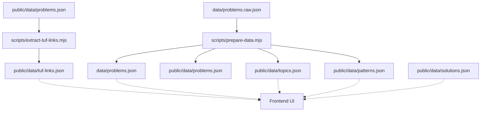
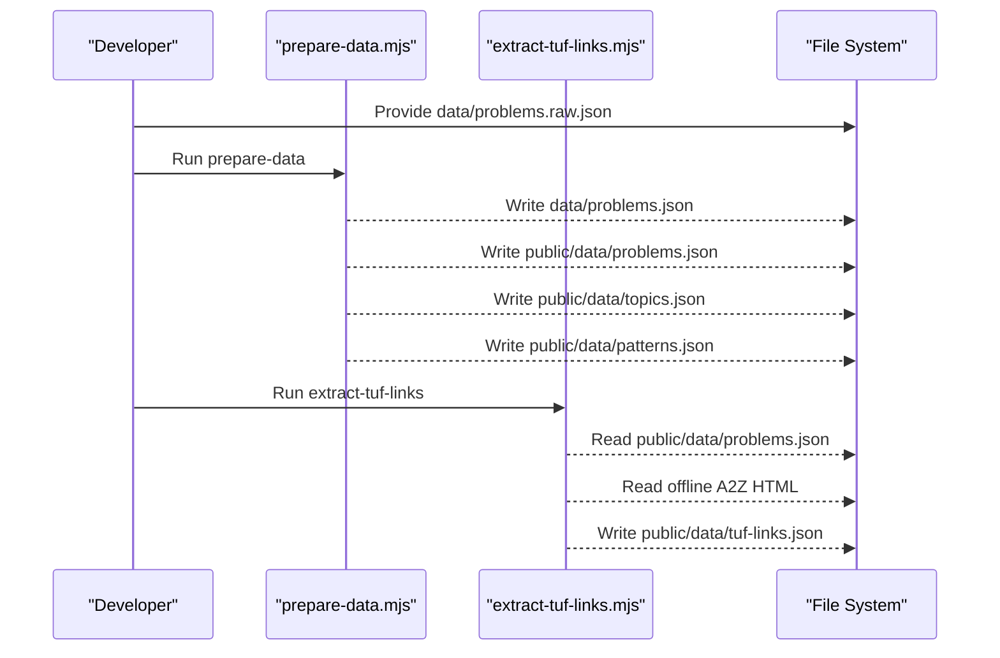
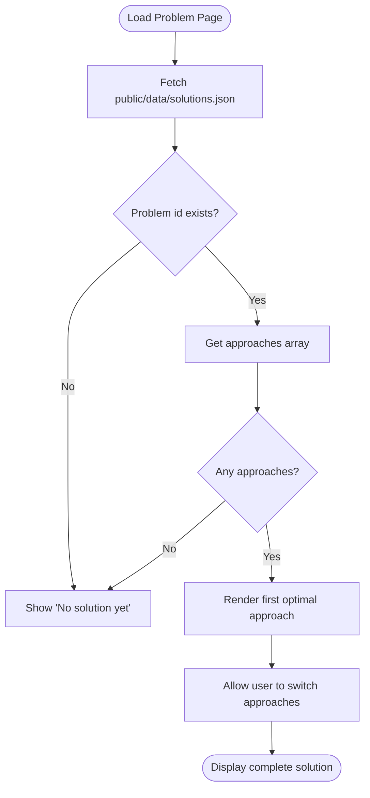
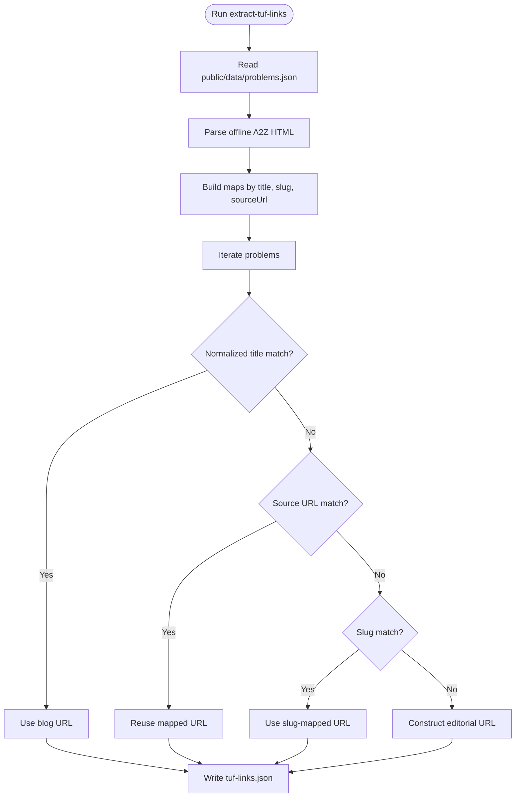
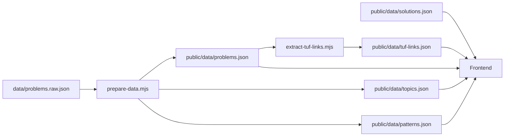

# Static Data Assets

<cite>
**Referenced Files in This Document**
- [solutions.json](file://public/data/solutions.json)
- [tuf-links.json](file://public/data/tuf-links.json)
- [problems.json](file://data/problems.json)
- [problems.raw.json](file://data/problems.raw.json)
- [topics.json](file://public/data/topics.json)
- [patterns.json](file://public/data/patterns.json)
- [extract-tuf-links.mjs](file://scripts/extract-tuf-links.mjs)
- [prepare-data.mjs](file://scripts/prepare-data.mjs)
- [README.md](file://README.md)
</cite>

## Table of Contents
1. Introduction
2. Project Structure
3. Core Components
4. Architecture Overview
5. Detailed Component Analysis
6. Dependency Analysis
7. Performance Considerations
8. Troubleshooting Guide
9. Conclusion
10. Appendices

## Introduction
This document explains how static data assets are structured and maintained for the DSA Tracker application, focusing on:
- The solution templates stored in public/data/solutions.json
- The external TakeUForward link mapping in public/data/tuf-links.json
- How these assets relate to problem metadata and patterns
- Schema definitions, validation rules, and update procedures
- Guidance for maintaining and extending these files while keeping frontend compatibility

The goal is to provide a clear, code-backed reference for contributors who need to add solutions or update links without breaking the app.

## Project Structure
Static assets relevant to this documentation live under public/data and are generated or curated via scripts in scripts/. Problem metadata originates from data/problems.raw.json and is transformed into curated datasets used by the frontend.

**Diagram sources**
- [prepare-data.mjs:1-768](file://scripts/prepare-data.mjs#L1-L768)
- [extract-tuf-links.mjs:1-71](file://scripts/extract-tuf-links.mjs#L1-L71)

**Section sources**
- [README.md:5-19](file://README.md#L5-L19)
- [prepare-data.mjs:1-768](file://scripts/prepare-data.mjs#L1-L768)
- [extract-tuf-links.mjs:1-71](file://scripts/extract-tuf-links.mjs#L1-L71)

## Core Components
- Solutions catalog (public/data/solutions.json): Stores solution templates keyed by problem id, each containing one or more approaches with metadata and multi-language code snippets.
- External links catalog (public/data/tuf-links.json): Maps each problem id to a canonical TakeUForward URL (blog or editorial).
- Problem dataset (data/problems.json and public/data/problems.json): Curated list of problems with id, title, topic, pattern, difficulty, status, url, videoUrl.
- Topic and pattern catalogs (public/data/topics.json and public/data/patterns.json): Derived lists that group problems by topic and subcategory patterns.

These components together power the frontend’s problem view, solution display, and external resource linking.

**Section sources**
- [solutions.json:1-13](file://public/data/solutions.json#L1-L13)
- [tuf-links.json:1-409](file://public/data/tuf-links.json#L1-L409)
- [problems.json:1-800](file://data/problems.json#L1-L800)
- [topics.json:1-20](file://public/data/topics.json#L1-L20)
- [patterns.json:1-91](file://public/data/patterns.json#L1-L91)

## Architecture Overview
The asset pipeline has two main flows:

1) Problem curation flow:
- Raw sheet data (data/problems.raw.json) is filtered and normalized into curated datasets (data/problems.json and public/data/problems.json), plus derived topics and patterns.
- Scripts remove theory/intro items and assign TakeUForward-style subcategory patterns based on title/topic heuristics.

2) Link extraction flow:
- Given the curated problems (public/data/problems.json) and an offline snapshot of the A2Z page, extract-tuf-links.mjs builds a map from problem id to the best matching TakeUForward URL. It prefers official blog posts when available; otherwise it falls back to editorial pages using slugs or titles.

**Diagram sources**
- [prepare-data.mjs:1-768](file://scripts/prepare-data.mjs#L1-L768)
- [extract-tuf-links.mjs:1-71](file://scripts/extract-tuf-links.mjs#L1-L71)

## Detailed Component Analysis

### Solutions Catalog (public/data/solutions.json)
Purpose:
- Provides reusable solution templates per problem id.
- Each entry contains an array of approaches, where each approach includes:
  - id: unique approach identifier
  - title: human-readable name
  - level: complexity rating (e.g., Optimal)
  - time: time complexity notation
  - space: space complexity notation
  - explanation: concise description of the approach
  - code: object with language keys (e.g., java, csharp) holding implementation strings

Schema definition:
- Root: object mapping problem id to an object with field approaches (array).
- Approach object fields:
  - id: string
  - title: string
  - level: string
  - time: string
  - space: string
  - explanation: string
  - code: object mapping language identifiers to code strings

Validation rules:
- Every problem id present in solutions must correspond to a valid problem id in the curated problems dataset to ensure frontend consistency.
- Approaches should be non-empty for entries intended to render in the UI.
- Code objects should include at least one supported language key expected by the frontend.

Update procedure:
- Add new problem ids only if they exist in the curated problems dataset.
- For each new approach, include all required fields to avoid runtime errors.
- Keep explanations concise and consistent across similar approaches.
- Maintain stable ids for approaches to prevent UI regressions when reordering.

Example usage pattern:
- Frontend reads public/data/solutions.json, finds the entry for the current problem id, and renders the first optimal approach or allows switching among multiple approaches.

**Section sources**
- [solutions.json:1-13](file://public/data/solutions.json#L1-L13)

### External Links Catalog (public/data/tuf-links.json)
Purpose:
- Maps each problem id to a canonical TakeUForward URL.
- Used by the frontend to open the most relevant tutorial or editorial for the problem.

Schema definition:
- Root: object mapping problem id to a string URL.

Validation rules:
- Keys must match problem ids in the curated problems dataset.
- Values must be absolute URLs pointing to TakeUForward resources.
- Prefer official blog posts over generic editorials when available.

Generation and maintenance:
- Generated by scripts/extract-tuf-links.mjs using:
  - public/data/problems.json as the source of truth for problem ids and titles
  - An offline snapshot of the A2Z page to find official blog links
  - Heuristics to normalize titles and derive fallback editorial URLs
- After updating problems or the A2Z page snapshot, rerun the script to regenerate tuf-links.json.

Link management patterns:
- Primary match: exact normalized title mapping to a blog post
- Secondary match: source URL normalization to reuse existing mappings
- Tertiary match: slug-based lookup
- Fallback: construct editorial URL from known patterns or problem title

**Section sources**
- [tuf-links.json:1-409](file://public/data/tuf-links.json#L1-L409)
- [extract-tuf-links.mjs:1-71](file://scripts/extract-tuf-links.mjs#L1-L71)

### Problem Dataset and Pattern Assignment
Purpose:
- Curates the raw A2Z sheet into a focused set of practice problems.
- Assigns topics and subcategory patterns aligned with TakeUForward’s structure.

Key behaviors:
- Filters out theory and basic-intro items.
- Normalizes topics to shorter labels (e.g., “Binary Search Trees” → “BST”).
- Infers patterns per topic using regex rules defined in the script.
- Outputs both internal and public datasets for different consumption contexts.

Validation rules:
- Ensure raw input is an array with sufficient length before processing.
- Confirm that generated topics and patterns reflect actual problem distribution.

Update procedure:
- Update data/problems.raw.json to add or modify raw problems.
- Re-run npm run prepare-data to regenerate curated outputs.
- Review unmatched patterns reported by the script and adjust regex rules if needed.

**Section sources**
- [problems.raw.json:1-200](file://data/problems.raw.json#L1-L200)
- [problems.json:1-800](file://data/problems.json#L1-L800)
- [topics.json:1-20](file://public/data/topics.json#L1-L20)
- [patterns.json:1-91](file://public/data/patterns.json#L1-L91)
- [prepare-data.mjs:1-768](file://scripts/prepare-data.mjs#L1-L768)

### Data Flow Diagrams

#### Solution Template Rendering Flow

[No sources needed since this diagram shows conceptual workflow, not actual code structure]

#### Link Extraction Flow

**Diagram sources**
- [extract-tuf-links.mjs:1-71](file://scripts/extract-tuf-links.mjs#L1-L71)

## Dependency Analysis
- prepare-data.mjs depends on data/problems.raw.json and writes curated datasets and catalogs.
- extract-tuf-links.mjs depends on public/data/problems.json and an offline A2Z HTML file to produce public/data/tuf-links.json.
- Frontend consumes:
  - public/data/solutions.json for solution templates
  - public/data/tuf-links.json for external links
  - public/data/problems.json for problem listings and details
  - public/data/topics.json and public/data/patterns.json for grouping and navigation

Potential coupling risks:
- If a problem id changes in problems.json but not in solutions.json or tuf-links.json, the frontend may fail to resolve links or solutions.
- Adding new languages to solutions.json requires frontend support for rendering those languages.

Mitigation:
- Always regenerate tuf-links.json after updating problems.
- Validate that every solutions.json key exists in problems.json before committing changes.
- Keep approach ids stable to avoid UI breakage.

**Diagram sources**
- [prepare-data.mjs:1-768](file://scripts/prepare-data.mjs#L1-L768)
- [extract-tuf-links.mjs:1-71](file://scripts/extract-tuf-links.mjs#L1-L71)

**Section sources**
- [prepare-data.mjs:1-768](file://scripts/prepare-data.mjs#L1-L768)
- [extract-tuf-links.mjs:1-71](file://scripts/extract-tuf-links.mjs#L1-L71)

## Performance Considerations
- solutions.json can grow large; keep explanations concise and avoid duplicating large code blocks across approaches unless necessary.
- tuf-links.json is a simple mapping; generation is fast but depends on parsing the A2Z HTML snapshot.
- prepare-data.mjs performs filtering and pattern inference; ensure regex rules remain efficient to avoid slow runs on large raw datasets.

[No sources needed since this section provides general guidance]

## Troubleshooting Guide
Common issues and resolutions:
- Missing links for a problem:
  - Ensure the problem id exists in public/data/problems.json.
  - Rerun extract-tuf-links.mjs after updating the A2Z HTML snapshot.
  - Check that the title matches the normalized form used by the extractor.
- Solutions not rendering:
  - Verify the problem id exists in public/data/solutions.json.
  - Confirm the approaches array is non-empty and includes required fields.
  - Ensure the frontend supports the language keys present in the code object.
- Pattern mismatches:
  - Inspect output warnings from prepare-data.mjs for unmatched patterns.
  - Adjust regex rules in prepare-data.mjs to better classify new or renamed problems.

Operational tips:
- Always commit curated outputs (problems.json, topics.json, patterns.json, tuf-links.json) alongside scripts changes to keep the repo self-contained.
- Use npm run prepare-data to rebuild curated datasets from raw inputs.
- Keep the offline A2Z HTML snapshot up-to-date when regenerating links.

**Section sources**
- [extract-tuf-links.mjs:1-71](file://scripts/extract-tuf-links.mjs#L1-L71)
- [prepare-data.mjs:1-768](file://scripts/prepare-data.mjs#L1-L768)

## Conclusion
The static assets for solutions and external links are designed to be maintainable and robust:
- solutions.json provides structured, multi-language solution templates keyed by problem id.
- tuf-links.json centralizes canonical TakeUForward links, generated automatically to reduce manual effort and improve accuracy.
- The preparation pipeline curates raw data into clean, frontend-ready datasets with consistent topics and patterns.
Following the schema definitions and update procedures ensures compatibility with the frontend and minimizes integration risks.

[No sources needed since this section summarizes without analyzing specific files]

## Appendices

### Maintenance Checklist
- When adding a new problem:
  - Add to data/problems.raw.json if not already present.
  - Run npm run prepare-data to regenerate curated datasets.
  - Regenerate tuf-links.json using extract-tuf-links.mjs.
  - Optionally add solution templates to public/data/solutions.json.
- When updating links:
  - Refresh the offline A2Z HTML snapshot.
  - Rerun extract-tuf-links.mjs to rebuild public/data/tuf-links.json.
- When modifying patterns:
  - Update regex rules in prepare-data.mjs.
  - Re-run prepare-data and review unmatched pattern warnings.

**Section sources**
- [README.md:5-19](file://README.md#L5-L19)
- [prepare-data.mjs:1-768](file://scripts/prepare-data.mjs#L1-L768)
- [extract-tuf-links.mjs:1-71](file://scripts/extract-tuf-links.mjs#L1-L71)