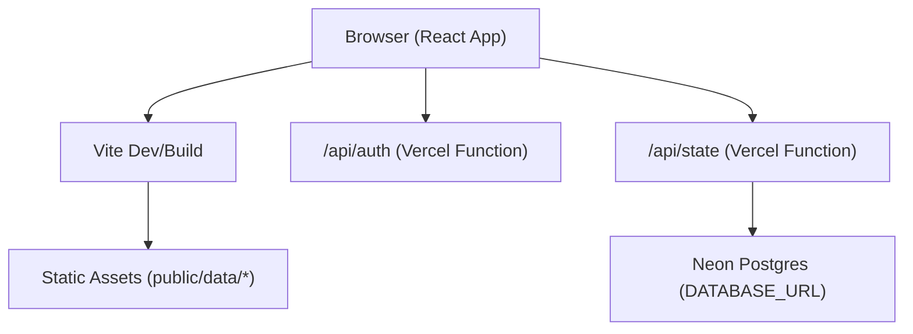
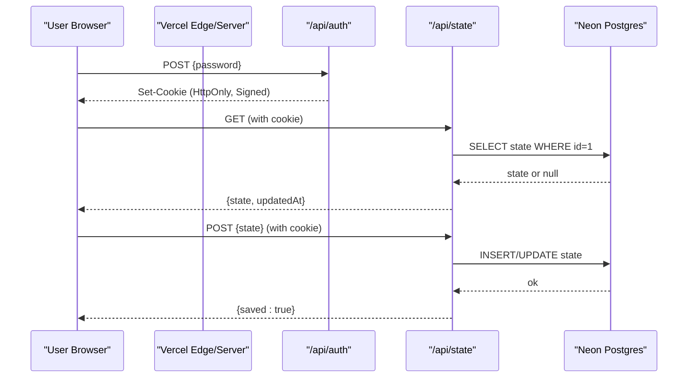
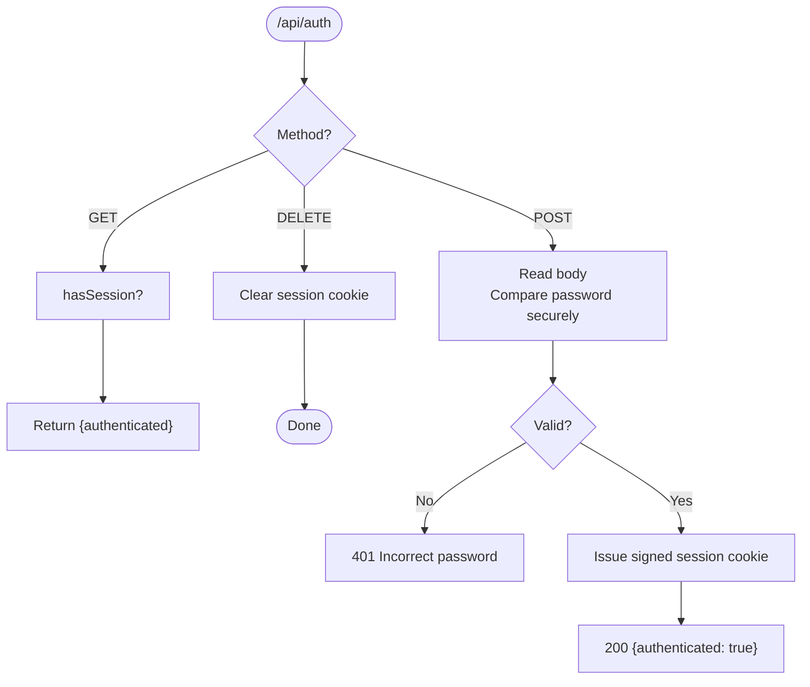
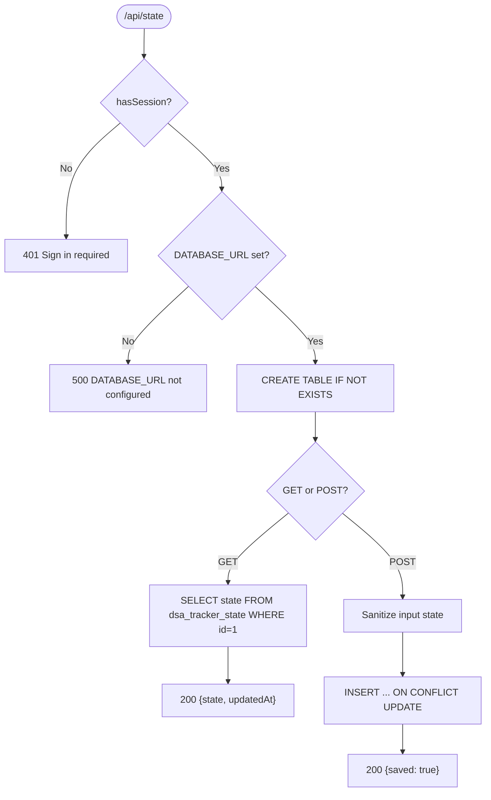
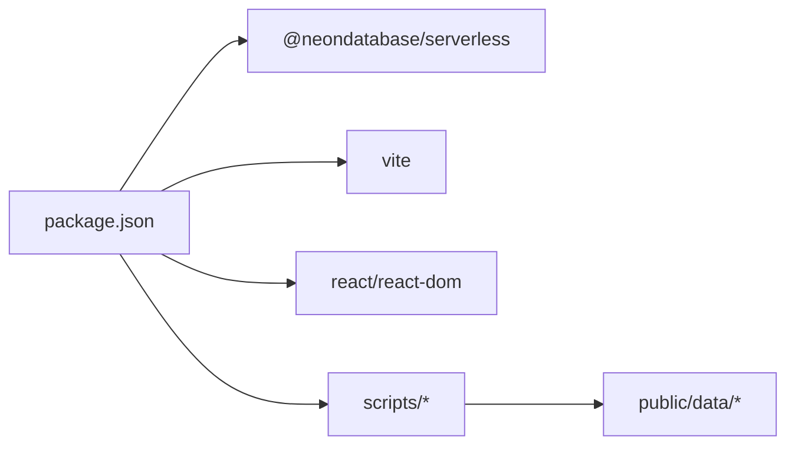

# Deployment Guide

<cite>
**Referenced Files in This Document**
- [package.json](file://package.json)
- [README.md](file://README.md)
- [api/auth.js](file://api/auth.js)
- [api/_session.js](file://api/_session.js)
- [api/state.js](file://api/state.js)
- [src/main.jsx](file://src/main.jsx)
- [index.html](file://index.html)
- [scripts/prepare-data.mjs](file://scripts/prepare-data.mjs)
</cite>

## Table of Contents
1. [Introduction](#introduction)
2. [Project Structure](#project-structure)
3. [Core Components](#core-components)
4. [Architecture Overview](#architecture-overview)
5. [Detailed Component Analysis](#detailed-component-analysis)
6. [Dependency Analysis](#dependency-analysis)
7. [Performance Considerations](#performance-considerations)
8. [Troubleshooting Guide](#troubleshooting-guide)
9. [Conclusion](#conclusion)
10. [Appendices](#appendices)

## Introduction
This guide explains how to deploy DSA Tracker locally and to Vercel for production, including environment configuration, Neon database integration, secrets management, monitoring, performance optimization, scaling considerations, troubleshooting, and maintenance procedures. The application is a local-first React/Vite app with optional cloud sync via serverless API routes deployed as Vercel Functions.

## Project Structure
The repository is organized into:
- Frontend: React + Vite (src/index entrypoint and UI logic)
- Serverless API routes: api/auth.js, api/state.js, api/_session.js
- Static data: public/data/* (problems, topics, patterns, solutions, tuf-links)
- Data preparation scripts: scripts/*
- Build and dev tooling: package.json scripts

**Diagram sources**
- [src/main.jsx:64-113](file://src/main.jsx#L64-L113)
- [api/auth.js:8-23](file://api/auth.js#L8-L23)
- [api/state.js:23-50](file://api/state.js#L23-L50)
- [package.json:5-10](file://package.json#L5-L10)

**Section sources**
- [package.json:1-21](file://package.json#L1-L21)
- [README.md:21-53](file://README.md#L21-L53)

## Core Components
- Frontend SPA: Loads problem data from static JSON files and optionally syncs state to the cloud via /api/state when authenticated.
- Authentication route (/api/auth): Validates an access password and issues an HTTP-only session cookie signed with SESSION_SECRET.
- State route (/api/state): Requires authentication; reads/writes user state to Neon using a single-row JSONB table.
- Session utilities: Cookie parsing, signing, expiration, and secure comparison helpers.

Key responsibilities:
- Local-first UX with offline-ready assets
- Optional cloud sync with strong session security
- Minimal server surface area (only two endpoints)

**Section sources**
- [src/main.jsx:64-113](file://src/main.jsx#L64-L113)
- [api/auth.js:8-23](file://api/auth.js#L8-L23)
- [api/state.js:23-50](file://api/state.js#L23-L50)
- [api/_session.js:1-54](file://api/_session.js#L1-L54)

## Architecture Overview
The runtime architecture consists of a client-side React app served by Vite and serverless functions on Vercel that handle authentication and cloud persistence.

**Diagram sources**
- [src/main.jsx:77-113](file://src/main.jsx#L77-L113)
- [api/auth.js:8-23](file://api/auth.js#L8-L23)
- [api/state.js:23-50](file://api/state.js#L23-L50)

## Detailed Component Analysis

### Authentication Flow (/api/auth)
- Accepts POST with a password field.
- Compares against APP_ACCESS_PASSWORD using constant-time equality to prevent timing attacks.
- Issues an HttpOnly, Lax, Secure (in production) session cookie signed with SESSION_SECRET.
- Supports GET to check current authentication status and DELETE to clear the session.

Security notes:
- Password is never stored; only compared at request time.
- Session payload includes an expiry timestamp and is HMAC-signed.
- Cookie is HttpOnly and SameSite=Lax; Secure flag set in production.

**Diagram sources**
- [api/auth.js:8-23](file://api/auth.js#L8-L23)
- [api/_session.js:23-39](file://api/_session.js#L23-L39)

**Section sources**
- [api/auth.js:1-24](file://api/auth.js#L1-L24)
- [api/_session.js:1-54](file://api/_session.js#L1-L54)

### Cloud State Sync (/api/state)
- Requires a valid session cookie; otherwise returns 401.
- Creates the dsa_tracker_state table if missing (id=1, JSONB state, updated_at).
- GET returns the latest state row; POST upserts the entire sanitized state object.
- Sanitization ensures only expected fields are persisted and settings defaults are applied.

Data model:
- Table: dsa_tracker_state
- Columns: id (SMALLINT, PK=1), state (JSONB), updated_at (TIMESTAMPTZ)

**Diagram sources**
- [api/state.js:23-50](file://api/state.js#L23-L50)

**Section sources**
- [api/state.js:1-51](file://api/state.js#L1-L51)

### Session Management (_session.js)
- Signs payloads with HMAC-SHA256 using SESSION_SECRET.
- Sets cookies with Path=/, HttpOnly, SameSite=Lax, Max-Age=30 days, and Secure in production.
- Provides safe string comparison and cookie parsing helpers.

Security implications:
- SESSION_SECRET must be long and random.
- Cookies are not readable by client scripts (HttpOnly).
- Expiration limits session lifetime.

**Section sources**
- [api/_session.js:1-54](file://api/_session.js#L1-L54)

### Frontend Integration (src/main.jsx)
- Loads problems, solutions, and TUF links from static JSON under public/data.
- Checks authentication status on load; signs in/out and loads/saves cloud state.
- Debounced save to /api/state after changes to reduce network calls.

Operational behavior:
- If no session exists, runs entirely locally.
- When connected, merges remote settings and persists local changes periodically.

**Section sources**
- [src/main.jsx:64-113](file://src/main.jsx#L64-L113)
- [src/main.jsx:77-113](file://src/main.jsx#L77-L113)

## Dependency Analysis
- Runtime dependencies include React, Vite, and @neondatabase/serverless for Neon connectivity.
- Scripts support preparing curated datasets and extracting external links.

**Diagram sources**
- [package.json:12-19](file://package.json#L12-L19)
- [scripts/prepare-data.mjs:1-7](file://scripts/prepare-data.mjs#L1-L7)

**Section sources**
- [package.json:1-21](file://package.json#L1-L21)
- [scripts/prepare-data.mjs:1-768](file://scripts/prepare-data.mjs#L1-L768)

## Performance Considerations
- Static data bundling: Problems, topics, patterns, solutions, and TUF links are shipped as static JSON under public/data, enabling fully offline operation and fast initial load.
- Debounced saves: The frontend batches updates and saves to the cloud after a short delay to avoid excessive requests.
- Single-row JSONB storage: Using one row per user simplifies writes and reduces contention.
- Minimize payload size: Keep settings minimal and avoid storing large code snippets in state unless necessary.

[No sources needed since this section provides general guidance]

## Troubleshooting Guide

Common deployment issues and resolutions:
- Missing or incorrect environment variables:
  - Ensure DATABASE_URL, APP_ACCESS_PASSWORD, and SESSION_SECRET are set in Vercel for all environments (Production, Preview, Development).
  - Do not prefix these with VITE_; they are server-only secrets.
- Authentication failures:
  - Verify APP_ACCESS_PASSWORD matches what you enter in Settings → Cloud sync.
  - Confirm SESSION_SECRET is present; without it, session issuance will fail.
- Database errors:
  - If DATABASE_URL is missing, /api/state returns a 500 error.
  - Ensure Neon connection string is correct and has sufficient permissions.
- API routes not available locally:
  - Use vercel dev to test API routes; plain npm run dev serves only the Vite interface.
- CORS or cookie issues:
  - Cookies are HttpOnly and SameSite=Lax; ensure your browser allows third-party-like cookies for localhost during development.
- Data integrity:
  - The state endpoint sanitizes inputs; unexpected fields are ignored.

Monitoring setup recommendations:
- Vercel Analytics: Enable in project settings to track page views, performance metrics, and errors.
- Error tracking: Integrate a service like Sentry for client-side error reporting and stack traces.
- API logs: Use Vercel function logs to inspect authentication and state sync flows.
- Database monitoring: Use Neon dashboard to monitor connections, query latency, and storage usage.

Scaling considerations:
- Stateless functions: Vercel scales automatically; ensure no in-memory state is assumed across invocations.
- Database scaling: Neon handles scaling; monitor connection limits and consider pooling if traffic increases.
- Rate limiting: Add rate limiting at the edge or via a gateway if abuse is observed.
- Caching: Consider caching GET /api/state responses with appropriate cache-control headers if acceptable for your use case.

Maintenance procedures:
- Update dataset: Run npm run prepare-data to regenerate curated problem lists and patterns.
- Rotate secrets: Regenerate SESSION_SECRET and update APP_ACCESS_PASSWORD; inform users to reconnect.
- Backup strategy: Encourage users to export backups regularly; maintain periodic exports of the Neon database.
- Versioning: Pin dependency versions in package.json to avoid unexpected breakages.

**Section sources**
- [README.md:35-53](file://README.md#L35-L53)
- [api/state.js:23-50](file://api/state.js#L23-L50)
- [api/_session.js:6-14](file://api/_session.js#L6-L14)
- [scripts/prepare-data.mjs:1-7](file://scripts/prepare-data.mjs#L1-L7)

## Conclusion
DSA Tracker deploys as a lightweight Vite SPA with minimal serverless functions for authentication and cloud sync. Properly configuring environment variables and Neon integration enables secure, scalable cloud synchronization while preserving a fully offline-capable local experience. Follow the troubleshooting and maintenance steps to keep the system reliable and performant over time.

## Appendices

### Local Development Setup
- Install dependencies and start the dev server:
  - npm install
  - npm run dev
- Test API routes locally:
  - Link your project in Vercel and run vercel dev to serve both the Vite app and API routes.

**Section sources**
- [README.md:21-53](file://README.md#L21-L53)
- [package.json:5-10](file://package.json#L5-L10)

### Production Deployment to Vercel
Steps:
- Connect a Neon Postgres database via Vercel Storage Marketplace or manually add DATABASE_URL.
- Add environment variables:
  - DATABASE_URL=<Neon connection string>
  - APP_ACCESS_PASSWORD=<strong password used in Settings → Cloud sync>
  - SESSION_SECRET=<random 32+ character value>
- Deploy the project as a Vite project; the root api/ directory is deployed automatically as Vercel Functions.
- On first device, connect via Settings → Cloud sync using APP_ACCESS_PASSWORD.

Security implications:
- APP_ACCESS_PASSWORD acts as a shared secret for cloud sync; keep it strong and private.
- SESSION_SECRET signs sessions; rotate periodically and keep it secret.
- DATABASE_URL grants database access; restrict to least privilege and store securely.

**Section sources**
- [README.md:35-53](file://README.md#L35-L53)
- [api/auth.js:16-22](file://api/auth.js#L16-L22)
- [api/_session.js:6-14](file://api/_session.js#L6-L14)

### Environment Variables Reference
- DATABASE_URL: Neon Postgres connection string used by /api/state to persist tracker state.
- APP_ACCESS_PASSWORD: Access password validated by /api/auth to issue a session cookie.
- SESSION_SECRET: Secret used to sign session cookies; required for session validation.

Notes:
- These variables are server-only; do not prefix with VITE_.
- SESSION_SECRET should be generated with a secure random source.

**Section sources**
- [api/state.js:23-29](file://api/state.js#L23-L29)
- [api/auth.js:16-22](file://api/auth.js#L16-L22)
- [api/_session.js:6-14](file://api/_session.js#L6-L14)

### Monitoring and Observability
- Vercel Analytics: Track frontend performance and errors.
- Function logs: Inspect authentication and state sync flows for issues.
- Neon dashboard: Monitor database health and queries.
- Error tracking: Integrate client-side error reporting for faster debugging.

[No sources needed since this section provides general guidance]