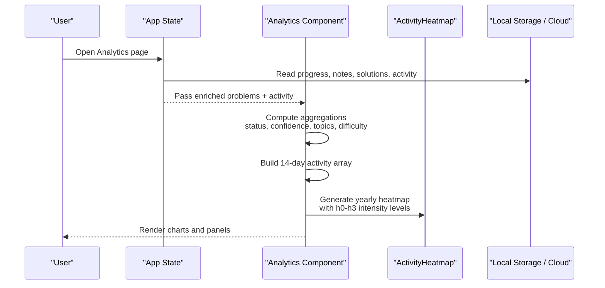
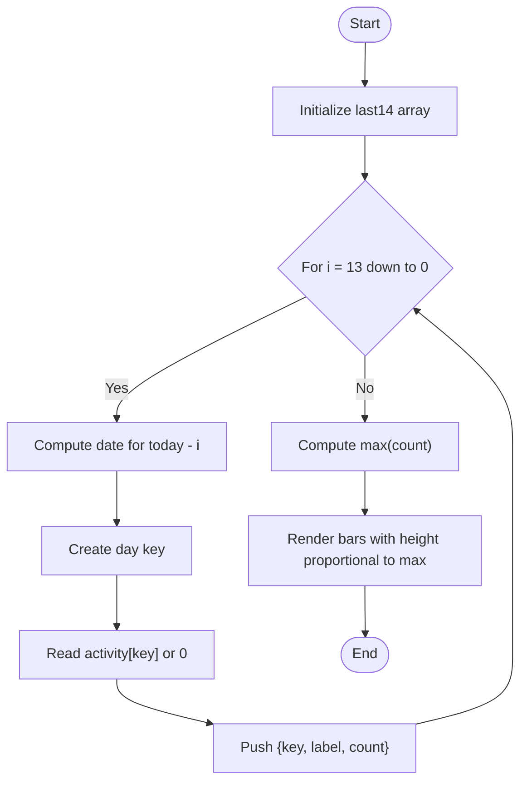
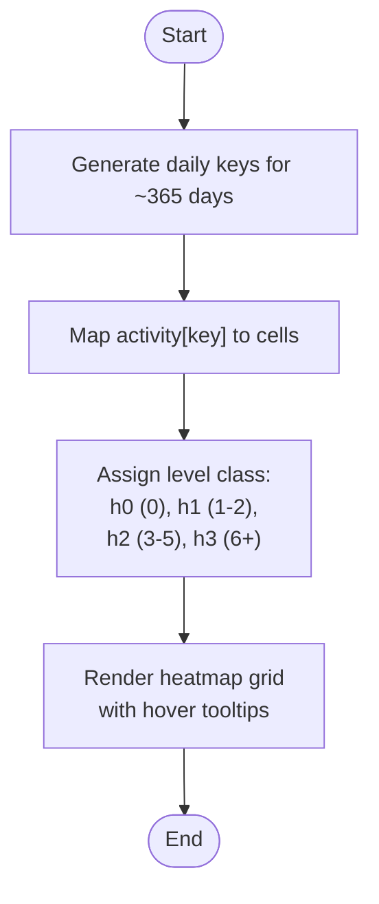
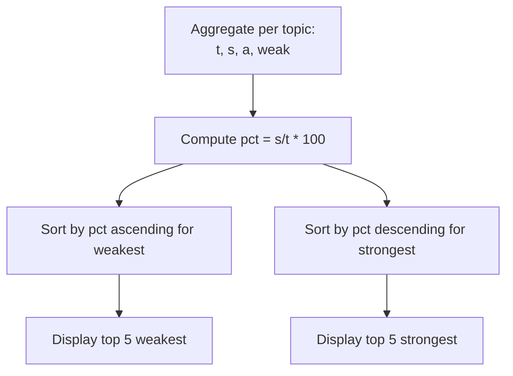
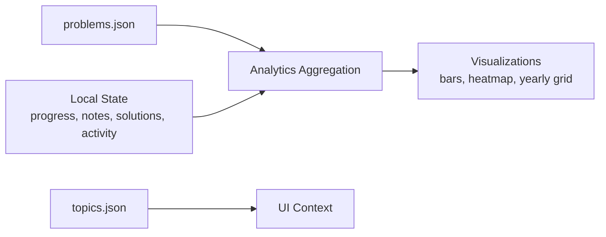

# Analytics Component

<cite>
**Referenced Files in This Document**
- [main.jsx](file://src/main.jsx)
- [problems.json](file://public/data/problems.json)
- [topics.json](file://public/data/topics.json)
- [README.md](file://README.md)
</cite>

## Update Summary
**Changes Made**
- Added comprehensive documentation for the new ActivityHeatmap component providing year-long activity visualization
- Updated analytics page structure to include the yearly heatmap alongside existing 14-day activity chart
- Enhanced data aggregation logic to support heatmap generation with GitHub-style contribution graph
- Added detailed explanation of color-coded intensity levels (h0-h3) and their mapping to activity counts
- Updated architecture diagrams to reflect the new heatmap component integration

## Table of Contents
1. [Introduction](#introduction)
2. [Project Structure](#project-structure)
3. [Core Components](#core-components)
4. [Architecture Overview](#architecture-overview)
5. [Detailed Component Analysis](#detailed-component-analysis)
6. [Dependency Analysis](#dependency-analysis)
7. [Performance Considerations](#performance-considerations)
8. [Troubleshooting Guide](#troubleshooting-guide)
9. [Conclusion](#conclusion)
10. [Appendices](#appendices)

## Introduction
This document explains the Analytics component that provides performance insights and learning metrics for the DSA Tracker. It covers how completion rates, mastery levels, confidence distribution, and topic-wise analysis are computed; how the 14-day activity chart, yearly heatmap, status breakdown charts, difficulty completion tracking, and weakest/strongest topic identification are rendered; and how data aggregation, chart rendering patterns, and actionable insights guide focused learning. It also documents the analytics note system and recommendations embedded in the interface.

**Updated** Added comprehensive coverage of the new ActivityHeatmap component that provides a year-long view of practice activity using GitHub-style contribution graph visualization.

## Project Structure
The Analytics feature is implemented as a single-page React application with all logic in one file. The app loads problem metadata from bundled JSON files and computes analytics on the client side using local state (progress, notes, solutions, activity). Cloud sync is optional and does not change the core analytics logic.

**Diagram sources**
- [main.jsx:366-515](file://src/main.jsx#L366-L515)
- [main.jsx:517-535](file://src/main.jsx#L517-L535)
- [problems.json:1-200](file://public/data/problems.json#L1-L200)
- [topics.json:1-20](file://public/data/topics.json#L1-L20)

**Section sources**
- [README.md:1-20](file://README.md#L1-L20)
- [main.jsx:103-260](file://src/main.jsx#L103-L260)

## Core Components
- Analytics page: Computes and displays key metrics, charts, and recommendations.
- Activity heatmap: Yearly view of daily activity intensity using GitHub-style contribution graph.
- Supporting helpers: Date utilities, day-key generation, and activity recording.

Key responsibilities:
- Aggregate per-problem status, confidence, topic, and difficulty into summary statistics.
- Build a 14-day activity timeline and a yearly heatmap with color-coded intensity levels.
- Identify weakest and strongest topics to guide focus.
- Surface notes and solutions coverage to encourage high-signal review.

**Updated** The ActivityHeatmap component now provides comprehensive year-long activity tracking with visual intensity indicators ranging from h0 (no activity) to h3 (high activity).

**Section sources**
- [main.jsx:366-515](file://src/main.jsx#L366-L515)
- [main.jsx:517-535](file://src/main.jsx#L517-L535)

## Architecture Overview
The Analytics component reads enriched problems (merged with progress), then aggregates across multiple dimensions. It renders:
- Top-level stats: completion percentage, mastered count, attempted count, streak.
- Secondary stats: notes coverage, solutions written, revisions due, total attempts.
- Visualizations: 14-day activity bars, yearly heatmap with GitHub-style contribution graph, status and confidence breakdowns, difficulty completion, topic progress, weakest/strongest topics.

**Diagram sources**
- [main.jsx:103-260](file://src/main.jsx#L103-L260)
- [main.jsx:366-515](file://src/main.jsx#L366-L515)
- [main.jsx:517-535](file://src/main.jsx#L517-L535)

## Detailed Component Analysis

### Statistical Calculations
- Completion rate: Percentage of solved or mastered problems out of total problems.
- Mastery level: Count of problems marked Mastered.
- Confidence distribution: Counts per confidence category including Unset.
- Topic-wise analysis: For each topic, counts total, solved, attempted, weak, and derived completion percentage.
- Difficulty completion: For Easy/Medium/Hard, counts total and solved, with percentage.
- Activity streak: Consecutive active days ending at today or yesterday if today has no activity.
- Notes and solutions coverage: Number of problems with any filled note fields; number of problems with at least one approach containing explanation or code; total filled approaches.

These calculations are performed in a single pass over the problems array to minimize overhead.

**Section sources**
- [main.jsx:187-198](file://src/main.jsx#L187-L198)
- [main.jsx:366-392](file://src/main.jsx#L366-L392)

### 14-Day Activity Chart
- Builds an array of the last 14 days, keyed by date string.
- Each entry includes label (weekday short) and count from activity storage.
- Bar height is normalized against the maximum daily count to fit the chart.

**Diagram sources**
- [main.jsx:396-402](file://src/main.jsx#L396-L402)
- [main.jsx:459-469](file://src/main.jsx#L459-L469)

**Section sources**
- [main.jsx:396-402](file://src/main.jsx#L396-L402)
- [main.jsx:459-469](file://src/main.jsx#L459-L469)

### Yearly Activity Heatmap
- Generates a 365+ day grid starting from the most recent Sunday back to roughly a year ago.
- Each cell represents one day's activity; color intensity encodes count ranges using h0-h3 classes.
- Hover tooltips show day and activity count with proper pluralization.
- Uses GitHub-style contribution graph layout with scrollable container.

**Updated** The heatmap now provides comprehensive year-long activity tracking with four intensity levels:
- h0: No activity (0 activities)
- h1: Low activity (1-2 activities)  
- h2: Medium activity (3-5 activities)
- h3: High activity (6+ activities)

**Diagram sources**
- [main.jsx:517-535](file://src/main.jsx#L517-L535)

**Section sources**
- [main.jsx:517-535](file://src/main.jsx#L517-L535)

### Status Breakdown Charts
- Counts per status: Not Started, Attempted, Solved, Mastered.
- Horizontal bars show proportion relative to total problems.

**Section sources**
- [main.jsx:367-375](file://src/main.jsx#L367-L375)
- [main.jsx:472-477](file://src/main.jsx#L472-L477)

### Confidence Distribution
- Counts per confidence category: Weak, Learning, Strong, Interview Ready, plus Unset.
- Only categories with non-zero counts are displayed.

**Section sources**
- [main.jsx:368-375](file://src/main.jsx#L368-L375)
- [main.jsx:478-483](file://src/main.jsx#L478-L483)

### Difficulty Completion Tracking
- Tracks totals and solved counts per difficulty level (Easy, Medium, Hard).
- Displays completed/total and bar width based on percentage.

**Section sources**
- [main.jsx:370-384](file://src/main.jsx#L370-L384)
- [main.jsx:486-491](file://src/main.jsx#L486-L491)

### Weakest and Strongest Topic Identification
- Topic rows include total, solved, attempted, weak, and computed completion percentage.
- Weakest topics: lowest completion percentages among topics with at least one problem.
- Strongest topics: highest completion percentages.

**Diagram sources**
- [main.jsx:393-395](file://src/main.jsx#L393-L395)
- [main.jsx:492-513](file://src/main.jsx#L492-L513)

**Section sources**
- [main.jsx:393-395](file://src/main.jsx#L393-L395)
- [main.jsx:492-513](file://src/main.jsx#L492-L513)

### Data Aggregation Logic
- Single-pass aggregation over problems to compute:
  - Status counts
  - Confidence counts
  - Per-topic metrics (total, solved, attempted, weak)
  - Per-difficulty metrics (total, solved)
  - Notes coverage (any field filled)
  - Solutions coverage (approaches with explanation or code)
- Derived values:
  - Topic completion percentage
  - Weakest/strongest topic lists
  - 14-day activity series
  - Streak calculation
  - Yearly heatmap data generation

Complexity: O(N) where N is the number of problems; constant-time operations per problem.

**Updated** Enhanced to include yearly heatmap data generation alongside existing aggregation logic.

**Section sources**
- [main.jsx:366-392](file://src/main.jsx#L366-L392)
- [main.jsx:187-198](file://src/main.jsx#L187-L198)

### Chart Rendering Patterns
- All charts use simple HTML/CSS-based bars and grids without external chart libraries.
- Bars are styled via inline width/height percentages computed from aggregated data.
- Heatmap uses CSS classes mapped from activity counts to indicate intensity (h0-h3).
- Yearly heatmap implements GitHub-style contribution graph layout with responsive scrolling.

**Updated** Added comprehensive coverage of the new heatmap rendering pattern with color-coded intensity levels.

**Section sources**
- [main.jsx:459-513](file://src/main.jsx#L459-L513)
- [main.jsx:517-535](file://src/main.jsx#L517-L535)

### Actionable Insights and Recommendations
- Focus next panel highlights weakest topics with completion percentage and weak problem counts.
- Strongest topics panel includes an analytics note recommending pairing weakest topics with revision due items and filling notes/solutions to keep review high-signal.
- Secondary stats surface notes coverage and solutions written to encourage deeper learning artifacts.
- Yearly heatmap helps users visualize consistency patterns and identify periods of low activity.

**Updated** Added guidance on using the yearly heatmap for consistency analysis alongside existing recommendations.

**Section sources**
- [main.jsx:492-513](file://src/main.jsx#L492-L513)

### Analytics Note System
- Notes coverage metric counts problems with any filled note field.
- The analytics note in the strongest topics panel provides guidance to integrate weakest topics with scheduled revisions and ensure notes/solutions are complete.
- Notes are stored per problem and persist locally or via cloud sync when enabled.

**Section sources**
- [main.jsx:385-391](file://src/main.jsx#L385-L391)
- [main.jsx:511-512](file://src/main.jsx#L511-L512)

## Dependency Analysis
- Inputs:
  - Problems dataset: topic, pattern, difficulty, url, videoUrl.
  - Local state: progress (status, confidence, attempts, revision schedule), notes, solutions, activity.
  - Topics list: used for navigation and grouping elsewhere; analytics primarily uses problem topics.
- Outputs:
  - Aggregated metrics and visualizations rendered in the Analytics page.
  - Yearly heatmap with GitHub-style contribution graph visualization.
  - No direct dependency on external charting libraries; pure DOM/CSS rendering.

**Updated** Added output specification for the yearly heatmap visualization.

**Diagram sources**
- [problems.json:1-200](file://public/data/problems.json#L1-L200)
- [topics.json:1-20](file://public/data/topics.json#L1-L20)
- [main.jsx:366-535](file://src/main.jsx#L366-L535)

**Section sources**
- [main.jsx:366-535](file://src/main.jsx#L366-L535)

## Performance Considerations
- Aggregation runs once per render cycle using memoized inputs where applicable; complexity is linear in the number of problems.
- Avoids heavy computations by computing derived values (percentages, lists) in a single pass.
- Uses lightweight DOM/CSS charts to reduce runtime overhead compared to third-party chart libraries.
- Activity heatmap generates up to ~365 entries; still efficient for modern browsers.
- Yearly heatmap uses useMemo optimization to prevent unnecessary recalculations when activity data remains unchanged.

**Updated** Added specific performance considerations for the yearly heatmap component.

## Troubleshooting Guide
- If charts appear empty:
  - Ensure problems are loaded and enriched with progress.
  - Verify activity storage contains keys for dates; missing keys default to zero.
- If streak appears incorrect:
  - Confirm activity keys exist for consecutive days; streak computation starts from today or yesterday depending on presence of activity.
- If notes/solutions coverage seems low:
  - Check that note fields or solution approaches contain trimmed content; empty strings do not count as filled.
- If yearly heatmap shows no data:
  - Verify activity storage contains properly formatted date keys (YYYY-MM-DD format).
  - Check that the heatmap component receives the activity prop correctly from the parent Analytics component.

**Updated** Added troubleshooting guidance specifically for the yearly heatmap component.

**Section sources**
- [main.jsx:187-198](file://src/main.jsx#L187-L198)
- [main.jsx:385-391](file://src/main.jsx#L385-L391)
- [main.jsx:396-402](file://src/main.jsx#L396-L402)
- [main.jsx:517-535](file://src/main.jsx#L517-L535)

## Conclusion
The Analytics component delivers a comprehensive, client-side view of learning progress through robust aggregation and clear visualizations. It computes completion rates, mastery levels, confidence distributions, and topic-wise insights, while highlighting weakest and strongest areas to guide focused study. The 14-day activity chart and new yearly heatmap provide temporal context for activity patterns, and embedded recommendations help users prioritize revisions and improve learning artifacts. The addition of the ActivityHeatmap component enhances consistency tracking with a familiar GitHub-style contribution graph interface.

**Updated** Enhanced conclusion to highlight the new yearly heatmap functionality and its benefits for activity consistency tracking.

## Appendices

### Data Models and Fields Used by Analytics
- Problem fields: id, title, topic, pattern, difficulty, url, videoUrl.
- Progress fields: status, confidence, attempts, revisionCount, lastRevised, nextRevision, favorite.
- Notes fields: insight, mistake, approach, complexity, interviewCue.
- Solutions fields: approaches[] with explanation and code per language.
- Activity map: date key -> integer count.
- Heatmap intensity levels: h0 (0 activities), h1 (1-2 activities), h2 (3-5 activities), h3 (6+ activities).

**Updated** Added heatmap intensity level specifications for the new ActivityHeatmap component.

**Section sources**
- [problems.json:1-200](file://public/data/problems.json#L1-L200)
- [main.jsx:103-260](file://src/main.jsx#L103-L260)
- [main.jsx:366-392](file://src/main.jsx#L366-L392)
- [main.jsx:517-535](file://src/main.jsx#L517-L535)