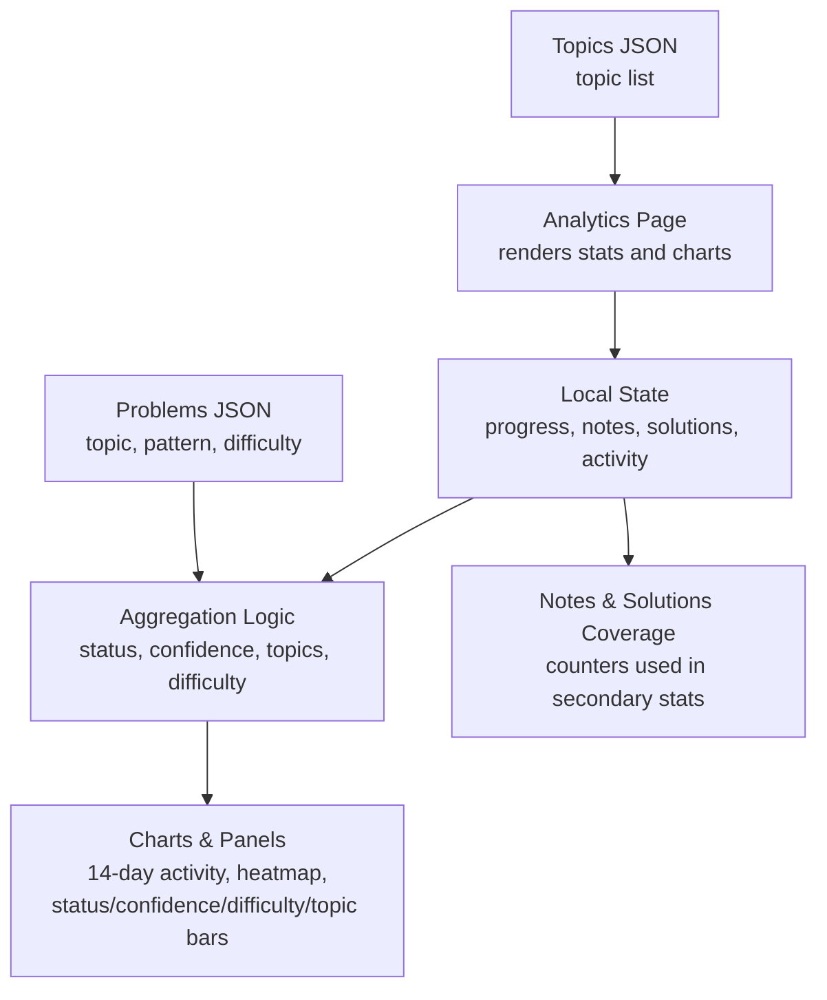
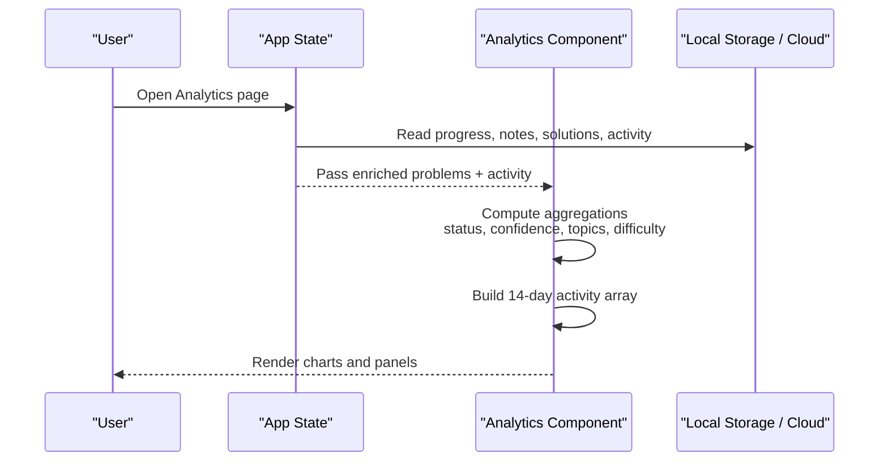
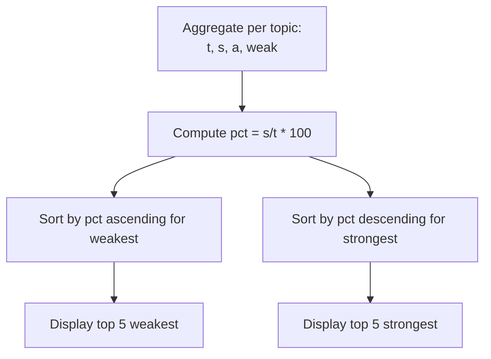
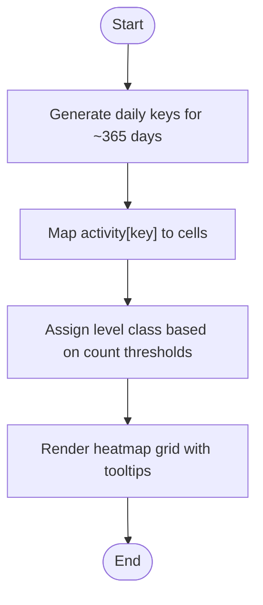
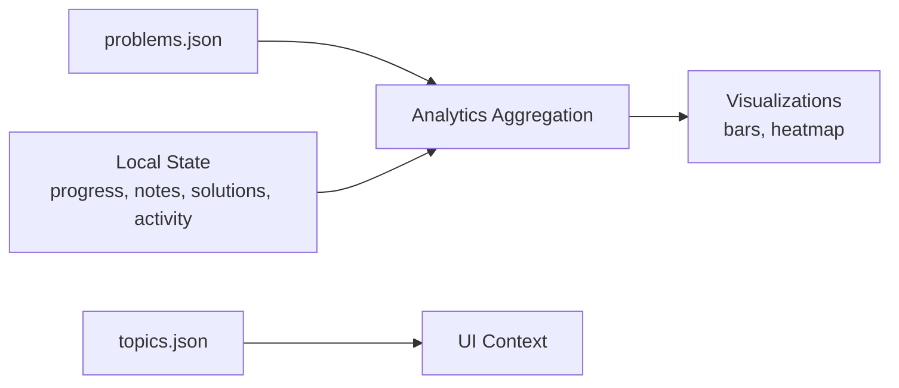

# Analytics Component

<cite>
**Referenced Files in This Document**
- [main.jsx](file://src/main.jsx)
- [problems.json](file://public/data/problems.json)
- [topics.json](file://public/data/topics.json)
- [README.md](file://README.md)
</cite>

## Table of Contents
1. [Introduction](#introduction)
2. [Project Structure](#project-structure)
3. [Core Components](#core-components)
4. [Architecture Overview](#architecture-overview)
5. [Detailed Component Analysis](#detailed-component-analysis)
6. [Dependency Analysis](#dependency-analysis)
7. [Performance Considerations](#performance-considerations)
8. [Troubleshooting Guide](#troubleshooting-guide)
9. [Conclusion](#conclusion)
10. [Appendices](#appendices)

## Introduction
This document explains the Analytics component that provides performance insights and learning metrics for the DSA Tracker. It covers how completion rates, mastery levels, confidence distribution, and topic-wise analysis are computed; how the 14-day activity chart, status breakdown charts, difficulty completion tracking, and weakest/strongest topic identification are rendered; and how data aggregation, chart rendering patterns, and actionable insights guide focused learning. It also documents the analytics note system and recommendations embedded in the interface.

## Project Structure
The Analytics feature is implemented as a single-page React application with all logic in one file. The app loads problem metadata from bundled JSON files and computes analytics on the client side using local state (progress, notes, solutions, activity). Cloud sync is optional and does not change the core analytics logic.

**Diagram sources**
- [main.jsx:320-429](file://src/main.jsx#L320-L429)
- [main.jsx:431-449](file://src/main.jsx#L431-L449)
- [problems.json:1-200](file://public/data/problems.json#L1-L200)
- [topics.json:1-20](file://public/data/topics.json#L1-L20)

**Section sources**
- [README.md:1-20](file://README.md#L1-L20)
- [main.jsx:73-220](file://src/main.jsx#L73-L220)

## Core Components
- Analytics page: Computes and displays key metrics, charts, and recommendations.
- Activity heatmap: Yearly view of daily activity intensity.
- Supporting helpers: Date utilities, day-key generation, and activity recording.

Key responsibilities:
- Aggregate per-problem status, confidence, topic, and difficulty into summary statistics.
- Build a 14-day activity timeline and a yearly heatmap.
- Identify weakest and strongest topics to guide focus.
- Surface notes and solutions coverage to encourage high-signal review.

**Section sources**
- [main.jsx:320-429](file://src/main.jsx#L320-L429)
- [main.jsx:431-449](file://src/main.jsx#L431-L449)

## Architecture Overview
The Analytics component reads enriched problems (merged with progress), then aggregates across multiple dimensions. It renders:
- Top-level stats: completion percentage, mastered count, attempted count, streak.
- Secondary stats: notes coverage, solutions written, revisions due, total attempts.
- Visualizations: 14-day activity bars, yearly heatmap, status and confidence breakdowns, difficulty completion, topic progress, weakest/strongest topics.

**Diagram sources**
- [main.jsx:73-220](file://src/main.jsx#L73-L220)
- [main.jsx:320-429](file://src/main.jsx#L320-L429)

## Detailed Component Analysis

### Statistical Calculations
- Completion rate: Percentage of solved or mastered problems out of total problems.
- Mastery level: Count of problems marked Mastered.
- Confidence distribution: Counts per confidence category including Unset.
- Topic-wise analysis: For each topic, counts total, solved, attempted, weak, and derived completion percentage.
- Difficulty completion: For Easy/Medium/Hard, counts total and solved, with percentage.
- Activity streak: Consecutive active days ending at today or yesterday if today has no activity.
- Notes and solutions coverage: Number of problems with any filled note fields; number of problems with at least one approach containing explanation or code; total filled approaches.

These calculations are performed in a single pass over the problems array to minimize overhead.

**Section sources**
- [main.jsx:154-165](file://src/main.jsx#L154-L165)
- [main.jsx:320-372](file://src/main.jsx#L320-L372)

### 14-Day Activity Chart
- Builds an array of the last 14 days, keyed by date string.
- Each entry includes label (weekday short) and count from activity storage.
- Bar height is normalized against the maximum daily count to fit the chart.

**Diagram sources**
- [main.jsx:350-357](file://src/main.jsx#L350-L357)
- [main.jsx:373-383](file://src/main.jsx#L373-L383)

**Section sources**
- [main.jsx:350-383](file://src/main.jsx#L350-L383)

### Status Breakdown Charts
- Counts per status: Not Started, Attempted, Solved, Mastered.
- Horizontal bars show proportion relative to total problems.

**Section sources**
- [main.jsx:321-338](file://src/main.jsx#L321-L338)
- [main.jsx:385-391](file://src/main.jsx#L385-L391)

### Confidence Distribution
- Counts per confidence category: Weak, Learning, Strong, Interview Ready, plus Unset.
- Only categories with non-zero counts are displayed.

**Section sources**
- [main.jsx:322-329](file://src/main.jsx#L322-L329)
- [main.jsx:392-397](file://src/main.jsx#L392-L397)

### Difficulty Completion Tracking
- Tracks totals and solved counts per difficulty level (Easy, Medium, Hard).
- Displays completed/total and bar width based on percentage.

**Section sources**
- [main.jsx:324-338](file://src/main.jsx#L324-L338)
- [main.jsx:399-405](file://src/main.jsx#L399-L405)

### Weakest and Strongest Topic Identification
- Topic rows include total, solved, attempted, weak, and computed completion percentage.
- Weakest topics: lowest completion percentages among topics with at least one problem.
- Strongest topics: highest completion percentages.

**Diagram sources**
- [main.jsx:323-349](file://src/main.jsx#L323-L349)
- [main.jsx:406-427](file://src/main.jsx#L406-L427)

**Section sources**
- [main.jsx:323-349](file://src/main.jsx#L323-L349)
- [main.jsx:406-427](file://src/main.jsx#L406-L427)

### Yearly Activity Heatmap
- Generates a 365+ day grid starting from the most recent Sunday back to roughly a year ago.
- Each cell represents one day’s activity; color intensity encodes count ranges.
- Hover tooltips show day and activity count.

**Diagram sources**
- [main.jsx:431-449](file://src/main.jsx#L431-L449)

**Section sources**
- [main.jsx:431-449](file://src/main.jsx#L431-L449)

### Data Aggregation Logic
- Single-pass aggregation over problems to compute:
  - Status counts
  - Confidence counts
  - Per-topic metrics (total, solved, attempted, weak)
  - Per-difficulty metrics (total, solved)
  - Notes coverage (any field filled)
  - Solutions coverage (approaches with explanation or code)
- Derived values:
  - Topic completion percentage
  - Weakest/strongest topic lists
  - 14-day activity series
  - Streak calculation

Complexity: O(N) where N is the number of problems; constant-time operations per problem.

**Section sources**
- [main.jsx:320-372](file://src/main.jsx#L320-L372)
- [main.jsx:154-165](file://src/main.jsx#L154-L165)

### Chart Rendering Patterns
- All charts use simple HTML/CSS-based bars and grids without external chart libraries.
- Bars are styled via inline width/height percentages computed from aggregated data.
- Heatmap uses CSS classes mapped from activity counts to indicate intensity.

**Section sources**
- [main.jsx:373-427](file://src/main.jsx#L373-L427)
- [main.jsx:431-449](file://src/main.jsx#L431-L449)

### Actionable Insights and Recommendations
- Focus next panel highlights weakest topics with completion percentage and weak problem counts.
- Strongest topics panel includes an analytics note recommending pairing weakest topics with revision due items and filling notes/solutions to keep review high-signal.
- Secondary stats surface notes coverage and solutions written to encourage deeper learning artifacts.

**Section sources**
- [main.jsx:406-427](file://src/main.jsx#L406-L427)

### Analytics Note System
- Notes coverage metric counts problems with any filled note field.
- The analytics note in the strongest topics panel provides guidance to integrate weakest topics with scheduled revisions and ensure notes/solutions are complete.
- Notes are stored per problem and persist locally or via cloud sync when enabled.

**Section sources**
- [main.jsx:339-345](file://src/main.jsx#L339-L345)
- [main.jsx:420-427](file://src/main.jsx#L420-L427)

## Dependency Analysis
- Inputs:
  - Problems dataset: topic, pattern, difficulty, url, videoUrl.
  - Local state: progress (status, confidence, attempts, revision schedule), notes, solutions, activity.
  - Topics list: used for navigation and grouping elsewhere; analytics primarily uses problem topics.
- Outputs:
  - Aggregated metrics and visualizations rendered in the Analytics page.
  - No direct dependency on external charting libraries; pure DOM/CSS rendering.

**Diagram sources**
- [problems.json:1-200](file://public/data/problems.json#L1-L200)
- [topics.json:1-20](file://public/data/topics.json#L1-L20)
- [main.jsx:320-429](file://src/main.jsx#L320-L429)

**Section sources**
- [main.jsx:320-429](file://src/main.jsx#L320-L429)

## Performance Considerations
- Aggregation runs once per render cycle using memoized inputs where applicable; complexity is linear in the number of problems.
- Avoids heavy computations by computing derived values (percentages, lists) in a single pass.
- Uses lightweight DOM/CSS charts to reduce runtime overhead compared to third-party chart libraries.
- Activity heatmap generates up to ~365 entries; still efficient for modern browsers.

[No sources needed since this section provides general guidance]

## Troubleshooting Guide
- If charts appear empty:
  - Ensure problems are loaded and enriched with progress.
  - Verify activity storage contains keys for dates; missing keys default to zero.
- If streak appears incorrect:
  - Confirm activity keys exist for consecutive days; streak computation starts from today or yesterday depending on presence of activity.
- If notes/solutions coverage seems low:
  - Check that note fields or solution approaches contain trimmed content; empty strings do not count as filled.

**Section sources**
- [main.jsx:154-165](file://src/main.jsx#L154-L165)
- [main.jsx:339-345](file://src/main.jsx#L339-L345)
- [main.jsx:350-357](file://src/main.jsx#L350-L357)

## Conclusion
The Analytics component delivers a comprehensive, client-side view of learning progress through robust aggregation and clear visualizations. It computes completion rates, mastery levels, confidence distributions, and topic-wise insights, while highlighting weakest and strongest areas to guide focused study. The 14-day activity chart and yearly heatmap provide temporal context, and embedded recommendations help users prioritize revisions and improve learning artifacts.

[No sources needed since this section summarizes without analyzing specific files]

## Appendices

### Data Models and Fields Used by Analytics
- Problem fields: id, title, topic, pattern, difficulty, url, videoUrl.
- Progress fields: status, confidence, attempts, revisionCount, lastRevised, nextRevision, favorite.
- Notes fields: insight, mistake, approach, complexity, interviewCue.
- Solutions fields: approaches[] with explanation and code per language.
- Activity map: date key -> integer count.

**Section sources**
- [problems.json:1-200](file://public/data/problems.json#L1-L200)
- [main.jsx:13-26](file://src/main.jsx#L13-L26)
- [main.jsx:320-372](file://src/main.jsx#L320-L372)