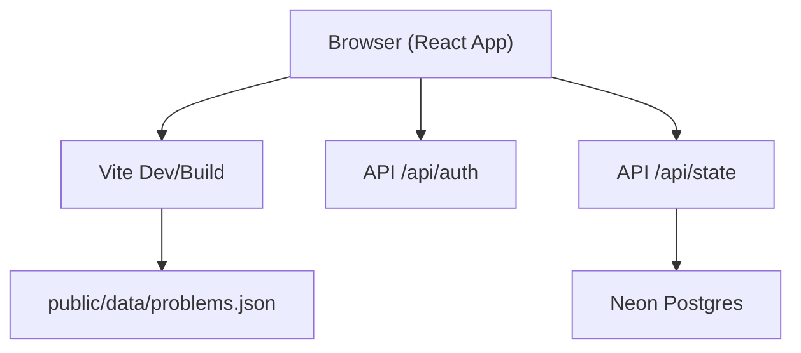
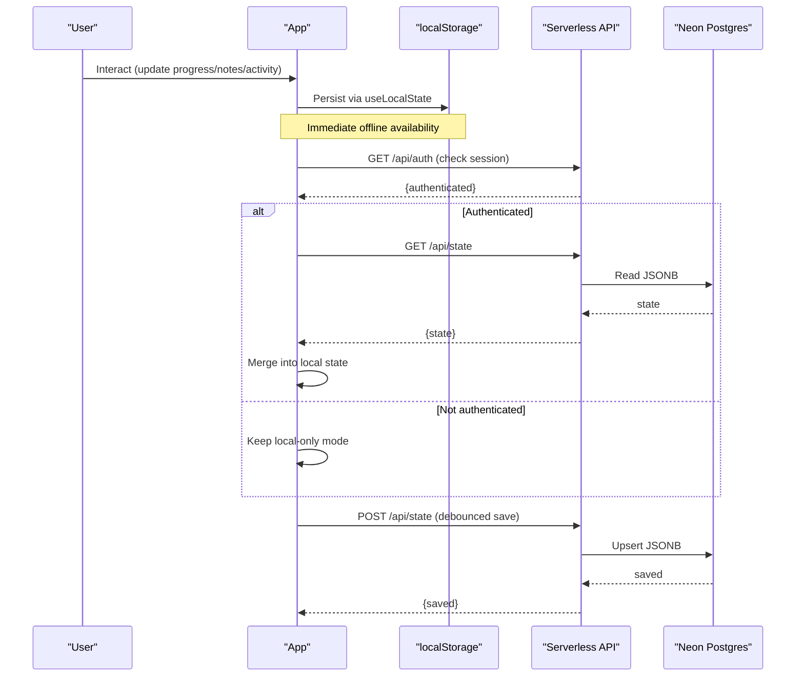
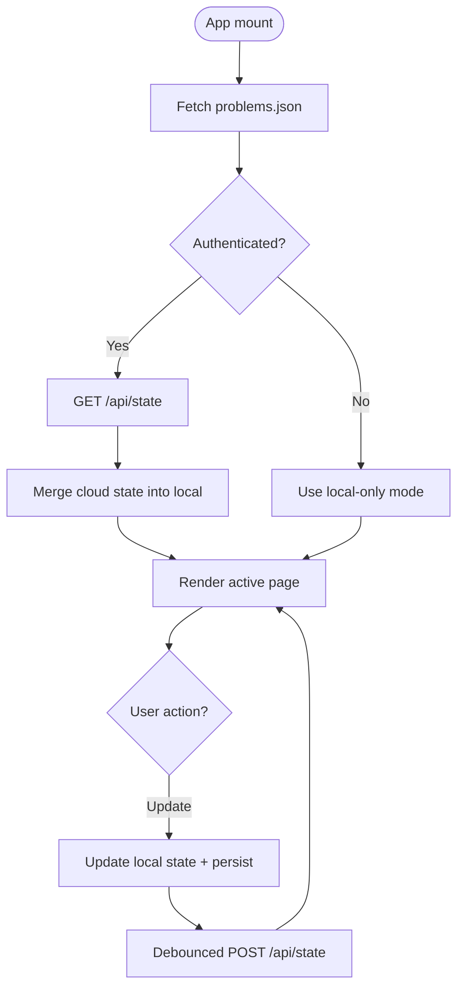
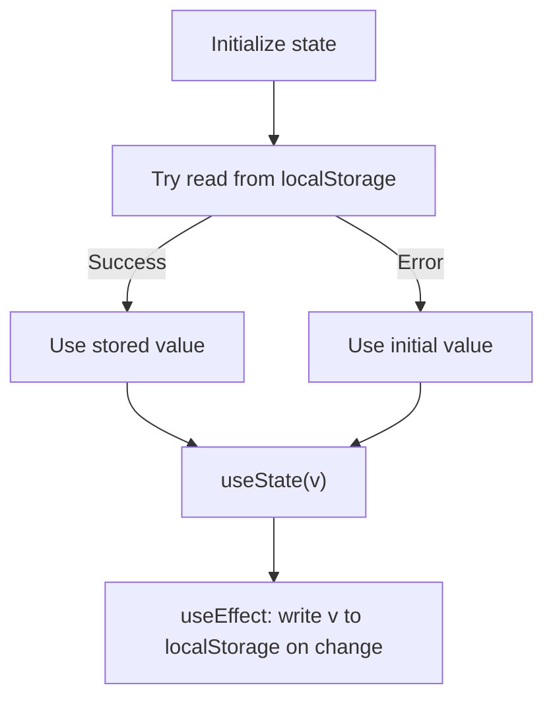
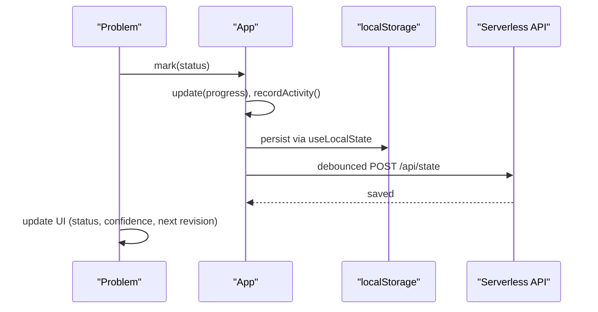
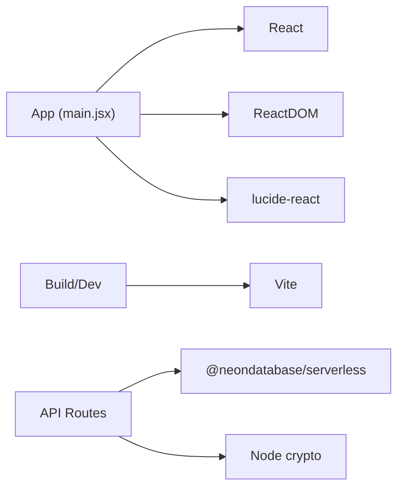

# Application Architecture

<cite>
**Referenced Files in This Document**
- [main.jsx](file://src/main.jsx)
- [_session.js](file://api/_session.js)
- [auth.js](file://api/auth.js)
- [state.js](file://api/state.js)
- [problems.json](file://public/data/problems.json)
- [README.md](file://README.md)
- [package.json](file://package.json)
</cite>

## Table of Contents
1. [Introduction](#introduction)
2. [Project Structure](#project-structure)
3. [Core Components](#core-components)
4. [Architecture Overview](#architecture-overview)
5. [Detailed Component Analysis](#detailed-component-analysis)
6. [Dependency Analysis](#dependency-analysis)
7. [Performance Considerations](#performance-considerations)
8. [Troubleshooting Guide](#troubleshooting-guide)
9. [Conclusion](#conclusion)

## Introduction
This document explains the React application architecture for a local-first DSA (Data Structures and Algorithms) tracker. It covers the main App component structure, state management with React hooks, local persistence using localStorage, routing via page state, data flow between components, and integration with cloud APIs for optional multi-device sync. It also documents the custom useLocalState hook, session management, and error handling strategies.

## Project Structure
The project is a Vite-based React app with a single-page interface. The core UI logic lives in one large component file that renders multiple views based on page state. Cloud synchronization is implemented through serverless API routes deployed as Vercel Functions. Static problem datasets are bundled under public/data and loaded at runtime.

**Diagram sources**
- [main.jsx:1-10](file://src/main.jsx#L1-L10)
- [problems.json:1-20](file://public/data/problems.json#L1-L20)
- [auth.js:1-24](file://api/auth.js#L1-L24)
- [state.js:1-51](file://api/state.js#L1-L51)

**Section sources**
- [main.jsx:1-10](file://src/main.jsx#L1-L10)
- [README.md:1-20](file://README.md#L1-L20)
- [package.json:1-21](file://package.json#L1-L21)

## Core Components
The application is composed of a central App component that manages global state and delegates rendering to view-specific components: Dashboard, Roadmap, Revision, Patterns, Analytics, Settings, and Problem. All user progress, notes, solutions, activity logs, and settings are persisted locally by default and optionally synced to a cloud database when authenticated.

Key responsibilities:
- App: orchestrates state, routing, data loading, filtering, stats computation, and cloud sync lifecycle.
- Dashboard: high-level overview, daily goal, due revisions, next problems, weak problems, study loop guidance.
- Roadmap: grouped topic/pattern listing with filters and sorting.
- Revision: spaced repetition queue and upcoming schedule.
- Patterns: pattern-level completion metrics and links to external resources.
- Analytics: charts and breakdowns across status, confidence, difficulty, topics, and activity.
- Settings: export/import/reset, theme, daily goal, and cloud sync connection.
- Problem: per-problem editing of notes, solutions, metadata, revision scheduling, and status transitions.

**Section sources**
- [main.jsx:47-173](file://src/main.jsx#L47-L173)
- [main.jsx:175-189](file://src/main.jsx#L175-L189)
- [main.jsx:199-245](file://src/main.jsx#L199-L245)
- [main.jsx:247-249](file://src/main.jsx#L247-L249)
- [main.jsx:250-271](file://src/main.jsx#L250-L271)
- [main.jsx:273-381](file://src/main.jsx#L273-L381)
- [main.jsx:383-584](file://src/main.jsx#L383-L584)
- [main.jsx:586-606](file://src/main.jsx#L586-L606)

## Architecture Overview
The app follows a unidirectional data flow with a single source of truth in the App component. Local state is persisted to localStorage via a custom hook. Optional cloud sync uses an HTTP-only session cookie and a JSONB store in Neon Postgres.

**Diagram sources**
- [main.jsx:29-33](file://src/main.jsx#L29-L33)
- [main.jsx:64-113](file://src/main.jsx#L64-L113)
- [auth.js:1-24](file://api/auth.js#L1-L24)
- [state.js:1-51](file://api/state.js#L1-L51)

## Detailed Component Analysis

### App Component
- State management:
  - Uses useState for transient UI state (page, selected problem, query, toast).
  - Uses a custom useLocalState hook for persistent keys: progress, notes, solutions, activity, settings.
  - Computes derived data with useMemo: enriched problems list, statistics, filtered roadmap items.
- Routing mechanism:
  - Page state drives conditional rendering of Dashboard, Roadmap, Revision, Patterns, Analytics, Settings, and Problem views.
- Data loading:
  - Fetches static problem dataset from bundled JSON.
  - Loads built-in solutions and TUF links if available.
  - Checks authentication and loads cloud state when connected.
- Cloud sync:
  - Debounced save of current local state to /api/state after changes.
  - Sign-in/sign-out flows manage session cookies and sync status.
- Error handling:
  - Graceful fallbacks when network or data fetch fails; user-facing toast messages.

**Diagram sources**
- [main.jsx:47-113](file://src/main.jsx#L47-L113)
- [auth.js:1-24](file://api/auth.js#L1-L24)
- [state.js:1-51](file://api/state.js#L1-L51)

**Section sources**
- [main.jsx:29-33](file://src/main.jsx#L29-L33)
- [main.jsx:47-173](file://src/main.jsx#L47-L173)
- [main.jsx:586-606](file://src/main.jsx#L586-L606)

### Custom Hook: useLocalState
- Purpose: Provide key-value pairs backed by localStorage with automatic persistence.
- Behavior:
  - Initializes state from localStorage if present, otherwise falls back to provided initial value.
  - Persists updates immediately to localStorage.
  - Wraps JSON parse/stringify with try/catch to avoid corrupting state on malformed storage.

**Diagram sources**
- [main.jsx:29-33](file://src/main.jsx#L29-L33)

**Section sources**
- [main.jsx:29-33](file://src/main.jsx#L29-L33)

### Dashboard
- Displays summary stats, streak, due revisions, next problems, and weak problems.
- Provides quick navigation to Roadmap and Revision pages.
- Uses computed stats passed down from App.

**Section sources**
- [main.jsx:175-189](file://src/main.jsx#L175-L189)

### Roadmap
- Groups problems by topic and pattern.
- Supports filters: topic, status, difficulty, pattern, favorites, and sort order.
- Collapsible sections for better scanning.

**Section sources**
- [main.jsx:199-245](file://src/main.jsx#L199-L245)

### Revision
- Shows due revisions sorted by nextRevision date.
- Allows marking a revision complete, which advances the next scheduled review using spaced intervals.
- Tracks activity count for today.

**Section sources**
- [main.jsx:247-249](file://src/main.jsx#L247-L249)

### Patterns
- Aggregates problems by topic and pattern.
- Shows completion percentages and links to external TakeUForward solutions when available.

**Section sources**
- [main.jsx:250-271](file://src/main.jsx#L250-L271)

### Analytics
- Computes distributions for status, confidence, difficulty, and topics.
- Renders last 14 days activity bars and identifies weakest/strongest topics.
- Highlights notes coverage and solutions written.

**Section sources**
- [main.jsx:273-381](file://src/main.jsx#L273-L381)

### Problem
- Per-problem editing of learning notes, solutions, and metadata.
- Status transitions update progress, attempts, confidence, and schedule next revision.
- Supports built-in solutions or personal copies, with language selection and copy-to-clipboard.
- Schedules revisions and shows next revision date.

**Diagram sources**
- [main.jsx:383-584](file://src/main.jsx#L383-L584)
- [main.jsx:64-113](file://src/main.jsx#L64-L113)

**Section sources**
- [main.jsx:383-584](file://src/main.jsx#L383-L584)

### Settings
- Export/import/reset local data.
- Theme toggle and daily goal configuration.
- Cloud sync connect/disconnect with password-based session.

**Section sources**
- [main.jsx:586-606](file://src/main.jsx#L586-L606)

## Dependency Analysis
- Frontend dependencies:
  - React and ReactDOM for UI.
  - lucide-react for icons.
  - Vite for build/dev tooling.
- Backend dependencies:
  - Neon serverless client for Postgres access.
  - Node crypto for secure session signing and validation.

**Diagram sources**
- [package.json:12-19](file://package.json#L12-L19)
- [state.js:1-5](file://api/state.js#L1-L5)
- [_session.js:1-14](file://api/_session.js#L1-L14)

**Section sources**
- [package.json:12-19](file://package.json#L12-L19)
- [state.js:1-5](file://api/state.js#L1-L5)
- [_session.js:1-14](file://api/_session.js#L1-L14)

## Performance Considerations
- Derived computations:
  - Enriched problems, stats, and filtered lists are memoized with useMemo to avoid recomputation on every render.
- Local persistence:
  - useLocalState writes to localStorage synchronously on each state change; consider batching for very large payloads if needed.
- Cloud sync:
  - Debounced saves reduce network overhead during rapid edits.
- Rendering:
  - Conditional rendering of pages reduces DOM size; collapsible sections in Roadmap improve scanability.

[No sources needed since this section provides general guidance]

## Troubleshooting Guide
- Cloud sync not connecting:
  - Ensure APP_ACCESS_PASSWORD is configured in environment variables and matches the password entered in Settings.
  - Verify DATABASE_URL is set for state persistence.
  - Check browser console for errors and confirm session cookie is set after sign-in.
- Sync status issues:
  - If syncStatus shows “unavailable” or “error,” verify network connectivity and API endpoints.
  - Reconnect via Settings to refresh session and reload state.
- Data loss prevention:
  - Use Export backup regularly; local data is device/browser specific.
  - Import backup to restore previous state if needed.
- Common errors:
  - Incorrect password returns 401; re-enter correct APP_ACCESS_PASSWORD.
  - Missing DATABASE_URL returns 500; configure environment variable.

**Section sources**
- [auth.js:16-22](file://api/auth.js#L16-L22)
- [state.js:23-49](file://api/state.js#L23-L49)
- [main.jsx:77-89](file://src/main.jsx#L77-L89)
- [main.jsx:586-606](file://src/main.jsx#L586-L606)

## Conclusion
The application implements a robust local-first architecture with optional cloud synchronization. The App component centralizes state and routing, while child components provide focused functionality for tracking, revising, and analyzing DSA progress. The custom useLocalState hook ensures immediate offline persistence, and the cloud layer provides multi-device continuity with secure session management. Memoization and debounced saves optimize performance, and comprehensive error handling improves resilience.

[No sources needed since this section summarizes without analyzing specific files]