# Dashboard Component

<cite>
**Referenced Files in This Document**
- [main.jsx](file://src/main.jsx)
- [styles.css](file://src/styles.css)
- [README.md](file://README.md)
</cite>

## Table of Contents
1. [Introduction](#introduction)
2. [Project Structure](#project-structure)
3. [Core Components](#core-components)
4. [Architecture Overview](#architecture-overview)
5. [Detailed Component Analysis](#detailed-component-analysis)
6. [Dependency Analysis](#dependency-analysis)
7. [Performance Considerations](#performance-considerations)
8. [Troubleshooting Guide](#troubleshooting-guide)
9. [Conclusion](#conclusion)

## Introduction
This document explains the Dashboard component of the DSA Tracker application. It covers:
- Progress visualization with a circular progress indicator
- Statistics cards for streak, due problems, weak problems, and mastered count
- Revision due panel, Continue A2Z section, weak problems prioritization, and study loop guidance
- Responsive grid layout and card-based UI patterns
- User interaction flows from dashboard to roadmap, revision, and problem pages
- Calculation logic for statistics and filtering for due items
- Navigation integration with other pages

The app is a local-first React/Vite tracker for the Striver A2Z DSA Sheet. Problem data ships locally, and user state (progress, notes, solutions, activity, settings) is stored in browser storage and optionally synced to a cloud database when configured.

**Section sources**
- [README.md:1-20](file://README.md#L1-L20)

## Project Structure
The Dashboard lives inside a single-page React application rendered by Vite. The main entry point mounts the root App component, which manages global state and renders page-specific components based on navigation. The Dashboard component is one of several views alongside Roadmap, Revision, Patterns, Analytics, Settings, and Problem detail.

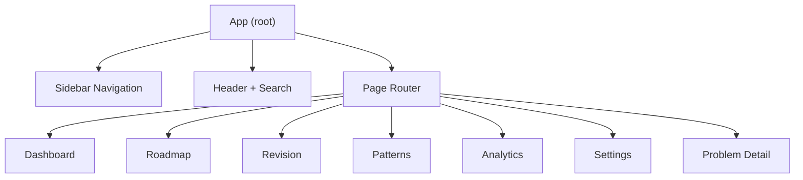

**Diagram sources**
- [main.jsx:47-173](file://src/main.jsx#L47-L173)

**Section sources**
- [main.jsx:47-173](file://src/main.jsx#L47-L173)

## Core Components
- Dashboard: Displays overall progress, stats, and quick actions.
- DashboardPanel: Reusable panel wrapper used across dashboard sections.
- ProblemRow: Compact row representing a problem with status, tags, and navigation.
- Supporting helpers: enriched dataset, stats computation, filtering, and navigation functions.

Key responsibilities:
- Compute completion percentage and render a circular progress ring.
- Show four stat cards: Streak, Due today, Weak, Mastered.
- Render “Revision due” list sorted by next revision date.
- Render “Continue A2Z” list of not-started problems.
- Render “Weak problems” prioritized list.
- Provide Study loop guidance.
- Navigate to Roadmap, Revision, or open a specific Problem.

**Section sources**
- [main.jsx:175-188](file://src/main.jsx#L175-L188)

## Architecture Overview
The Dashboard receives precomputed props from the parent App:
- stats: derived from enriched problems and activity
- problems: enriched problem list merged with per-problem progress
- open(p): opens a specific problem
- setPage(id): navigates to another page
- settings: user preferences including daily goal

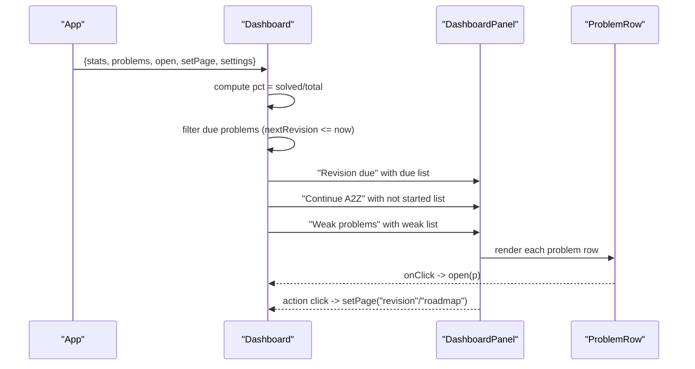

**Diagram sources**
- [main.jsx:115-126](file://src/main.jsx#L115-L126)
- [main.jsx:175-188](file://src/main.jsx#L175-L188)

## Detailed Component Analysis

### Circular Progress Indicator
- Percentage calculation: solved / total * 100
- Visual ring uses CSS custom property --pct set to degrees (percentage * 3.6)
- Conic gradient draws the filled portion; inner circle masks the center

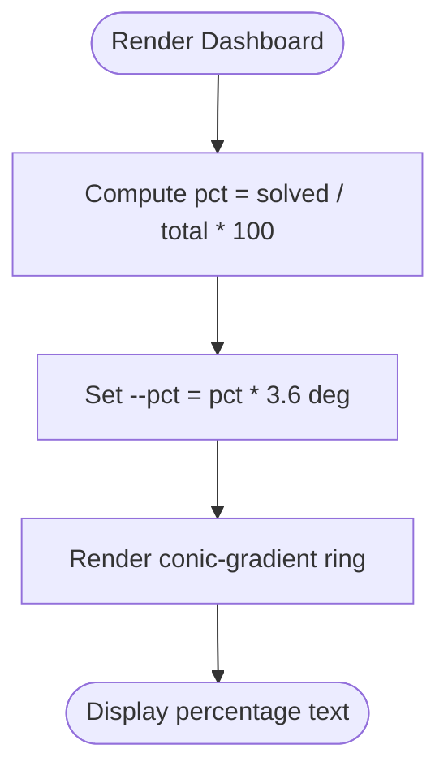

**Diagram sources**
- [main.jsx:175-182](file://src/main.jsx#L175-L182)
- [styles.css:1-15](file://src/styles.css#L1-L15)

**Section sources**
- [main.jsx:175-182](file://src/main.jsx#L175-L182)
- [styles.css:1-15](file://src/styles.css#L1-L15)

### Statistics Cards
Cards show:
- Streak: consecutive active days computed by walking backwards through activity history
- Due today: number of problems whose nextRevision is today or earlier
- Weak: count of problems marked as Weak confidence
- Mastered: count of problems marked as Mastered

Calculation highlights:
- Enriched dataset merges base problem data with per-problem progress
- Stats are memoized to avoid recomputation
- Today’s activity increments via recordActivity on interactions that mark progress

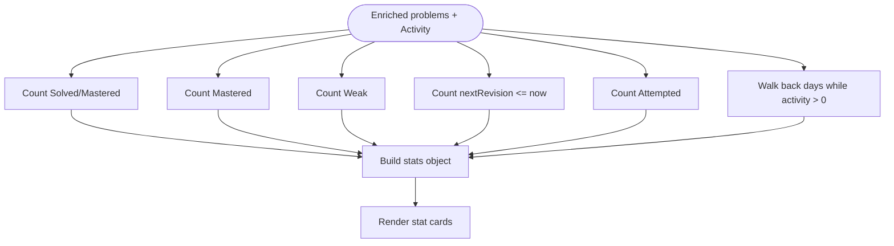

**Diagram sources**
- [main.jsx:115-126](file://src/main.jsx#L115-L126)

**Section sources**
- [main.jsx:115-126](file://src/main.jsx#L115-L126)

### Revision Due Panel
- Filters problems where nextRevision exists and is due today or earlier
- Sorts by ascending nextRevision date
- Shows up to five items
- Action button navigates to the Revision page

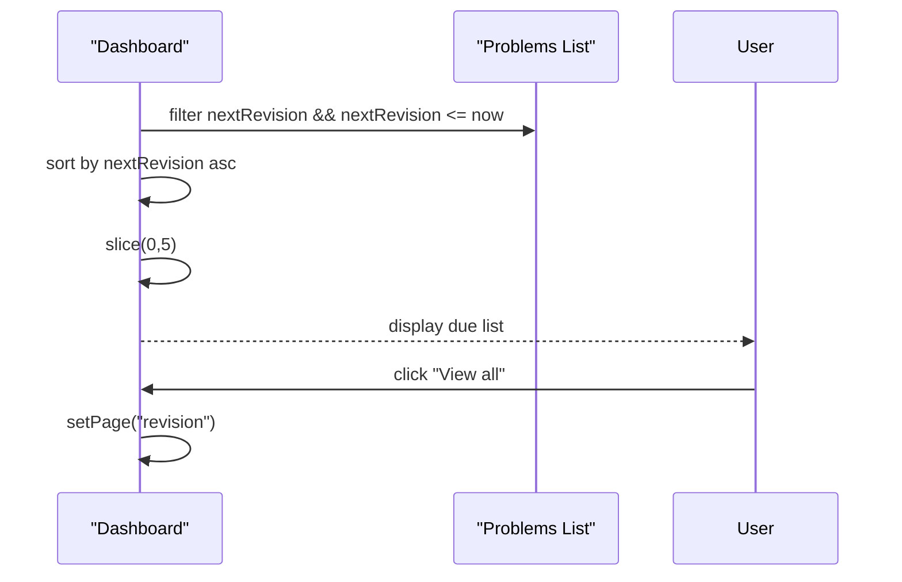

**Diagram sources**
- [main.jsx:175-183](file://src/main.jsx#L175-L183)

**Section sources**
- [main.jsx:175-183](file://src/main.jsx#L175-L183)

### Continue A2Z Section
- Shows up to five problems that are Not Started
- Encourages resuming learning from where the user left off
- Action button navigates to the Roadmap page

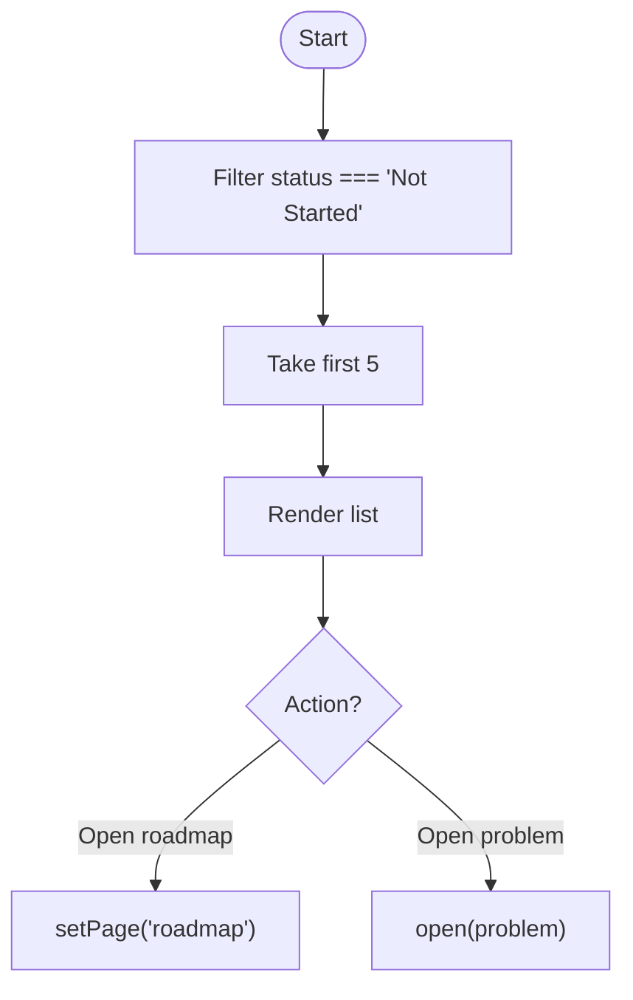

**Diagram sources**
- [main.jsx:175-183](file://src/main.jsx#L175-L183)

**Section sources**
- [main.jsx:175-183](file://src/main.jsx#L175-L183)

### Weak Problems Prioritization
- Filters problems with confidence equal to Weak
- Shows up to four items
- Action button navigates to the Roadmap page to explore more weak items

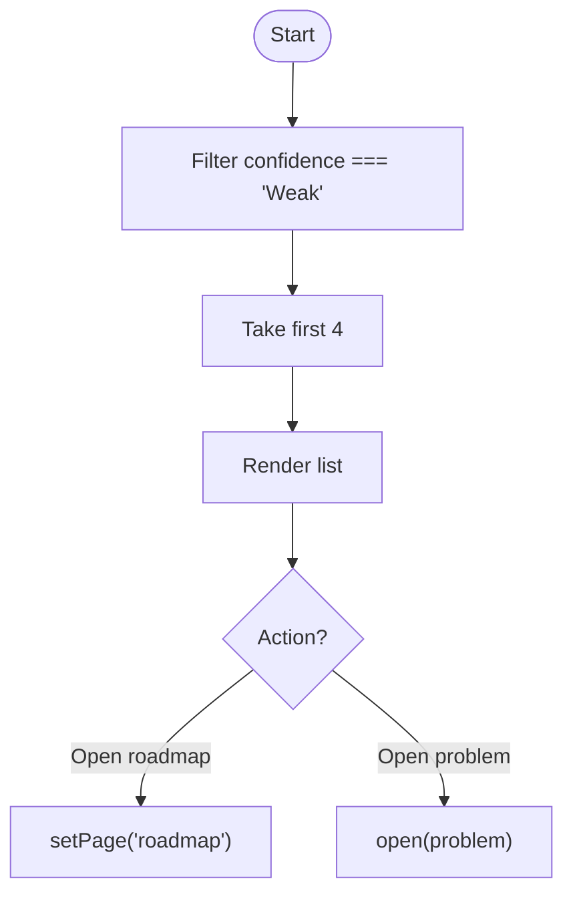

**Diagram sources**
- [main.jsx:175-184](file://src/main.jsx#L175-L184)

**Section sources**
- [main.jsx:175-184](file://src/main.jsx#L175-L184)

### Study Loop Guidance
- Provides a three-step loop: Attempt, Record, Revise
- Reinforces spaced repetition and reflective practice
- No direct data mutation; purely instructional

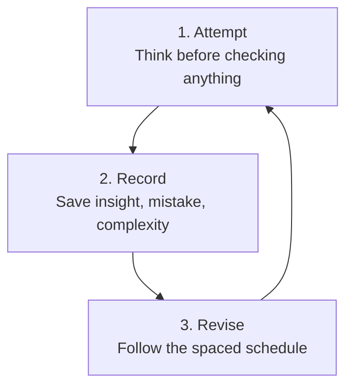

[No sources needed since this diagram shows conceptual workflow, not actual code structure]

**Section sources**
- [main.jsx:184](file://src/main.jsx#L184)

### Responsive Grid Layout and Card-Based UI
- Hero section with progress ring and summary
- Four-column card grid for stats
- Two-column grid panels for lists and guidance
- Responsive breakpoints collapse grids to fewer columns and adjust sidebar width
- Dark mode support via theme class

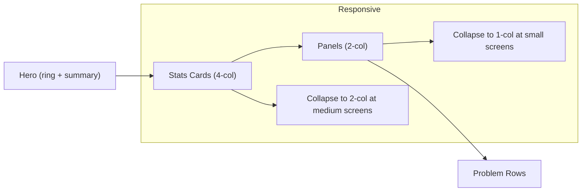

**Diagram sources**
- [styles.css:1-15](file://src/styles.css#L1-L15)

**Section sources**
- [styles.css:1-15](file://src/styles.css#L1-L15)

### User Interaction Flows
- Clicking a problem row opens the Problem detail page
- Panel actions navigate to Roadmap or Revision
- Marking progress updates stats and may schedule revisions
- Daily goal shown in hero reflects current day’s activity vs target

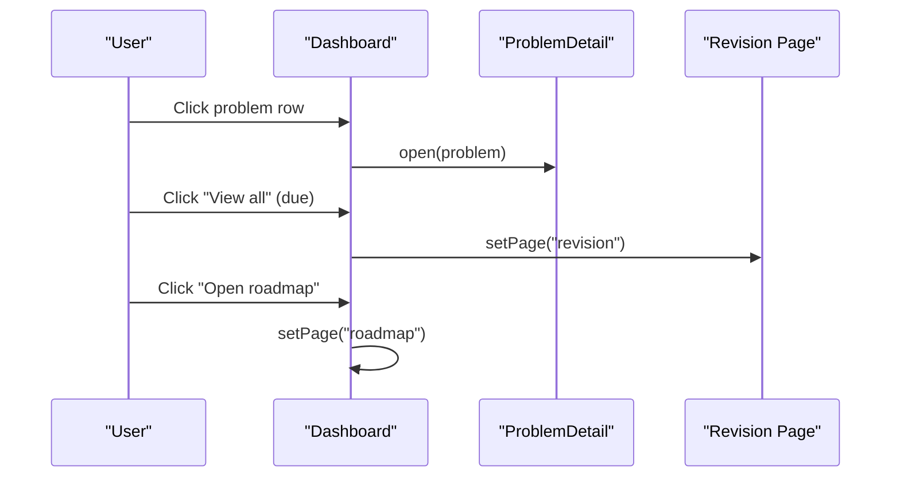

**Diagram sources**
- [main.jsx:175-188](file://src/main.jsx#L175-L188)

**Section sources**
- [main.jsx:175-188](file://src/main.jsx#L175-L188)

## Dependency Analysis
- Dashboard depends on:
  - Enriched problems (base problems merged with per-problem progress)
  - Stats computed from enriched problems and activity
  - Navigation helpers (open, setPage)
  - Settings (dailyGoal)
- Data flow:
  - Base problems loaded from local JSON seed
  - Per-problem progress stored in localStorage and optionally synced to cloud
  - Activity tracked per day and used for streak and analytics
  - Stats recompute whenever enriched data or activity changes

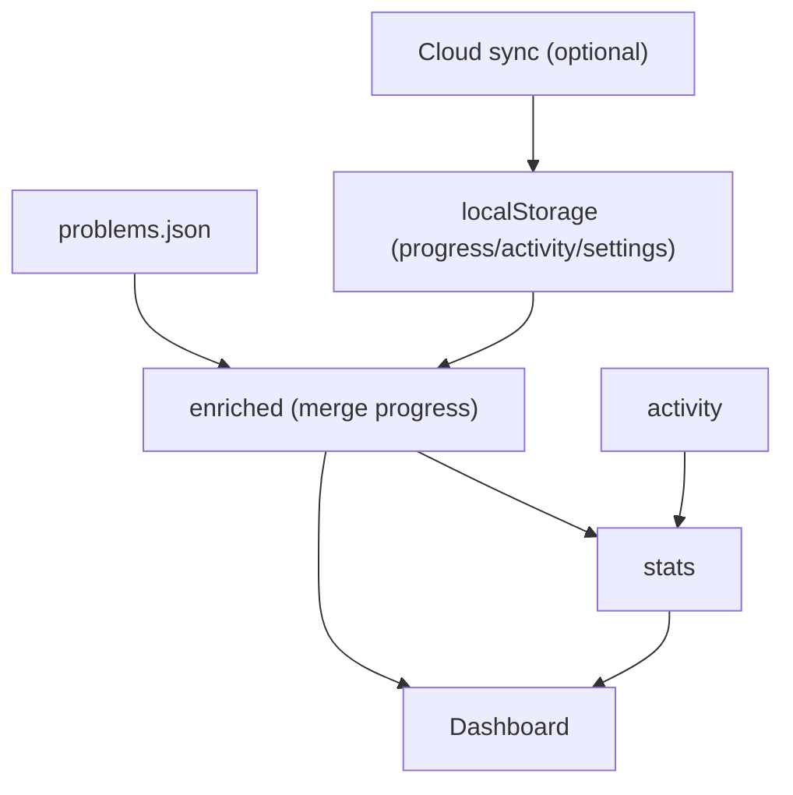

**Diagram sources**
- [main.jsx:47-126](file://src/main.jsx#L47-L126)

**Section sources**
- [main.jsx:47-126](file://src/main.jsx#L47-L126)

## Performance Considerations
- Memoization:
  - enriched dataset and stats are wrapped in useMemo to avoid unnecessary recalculations
  - Filtering for dashboard panels is lightweight but still benefits from minimal recomputation
- Rendering:
  - Limiting displayed items (e.g., top 5 due, top 5 continue, top 4 weak) reduces DOM size
- Storage:
  - LocalStorage writes occur on state changes; consider batching if frequent updates are added
- Network:
  - Optional cloud sync uses debounced saves to reduce network calls

[No sources needed since this section provides general guidance]

## Troubleshooting Guide
Common issues and resolutions:
- Circular progress shows 0%:
  - Ensure problems are loaded and stats compute correctly; verify enriched list has entries
- Due panel empty:
  - Check that nextRevision is set and dates are valid; ensure time zone handling is consistent
- Streak not updating:
  - Confirm recordActivity is called when marking progress; verify today’s key matches current date
- Navigation not working:
  - Verify setPage and open callbacks are passed to Dashboard and invoked correctly

**Section sources**
- [main.jsx:115-126](file://src/main.jsx#L115-L126)
- [main.jsx:175-188](file://src/main.jsx#L175-L188)

## Conclusion
The Dashboard provides a clear, actionable overview of learning progress:
- Visual feedback via a circular progress ring
- Immediate insights through stat cards
- Focused tasks via due, continue, and weak problem panels
- Guided study loop to reinforce retention
- Seamless navigation to deeper pages for focused work

It integrates tightly with the rest of the app’s state model and UI patterns, offering a responsive and accessible experience across devices.

[No sources needed since this section summarizes without analyzing specific files]