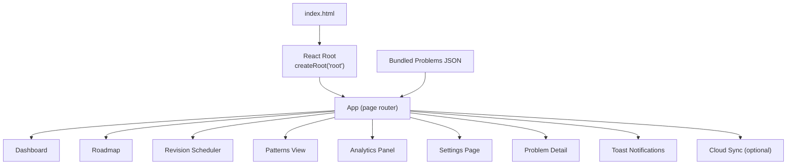
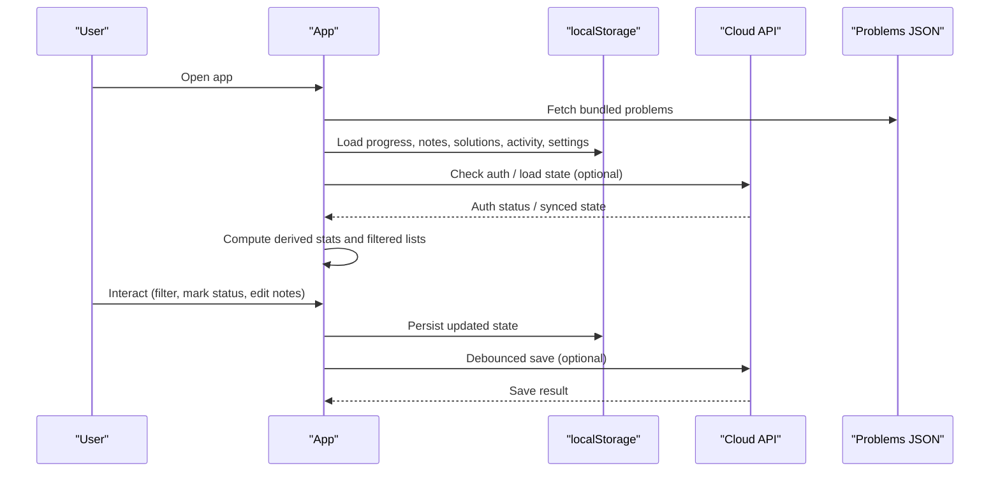
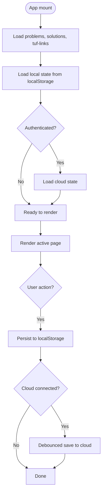
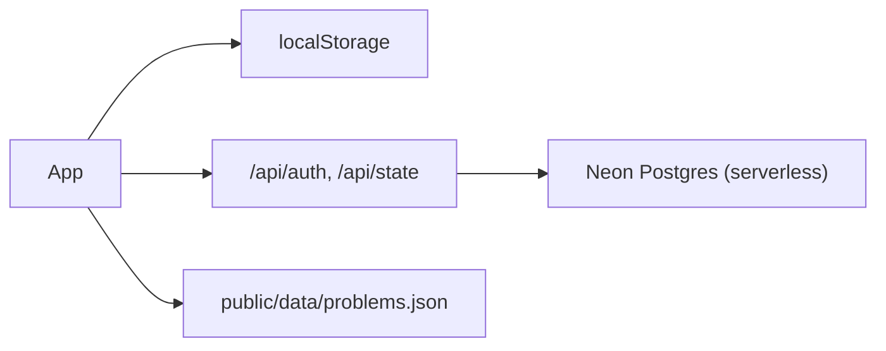

# Frontend Application

<cite>
**Referenced Files in This Document**
- [main.jsx](file://src/main.jsx)
- [styles.css](file://src/styles.css)
- [cloud-sync.css](file://src/cloud-sync.css)
- [package.json](file://package.json)
- [index.html](file://index.html)
- [README.md](file://README.md)
- [problems.json](file://public/data/problems.json)
</cite>

## Table of Contents
1. Introduction
2. Project Structure
3. Core Components
4. Architecture Overview
5. Detailed Component Analysis
6. Dependency Analysis
7. Performance Considerations
8. Troubleshooting Guide
9. Conclusion

## Introduction
This document describes the React frontend application that tracks progress through a curated DSA problem set. It explains the main application structure, component hierarchy, state management with React hooks, routing via page state, and the key interfaces: dashboard, roadmap, revision scheduler, analytics panel, settings, and problem detail view. It also covers styling, responsive design, user interaction flows, local storage usage, and optional cloud synchronization.

## Project Structure
The application is a single-page React app built with Vite. The entry point mounts the root component into the DOM, and all UI logic lives in one primary file for simplicity. Styling is centralized in CSS files, and data is loaded from bundled JSON assets. Optional cloud sync uses serverless API routes deployed alongside the app.

**Diagram sources**
- [index.html:1-3](file://index.html#L1-L3)
- [main.jsx:47-173](file://src/main.jsx#L47-L173)
- [main.jsx:175-608](file://src/main.jsx#L175-L608)

**Section sources**
- [index.html:1-3](file://index.html#L1-L3)
- [package.json:1-21](file://package.json#L1-L21)
- [README.md:1-59](file://README.md#L1-L59)

## Core Components
- App: Central router and state owner. Manages problems, progress, notes, solutions, activity, settings, filters, selected problem, search query, toast messages, and cloud sync status. Loads seed data and persists state to localStorage; optionally syncs to cloud.
- Dashboard: High-level overview showing completion ring, daily goal, due revisions, next problems, weak problems, and study loop guidance.
- Roadmap: Grouped by topic and pattern with filters (topic, status, difficulty, pattern, favorites, sort). Collapsible sections for topics and patterns.
- Revision Scheduler: Lists due and upcoming revisions based on spaced repetition intervals; allows marking reviews complete and scheduling next revision.
- Patterns: Aggregated view grouped by topic and pattern with per-problem links to external solutions when available.
- Analytics: Computes and displays metrics such as completion percentage, mastery count, streak, last 14 days activity chart, status breakdown, confidence mix, difficulty completion, topic progress, and weakest/strongest topics.
- Problem Detail: Per-problem editing of learning notes, solutions (approaches), metadata, confidence, favorites, status transitions, and revision scheduling. Includes code copy and language toggle for solution display.
- Settings: Cloud sync connection/disconnection, export/import/reset of local data, daily goal configuration, and help text explaining tracker behavior.

State management highlights:
- Local-first persistence using a custom hook wrapping localStorage.
- Derived state computed with useMemo for performance.
- Event-driven updates for status changes, notes, solutions, and activity tracking.

Routing:
- Client-side navigation via page state ("dashboard", "roadmap", "revision", "patterns", "analytics", "settings", "problem").

Cloud sync:
- Optional authentication and state synchronization with server endpoints.

**Section sources**
- [main.jsx:29-173](file://src/main.jsx#L29-L173)
- [main.jsx:175-608](file://src/main.jsx#L175-L608)

## Architecture Overview
The app follows a single-root component architecture with child components rendered conditionally based on page state. Data flows downward via props; actions flow upward via callbacks. State is centralized in App and persisted locally; optional cloud sync reads/writes aggregated state.

**Diagram sources**
- [main.jsx:90-114](file://src/main.jsx#L90-L114)
- [main.jsx:115-173](file://src/main.jsx#L115-L173)

## Detailed Component Analysis

### App: Router and State Orchestrator
Responsibilities:
- Load problem dataset and auxiliary data (solutions, TUF links).
- Manage global state: problems, progress, notes, solutions, activity, settings, filters, selected problem, search, toast, sync status.
- Provide derived computations: enriched problems list, statistics, filtered roadmap items.
- Render views based on current page and pass down necessary props and handlers.

Key implementation patterns:
- Custom hook for localStorage-backed state.
- Memoization for expensive computations.
- Debounced cloud sync to avoid excessive writes.
- Utility functions for dates, URL validation, and link generation.

**Diagram sources**
- [main.jsx:90-114](file://src/main.jsx#L90-L114)
- [main.jsx:115-173](file://src/main.jsx#L115-L173)

**Section sources**
- [main.jsx:29-173](file://src/main.jsx#L29-L173)

### Dashboard
Provides:
- Completion ring and daily goal indicator.
- Summary cards: streak, due today, weak, mastered.
- Quick access panels: revision due, continue A2Z, weak problems, study loop steps.

Interactions:
- Clicking rows opens the problem detail view.
- Navigation buttons switch pages.

**Section sources**
- [main.jsx:175-189](file://src/main.jsx#L175-L189)

### Roadmap
Features:
- Grouping by topic and pattern with collapsible sections.
- Filters: topic, status, difficulty, pattern, favorites, sort order.
- Live filtering and sorting with memoized results.

Interactions:
- Toggle collapse for topics/patterns.
- Filter controls update visible list.
- Rows open problem detail.

**Section sources**
- [main.jsx:199-245](file://src/main.jsx#L199-L245)

### Revision Scheduler
Logic:
- Spaced repetition intervals defined as fixed steps.
- Due list sorted by next revision date.
- Marking review updates revision count, last revised timestamp, next revision date, and may advance status.

Interactions:
- Open problem to attempt.
- Mark reviewed to schedule next revision and record activity.

**Section sources**
- [main.jsx:247-249](file://src/main.jsx#L247-L249)

### Patterns View
Aggregation:
- Groups problems by topic and pattern.
- Shows per-pattern completion counts and percentages.
- External links to TakeUForward solutions where available.

Interactions:
- Open problem detail from pattern list.

**Section sources**
- [main.jsx:250-271](file://src/main.jsx#L250-L271)

### Analytics Panel
Metrics:
- Completion percentage, mastered count, attempted count, streak.
- Notes coverage, solutions written, revisions due, total attempts.
- Last 14 days activity bar chart.
- Status breakdown, confidence mix, difficulty completion.
- Topic progress, weakest and strongest topics.

Interactions:
- Read-only visualization of performance and focus areas.

**Section sources**
- [main.jsx:273-381](file://src/main.jsx#L273-L381)

### Problem Detail
Capabilities:
- Learning notes with structured fields and edit/view modes.
- Solutions editor supporting multiple approaches with explanation and code; supports Java/C# display and copying.
- Metadata and revision ladder visualization.
- Status transitions, confidence selection, favorites toggle.
- Schedule revision manually.

Interactions:
- Edit and save notes or solutions.
- Mark status and update confidence.
- Copy code to clipboard.
- Navigate back to roadmap.

**Section sources**
- [main.jsx:383-584](file://src/main.jsx#L383-L584)

### Settings Page
Functions:
- Connect/disconnect cloud sync with password-based authentication.
- Export/import backup as JSON.
- Reset local data with confirmation.
- Configure daily goal.
- Help section explaining revision and mastery concepts.

Interactions:
- Submit password to connect.
- Trigger export/import/reset.
- Adjust daily goal input.

**Section sources**
- [main.jsx:586-606](file://src/main.jsx#L586-L606)

## Dependency Analysis
External dependencies and integrations:
- React and ReactDOM for UI rendering.
- Lucide icons for consistent iconography.
- Vite as build tool and dev server.
- Neon database integration via serverless functions for optional cloud sync.

Data sources:
- Bundled problems JSON provides the problem catalog.
- LocalStorage stores user-specific state.
- Optional cloud endpoints for cross-device synchronization.

**Diagram sources**
- [main.jsx:90-114](file://src/main.jsx#L90-L114)
- [package.json:12-19](file://package.json#L12-L19)

**Section sources**
- [package.json:1-21](file://package.json#L1-L21)
- [README.md:35-54](file://README.md#L35-L54)

## Performance Considerations
- Memoization: Heavily used useMemo for enriched problem lists, statistics, and filtered roadmap results to minimize recomputation on re-renders.
- Local-first state: Reduces network calls; cloud sync is debounced to prevent frequent writes.
- Efficient filtering/sorting: Applied to derived arrays only when inputs change.
- Minimal re-renders: Props passed explicitly to child components; state updates are localized where possible.
- Large datasets: Problems array can be large; grouping and collapsing reduce DOM size in roadmap and patterns views.

[No sources needed since this section provides general guidance]

## Troubleshooting Guide
Common issues and resolutions:
- Could not load problem data: Ensure the bundled problems JSON is accessible at the expected path; check network tab for fetch errors.
- Cloud sync unavailable: Verify environment variables and serverless functions are deployed; check authentication endpoint responses.
- Invalid backup file: Import requires a valid JSON backup produced by the app’s export feature.
- Reset confirmation: Use reset only after exporting a backup if you need to preserve data.

Operational tips:
- Use export regularly to maintain backups.
- When switching devices, connect cloud sync to load shared state.
- If edits conflict across devices, last completed save wins.

**Section sources**
- [main.jsx:90-114](file://src/main.jsx#L90-L114)
- [main.jsx:144-146](file://src/main.jsx#L144-L146)
- [main.jsx:586-606](file://src/main.jsx#L586-L606)

## Conclusion
The application delivers a cohesive, local-first DSA practice tracker with optional cloud synchronization. Its single-file component architecture keeps complexity manageable while providing rich features: dashboard insights, roadmap navigation, spaced repetition scheduling, analytics, and detailed problem workspaces. Styling is centralized and responsive, ensuring usability across screen sizes. The design emphasizes incremental learning, reflection via notes, and sustained retention through scheduled revisions.

[No sources needed since this section summarizes without analyzing specific files]