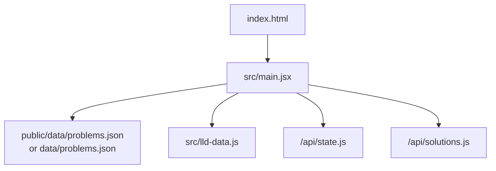
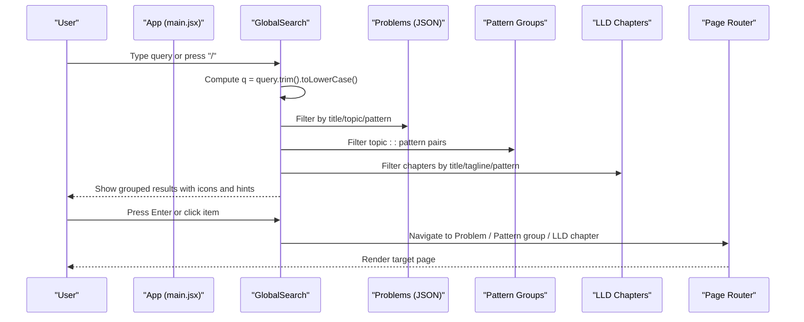
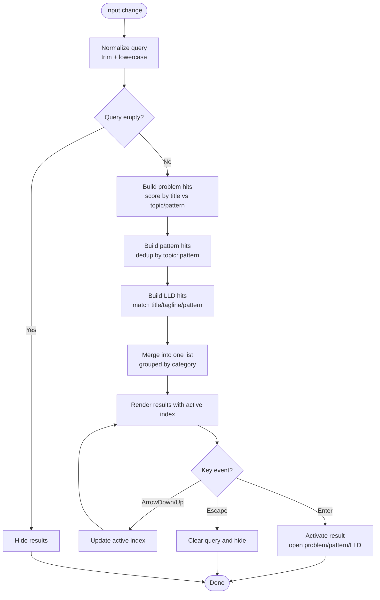
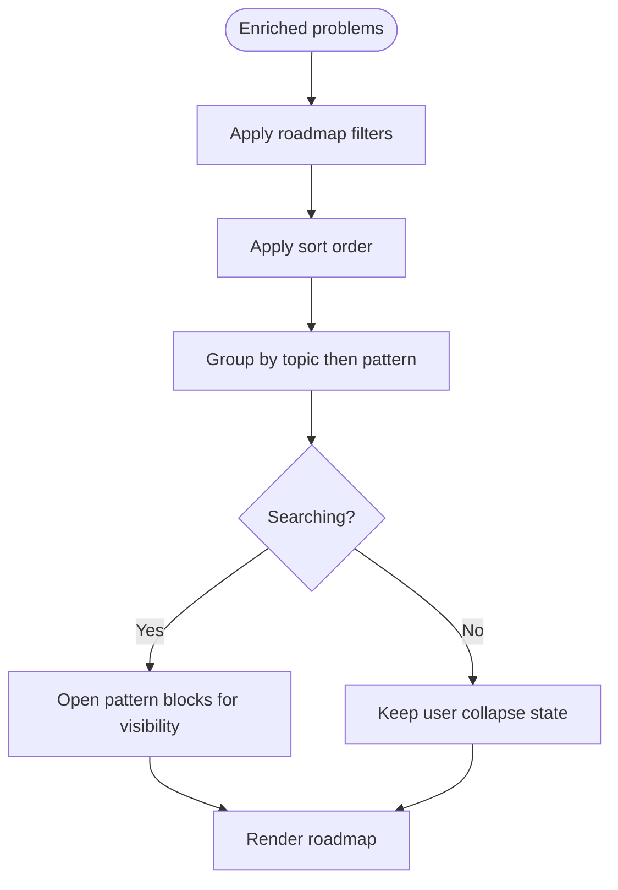
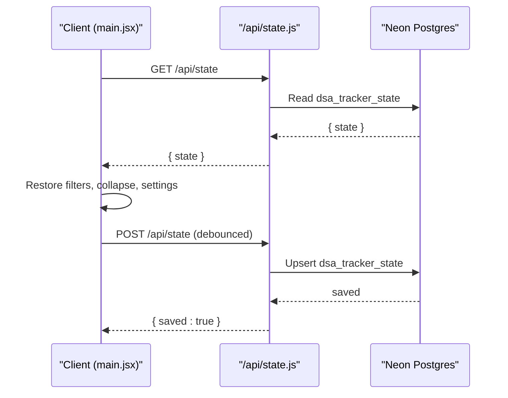
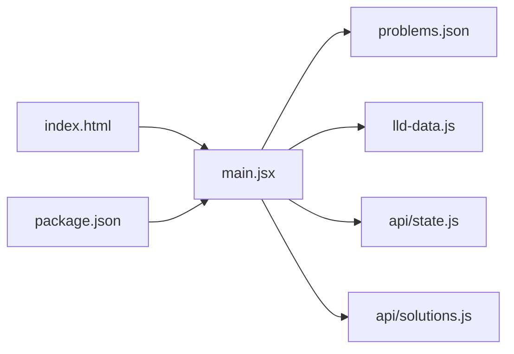

# Global Search System

<cite>
**Referenced Files in This Document**
- [main.jsx](file://src/main.jsx)
- [lld-data.js](file://src/lld-data.js)
- [state.js](file://api/state.js)
- [solutions.js](file://api/solutions.js)
- [problems.json](file://data/problems.json)
- [package.json](file://package.json)
- [index.html](file://index.html)
</cite>

## Table of Contents
1. [Introduction](#introduction)
2. [Project Structure](#project-structure)
3. [Core Components](#core-components)
4. [Architecture Overview](#architecture-overview)
5. [Detailed Component Analysis](#detailed-component-analysis)
6. [Dependency Analysis](#dependency-analysis)
7. [Performance Considerations](#performance-considerations)
8. [Troubleshooting Guide](#troubleshooting-guide)
9. [Conclusion](#conclusion)

## Introduction
This document explains the Global Search System implemented in the DSA Tracker application. The search is a unified, keyboard-friendly interface that lets users quickly find and navigate to:
- Problems (from the A2Z problem set)
- Pattern groups (topic + pattern combinations)
- LLD Lab chapters (low-level design practice modules)

The system is global: it works from any page and returns actionable results rather than only filtering the current view. It also integrates with local state, cloud sync, and the bundled data sources used by the app.

## Project Structure
At a high level:
- The React entry point mounts the app and wires up routing, state, and pages.
- The header contains the GlobalSearch component that composes results across problems, patterns, and LLD chapters.
- Data sources include bundled JSON for problems and LLD chapter metadata.
- Optional cloud sync persists user progress, notes, solutions, activity, settings, filters, collapse states, and solution library counts.

**Diagram sources**
- [index.html:1-3](file://index.html#L1-L3)
- [main.jsx:10-12](file://src/main.jsx#L10-L12)
- [main.jsx:314-331](file://src/main.jsx#L314-L331)
- [state.js:1-67](file://api/state.js#L1-L67)
- [solutions.js:1-68](file://api/solutions.js#L1-L68)

**Section sources**
- [index.html:1-3](file://index.html#L1-L3)
- [package.json:1-21](file://package.json#L1-L21)
- [main.jsx:10-12](file://src/main.jsx#L10-L12)

## Core Components
- GlobalSearch: The central search UI and logic. It listens for keyboard shortcuts, computes results, highlights active items, and navigates to destinations.
- Roadmap filters: A secondary filter layer on the roadmap page that can be combined with or reset independently of the global search.
- Revision and Patterns pages: They also consume the global query to narrow their own lists when relevant.
- Cloud sync: Persists filters and collapse state alongside other user data so search context survives device changes.

Key responsibilities:
- Compute search results from three sources: problems, pattern groups, and LLD chapters.
- Provide keyboard navigation (arrow keys, Enter, Escape).
- Open the correct destination based on result type.
- Persist filters and collapse state via cloud sync when authenticated.

**Section sources**
- [main.jsx:349-428](file://src/main.jsx#L349-L428)
- [main.jsx:256-270](file://src/main.jsx#L256-L270)
- [main.jsx:441-497](file://src/main.jsx#L441-L497)
- [main.jsx:499-500](file://src/main.jsx#L499-L500)
- [main.jsx:524-627](file://src/main.jsx#L524-L627)

## Architecture Overview
The Global Search System composes multiple data sources and routes actions to different parts of the app.

**Diagram sources**
- [main.jsx:349-428](file://src/main.jsx#L349-L428)
- [main.jsx:288-299](file://src/main.jsx#L288-L299)
- [lld-data.js:18-23](file://src/lld-data.js#L18-L23)

## Detailed Component Analysis

### GlobalSearch Component
Responsibilities:
- Focus management: opens on "/" shortcut; closes when clicking outside.
- Result computation: builds a ranked list of problems, pattern groups, and LLD chapters matching the query.
- Keyboard navigation: arrow keys move selection; Enter activates; Escape clears.
- Navigation: dispatches to open a problem, jump to a pattern group, or open an LLD chapter.

Algorithm overview:
- Normalize query to lowercase trimmed string.
- For problems: score matches by title vs. topic/pattern; sort by relevance; limit to top results.
- For patterns: deduplicate by topic::pattern; limit to top results.
- For LLD chapters: match against title, tagline, and pattern; limit to top results.
- Group results by category and mark first-of-group for section headers.

Keyboard interactions:
- "/" focuses input unless already typing in another field.
- ArrowUp/ArrowDown cycles through results.
- Enter activates the currently selected result.
- Escape clears the query and hides results.

Navigation outcomes:
- Problem: opens the problem detail page.
- Pattern: sets roadmap filters to that topic and pattern and switches to roadmap.
- LLD: focuses the specified chapter and switches to LLD lab.

**Diagram sources**
- [main.jsx:349-428](file://src/main.jsx#L349-L428)

**Section sources**
- [main.jsx:349-428](file://src/main.jsx#L349-L428)

### Problem Filtering and Sorting
The roadmap page applies additional filters and sorting that are independent of the global search but can be combined with it. Filters include topic, status, difficulty, pattern, confidence, favorites, and sort order. When searching, pattern sections auto-expand to show all hits, improving discoverability.

**Diagram sources**
- [main.jsx:256-270](file://src/main.jsx#L256-L270)
- [main.jsx:441-497](file://src/main.jsx#L441-L497)

**Section sources**
- [main.jsx:256-270](file://src/main.jsx#L256-L270)
- [main.jsx:441-497](file://src/main.jsx#L441-L497)

### Revision Page Search Integration
The revision page uses the same global query to filter due and upcoming revisions. This allows users to quickly locate specific revision items while keeping the global search consistent across the app.

**Section sources**
- [main.jsx:499-500](file://src/main.jsx#L499-L500)

### Patterns Page Search Integration
The patterns page has its own local search that narrows pattern cards. It also auto-expands cards whose problems match the global query, making cross-page discovery seamless.

**Section sources**
- [main.jsx:524-627](file://src/main.jsx#L524-L627)

### Cloud Sync of Search Context
When signed in, the app synchronizes filters and collapse state along with other user data. This ensures that the last known search context (filters and collapsed sections) is restored on other devices.

**Diagram sources**
- [main.jsx:144-162](file://src/main.jsx#L144-L162)
- [main.jsx:223-236](file://src/main.jsx#L223-L236)
- [state.js:43-66](file://api/state.js#L43-L66)

**Section sources**
- [main.jsx:144-162](file://src/main.jsx#L144-L162)
- [main.jsx:223-236](file://src/main.jsx#L223-L236)
- [state.js:1-67](file://api/state.js#L1-L67)

### Solution Library Sync
The app also syncs a built-in solution library to the cloud. It compares the number of approaches locally versus in the cloud and pushes or pulls accordingly. This is separate from the global search but shares the same authentication and persistence layer.

**Section sources**
- [main.jsx:182-214](file://src/main.jsx#L182-L214)
- [solutions.js:1-68](file://api/solutions.js#L1-L68)

## Dependency Analysis
- main.jsx depends on:
  - Bundled problem data (JSON)
  - LLD chapter metadata (module)
  - Cloud APIs (/api/state.js, /api/solutions.js)
  - Local storage for offline state
- lld-data.js provides chapter definitions consumed by the search to return LLD results.
- package.json defines scripts and dependencies for building and running the app.
- index.html mounts the React root and loads the entry module.

**Diagram sources**
- [main.jsx:10-12](file://src/main.jsx#L10-L12)
- [main.jsx:314-331](file://src/main.jsx#L314-L331)
- [lld-data.js:18-23](file://src/lld-data.js#L18-L23)
- [state.js:1-67](file://api/state.js#L1-L67)
- [solutions.js:1-68](file://api/solutions.js#L1-L68)
- [index.html:1-3](file://index.html#L1-L3)
- [package.json:1-21](file://package.json#L1-L21)

**Section sources**
- [main.jsx:10-12](file://src/main.jsx#L10-L12)
- [lld-data.js:18-23](file://src/lld-data.js#L18-L23)
- [state.js:1-67](file://api/state.js#L1-L67)
- [solutions.js:1-68](file://api/solutions.js#L1-L68)
- [index.html:1-3](file://index.html#L1-L3)
- [package.json:1-21](file://package.json#L1-L21)

## Performance Considerations
- Memoization: Results are computed with memoized callbacks to avoid unnecessary re-renders during typing.
- Bounded result sets: Each category limits the number of returned results to keep the UI responsive.
- Debounced sync: Cloud saves are debounced to reduce network requests while typing or editing.
- Lightweight filtering: Searches use simple substring matching on small datasets; this remains fast for the problem set size.
- Collapse behavior: On roadmap, pattern sections expand automatically when searching to ensure hits are visible without extra clicks.

[No sources needed since this section provides general guidance]

## Troubleshooting Guide
Common issues and resolutions:
- Search appears inactive on some pages: The global search always shows results; if you expected a page-specific filter, check the roadmap filters or the page’s own search input.
- No results found: Ensure your query matches at least one of title, topic, pattern, or LLD chapter fields. Try shorter keywords.
- Cloud sync not saving filters: Verify you are signed in and that the database URL is configured. Check browser console for errors and confirm the session cookie exists.
- Storage unavailable: If localStorage fails, the app will prompt to export a backup from Settings. Use the export/import feature to recover data.

**Section sources**
- [main.jsx:32-55](file://src/main.jsx#L32-L55)
- [main.jsx:237-242](file://src/main.jsx#L237-L242)
- [state.js:43-66](file://api/state.js#L43-L66)

## Conclusion
The Global Search System provides a fast, accessible way to navigate across problems, patterns, and LLD chapters. It integrates seamlessly with the roadmap filters, revision queue, and patterns page, while preserving search context via cloud sync. Its keyboard-first design and grouped results make it efficient for daily study workflows.

[No sources needed since this section summarizes without analyzing specific files]