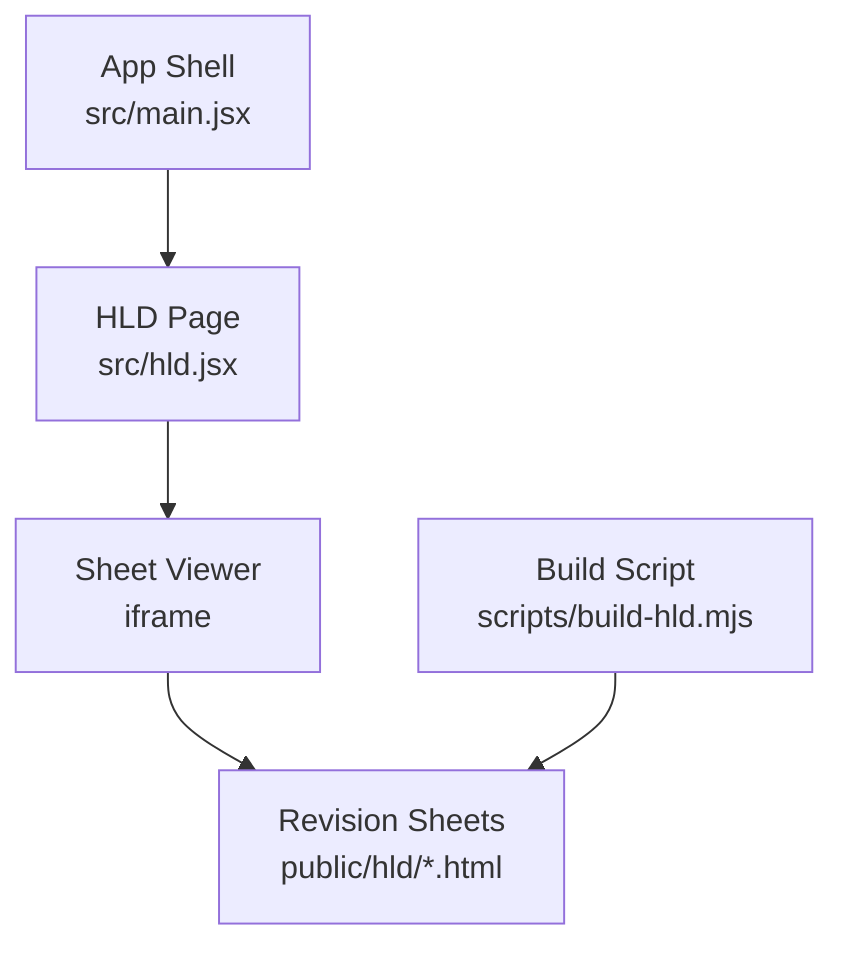
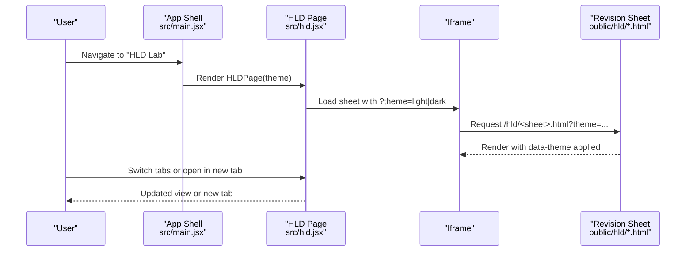
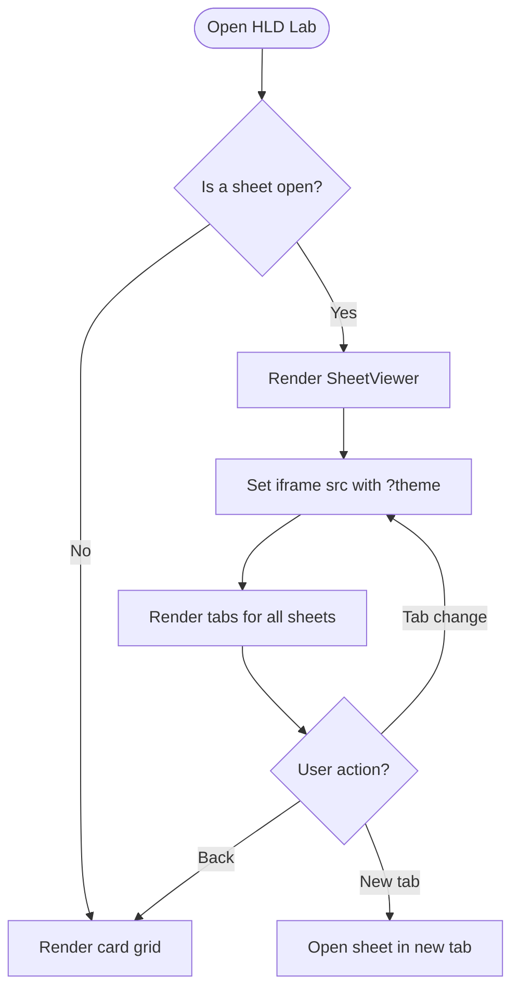
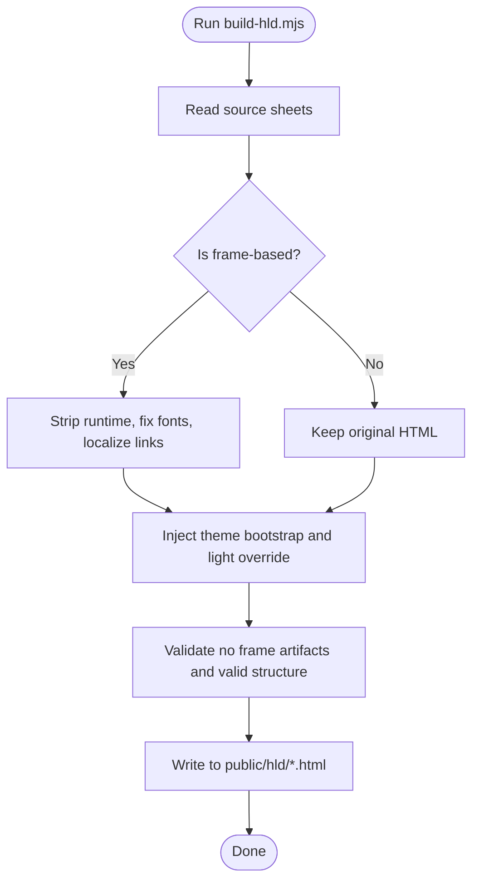
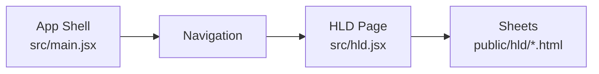
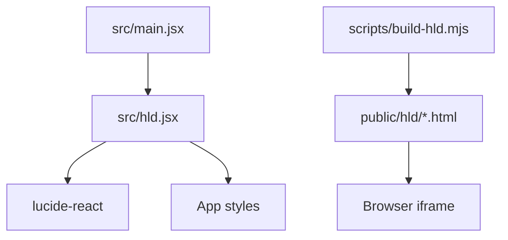

# HLD Lab Component

<cite>
**Referenced Files in This Document**
- [src/hld.jsx](file://src/hld.jsx)
- [scripts/build-hld.mjs](file://scripts/build-hld.mjs)
- [public/hld/rider-matching.html](file://public/hld/rider-matching.html)
- [public/hld/notification-system.html](file://public/hld/notification-system.html)
- [public/hld/job-scheduler.html](file://public/hld/job-scheduler.html)
- [src/main.jsx](file://src/main.jsx)
- [api/_session.js](file://api/_session.js)
- [api/auth.js](file://api/auth.js)
- [api/state.js](file://api/state.js)
- [api/solutions.js](file://api/solutions.js)
- [package.json](file://package.json)
- [README.md](file://README.md)
</cite>

## Table of Contents
1. [Introduction](#introduction)
2. [Project Structure](#project-structure)
3. [Core Components](#core-components)
4. [Architecture Overview](#architecture-overview)
5. [Detailed Component Analysis](#detailed-component-analysis)
6. [Dependency Analysis](#dependency-analysis)
7. [Performance Considerations](#performance-considerations)
8. [Troubleshooting Guide](#troubleshooting-guide)
9. [Conclusion](#conclusion)

## Introduction
The HLD Lab is a dedicated section within the DSA Tracker application that presents high-level design revision sheets for production-scale systems. It embeds standalone HTML revision sheets and provides a consistent UI with theme support, navigation, and an “open in new tab” option. The sheets cover three system designs: Rider Matching (H3 + Redis), Multi-Channel Notification System, and Distributed Job Scheduler.

The feature integrates into the main app shell, is served from static HTML files generated by a build script, and can be viewed both inside the app and directly in a browser.

**Section sources**
- [src/hld.jsx:1-86](file://src/hld.jsx#L1-L86)
- [scripts/build-hld.mjs:1-79](file://scripts/build-hld.mjs#L1-L79)
- [README.md:1-59](file://README.md#L1-L59)

## Project Structure
The HLD Lab consists of:
- A React component that lists and displays revision sheets via iframes.
- A Node build script that prepares self-contained HTML sheets from saved resources and injects theme support.
- Static HTML sheets under public/hld/ that are embedded in the app.
- Integration points in the main app to render the HLD page and pass theme context.

**Diagram sources**
- [src/main.jsx:317-328](file://src/main.jsx#L317-L328)
- [src/hld.jsx:41-86](file://src/hld.jsx#L41-L86)
- [scripts/build-hld.mjs:14-79](file://scripts/build-hld.mjs#L14-L79)

**Section sources**
- [src/hld.jsx:9-37](file://src/hld.jsx#L9-L37)
- [scripts/build-hld.mjs:19-35](file://scripts/build-hld.mjs#L19-L35)
- [public/hld/rider-matching.html:1-20](file://public/hld/rider-matching.html#L1-L20)
- [public/hld/notification-system.html:1-20](file://public/hld/notification-system.html#L1-L20)
- [public/hld/job-scheduler.html:1-20](file://public/hld/job-scheduler.html#L1-L20)

## Core Components
- HLD Page: Renders a hero header and either a card grid or an active sheet viewer. It maintains which sheet is open and passes theme to each sheet via URL query parameter.
- Sheet Viewer: Embeds the selected sheet in an iframe, adds tabs to switch between sheets, and exposes an “open in new tab” link.
- Build Script: Cleans frame artifacts, restores fonts, localizes links, and injects a small bootstrap script to honor ?theme=light|dark on the sheet.

Key behaviors:
- Theme propagation: The viewer appends ?theme=... to the sheet URL; sheets read it and set data-theme on the document element.
- Navigation: Tabs allow switching sheets without leaving the viewer; back button returns to the card grid.
- Accessibility: Each sheet has a descriptive title attribute for the iframe.

**Section sources**
- [src/hld.jsx:41-86](file://src/hld.jsx#L41-L86)
- [scripts/build-hld.mjs:37-46](file://scripts/build-hld.mjs#L37-L46)
- [public/hld/rider-matching.html:10-11](file://public/hld/rider-matching.html#L10-L11)
- [public/hld/notification-system.html:10-11](file://public/hld/notification-system.html#L10-L11)
- [public/hld/job-scheduler.html:10-11](file://public/hld/job-scheduler.html#L10-L11)

## Architecture Overview
At runtime, the app shell renders the HLD page when the user navigates to the HLD Lab. The HLD page loads one of three revision sheets as an iframe. The sheets are static assets built by scripts/build-hld.mjs, ensuring they are self-contained and theme-aware.

**Diagram sources**
- [src/main.jsx:317-328](file://src/main.jsx#L317-L328)
- [src/hld.jsx:41-86](file://src/hld.jsx#L41-L86)
- [public/hld/rider-matching.html:10-11](file://public/hld/rider-matching.html#L10-L11)

## Detailed Component Analysis

### HLD Page and Sheet Viewer
Responsibilities:
- Maintain state for the currently open sheet.
- Present cards for each system design with metadata (title, tagline, sections count, chips).
- Provide a toolbar with back navigation, tabs, and external link.
- Pass theme to sheets via URL query parameter.

Data model:
- A constant array defines each sheet’s id, file path, icon, title, tagline, sections list, and tags.

Rendering logic:
- If no sheet is open, show a grid of cards.
- If a sheet is open, show the viewer with the iframe and tabs.

**Diagram sources**
- [src/hld.jsx:41-86](file://src/hld.jsx#L41-L86)

**Section sources**
- [src/hld.jsx:9-37](file://src/hld.jsx#L9-L37)
- [src/hld.jsx:41-86](file://src/hld.jsx#L41-L86)

### Build Script: Preparing Revision Sheets
Purpose:
- Convert saved Claude frame documents into clean, self-contained HTML sheets.
- Strip frame runtime artifacts and localize links.
- Inject a small script to honor ?theme=light|dark.
- Ensure required structure (DOCTYPE, head, body) and validate outputs.

Process:
- For frame-based sheets: extract content starting at viewport meta, remove frame-runtime markers, restore Google Fonts link, and rewrite frame URLs to anchors.
- For non-frame sheets: copy as-is.
- Add theme bootstrap and light-mode override block.
- Validate no leftover frame references and balanced tags before writing output.

**Diagram sources**
- [scripts/build-hld.mjs:19-79](file://scripts/build-hld.mjs#L19-L79)

**Section sources**
- [scripts/build-hld.mjs:1-79](file://scripts/build-hld.mjs#L1-L79)

### Revision Sheets Content
Each sheet is a complete, styled HTML document with:
- A hero section introducing the system design problem and key metrics.
- Sections covering requirements, architecture, data models, reliability/scaling, capacity planning, alternatives, and interview playbooks.
- Inline SVG diagrams and tables to illustrate components, flows, and trade-offs.
- Theme support via CSS variables and a small bootstrap script that reads ?theme.

Examples:
- Rider Matching: Focuses on geospatial indexing, Redis structures, matching algorithm, consistency, and edge cases.
- Notification System: Covers multi-channel delivery, at-least-once guarantees, rate limiting, and disaster recovery.
- Job Scheduler: Details timing wheels, leases, due-job queries, sharding, partitioning, tiered storage, and fault tolerance.

**Section sources**
- [public/hld/rider-matching.html:1-200](file://public/hld/rider-matching.html#L1-L200)
- [public/hld/notification-system.html:1-200](file://public/hld/notification-system.html#L1-L200)
- [public/hld/job-scheduler.html:1-200](file://public/hld/job-scheduler.html#L1-L200)

### App Integration
The main app includes the HLD page alongside other features like Dashboard, Roadmap, LLD Lab, Patterns, Analytics, and Settings. When the user selects “HLD Lab,” the app renders HLDPage and passes the current theme setting so sheets match the app’s dark/light mode.

**Diagram sources**
- [src/main.jsx:317-328](file://src/main.jsx#L317-L328)
- [src/hld.jsx:70-86](file://src/hld.jsx#L70-L86)

**Section sources**
- [src/main.jsx:317-328](file://src/main.jsx#L317-L328)

## Dependency Analysis
- Frontend dependencies:
  - React components in src/hld.jsx depend on lucide-react icons and CSS classes defined elsewhere in the app.
  - The app shell imports and renders HLDPage based on routing state.
- Build-time dependencies:
  - scripts/build-hld.mjs uses Node fs/promises and path modules to generate static assets.
- Runtime assets:
  - public/hld/*.html are served as static files and embedded via iframes.
- Optional cloud sync:
  - API routes handle authentication and state synchronization for other features; HLD sheets themselves are static and do not call APIs.

**Diagram sources**
- [src/hld.jsx:1-3](file://src/hld.jsx#L1-L3)
- [src/main.jsx:317-328](file://src/main.jsx#L317-L328)
- [scripts/build-hld.mjs:10-14](file://scripts/build-hld.mjs#L10-L14)

**Section sources**
- [package.json:12-18](file://package.json#L12-L18)
- [src/hld.jsx:1-3](file://src/hld.jsx#L1-L3)
- [scripts/build-hld.mjs:10-14](file://scripts/build-hld.mjs#L10-L14)

## Performance Considerations
- Lazy loading: The iframe uses lazy loading to defer off-screen sheet content until needed.
- Static assets: Sheets are prebuilt and cached; no runtime generation overhead.
- Theme injection: Minimal JS in each sheet sets data-theme once on load.
- Avoid heavy DOM work: The viewer only manages simple state (active sheet ID) and does not parse or mutate sheet content.

[No sources needed since this section provides general guidance]

## Troubleshooting Guide
Common issues and resolutions:
- Sheets do not reflect app theme:
  - Ensure the viewer appends ?theme=light|dark to the iframe src.
  - Verify the sheet contains the theme bootstrap script and CSS variable overrides.
- Build output missing or malformed:
  - Re-run the build script to regenerate public/hld/*.html.
  - Confirm source files exist and contain required structure (viewport meta, DOCTYPE, closing body tag).
- Iframe fails to load:
  - Check that the server serves /hld/*.html correctly.
  - Validate that no frame runtime artifacts remain in the generated sheets.

Operational notes:
- Cloud sync endpoints require environment variables and session cookies; these are unrelated to HLD sheets but may affect overall app behavior.

**Section sources**
- [scripts/build-hld.mjs:37-79](file://scripts/build-hld.mjs#L37-L79)
- [public/hld/rider-matching.html:10-11](file://public/hld/rider-matching.html#L10-L11)
- [public/hld/notification-system.html:10-11](file://public/hld/notification-system.html#L10-L11)
- [public/hld/job-scheduler.html:10-11](file://public/hld/job-scheduler.html#L10-L11)
- [api/_session.js:1-60](file://api/_session.js#L1-L60)
- [api/auth.js:1-30](file://api/auth.js#L1-L30)
- [api/state.js:1-67](file://api/state.js#L1-L67)
- [api/solutions.js:1-68](file://api/solutions.js#L1-L68)

## Conclusion
The HLD Lab provides a focused, interview-grade presentation of high-level system designs through embedded, theme-aware revision sheets. Its lightweight React wrapper and robust build pipeline ensure reliable rendering and easy maintenance. The included sheets cover realistic production concerns—capacity planning, data modeling, consistency, scaling, and failure handling—making them valuable study and reference material.

[No sources needed since this section summarizes without analyzing specific files]