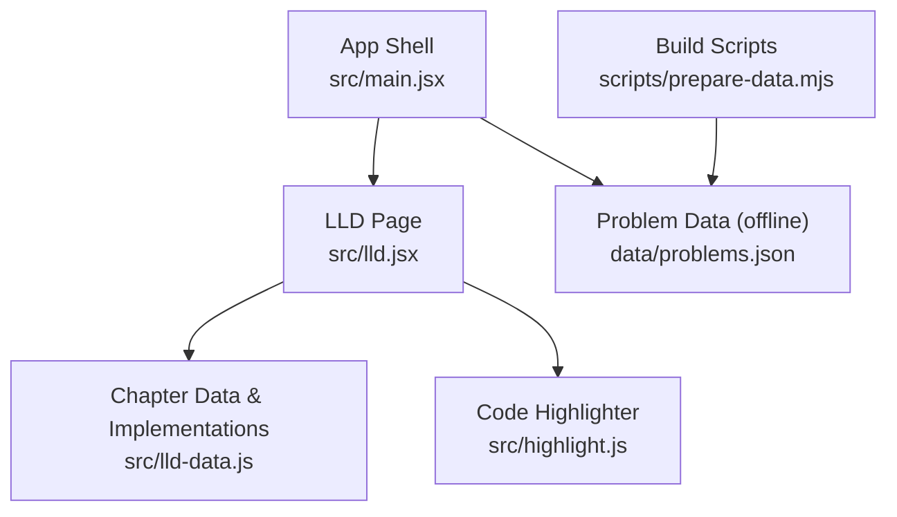
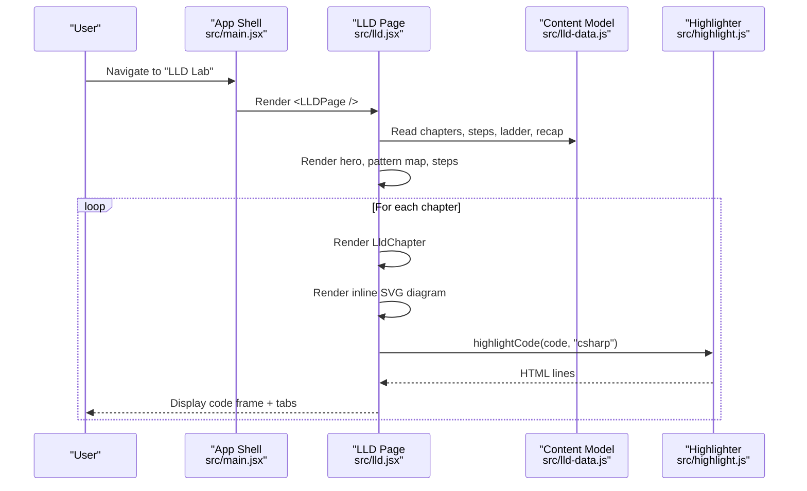
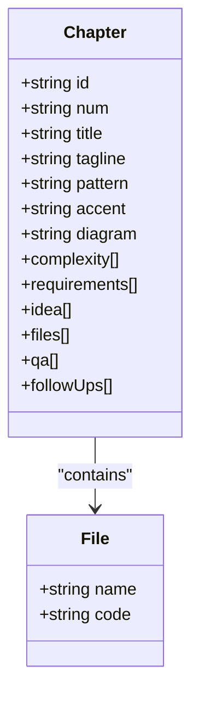
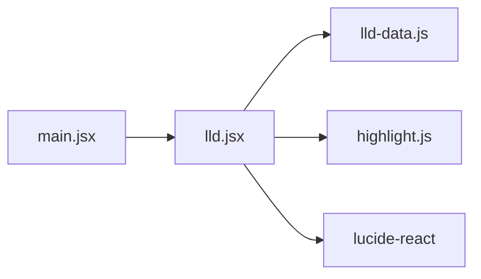

# LLD Lab Component

<cite>
**Referenced Files in This Document**
- [README.md](file://README.md)
- [package.json](file://package.json)
- [src/main.jsx](file://src/main.jsx)
- [src/lld.jsx](file://src/lld.jsx)
- [src/lld-data.js](file://src/lld-data.js)
- [src/highlight.js](file://src/highlight.js)
- [scripts/prepare-data.mjs](file://scripts/prepare-data.mjs)
- [data/problems.json](file://data/problems.json)
</cite>

## Table of Contents
1. [Introduction](#introduction)
2. [Project Structure](#project-structure)
3. [Core Components](#core-components)
4. [Architecture Overview](#architecture-overview)
5. [Detailed Component Analysis](#detailed-component-analysis)
6. [Dependency Analysis](#dependency-analysis)
7. [Performance Considerations](#performance-considerations)
8. [Troubleshooting Guide](#troubleshooting-guide)
9. [Conclusion](#conclusion)

## Introduction
This document explains the Low-Level Design (LLD) Lab component embedded in a local-first React/Vite application that tracks DSA practice progress. The LLD Lab presents four canonical system designs with diagrams, requirements, complexity contracts, interview questions, follow-ups, and complete C# implementations: LRU Cache, Vending Machine, Parking Lot, and Elevator System. It is integrated into the main app as a page and shares code highlighting utilities with the rest of the app.

The project runs fully offline for development and builds; cloud sync is optional and configured via environment variables when deployed to Vercel with a Neon Postgres database.

**Section sources**
- [README.md:1-59](file://README.md#L1-L59)
- [package.json:1-21](file://package.json#L1-L21)

## Project Structure
The LLD Lab lives under src/ and is rendered by the main application shell. Data for the lab content is centralized in a single module, while rendering logic is split across components and helper utilities.

**Diagram sources**
- [src/main.jsx:1-10](file://src/main.jsx#L1-L10)
- [src/lld.jsx:1-10](file://src/lld.jsx#L1-L10)
- [src/lld-data.js:1-10](file://src/lld-data.js#L1-L10)
- [src/highlight.js:1-10](file://src/highlight.js#L1-L10)
- [scripts/prepare-data.mjs:1-10](file://scripts/prepare-data.mjs#L1-L10)
- [data/problems.json:1-10](file://data/problems.json#L1-L10)

**Section sources**
- [src/main.jsx:1-10](file://src/main.jsx#L1-L10)
- [src/lld.jsx:1-10](file://src/lld.jsx#L1-L10)
- [src/lld-data.js:1-10](file://src/lld-data.js#L1-L10)
- [src/highlight.js:1-10](file://src/highlight.js#L1-L10)
- [scripts/prepare-data.mjs:1-10](file://scripts/prepare-data.mjs#L1-L10)
- [data/problems.json:1-10](file://data/problems.json#L1-L10)

## Core Components
- LLDPage: Top-level page that renders hero text, pattern map, run order steps, chapters, maturity ladder, and recap cards.
- LldChapter: Collapsible chapter card per design with requirements, complexity contract, idea, diagram, implementation tabs, Q&A, and follow-ups.
- Diagrams: Inline SVG diagrams for LRU Cache, Vending Machine, Parking Lot, and Elevator System.
- Code frames: Syntax-highlighted C# code blocks with copy-to-clipboard.
- Data model: Centralized arrays/objects defining chapters, patterns, steps, ladder, and recap cards.

Key responsibilities:
- Present structured learning material for each design.
- Render interactive diagrams and code samples.
- Provide interview-focused guidance and extension prompts.

**Section sources**
- [src/lld.jsx:204-298](file://src/lld.jsx#L204-L298)
- [src/lld-data.js:4-800](file://src/lld-data.js#L4-L800)

## Architecture Overview
The LLD Lab integrates into the main app through a dedicated route/page. The data-driven approach keeps content decoupled from UI logic, enabling easy updates to chapters and implementations without touching rendering code.

**Diagram sources**
- [src/main.jsx:294-308](file://src/main.jsx#L294-L308)
- [src/lld.jsx:257-298](file://src/lld.jsx#L257-L298)
- [src/lld-data.js:4-800](file://src/lld-data.js#L4-L800)
- [src/highlight.js:6-32](file://src/highlight.js#L6-L32)

## Detailed Component Analysis

### LLDPage
- Renders a hero section describing the scope of the lab.
- Displays a pattern map table mapping problems to skills.
- Shows a recommended workflow for running an LLD round.
- Iterates over chapters to render collapsible sections.
- Includes a maturity ladder and one-line recap cards.

Implementation highlights:
- Uses state to track open chapters.
- Delegates chapter rendering to LldChapter.
- Integrates shared icons and styling classes.

**Section sources**
- [src/lld.jsx:257-298](file://src/lld.jsx#L257-L298)

### LldChapter
- Presents requirements, complexity contract, design idea, diagram, completed C# implementation tabs, interview Q&A, and follow-up prompts.
- Manages active tab selection for multi-file implementations.
- Renders a custom code frame with syntax highlighting and copy button.

Behavioral notes:
- Each chapter defines its own accent color and associated diagram type.
- Complexity contract is displayed as a small grid.
- Follow-ups encourage deeper exploration beyond the happy path.

**Section sources**
- [src/lld.jsx:204-253](file://src/lld.jsx#L204-L253)

### Diagrams
- LruDiagram: Visualizes dictionary-to-doubly-linked-list composition, recency ordering, and eviction at tail.
- VendingDiagram: State machine transitions between IDLE, HAS_MONEY, PRODUCT_SELECTED, DISPENSING with cancel flows.
- ParkingDiagram: Composition tree (ParkingLot → Floors → Spots), vehicle hierarchy, and injected strategies for allocation and pricing.
- ElevatorDiagram: Controller-to-cars assignment, elevator state cycle, and SCAN scheduling visualization.

These are pure presentational components returning SVG elements with theme-aware CSS classes.

**Section sources**
- [src/lld.jsx:28-194](file://src/lld.jsx#L28-L194)

### Code Frames and Highlighting
- LldCode wraps highlighted C# code with line numbers and a copy button.
- highlightCode tokenizes Java/C# source using regex-based rules and keyword sets, producing HTML spans for syntax classes.

Usage:
- LldChapter passes file name and code to LldCode.
- highlightCode is invoked per code block with language "csharp".

**Section sources**
- [src/lld.jsx:8-21](file://src/lld.jsx#L8-L21)
- [src/highlight.js:1-33](file://src/highlight.js#L1-L33)

### Content Model (Chapters, Steps, Patterns, Ladder, Recap)
- LLD_CHAPTERS: Array of chapter objects containing id, title, tagline, pattern, accent, diagram key, complexity matrix, requirements, idea paragraphs, files (name/code), qa pairs, and follow-ups.
- LLD_STEPS: Ordered steps for conducting an LLD round.
- LLD_PATTERN_TABLE: Mapping of problem to main concept and what it proves.
- LLD_LADDER: Maturity levels to memorize in order.
- LLD_RECAP_CARDS: One-line summaries per topic.
- LLD_FOLLOWUP_PROMPTS: Suggested advanced prompts for senior interviews.

This data-driven structure allows content updates without changing UI code.

**Section sources**
- [src/lld-data.js:4-800](file://src/lld-data.js#L4-L800)

#### Class-like Relationships in Chapter Data

**Diagram sources**
- [src/lld-data.js:4-800](file://src/lld-data.js#L4-L800)

## Dependency Analysis
- LLDPage depends on lld-data.js for all content and uses lucide-react icons.
- LldChapter depends on lld.jsx internal helpers and highlight.js for code rendering.
- Diagrams are self-contained within lld.jsx and styled via CSS classes.
- The main app mounts LLDPage as a page and shares highlight.js across solutions and LLD.

**Diagram sources**
- [src/main.jsx:1-10](file://src/main.jsx#L1-L10)
- [src/lld.jsx:1-10](file://src/lld.jsx#L1-L10)
- [src/lld-data.js:1-10](file://src/lld-data.js#L1-L10)
- [src/highlight.js:1-10](file://src/highlight.js#L1-L10)

**Section sources**
- [src/main.jsx:1-10](file://src/main.jsx#L1-L10)
- [src/lld.jsx:1-10](file://src/lld.jsx#L1-L10)
- [src/lld-data.js:1-10](file://src/lld-data.js#L1-L10)
- [src/highlight.js:1-10](file://src/highlight.js#L1-L10)

## Performance Considerations
- Rendering cost: Each chapter includes multiple SVG diagrams and code blocks. Use lazy expansion (already implemented via collapsible chapters) to minimize initial render work.
- Code highlighting: Tokenization runs per code block; consider memoizing large outputs if chapters grow significantly.
- Memory: Large datasets in lld-data.js increase bundle size; keep only necessary chapters or paginate if needed.
- Clipboard operations: Copy-to-clipboard is lightweight but should be guarded against unsupported environments.

[No sources needed since this section provides general guidance]

## Troubleshooting Guide
Common issues and resolutions:
- Code not highlighting: Ensure highlightCode receives a valid string and language ("csharp"). Check console for empty inputs.
- Diagrams not visible: Verify CSS classes exist and theme styles are loaded; ensure SVG viewBox values match layout expectations.
- Tabs not switching: Confirm chapter.files array has unique names and activeFile state is managed correctly.
- Copy button not working: Some browsers restrict clipboard access; ensure user gesture context and HTTPS if applicable.

If you need to extend the LLD content:
- Add new chapters by appending to LLD_CHAPTERS in lld-data.js with required fields (id, files[], diagram, etc.).
- Register a new diagram function and add it to LLD_DIAGRAMS and captions.

**Section sources**
- [src/lld.jsx:8-21](file://src/lld.jsx#L8-L21)
- [src/lld.jsx:28-194](file://src/lld.jsx#L28-L194)
- [src/lld.jsx:204-253](file://src/lld.jsx#L204-L253)
- [src/lld-data.js:4-800](file://src/lld-data.js#L4-L800)

## Conclusion
The LLD Lab component delivers a structured, data-driven learning experience for four classic low-level design problems. Its separation of content and presentation, combined with rich diagrams and complete C# implementations, supports both interview preparation and practical design skills. The integration with the main app ensures consistent UX and shared utilities like syntax highlighting. Future enhancements can include additional chapters, richer interactivity, and exportable study materials.

[No sources needed since this section summarizes without analyzing specific files]