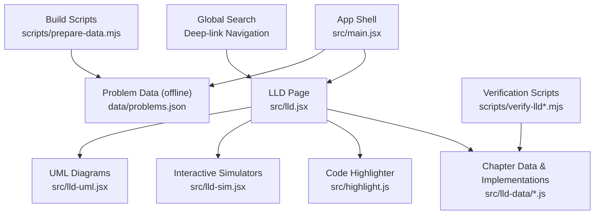
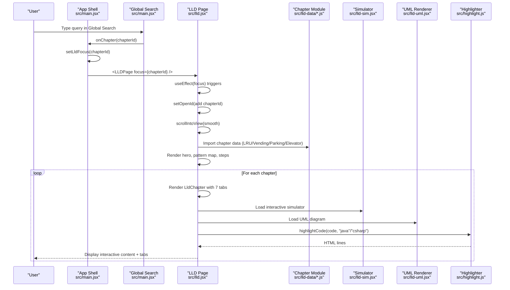
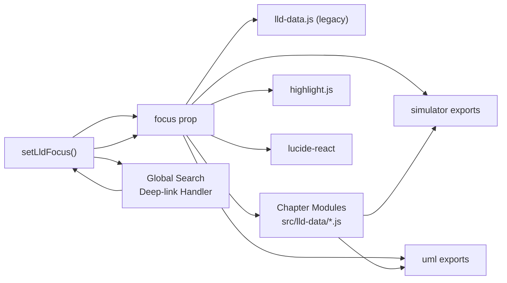

# LLD Lab Component

<cite>
**Referenced Files in This Document**
- [README.md](file://README.md)
- [package.json](file://package.json)
- [src/main.jsx](file://src/main.jsx)
- [src/lld.jsx](file://src/lld.jsx)
- [src/lld-data.js](file://src/lld-data.js)
- [src/highlight.js](file://src/highlight.js)
- [src/lld-sim.jsx](file://src/lld-sim.jsx)
- [src/lld-uml.jsx](file://src/lld-uml.jsx)
- [src/lld-data/lru-cache.js](file://src/lld-data/lru-cache.js)
- [src/lld-data/vending-machine.js](file://src/lld-data/vending-machine.js)
- [src/lld-data/parking-lot.js](file://src/lld-data/parking-lot.js)
- [src/lld-data/elevator-system.js](file://src/lld-data/elevator-system.js)
- [scripts/prepare-data.mjs](file://scripts/prepare-data.mjs)
- [data/problems.json](file://data/problems.json)
</cite>

## Update Summary
**Changes Made**
- Enhanced LLDPage component with focus management capabilities for deep-linked chapter navigation
- Integrated seamless transitions between global search results and specific LLD content
- Added smooth scrolling and automatic chapter expansion when navigating from search
- Updated main application state management to handle LLD focus prop passing
- Maintained backward compatibility with existing seven-tab layout system

## Table of Contents
1. [Introduction](#introduction)
2. [Project Structure](#project-structure)
3. [Core Components](#core-components)
4. [Architecture Overview](#architecture-overview)
5. [Detailed Component Analysis](#detailed-component-analysis)
6. [Modular Data Architecture](#modular-data-architecture)
7. [Interactive Simulators](#interactive-simulators)
8. [Enhanced Interview Preparation](#enhanced-interview-preparation)
9. [Verification Infrastructure](#verification-infrastructure)
10. [Dependency Analysis](#dependency-analysis)
11. [Performance Considerations](#performance-considerations)
12. [Troubleshooting Guide](#troubleshooting-guide)
13. [Conclusion](#conclusion)

## Introduction
This document explains the Low-Level Design (LLD) Lab component embedded in a local-first React/Vite application that tracks DSA practice progress. The LLD Lab presents four canonical system designs with diagrams, requirements, complexity contracts, interview questions, follow-ups, and complete C# implementations: LRU Cache, Vending Machine, Parking Lot, and Elevator System. 

The component has undergone a major architectural transformation from a monolithic structure to a modular architecture with separate chapter files, enhanced seven-tab layout system, interactive animated simulators, comprehensive verification infrastructure, and **advanced focus management capabilities for deep-linked navigation**. It is integrated into the main app as a page and shares code highlighting utilities with the rest of the app.

The project runs fully offline for development and builds; cloud sync is optional and configured via environment variables when deployed to Vercel with a Neon Postgres database.

**Section sources**
- [README.md:1-59](file://README.md#L1-L59)
- [package.json:1-21](file://package.json#L1-L21)

## Project Structure
The LLD Lab lives under src/ and is rendered by the main application shell. The architecture has been completely restructured from a single monolithic data file to a modular approach with separate chapter modules, while rendering logic remains split across components and helper utilities.



**Diagram sources**
- [src/main.jsx:1-10](file://src/main.jsx#L1-L10)
- [src/lld.jsx:1-10](file://src/lld.jsx#L1-L10)
- [src/lld-data/lru-cache.js:1-10](file://src/lld-data/lru-cache.js#L1-L10)
- [src/lld-data/vending-machine.js:1-10](file://src/lld-data/vending-machine.js#L1-L10)
- [src/lld-data/parking-lot.js:1-10](file://src/lld-data/parking-lot.js#L1-L10)
- [src/lld-data/elevator-system.js:1-10](file://src/lld-data/elevator-system.js#L1-L10)
- [src/lld-sim.jsx:1-10](file://src/lld-sim.jsx#L1-L10)
- [src/lld-uml.jsx:1-10](file://src/lld-uml.jsx#L1-L10)

**Section sources**
- [src/main.jsx:1-10](file://src/main.jsx#L1-L10)
- [src/lld.jsx:1-10](file://src/lld.jsx#L1-L10)
- [src/lld-data/lru-cache.js:1-10](file://src/lld-data/lru-cache.js#L1-L10)
- [src/lld-data/vending-machine.js:1-10](file://src/lld-data/vending-machine.js#L1-L10)
- [src/lld-data/parking-lot.js:1-10](file://src/lld-data/parking-lot.js#L1-L10)
- [src/lld-data/elevator-system.js:1-10](file://src/lld-data/elevator-system.js#L1-L10)
- [src/lld-sim.jsx:1-10](file://src/lld-sim.jsx#L1-L10)
- [src/lld-uml.jsx:1-10](file://src/lld-uml.jsx#L1-L10)

## Core Components
- **LLDPage**: Top-level page that renders hero text, pattern map, run order steps, chapters, maturity ladder, and recap cards with enhanced seven-tab navigation and **focus management for deep-linked navigation**.
- **LldChapter**: Collapsible chapter card per design with requirements, complexity contract, idea, diagram, implementation tabs, Q&A, and follow-ups. Now supports interactive simulators, UML diagrams, and **smooth scroll-to-target functionality**.
- **Interactive Simulators**: Animated step-through simulations for each algorithm that demonstrate real-time behavior and state transitions.
- **UML Diagrams**: Data-driven class diagrams with theme-aware styling and animation on reveal.
- **Code frames**: Syntax-highlighted Java/C# code blocks with copy-to-clipboard functionality.
- **Data model**: Modular arrays/objects defining chapters, patterns, steps, ladder, and recap cards across separate chapter files.

Key responsibilities:
- Present structured learning material for each design with enhanced interactivity.
- Render interactive diagrams, animations, and code samples.
- Provide SDE-2 level interview-focused guidance and extension prompts.
- Support both Java and C# implementations with language switching.
- **Handle deep-linked navigation from global search with automatic chapter expansion and smooth scrolling**.

**Section sources**
- [src/lld.jsx:204-376](file://src/lld.jsx#L204-L376)
- [src/lld-sim.jsx:1-945](file://src/lld-sim.jsx#L1-L945)
- [src/lld-uml.jsx:1-271](file://src/lld-uml.jsx#L1-L271)

## Architecture Overview
The LLD Lab integrates into the main app through a dedicated route/page with a completely restructured modular architecture. The data-driven approach keeps content decoupled from UI logic, enabling easy updates to chapters and implementations without touching rendering code. Each chapter now has its own dedicated module with comprehensive content including requirements, patterns, decisions, concurrency considerations, and complete implementations.



**Diagram sources**
- [src/main.jsx:294-308](file://src/main.jsx#L294-L308)
- [src/main.jsx:324](file://src/main.jsx#L324)
- [src/lld.jsx:327-336](file://src/lld.jsx#L327-L336)
- [src/lld.jsx:257-376](file://src/lld.jsx#L257-L376)
- [src/lld-data/lru-cache.js:4-553](file://src/lld-data/lru-cache.js#L4-L553)
- [src/lld-sim.jsx:1-945](file://src/lld-sim.jsx#L1-L945)
- [src/lld-uml.jsx:1-271](file://src/lld-uml.jsx#L1-L271)
- [src/highlight.js:6-32](file://src/highlight.js#L6-L32)

## Detailed Component Analysis

### LLDPage
- Renders a hero section describing the scope of the lab with enhanced SDE-2 focus.
- Displays a pattern map table mapping problems to skills.
- Shows a recommended workflow for running an LLD round.
- Iterates over chapters to render collapsible sections with seven-tab navigation.
- Includes a maturity ladder and one-line recap cards.
- **Handles deep-linked navigation via focus prop for seamless search-to-content transitions**.

Implementation highlights:
- Uses state to track open chapters and active tab selection.
- Delegates chapter rendering to LldChapter with enhanced capabilities.
- Integrates shared icons and styling classes.
- Supports language switching between Java and C#.
- **Implements focus management with useEffect hook to automatically expand and scroll to target chapters**.

**Updated** Added focus management capabilities for deep-linked chapter navigation from global search, enabling seamless transitions between search results and specific LLD content.

**Section sources**
- [src/lld.jsx:327-376](file://src/lld.jsx#L327-L376)

### Focus Management Implementation
The LLDPage component now includes sophisticated focus management to handle deep-linked navigation:

- **Focus Prop Handling**: Accepts `focus` prop from parent component containing chapter ID
- **Automatic Chapter Expansion**: When focus is provided, automatically adds the target chapter to the open set
- **Smooth Scrolling**: Uses `scrollIntoView()` with smooth behavior and block positioning
- **Cleanup Logic**: Focus state is cleared when leaving the LLD page to prevent stale navigation

Behavioral notes:
- Focus effect runs only when focus prop changes
- Smooth scrolling ensures user experience consistency
- Chapter expansion happens before scrolling to ensure target element exists
- Focus state is managed at the page level for proper lifecycle handling

**Section sources**
- [src/lld.jsx:327-336](file://src/lld.jsx#L327-L336)

### LldChapter
- Presents requirements, complexity contract, design idea, diagram, completed implementations in both languages, interview Q&A, and follow-up prompts.
- Manages active tab selection for multi-file implementations with seven-tab layout.
- Renders a custom code frame with syntax highlighting and copy button.
- Integrates interactive simulators and UML diagrams.
- **Supports smooth scroll-to-target functionality for deep-linked navigation**.

Behavioral notes:
- Each chapter defines its own accent color and associated diagram type.
- Complexity contract is displayed as a small grid.
- Follow-ups encourage deeper exploration beyond the happy path.
- Seven-tab system: brief, design, diagrams, play, code, hard, interview.
- **Chapter elements have unique IDs for precise targeting during deep-link navigation**.

**Section sources**
- [src/lld.jsx:225-323](file://src/lld.jsx#L225-L323)

### Interactive Simulators
- **LRU Simulator**: Visualizes dictionary-to-doubly-linked-list composition, recency ordering, TTL expiration, and eviction at tail with real-time animations.
- **Vending Simulator**: State machine transitions between IDLE, HAS_MONEY, PRODUCT_SELECTED, DISPENSING with cancel flows and change-making validation.
- **Parking Simulator**: Composition tree (ParkingLot → Floors → Spots), vehicle hierarchy, and injected strategies for allocation and pricing with CAS claim visualization.
- **Elevator Simulator**: Controller-to-cars assignment, elevator state cycle, and SCAN scheduling visualization with emergency handling.

These are interactive components that run the actual algorithms from chapter data, providing hands-on understanding of complex system behaviors.

**Section sources**
- [src/lld-sim.jsx:45-945](file://src/lld-sim.jsx#L45-L945)

### UML Diagrams
- **LruUml**: Visualizes Cache interface, LruCache implementation, Node structure, ShardedLruCache, and relationships with proper UML notation.
- **VendingUml**: Shows VendingApi, VendingMachine context, VendingState implementations, Inventory, CoinVault, and state transitions.
- **ParkingUml**: Demonstrates ParkingLot, ParkingFloor, ParkingSpot hierarchy, Vehicle types, and strategy interfaces.
- **ElevatorUml**: Illustrates Dispatcher, ElevatorCar, AssignmentStrategy, ElevatorCall, and observer patterns.

These are data-driven components returning SVG elements with theme-aware CSS classes and animation on reveal.

**Section sources**
- [src/lld-uml.jsx:109-271](file://src/lld-uml.jsx#L109-L271)

### Code Frames and Highlighting
- LldCode wraps highlighted Java/C# code with line numbers and a copy button.
- highlightCode tokenizes source using regex-based rules and keyword sets, producing HTML spans for syntax classes.

Usage:
- LldChapter passes file name and code to LldCode with language switching support.
- highlightCode is invoked per code block with language "java" or "csharp".

**Section sources**
- [src/lld.jsx:10-24](file://src/lld.jsx#L10-L24)
- [src/highlight.js:1-33](file://src/highlight.js#L1-L33)

## Modular Data Architecture
The data architecture has been completely restructured from a monolithic `src/lld-data.js` to modular chapter files, each containing comprehensive content for their respective systems.

### Chapter Modules
Each chapter module exports a complete chapter object with:
- **Metadata**: id, num, title, level, tagline, pattern, accent, diagram, uml, sim references
- **Requirements**: Detailed functional and non-functional requirements
- **Clarification Questions**: Interview-style questions to clarify scope
- **Entities**: Core domain objects and their responsibilities
- **Contract**: Public API definitions in both Java and C#
- **Design Ideas**: Detailed explanation of architectural decisions
- **Patterns**: Applied design patterns with explanations
- **Decisions**: Trade-offs and rejected alternatives
- **Concurrency**: Thread safety and scalability considerations
- **Edge Cases**: Boundary conditions and error handling
- **At Scale**: Production deployment considerations
- **Files**: Complete implementations in both languages
- **UML Notes**: Additional diagram explanations
- **Q&A**: Common interview questions and answers
- **Follow-ups**: Advanced scenarios and extensions
- **Rubric**: SDE-1 vs SDE-2 evaluation criteria
- **Complexity**: Performance characteristics

```mermaid
classDiagram
class Chapter {
+string id
+string num
+string title
+string tagline
+string pattern
+string accent
+string diagram
+complexity[]
+requirements[]
+clarify[][]
+entities[][]
+contract[]
+idea[]
+patterns[]
+decisions[]
+concurrency[]
+edgeCases[]
+atScale[]
+files[]
+umlNote
+qa[][]
+followUps[][]
+rubric{strong[], weak[]}
}
class File {
+string name
+string java
+string cs
}
Chapter --> File : "contains"
```

**Diagram sources**
- [src/lld-data/lru-cache.js:4-553](file://src/lld-data/lru-cache.js#L4-L553)
- [src/lld-data/vending-machine.js:4-1050](file://src/lld-data/vending-machine.js#L4-L1050)
- [src/lld-data/parking-lot.js:4-1169](file://src/lld-data/parking-lot.js#L4-L1169)
- [src/lld-data/elevator-system.js:4-976](file://src/lld-data/elevator-system.js#L4-L976)

**Section sources**
- [src/lld-data/lru-cache.js:4-553](file://src/lld-data/lru-cache.js#L4-L553)
- [src/lld-data/vending-machine.js:4-1050](file://src/lld-data/vending-machine.js#L4-L1050)
- [src/lld-data/parking-lot.js:4-1169](file://src/lld-data/parking-lot.js#L4-L1169)
- [src/lld-data/elevator-system.js:4-976](file://src/lld-data/elevator-system.js#L4-L976)

## Interactive Simulators
The LLD Lab now includes comprehensive interactive simulators for each algorithm that demonstrate real-time behavior and state transitions. These simulators run the actual algorithms from the chapter data, providing hands-on understanding of complex system behaviors.

### LRU Cache Simulator
- Visualizes HashMap-to-doubly-linked-list composition with real-time node movements
- Supports capacity changes, TTL expiration, and eviction animations
- Tracks hits, misses, evictions, and expired entries with live statistics
- Provides random workload simulation for stress testing

### Vending Machine Simulator
- Interactive state machine with visual state transitions
- Real-time coin vault management and change-making validation
- Product reservation system with stock tracking
- Receipt generation and maintenance mode simulation

### Parking Lot Simulator
- Multi-floor parking visualization with spot allocation strategies
- Real-time vehicle entry/exit with ticket management
- CAS claim visualization for concurrent access scenarios
- Best-fit vs first-fit allocation comparison

### Elevator System Simulator
- Multi-car elevator coordination with SCAN scheduling
- Hall call and destination request management
- Emergency handling and fault recovery simulation
- Real-time car movement and door operations

**Section sources**
- [src/lld-sim.jsx:45-945](file://src/lld-sim.jsx#L45-L945)

## Enhanced Interview Preparation
The modular architecture enables comprehensive SDE-2 level interview preparation content with advanced design patterns and concurrency considerations.

### Advanced Content Features
- **SDE-2 Rubric**: Clear evaluation criteria distinguishing junior vs senior responses
- **Concurrency Deep Dives**: Thread safety, locking strategies, and scalability considerations
- **Production Scenarios**: Real-world deployment challenges and solutions
- **Pattern Justifications**: Why specific patterns were chosen over alternatives
- **Edge Case Coverage**: Comprehensive boundary condition handling
- **Follow-up Challenges**: Advanced scenarios that extend basic implementations

### Interview Focus Areas
Each chapter includes detailed coverage of:
- Requirements clarification techniques
- API design principles
- Pattern identification and application
- Concurrency and thread safety
- Scalability and performance considerations
- Testing strategies and edge cases
- Production deployment concerns

**Section sources**
- [src/lld-data/lru-cache.js:528-553](file://src/lld-data/lru-cache.js#L528-L553)
- [src/lld-data/vending-machine.js:68-90](file://src/lld-data/vending-machine.js#L68-L90)
- [src/lld-data/parking-lot.js:68-89](file://src/lld-data/parking-lot.js#L68-L89)
- [src/lld-data/elevator-system.js:70-92](file://src/lld-data/elevator-system.js#L70-L92)

## Verification Infrastructure
The system includes comprehensive verification infrastructure with batch testing scripts to ensure correctness and reliability of all components.

### Batch Testing Scripts
- **Batch Scripts**: Multiple batch processing scripts (batch1.mjs through batch13.mjs) for systematic testing
- **Verification Scripts**: Dedicated verification tools (verify-lld.mjs, verify-lld-sims.mjs) for component validation
- **Test Case Management**: Structured test case files (batch2cases.json, batch3cases.json, etc.) for different scenarios
- **Data Processing**: Scripts for preparing and validating problem data

### Testing Capabilities
- **Algorithm Verification**: Automated testing of core algorithms against expected outputs
- **Simulation Validation**: Verification of interactive simulator behavior
- **Data Integrity**: Validation of chapter data and implementation consistency
- **Performance Testing**: Benchmarking and performance regression detection

**Section sources**
- [scripts/batch1.mjs:1-100](file://scripts/batch1.mjs#L1-L100)
- [scripts/verify-lld.mjs:1-100](file://scripts/verify-lld.mjs#L1-L100)
- [scripts/verify-lld-sims.mjs:1-100](file://scripts/verify-lld-sims.mjs#L1-L100)

## Dependency Analysis
The modular architecture introduces new dependency relationships while maintaining backward compatibility with existing components.



**Diagram sources**
- [src/main.jsx:1-10](file://src/main.jsx#L1-L10)
- [src/main.jsx:130-132](file://src/main.jsx#L130-L132)
- [src/main.jsx:299-324](file://src/main.jsx#L299-L324)
- [src/lld.jsx:1-10](file://src/lld.jsx#L1-L10)
- [src/lld.jsx:327-336](file://src/lld.jsx#L327-L336)
- [src/lld-data/lru-cache.js:1-10](file://src/lld-data/lru-cache.js#L1-L10)
- [src/lld-data/vending-machine.js:1-10](file://src/lld-data/vending-machine.js#L1-L10)
- [src/lld-data/parking-lot.js:1-10](file://src/lld-data/parking-lot.js#L1-L10)
- [src/lld-data/elevator-system.js:1-10](file://src/lld-data/elevator-system.js#L1-L10)
- [src/lld-sim.jsx:1-10](file://src/lld-sim.jsx#L1-L10)
- [src/lld-uml.jsx:1-10](file://src/lld-uml.jsx#L1-L10)

**Section sources**
- [src/main.jsx:1-10](file://src/main.jsx#L1-L10)
- [src/main.jsx:130-132](file://src/main.jsx#L130-L132)
- [src/main.jsx:299-324](file://src/main.jsx#L299-L324)
- [src/lld.jsx:1-10](file://src/lld.jsx#L1-L10)
- [src/lld.jsx:327-336](file://src/lld.jsx#L327-L336)
- [src/lld-data/lru-cache.js:1-10](file://src/lld-data/lru-cache.js#L1-L10)
- [src/lld-data/vending-machine.js:1-10](file://src/lld-data/vending-machine.js#L1-L10)
- [src/lld-data/parking-lot.js:1-10](file://src/lld-data/parking-lot.js#L1-L10)
- [src/lld-data/elevator-system.js:1-10](file://src/lld-data/elevator-system.js#L1-L10)
- [src/lld-sim.jsx:1-10](file://src/lld-sim.jsx#L1-L10)
- [src/lld-uml.jsx:1-10](file://src/lld-uml.jsx#L1-L10)

## Performance Considerations
The modular architecture and enhanced features introduce new performance considerations:

- **Rendering Optimization**: Each chapter includes multiple SVG diagrams, interactive simulators, and code blocks. Lazy loading and collapsible chapters minimize initial render work.
- **Code Highlighting**: Tokenization runs per code block; memoization is used for large outputs to prevent re-computation.
- **Memory Management**: Modular chapter files reduce bundle size compared to monolithic approach; only necessary chapters are loaded.
- **Interactive Simulators**: Simulators use efficient state management with useReducer and selective re-rendering.
- **Animation Performance**: SVG animations are optimized with CSS transforms and hardware acceleration.
- **Clipboard Operations**: Copy-to-clipboard functionality is lightweight but guarded against unsupported environments.
- **Focus Management**: Deep-linked navigation uses efficient DOM manipulation with smooth scrolling and minimal re-renders.

## Troubleshooting Guide
Common issues and resolutions for the enhanced system:

- **Code not highlighting**: Ensure highlightCode receives valid strings and correct language ("java" or "csharp"). Check console for empty inputs.
- **Diagrams not visible**: Verify CSS classes exist and theme styles are loaded; ensure SVG viewBox values match layout expectations.
- **Tabs not switching**: Confirm chapter.files array has unique names and activeFile state is managed correctly.
- **Copy button not working**: Some browsers restrict clipboard access; ensure user gesture context and HTTPS if applicable.
- **Simulators not loading**: Check that chapter.sim references match available simulator exports in lld-sim.jsx.
- **UML diagrams not displaying**: Verify chapter.uml references match available UML components in lld-uml.jsx.
- **Chapter data import errors**: Ensure modular chapter files export correct constants (LRU_CHAPTER, VENDING_CHAPTER, etc.).
- **Deep-link navigation not working**: Verify chapter IDs match exactly between search results and chapter data; check browser console for DOM element existence.

If you need to extend the LLD content:
- Add new chapters by creating files in src/lld-data/ with required fields and exporting chapter constants.
- Register new simulators in lld-sim.jsx and add corresponding chapter references.
- Add new UML diagrams in lld-uml.jsx and register them in the LLD_UML mapping.
- Update the seven-tab system if additional tab types are needed.
- **Ensure new chapters have unique IDs for deep-link navigation support**.

**Section sources**
- [src/lld.jsx:10-24](file://src/lld.jsx#L10-L24)
- [src/lld.jsx:28-194](file://src/lld.jsx#L28-L194)
- [src/lld.jsx:225-323](file://src/lld.jsx#L225-L323)
- [src/lld.jsx:327-336](file://src/lld.jsx#L327-L336)
- [src/lld-sim.jsx:1-945](file://src/lld-sim.jsx#L1-L945)
- [src/lld-uml.jsx:1-271](file://src/lld-uml.jsx#L1-L271)

## Conclusion
The LLD Lab component has undergone a major architectural transformation from a monolithic structure to a comprehensive modular system that delivers a structured, data-driven learning experience for four classic low-level design problems. The separation of content and presentation, combined with rich interactive simulators, UML diagrams, complete implementations in both Java and C#, SDE-2 level interview preparation content, and **advanced focus management capabilities for deep-linked navigation**, supports both interview preparation and practical design skills.

The enhanced seven-tab layout system provides progressive disclosure of complexity, from basic requirements through advanced concurrency considerations. The interactive simulators offer hands-on understanding of complex system behaviors, while the comprehensive verification infrastructure ensures reliability and correctness. **The new focus management system enables seamless transitions between global search results and specific LLD content, significantly improving the user experience for learners navigating between different parts of the learning material.**

Future enhancements can include additional chapters following the same modular pattern, richer interactivity within simulators, exportable study materials, integration with external testing frameworks, and **enhanced deep-link navigation with URL-based routing support**. The modular architecture makes these extensions straightforward while maintaining consistency with the existing system design.