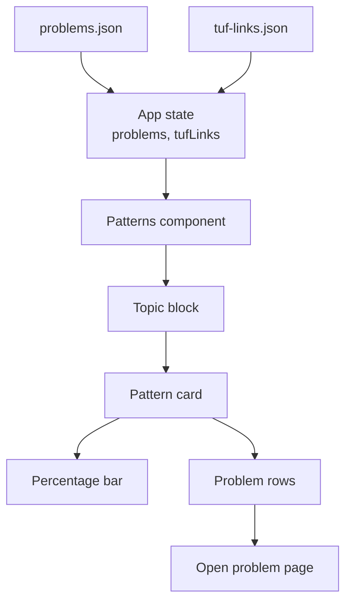
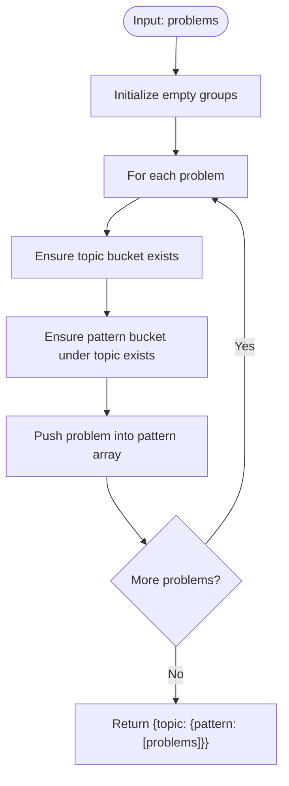
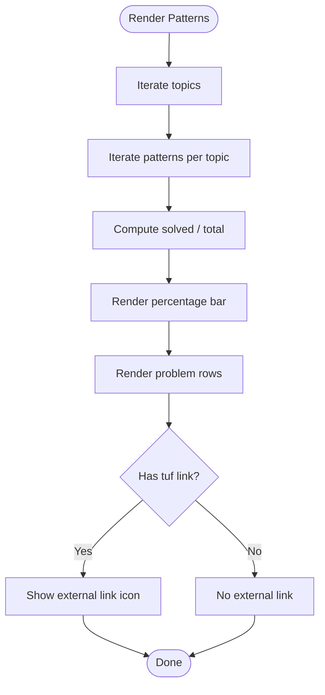
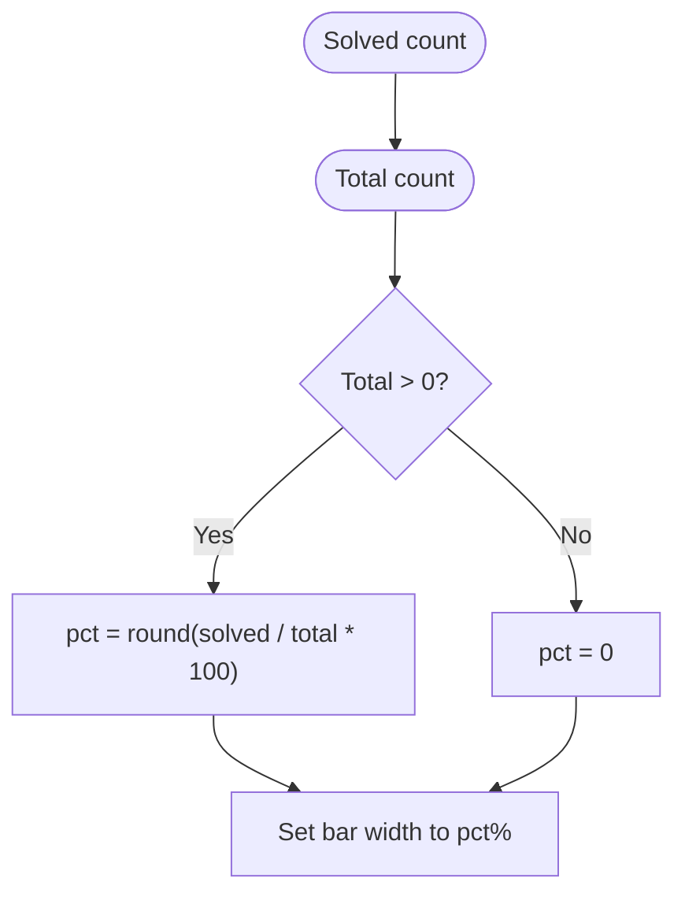
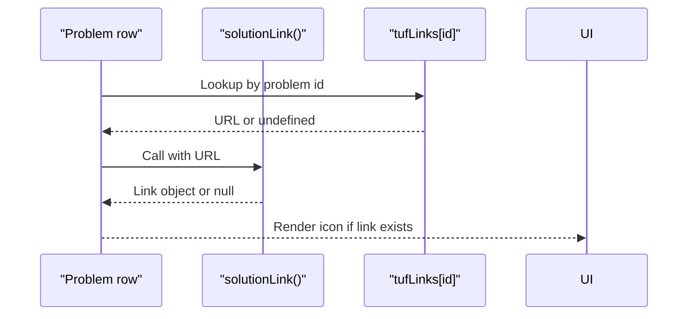
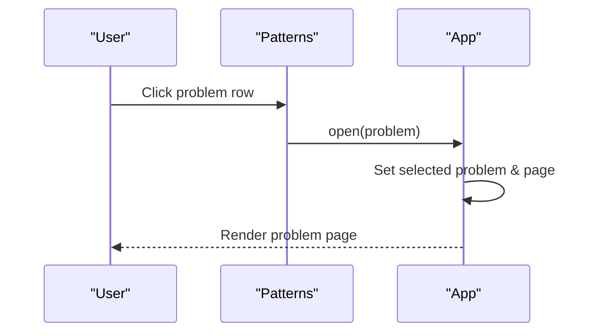
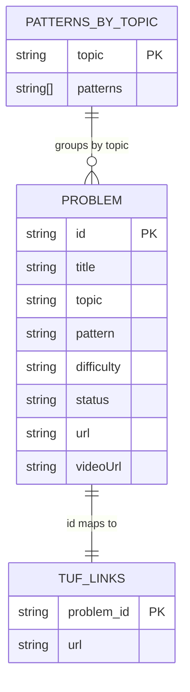
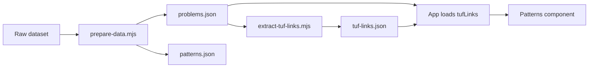

# Patterns Component

<cite>
**Referenced Files in This Document**
- [main.jsx](file://src/main.jsx)
- [patterns.json](file://data/patterns.json)
- [problems.json](file://public/data/problems.json)
- [tuf-links.json](file://public/data/tuf-links.json)
- [prepare-data.mjs](file://scripts/prepare-data.mjs)
- [extract-tuf-links.mjs](file://scripts/extract-tuf-links.mjs)
</cite>

## Table of Contents
1. [Introduction](#introduction)
2. [Project Structure](#project-structure)
3. [Core Components](#core-components)
4. [Architecture Overview](#architecture-overview)
5. [Detailed Component Analysis](#detailed-component-analysis)
6. [Dependency Analysis](#dependency-analysis)
7. [Performance Considerations](#performance-considerations)
8. [Troubleshooting Guide](#troubleshooting-guide)
9. [Conclusion](#conclusion)

## Introduction
The Patterns component provides a topic-first view of the DSA problem set, grouping problems by their assigned pattern within each topic. It shows completion progress per pattern using percentage bars and integrates external TakeUForward solution links where available. Users can navigate from a pattern card to an individual problem page for deeper work on notes, solutions, and revision scheduling.

## Project Structure
The Patterns feature is implemented as part of a single-page React application. The key data sources are:
- Problem catalog with topic, pattern, difficulty, and status fields
- A precomputed mapping of problem IDs to TakeUForward solution URLs
- A static patterns catalog that enumerates valid patterns per topic (used conceptually by preparation scripts)



**Diagram sources**
- [main.jsx:297-318](file://src/main.jsx#L297-L318)
- [problems.json:1-20](file://public/data/problems.json#L1-L20)
- [tuf-links.json:1-10](file://public/data/tuf-links.json#L1-L10)

**Section sources**
- [main.jsx:1-130](file://src/main.jsx#L1-L130)
- [problems.json:1-20](file://public/data/problems.json#L1-L20)
- [tuf-links.json:1-10](file://public/data/tuf-links.json#L1-L10)

## Core Components
- Grouping utility: Groups all problems into a nested map by topic then pattern.
- Patterns component: Renders topics, each containing pattern cards with progress bars and problem lists.
- External link helper: Detects whether a TakeUForward URL exists for a problem and renders an external link icon next to it.
- Navigation: Clicking a problem row opens the problem detail page via a shared open handler.

Key behaviors:
- Grouped display structure: Problems are grouped first by topic, then by pattern.
- Progress visualization: Each pattern card shows solved vs total and a percentage bar.
- External link integration: If a TakeUForward solution URL exists for the problem ID, an external link icon appears next to the problem row.
- Completion tracking: Uses the problem’s status field to compute “completed” counts.
- Navigation: Clicking a problem navigates to the problem page while preserving origin context.

**Section sources**
- [main.jsx:237-244](file://src/main.jsx#L237-L244)
- [main.jsx:297-318](file://src/main.jsx#L297-L318)
- [main.jsx:59-66](file://src/main.jsx#L59-L66)

## Architecture Overview
The Patterns page is rendered inside the main app when the current page equals “patterns”. It receives the enriched problem list and the loaded tufLinks map. The component computes groupings locally and renders UI accordingly.

```mermaid
sequenceDiagram
participant App as "App"
participant Patterns as "Patterns"
participant Data as "problems.json"
participant Links as "tuf-links.json"
App->>Data : Load problems
App->>Links : Load tufLinks
App-->>Patterns : Pass {problems, tufLinks}
Patterns->>Patterns : Group by topic → pattern
Patterns-->>User : Render topic blocks
User->>Patterns : Click problem row
Patterns-->>App : open(problem)
App-->>User : Navigate to problem page
```

**Diagram sources**
- [main.jsx:123-126](file://src/main.jsx#L123-L126)
- [main.jsx:213-216](file://src/main.jsx#L213-L216)
- [main.jsx:297-318](file://src/main.jsx#L297-L318)

## Detailed Component Analysis

### Grouping Logic
Problems are grouped into a nested structure keyed by topic and pattern. This enables rendering a hierarchical view where each topic contains multiple pattern cards.



**Diagram sources**
- [main.jsx:237-244](file://src/main.jsx#L237-L244)

**Section sources**
- [main.jsx:237-244](file://src/main.jsx#L237-L244)

### Patterns Page Rendering
The Patterns component iterates over topics and patterns, computing per-pattern completion and rendering:
- Pattern header with count and percentage
- A horizontal progress bar representing completion
- A list of problems with status badges and optional external link icon



**Diagram sources**
- [main.jsx:297-318](file://src/main.jsx#L297-L318)

**Section sources**
- [main.jsx:297-318](file://src/main.jsx#L297-L318)

### Progress Visualization
- Percentage calculation: solved divided by total for the pattern, rounded to nearest integer.
- Visual bar: An inline element width is set to the computed percentage.
- Status definition: “Completed” means status is either “Solved” or “Mastered”.



**Diagram sources**
- [main.jsx:307-311](file://src/main.jsx#L307-L311)

**Section sources**
- [main.jsx:307-311](file://src/main.jsx#L307-L311)

### External Link Integration with TakeUForward
- Source of truth: tufLinks map keyed by problem id.
- Detection: A helper checks if the provided URL is an HTTP(S) link; if so, it returns a link object with href and label.
- Rendering: When present, an external link icon is appended to the problem row.



**Diagram sources**
- [main.jsx:59-66](file://src/main.jsx#L59-L66)
- [main.jsx:307-312](file://src/main.jsx#L307-L312)
- [tuf-links.json:1-10](file://public/data/tuf-links.json#L1-L10)

**Section sources**
- [main.jsx:59-66](file://src/main.jsx#L59-L66)
- [main.jsx:307-312](file://src/main.jsx#L307-L312)
- [tuf-links.json:1-10](file://public/data/tuf-links.json#L1-L10)

### Navigation to Individual Problems
- Clicking a problem row triggers a shared open handler that sets the selected problem and navigates to the problem page.
- The problem page displays metadata, status controls, notes, solutions, and revision scheduling.



**Diagram sources**
- [main.jsx:181-186](file://src/main.jsx#L181-L186)
- [main.jsx:213-216](file://src/main.jsx#L213-L216)

**Section sources**
- [main.jsx:181-186](file://src/main.jsx#L181-L186)
- [main.jsx:213-216](file://src/main.jsx#L213-L216)

### Data Model and Relationships
- Problem model includes id, title, topic, pattern, difficulty, status, url, videoUrl.
- Patterns catalog defines valid patterns per topic used during data preparation.
- tufLinks maps problem ids to TakeUForward URLs.



**Diagram sources**
- [problems.json:1-20](file://public/data/problems.json#L1-L20)
- [patterns.json:1-90](file://data/patterns.json#L1-L90)
- [tuf-links.json:1-10](file://public/data/tuf-links.json#L1-L10)

**Section sources**
- [problems.json:1-20](file://public/data/problems.json#L1-L20)
- [patterns.json:1-90](file://data/patterns.json#L1-L90)
- [tuf-links.json:1-10](file://public/data/tuf-links.json#L1-L10)

## Dependency Analysis
- Patterns component depends on:
  - Enriched problems list (includes local progress)
  - tufLinks map for external links
- Data preparation pipeline:
  - prepare-data.mjs assigns patterns to problems based on curated rules and writes problems.json and patterns.json
  - extract-tuf-links.mjs builds tuf-links.json by matching problem titles and source URLs to TakeUForward resources



**Diagram sources**
- [prepare-data.mjs:55-767](file://scripts/prepare-data.mjs#L55-L767)
- [extract-tuf-links.mjs:1-70](file://scripts/extract-tuf-links.mjs#L1-L70)
- [main.jsx:123-126](file://src/main.jsx#L123-L126)

**Section sources**
- [prepare-data.mjs:55-767](file://scripts/prepare-data.mjs#L55-L767)
- [extract-tuf-links.mjs:1-70](file://scripts/extract-tuf-links.mjs#L1-L70)
- [main.jsx:123-126](file://src/main.jsx#L123-L126)

## Performance Considerations
- Grouping is O(n) over the problem list and performed with useMemo to avoid recomputation on unrelated re-renders.
- Percentage calculations and bar widths are simple arithmetic operations per pattern.
- External link lookup is O(1) via hash map access by problem id.
- Rendering scales with the number of problems per pattern; consider virtualization only if the list grows significantly beyond current sizes.

[No sources needed since this section provides general guidance]

## Troubleshooting Guide
- Missing external links:
  - Verify that tuf-links.json contains an entry for the problem id.
  - Check that the problem’s url or title matches the extraction logic used by the script.
- Incorrect progress:
  - Ensure the problem status is one of “Solved” or “Mastered” to be counted as completed.
  - Confirm that local progress updates are persisted and reflected in the enriched list passed to Patterns.
- Navigation issues:
  - Confirm that the open handler is invoked and that the selected problem exists in the enriched list before navigating.

**Section sources**
- [main.jsx:59-66](file://src/main.jsx#L59-L66)
- [main.jsx:297-318](file://src/main.jsx#L297-L318)
- [main.jsx:181-186](file://src/main.jsx#L181-L186)

## Conclusion
The Patterns component organizes problems by topic and pattern, visualizes completion with percentage bars, and integrates TakeUForward solution links where available. It provides a clear, navigable interface to explore problems by pattern and drill down into detailed problem pages for focused study and revision.

[No sources needed since this section summarizes without analyzing specific files]