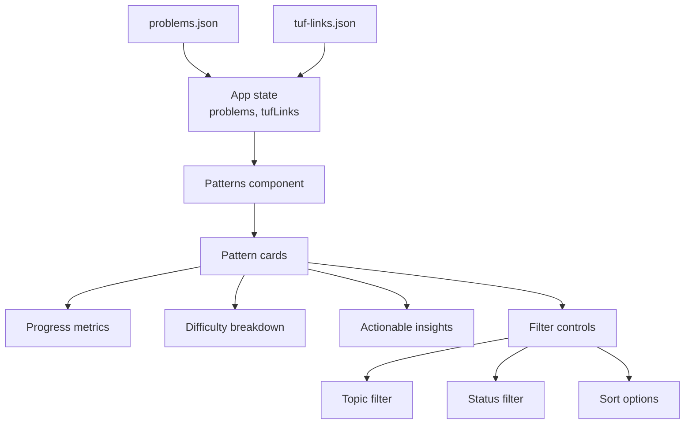
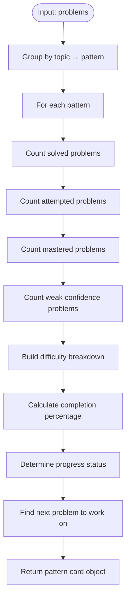
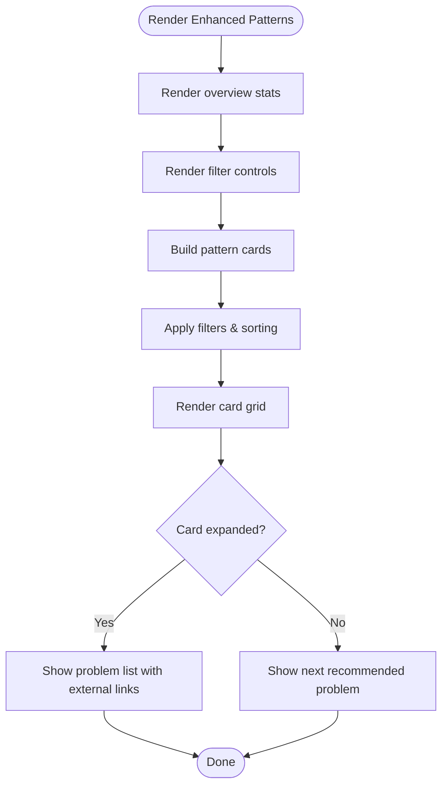
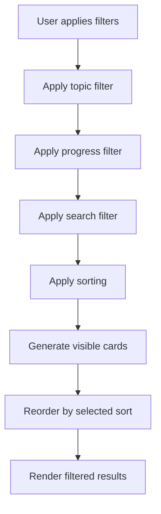
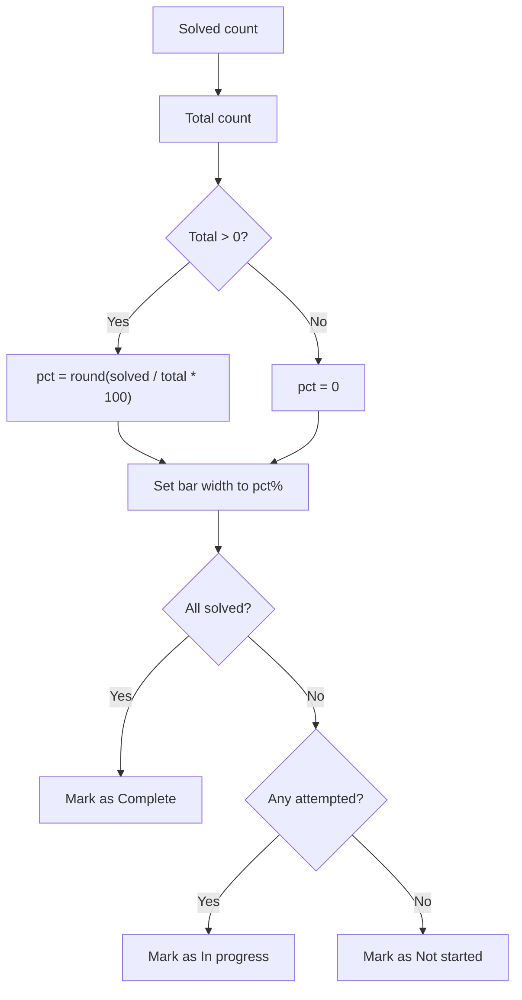
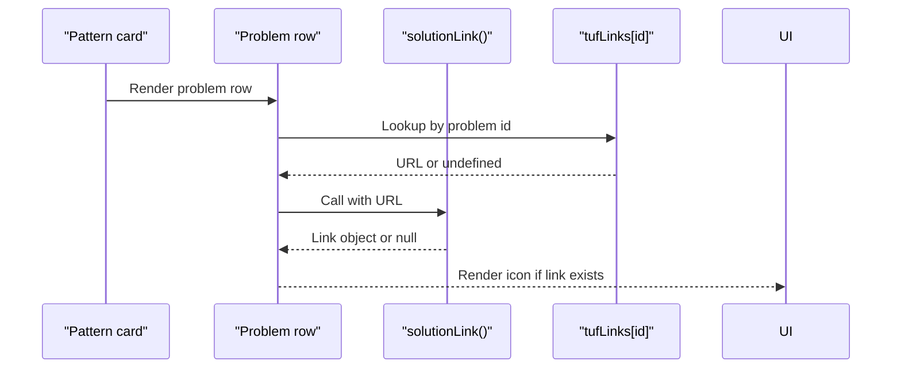
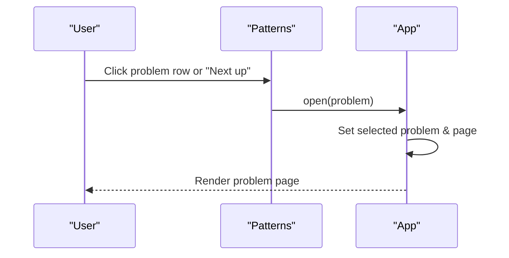
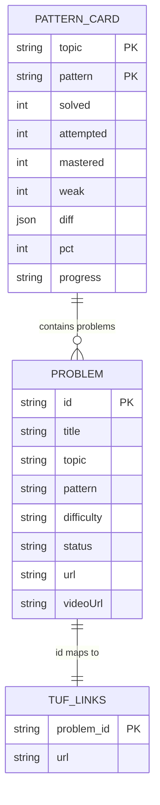
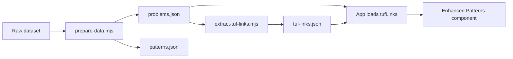

# Patterns Component

<cite>
**Referenced Files in This Document**
- [main.jsx](file://src/main.jsx)
- [patterns.json](file://data/patterns.json)
- [problems.json](file://public/data/problems.json)
- [tuf-links.json](file://public/data/tuf-links.json)
</cite>

## Update Summary
**Changes Made**
- Updated the Patterns component section to reflect the new card-based interface with progress metrics, difficulty breakdowns, and actionable insights
- Added documentation for filtering by topic, progress status, and sorting options
- Enhanced the architecture overview to include the new pattern cards system
- Updated data model section to reflect the enhanced pattern card structure
- Added new sections for pattern card rendering and filtering logic

## Table of Contents
1. [Introduction](#introduction)
2. [Project Structure](#project-structure)
3. [Core Components](#core-components)
4. [Architecture Overview](#architecture-overview)
5. [Detailed Component Analysis](#detailed-component-analysis)
6. [Dependency Analysis](#dependency-analysis)
7. [Performance Considerations](#performance-considerations)
8. [Troubleshooting Guide](#troubleshooting-guide)
9. [Conclusion](#conclusion)

## Introduction
The Patterns component provides a comprehensive card-based interface for exploring DSA problems organized by topics and patterns. It displays progress metrics, difficulty breakdowns, and actionable insights for each topic-pattern combination. Users can filter by topic, progress status, and sort options to focus on specific areas of improvement. The component integrates external TakeUForward solution links and provides navigation to individual problem pages for detailed work on notes, solutions, and revision scheduling.

## Project Structure
The Patterns feature is implemented as part of a single-page React application with an enhanced card-based interface. The key data sources are:
- Problem catalog with topic, pattern, difficulty, and status fields
- A precomputed mapping of problem IDs to TakeUForward solution URLs
- A static patterns catalog that enumerates valid patterns per topic (used conceptually by preparation scripts)



**Diagram sources**
- [main.jsx:524-628](file://src/main.jsx#L524-L628)
- [problems.json:1-20](file://public/data/problems.json#L1-L20)
- [tuf-links.json:1-10](file://public/data/tuf-links.json#L1-L10)

**Section sources**
- [main.jsx:1-130](file://src/main.jsx#L1-L130)
- [problems.json:1-20](file://public/data/problems.json#L1-L20)
- [tuf-links.json:1-10](file://public/data/tuf-links.json#L1-L10)

## Core Components
- **Pattern Card Builder**: Creates comprehensive cards for each topic-pattern combination with progress metrics, difficulty breakdowns, and actionable insights.
- **Enhanced Patterns Component**: Renders a grid of pattern cards with filtering, sorting, and expansion capabilities.
- **Filter System**: Provides filtering by topic, progress status, and sorting options including weakest, strongest, most problems, and alphabetical sorting.
- **External Link Helper**: Detects whether a TakeUForward URL exists for a problem and renders an external link icon next to it.
- **Navigation**: Clicking a problem row opens the problem detail page via a shared open handler.

Key behaviors:
- **Card-based interface**: Each topic-pattern combination is displayed as a comprehensive card with visual progress indicators.
- **Progress visualization**: Cards show solved vs total counts, percentage bars, and completion status (Complete, In progress, Not started).
- **Difficulty breakdown**: Each card displays Easy, Medium, and Hard problem counts with color-coded chips.
- **Actionable insights**: Cards highlight weak problems, next recommended problems, and mastery indicators.
- **Advanced filtering**: Users can filter by topic, progress status, and sort by various criteria.
- **External link integration**: If a TakeUForward solution URL exists for the problem ID, an external link icon appears next to the problem row.

**Section sources**
- [main.jsx:507-522](file://src/main.jsx#L507-L522)
- [main.jsx:524-628](file://src/main.jsx#L524-L628)
- [main.jsx:63-66](file://src/main.jsx#L63-L66)

## Architecture Overview
The Patterns page is rendered inside the main app when the current page equals "patterns". It receives the enriched problem list and the loaded tufLinks map. The component computes pattern cards locally with comprehensive metrics and renders UI accordingly.

```mermaid
sequenceDiagram
participant App as "App"
participant Patterns as "Patterns"
participant Data as "problems.json"
participant Links as "tuf-links.json"
App->>Data : Load problems
App->>Links : Load tufLinks
App-->>Patterns : Pass {problems, tufLinks}
Patterns->>Patterns : Build pattern cards with metrics
Patterns->>Patterns : Apply filters and sorting
Patterns-->>User : Render card grid
User->>Patterns : Apply filters/sort
Patterns-->>User : Update visible cards
User->>Patterns : Click problem row
Patterns-->>App : open(problem)
App-->>User : Navigate to problem page
```

**Diagram sources**
- [main.jsx:123-126](file://src/main.jsx#L123-L126)
- [main.jsx:213-216](file://src/main.jsx#L213-L216)
- [main.jsx:524-628](file://src/main.jsx#L524-L628)

## Detailed Component Analysis

### Pattern Card Building Logic
Pattern cards are built by grouping problems by topic and pattern, then computing comprehensive metrics for each combination including solved counts, attempted counts, mastered counts, weak problem counts, difficulty distribution, and progress percentage.



**Diagram sources**
- [main.jsx:507-522](file://src/main.jsx#L507-L522)

**Section sources**
- [main.jsx:507-522](file://src/main.jsx#L507-L522)

### Enhanced Patterns Page Rendering
The enhanced Patterns component renders a sophisticated card-based interface with:
- Overview statistics showing overall completion across all patterns
- Filter controls for topic, progress status, and sorting
- Responsive grid layout of pattern cards
- Expandable card details showing individual problems
- Visual progress indicators and difficulty breakdowns



**Diagram sources**
- [main.jsx:524-628](file://src/main.jsx#L524-L628)

**Section sources**
- [main.jsx:524-628](file://src/main.jsx#L524-L628)

### Advanced Filtering and Sorting System
The component implements a comprehensive filtering and sorting system:
- **Topic filtering**: Filter patterns by specific topics or view all
- **Progress filtering**: Filter by Complete, In progress, or Not started status
- **Search functionality**: Search within pattern names, topics, and problem titles
- **Sorting options**: Order, Weakest, Strongest, Most problems, Pattern A-Z



**Diagram sources**
- [main.jsx:535-547](file://src/main.jsx#L535-L547)

**Section sources**
- [main.jsx:535-547](file://src/main.jsx#L535-L547)

### Progress Visualization and Metrics
- **Percentage calculation**: solved divided by total for the pattern, rounded to nearest integer
- **Visual bar**: An inline element width is set to the computed percentage
- **Status definition**: "Complete" means all problems solved, "In progress" has some attempts, "Not started" has no attempts
- **Difficulty breakdown**: Color-coded chips showing Easy, Medium, and Hard problem counts
- **Mastery indicators**: Special badges for mastered problems and weak confidence issues



**Diagram sources**
- [main.jsx:516-517](file://src/main.jsx#L516-L517)

**Section sources**
- [main.jsx:516-517](file://src/main.jsx#L516-L517)

### External Link Integration with TakeUForward
- **Source of truth**: tufLinks map keyed by problem id
- **Detection**: A helper checks if the provided URL is an HTTP(S) link; if so, it returns a link object with href and label
- **Rendering**: When present, an external link icon is appended to the problem row within expanded cards



**Diagram sources**
- [main.jsx:63-66](file://src/main.jsx#L63-L66)
- [main.jsx:621](file://src/main.jsx#L621)
- [tuf-links.json:1-10](file://public/data/tuf-links.json#L1-L10)

**Section sources**
- [main.jsx:63-66](file://src/main.jsx#L63-L66)
- [main.jsx:621](file://src/main.jsx#L621)
- [tuf-links.json:1-10](file://public/data/tuf-links.json#L1-L10)

### Navigation to Individual Problems
- **Clicking a problem row**: Triggers a shared open handler that sets the selected problem and navigates to the problem page
- **Next up button**: Cards provide a quick action button to navigate directly to the next recommended problem
- **Problem page display**: Shows metadata, status controls, notes, solutions, and revision scheduling



**Diagram sources**
- [main.jsx:181-186](file://src/main.jsx#L181-L186)
- [main.jsx:213-216](file://src/main.jsx#L213-L216)
- [main.jsx:620](file://src/main.jsx#L620)

**Section sources**
- [main.jsx:181-186](file://src/main.jsx#L181-L186)
- [main.jsx:213-216](file://src/main.jsx#L213-L216)
- [main.jsx:620](file://src/main.jsx#L620)

### Data Model and Relationships
- **Problem model**: Includes id, title, topic, pattern, difficulty, status, url, videoUrl
- **Pattern card model**: Contains topic, pattern, problems array, solved/attempted/mastered counts, weak count, difficulty breakdown, percentage, progress status, and next recommended problem
- **Patterns catalog**: Defines valid patterns per topic used during data preparation
- **tufLinks**: Maps problem ids to TakeUForward URLs



**Diagram sources**
- [problems.json:1-20](file://public/data/problems.json#L1-L20)
- [patterns.json:1-90](file://data/patterns.json#L1-L90)
- [tuf-links.json:1-10](file://public/data/tuf-links.json#L1-L10)
- [main.jsx:507-522](file://src/main.jsx#L507-L522)

**Section sources**
- [problems.json:1-20](file://public/data/problems.json#L1-L20)
- [patterns.json:1-90](file://data/patterns.json#L1-L90)
- [tuf-links.json:1-10](file://public/data/tuf-links.json#L1-L10)
- [main.jsx:507-522](file://src/main.jsx#L507-L522)

## Dependency Analysis
- **Patterns component depends on**:
  - Enriched problems list (includes local progress)
  - tufLinks map for external links
- **Data preparation pipeline**:
  - prepare-data.mjs assigns patterns to problems based on curated rules and writes problems.json and patterns.json
  - extract-tuf-links.mjs builds tuf-links.json by matching problem titles and source URLs to TakeUForward resources



**Diagram sources**
- [prepare-data.mjs:55-767](file://scripts/prepare-data.mjs#L55-L767)
- [extract-tuf-links.mjs:1-70](file://scripts/extract-tuf-links.mjs#L1-L70)
- [main.jsx:123-126](file://src/main.jsx#L123-L126)

**Section sources**
- [prepare-data.mjs:55-767](file://scripts/prepare-data.mjs#L55-L767)
- [extract-tuf-links.mjs:1-70](file://scripts/extract-tuf-links.mjs#L1-L70)
- [main.jsx:123-126](file://src/main.jsx#L123-L126)

## Performance Considerations
- **Pattern card building**: O(n) over the problem list using efficient grouping algorithms
- **Filtering and sorting**: Optimized with useMemo hooks to avoid recomputation on unrelated re-renders
- **Percentage calculations**: Simple arithmetic operations per pattern with minimal overhead
- **External link lookup**: O(1) via hash map access by problem id
- **Rendering optimization**: Cards are grouped by topic and only visible cards are rendered after filtering
- **Expansion state**: Uses cloud-synced collapse state to maintain user preferences across sessions

## Troubleshooting Guide
- **Missing external links**:
  - Verify that tuf-links.json contains an entry for the problem id
  - Check that the problem's url or title matches the extraction logic used by the script
- **Incorrect progress metrics**:
  - Ensure the problem status is one of "Solved" or "Mastered" to be counted as completed
  - Confirm that local progress updates are persisted and reflected in the enriched list passed to Patterns
- **Filter issues**:
  - Verify that filter values are properly sanitized and validated
  - Check that topic and pattern filters are synchronized with available data
- **Navigation issues**:
  - Confirm that the open handler is invoked and that the selected problem exists in the enriched list before navigating
- **Card expansion problems**:
  - Ensure collapse state is properly managed in localStorage and cloud sync
  - Verify that card keys are unique and consistent across re-renders

**Section sources**
- [main.jsx:63-66](file://src/main.jsx#L63-L66)
- [main.jsx:524-628](file://src/main.jsx#L524-L628)
- [main.jsx:181-186](file://src/main.jsx#L181-L186)

## Conclusion
The enhanced Patterns component provides a comprehensive card-based interface for exploring DSA problems organized by topics and patterns. It displays progress metrics, difficulty breakdowns, and actionable insights for each topic-pattern combination with advanced filtering and sorting capabilities. The component integrates external TakeUForward solution links and provides intuitive navigation to individual problem pages for focused study and revision. The card-based design makes it easy to identify areas needing attention and track progress across different patterns and topics.