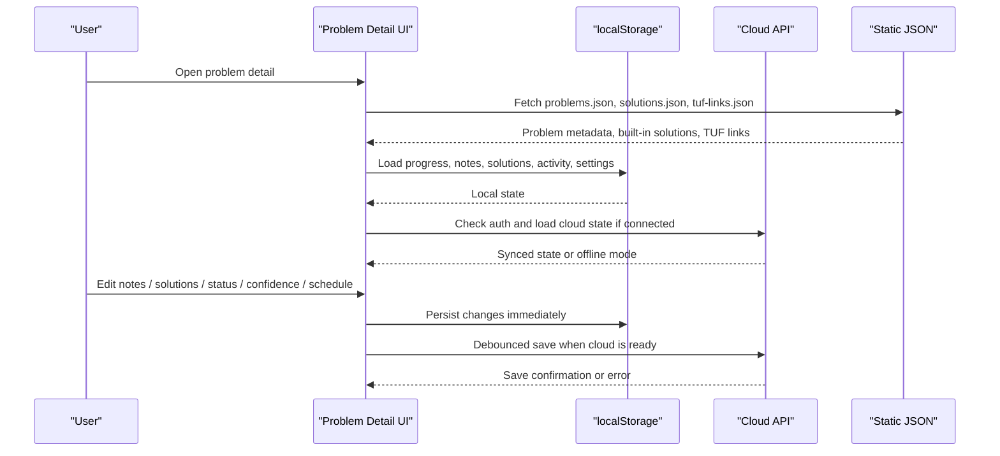
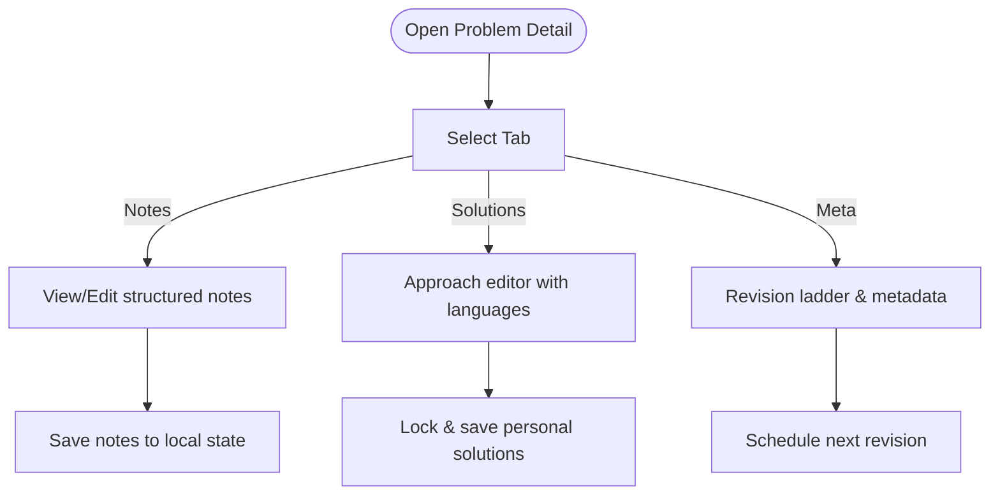
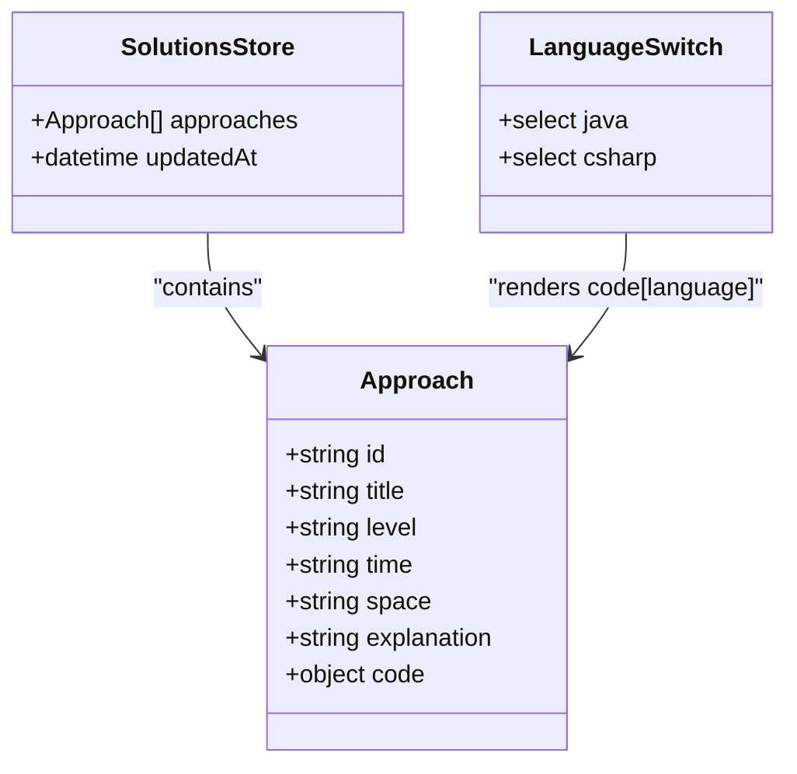
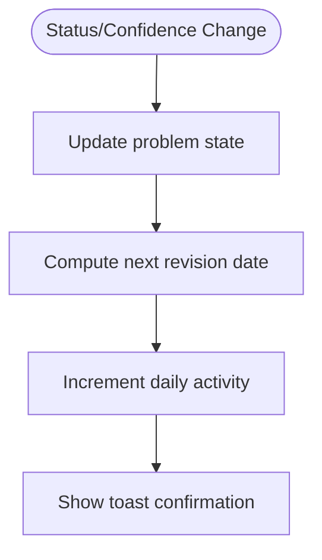
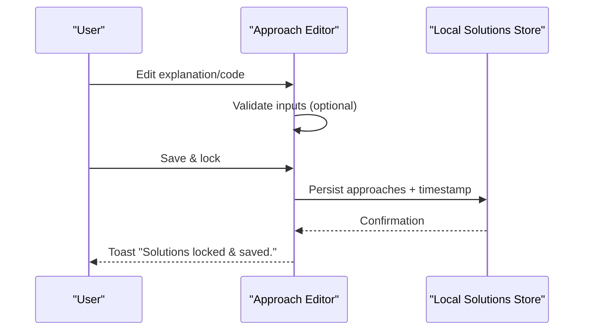
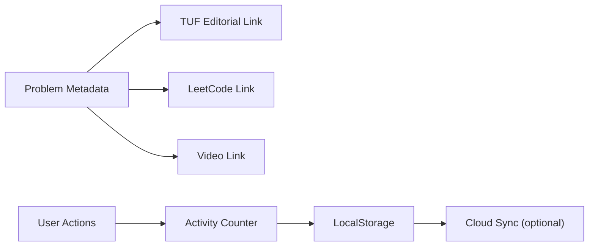
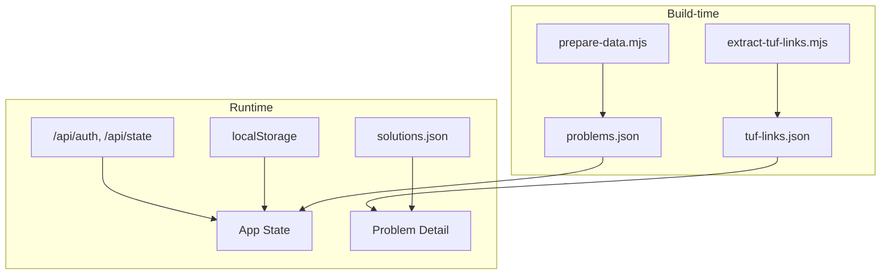

# Problem Detail Component

<cite>
**Referenced Files in This Document**
- [main.jsx](file://src/main.jsx)
- [problems.json](file://public/data/problems.json)
- [solutions.json](file://public/data/solutions.json)
- [state.js](file://api/state.js)
- [auth.js](file://api/auth.js)
- [prepare-data.mjs](file://scripts/prepare-data.mjs)
- [extract-tuf-links.mjs](file://scripts/extract-tuf-links.mjs)
- [README.md](file://README.md)
</cite>

## Table of Contents
1. [Introduction](#introduction)
2. [Project Structure](#project-structure)
3. [Core Components](#core-components)
4. [Architecture Overview](#architecture-overview)
5. [Detailed Component Analysis](#detailed-component-analysis)
6. [Dependency Analysis](#dependency-analysis)
7. [Performance Considerations](#performance-considerations)
8. [Troubleshooting Guide](#troubleshooting-guide)
9. [Conclusion](#conclusion)

## Introduction
This document explains the Problem Detail component that powers per-problem learning, solution management, and revision tracking. It covers:
- The three-tab interface: Learning Notes, Solutions, Meta
- Structured note editing with fields for insight, mistake, approach, complexity, and interview cues
- Solution management with multi-language support (Java and C#), including built-in solutions, personal copies, locking, and code copying
- Status marking, confidence tracking, revision scheduling, and favorites
- Integration with external links (TakeUForward editorial, LeetCode, videos) and activity recording

The component is implemented as a single-page React application using local-first storage with optional cloud sync.

**Section sources**
- [README.md:1-59](file://README.md#L1-L59)

## Project Structure
At runtime, the app loads problem metadata, built-in solutions, and TakeUForward link mappings from static JSON files, then renders the Problem Detail view when a problem is selected.

**Diagram sources**
- [main.jsx:74-125](file://src/main.jsx#L74-L125)
- [main.jsx:153-182](file://src/main.jsx#L153-L182)
- [main.jsx:450-653](file://src/main.jsx#L450-L653)

**Section sources**
- [main.jsx:74-125](file://src/main.jsx#L74-L125)
- [problems.json:1-200](file://public/data/problems.json#L1-L200)
- [solutions.json:1-13](file://public/data/solutions.json#L1-L13)

## Core Components
- Problem Detail view: Renders header, status actions, toolbar, and three tabs (Learning Notes, Solutions, Meta).
- Learning Notes tab: Structured fields with edit/view modes and save/clear actions.
- Solutions tab: Approach editor with complexity analysis, explanation, and Java/C# code; supports built-in solutions, personal copies, adding/removing approaches, locking, and copying code.
- Meta tab: Revision ladder visualization, metadata display, and mastery checklist.
- Status and confidence controls: Mark problems as Attempted/Solved/Mastered or reset to Not Started; set confidence levels.
- Revision scheduler: Schedule next review using spaced intervals; track attempts and last revised time.
- Favorites toggle: Star/unstar problems for quick filtering.
- External integrations: Links to TakeUForward editorial, LeetCode, and video explanations.
- Activity recording: Increments daily activity count on meaningful interactions.

**Section sources**
- [main.jsx:450-653](file://src/main.jsx#L450-L653)

## Architecture Overview
The Problem Detail component integrates data from multiple sources and persists user changes locally and optionally to the cloud.

**Diagram sources**
- [main.jsx:74-125](file://src/main.jsx#L74-L125)
- [main.jsx:133-146](file://src/main.jsx#L133-L146)
- [main.jsx:450-653](file://src/main.jsx#L450-L653)
- [state.js:40-63](file://api/state.js#L40-L63)
- [auth.js:8-29](file://api/auth.js#L8-L29)

## Detailed Component Analysis

### Three-Tab Interface
- Learning Notes: Displays structured fields and counts filled fields; supports edit/view modes.
- Solutions: Shows approach list with complexity, explanation, and language-specific code; supports built-in vs personal copy.
- Meta: Shows revision steps, metadata, and mastery checklist.

**Diagram sources**
- [main.jsx:552-653](file://src/main.jsx#L552-L653)

**Section sources**
- [main.jsx:552-653](file://src/main.jsx#L552-L653)

### Note Editing System with Structured Fields
- Fields: Insight, Mistake, Approach, Complexity, Interview cue.
- Modes: View mode shows formatted content; Edit mode provides textareas with placeholders.
- Actions: Save notes, clear all notes, cancel edits.
- Persistence: Changes are saved to local notes store keyed by problem id.

**Diagram sources**
- [main.jsx:558-596](file://src/main.jsx#L558-L596)

**Section sources**
- [main.jsx:558-596](file://src/main.jsx#L558-L596)

### Solution Management with Multi-Language Support (Java & C#)
- Built-in solutions: Loaded from solutions.json; displayed as read-only reference implementations.
- Personal copy: Users can unlock and create a personal editable copy; add/remove approaches; lock and save.
- Languages: Each approach stores code under keys for Java and C#; switching language updates the displayed code block.
- Copying: One-click copy to clipboard with feedback.
- Complexity: Each approach includes level, time, and space fields; editable in personal copy mode.

**Diagram sources**
- [main.jsx:598-646](file://src/main.jsx#L598-L646)
- [solutions.json:1-13](file://public/data/solutions.json#L1-L13)

**Section sources**
- [main.jsx:598-646](file://src/main.jsx#L598-L646)
- [solutions.json:1-13](file://public/data/solutions.json#L1-L13)

### Status Marking System, Confidence Tracking, Revision Scheduling, and Favorites
- Status options: Not Started, Attempted, Solved, Mastered.
- Confidence levels: Weak, Learning, Strong, Interview Ready.
- Revision scheduling: Spaced intervals (1, 3, 7, 14, 30 days); next revision computed based on current revision count.
- Attempts: Incremented when moving away from Not Started.
- Favorites: Toggle star to mark favorite problems; used in filters across views.

**Diagram sources**
- [main.jsx:511-524](file://src/main.jsx#L511-L524)
- [main.jsx:539-550](file://src/main.jsx#L539-L550)

**Section sources**
- [main.jsx:511-524](file://src/main.jsx#L511-L524)
- [main.jsx:539-550](file://src/main.jsx#L539-L550)

### Approach Editor with Complexity Analysis, Code Copying, and Solution Locking
- Complexity analysis: Time and Space fields per approach; Level dropdown for categorization.
- Explanation: Free-text field guiding reasoning and pattern recognition.
- Code copying: Copies current language’s code to clipboard; visual feedback on success.
- Locking: Saving locks the personal copy and persists it locally; discarding reverts to built-in or default approaches.

**Diagram sources**
- [main.jsx:491-510](file://src/main.jsx#L491-L510)
- [main.jsx:616-646](file://src/main.jsx#L616-L646)

**Section sources**
- [main.jsx:491-510](file://src/main.jsx#L491-L510)
- [main.jsx:616-646](file://src/main.jsx#L616-L646)

### Integration with Built-in Solutions, External Links, and Activity Recording
- Built-in solutions: Loaded from public/data/solutions.json; shown as reference implementations unless unlocked for personal editing.
- External links:
  - TakeUForward editorial link derived from tuf-links.json mapping.
  - LeetCode link extracted from problem url when applicable.
  - Video link from problem metadata.
- Activity recording: Increments daily activity on status changes and other meaningful interactions.

**Diagram sources**
- [main.jsx:528-537](file://src/main.jsx#L528-L537)
- [main.jsx:180-182](file://src/main.jsx#L180-L182)
- [extract-tuf-links.mjs:61-68](file://scripts/extract-tuf-links.mjs#L61-L68)

**Section sources**
- [main.jsx:528-537](file://src/main.jsx#L528-L537)
- [main.jsx:180-182](file://src/main.jsx#L180-L182)
- [extract-tuf-links.mjs:61-68](file://scripts/extract-tuf-links.mjs#L61-L68)

## Dependency Analysis
- Data dependencies:
  - problems.json provides problem catalog with topic, pattern, difficulty, and URLs.
  - solutions.json provides built-in approaches with Java and C# code.
  - tuf-links.json maps problem ids to TakeUForward editorial URLs.
- Runtime dependencies:
  - LocalStorage for persistence of progress, notes, solutions, activity, and settings.
  - Optional cloud sync via /api/auth and /api/state endpoints backed by Neon Postgres.
- Build-time dependencies:
  - prepare-data.mjs curates problems and patterns.
  - extract-tuf-links.mjs generates tuf-links.json from TakeUForward page content.

**Diagram sources**
- [prepare-data.mjs:737-748](file://scripts/prepare-data.mjs#L737-L748)
- [extract-tuf-links.mjs:61-68](file://scripts/extract-tuf-links.mjs#L61-L68)
- [main.jsx:74-125](file://src/main.jsx#L74-L125)
- [state.js:40-63](file://api/state.js#L40-L63)
- [auth.js:8-29](file://api/auth.js#L8-L29)

**Section sources**
- [prepare-data.mjs:737-748](file://scripts/prepare-data.mjs#L737-L748)
- [extract-tuf-links.mjs:61-68](file://scripts/extract-tuf-links.mjs#L61-L68)
- [main.jsx:74-125](file://src/main.jsx#L74-L125)
- [state.js:40-63](file://api/state.js#L40-L63)
- [auth.js:8-29](file://api/auth.js#L8-L29)

## Performance Considerations
- Local-first design minimizes network calls; only debounced cloud sync occurs after changes.
- Static JSON assets are loaded once at startup; problem lists are large but filtered efficiently.
- Avoid unnecessary re-renders by keeping local states scoped to components and using memoization where appropriate.
- Clipboard operations should be guarded and brief to avoid blocking UI.

[No sources needed since this section provides general guidance]

## Troubleshooting Guide
- Storage errors: If localStorage fails, a toast prompts exporting a backup from Settings.
- Cloud sync issues:
  - Authentication failures return descriptive errors; ensure APP_ACCESS_PASSWORD is configured.
  - Database unavailability returns an error; check DATABASE_URL configuration.
- Data integrity: Import/export backups allow recovery; resetting clears all local data.

**Section sources**
- [main.jsx:29-52](file://src/main.jsx#L29-L52)
- [main.jsx:147-152](file://src/main.jsx#L147-L152)
- [main.jsx:656-677](file://src/main.jsx#L656-L677)
- [state.js:40-63](file://api/state.js#L40-L63)
- [auth.js:8-29](file://api/auth.js#L8-L29)

## Conclusion
The Problem Detail component provides a comprehensive workflow for mastering DSA problems through structured notes, multi-language solution management, spaced revision scheduling, and robust tracking of progress and confidence. Its local-first architecture ensures fast, reliable operation, while optional cloud sync enables cross-device continuity. Integrations with external resources streamline access to explanations and videos, and activity recording helps maintain consistent practice habits.

[No sources needed since this section summarizes without analyzing specific files]