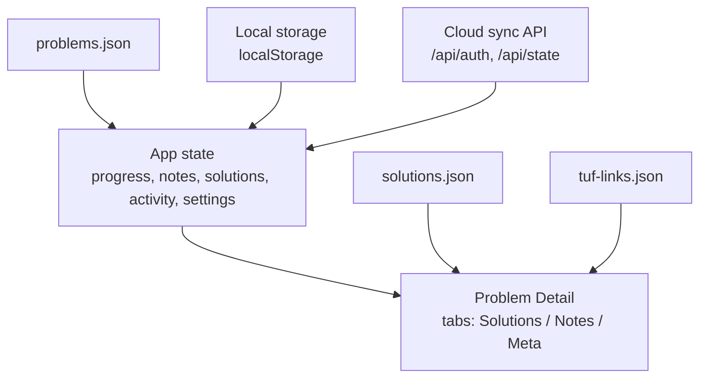
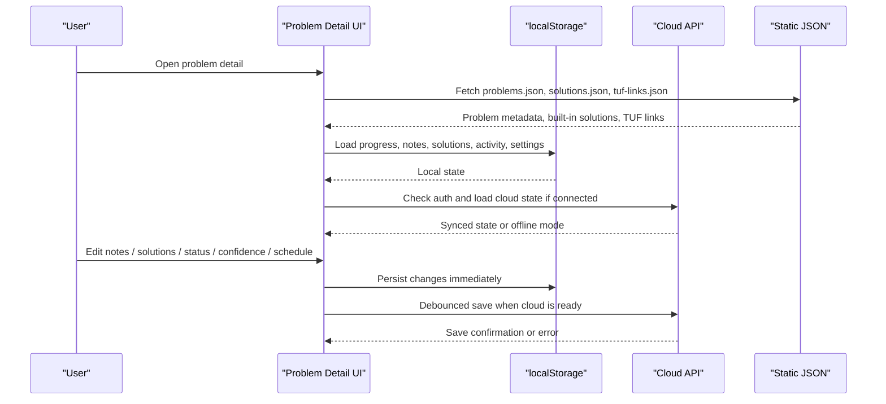
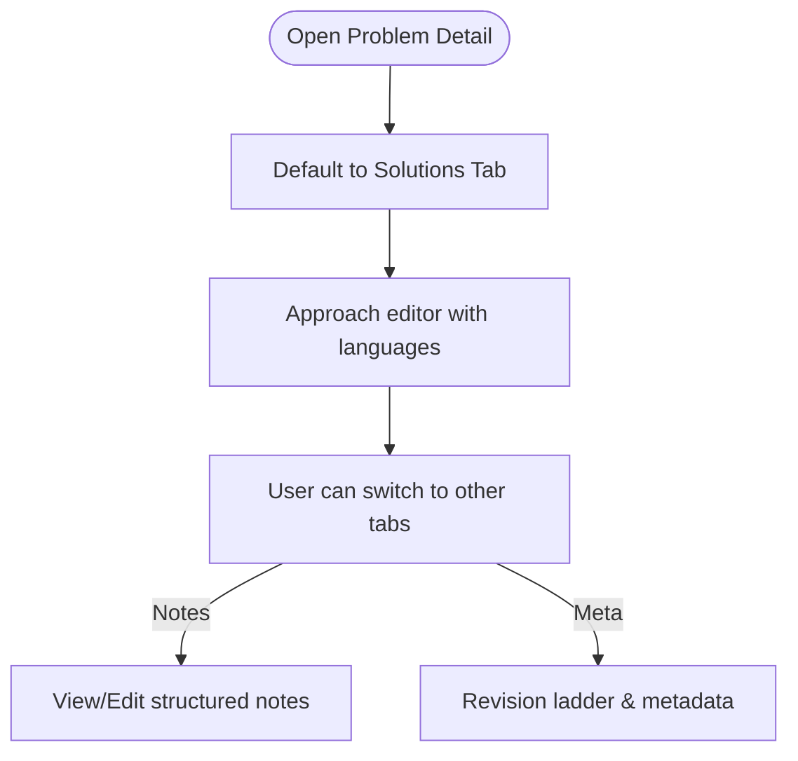
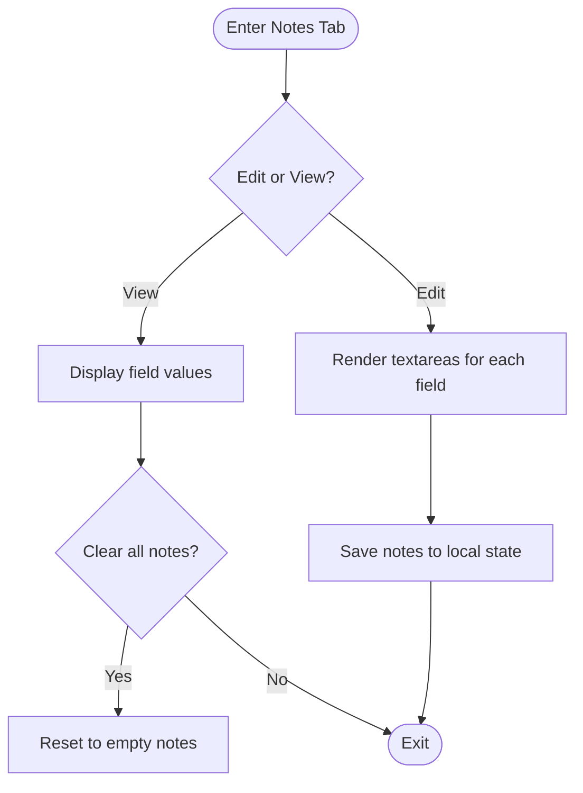
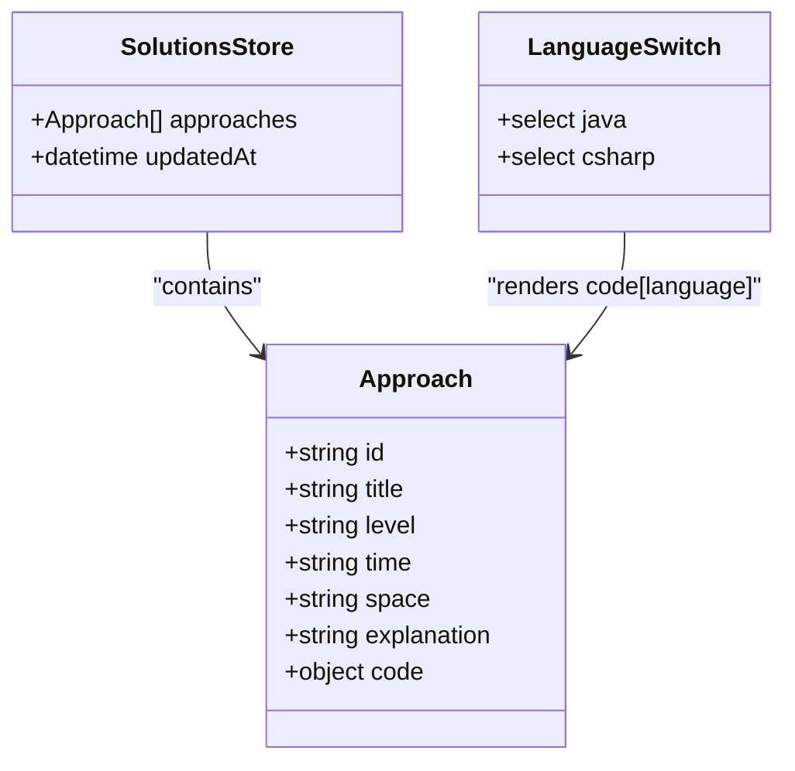
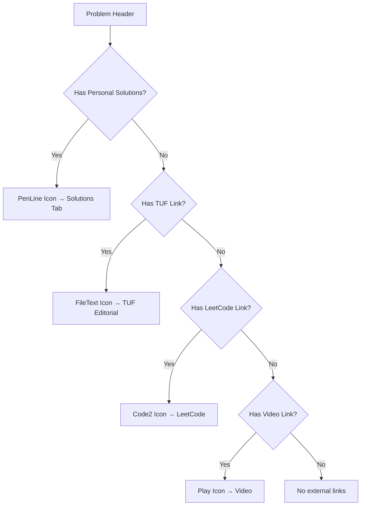
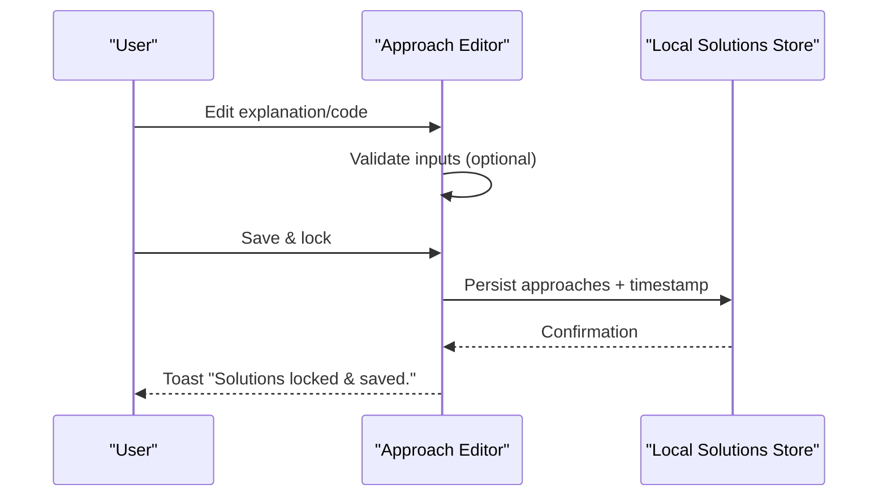
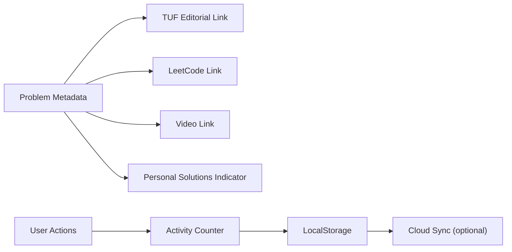
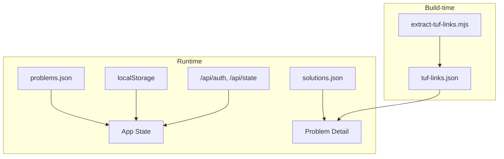

# Problem Detail Component

<cite>
**Referenced Files in This Document**
- [main.jsx](file://src/main.jsx)
- [problems.json](file://public/data/problems.json)
- [solutions.json](file://public/data/solutions.json)
- [tuf-links.json](file://public/data/tuf-links.json)
- [extract-tuf-links.mjs](file://scripts/extract-tuf-links.mjs)
</cite>

## Update Summary
**Changes Made**
- Updated default tab behavior to prioritize Solutions over Notes for better user experience
- Enhanced header navigation with improved icon-based external resource links
- Improved integration with personal solutions and TakeUForward editorial content
- Added visual indicators for personal solution availability and external link presence

## Table of Contents
1. [Introduction](#introduction)
2. [Project Structure](#project-structure)
3. [Core Components](#core-components)
4. [Architecture Overview](#architecture-overview)
5. [Detailed Component Analysis](#detailed-component-analysis)
6. [Dependency Analysis](#dependency-analysis)
7. [Performance Considerations](#performance-considerations)
8. [Troubleshooting Guide](#troubleshooting-guide)
9. [Conclusion](#conclusion)

## Introduction
This document explains the Problem Detail component that powers per-problem learning, solution management, and revision tracking. It covers:
- The three-tab interface: Learning Notes, Solutions, Meta (with enhanced default Solutions tab behavior)
- Structured note editing with fields for insight, mistake, approach, complexity, and interview cues
- Solution management with multi-language support (Java and C#), including built-in solutions, personal copies, locking, and code copying
- Status marking, confidence tracking, revision scheduling, and favorites
- Integration with external links (TakeUForward editorial, LeetCode, videos) and activity recording
- Enhanced header navigation with icon-based external resource links

The component is implemented as a single-page React application using local-first storage with optional cloud sync.

**Section sources**
- [main.jsx:828-855](file://src/main.jsx#L828-L855)

## Project Structure
At runtime, the app loads problem metadata, built-in solutions, and TakeUForward link mappings from static JSON files, then renders the Problem Detail view when a problem is selected.

**Diagram sources**
- [main.jsx:120-128](file://src/main.jsx#L120-L128)
- [main.jsx:182-217](file://src/main.jsx#L182-L217)
- [main.jsx:828-855](file://src/main.jsx#L828-L855)

**Section sources**
- [main.jsx:120-128](file://src/main.jsx#L120-L128)
- [problems.json:1-200](file://public/data/problems.json#L1-L200)
- [solutions.json:1-200](file://public/data/solutions.json#L1-L200)

## Core Components
- Problem Detail view: Renders header with enhanced icon-based navigation, status actions, toolbar, and three tabs (Solutions, Learning Notes, Meta).
- Learning Notes tab: Structured fields with edit/view modes and save/clear actions.
- Solutions tab: Approach editor with complexity analysis, explanation, and Java/C# code; supports built-in solutions, personal copies, adding/removing approaches, locking, and copying code.
- Meta tab: Revision ladder visualization, metadata display, and mastery checklist.
- Status and confidence controls: Mark problems as Attempted/Solved/Mastered or reset to Not Started; set confidence levels.
- Revision scheduler: Schedule next review using spaced intervals; track attempts and last revised time.
- Favorites toggle: Star/unstar problems for quick filtering.
- External integrations: Links to TakeUForward editorial, LeetCode, and video explanations with improved icon-based navigation.
- Activity recording: Increments daily activity count on meaningful interactions.

**Section sources**
- [main.jsx:828-1081](file://src/main.jsx#L828-L1081)

## Architecture Overview
The Problem Detail component integrates data from multiple sources and persists user changes locally and optionally to the cloud.

**Diagram sources**
- [main.jsx:120-128](file://src/main.jsx#L120-L128)
- [main.jsx:182-217](file://src/main.jsx#L182-L217)
- [main.jsx:828-855](file://src/main.jsx#L828-L855)

## Detailed Component Analysis

### Enhanced Three-Tab Interface with Default Solutions Tab
- **Default Behavior**: The component now defaults to showing the Solutions tab when opening a problem, providing immediate access to reference implementations and personal solutions.
- **Learning Notes**: Displays structured fields and counts filled fields; supports edit/view modes.
- **Solutions**: Shows approach list with complexity, explanation, and language-specific code; supports built-in vs personal copy.
- **Meta**: Shows revision steps, metadata, and mastery checklist.

**Updated** Enhanced default behavior prioritizes solutions access for better workflow efficiency.

**Diagram sources**
- [main.jsx:828-855](file://src/main.jsx#L828-L855)
- [main.jsx:978-982](file://src/main.jsx#L978-L982)

**Section sources**
- [main.jsx:828-855](file://src/main.jsx#L828-L855)
- [main.jsx:978-982](file://src/main.jsx#L978-L982)

### Note Editing System with Structured Fields
- Fields: Insight, Mistake, Approach, Complexity, Interview cue.
- Modes: View mode shows formatted content; Edit mode provides textareas with placeholders.
- Actions: Save notes, clear all notes, cancel edits.
- Persistence: Changes are saved to local notes store keyed by problem id.

**Diagram sources**
- [main.jsx:984-1023](file://src/main.jsx#L984-L1023)

**Section sources**
- [main.jsx:984-1023](file://src/main.jsx#L984-L1023)

### Solution Management with Multi-Language Support (Java & C#)
- Built-in solutions: Loaded from solutions.json; displayed as read-only reference implementations.
- Personal copy: Users can unlock and create a personal editable copy; add/remove approaches; lock and save.
- Languages: Each approach stores code under keys for Java and C#; switching language updates the displayed code block.
- Copying: One-click copy to clipboard with feedback.
- Complexity: Each approach includes level, time, and space fields; editable in personal copy mode.

**Diagram sources**
- [main.jsx:1025-1073](file://src/main.jsx#L1025-L1073)
- [solutions.json:1-200](file://public/data/solutions.json#L1-L200)

**Section sources**
- [main.jsx:1025-1073](file://src/main.jsx#L1025-L1073)
- [solutions.json:1-200](file://public/data/solutions.json#L1-L200)

### Enhanced Header Navigation with Icon-Based External Resource Links
- **Personal Solutions Indicator**: Visual indicator showing when personal solutions exist for a problem, with direct navigation to solutions tab.
- **TakeUForward Editorial Link**: Direct link to TakeUForward editorial content with FileText icon.
- **LeetCode Integration**: Direct link to LeetCode problem page with Code2 icon.
- **Video Integration**: Direct link to explanatory videos with Play icon.
- **Visual Feedback**: Icons provide immediate visual cues about available external resources.

**Updated** Enhanced header navigation provides better visual indicators and direct access to external resources.

**Diagram sources**
- [main.jsx:950-963](file://src/main.jsx#L950-L963)

**Section sources**
- [main.jsx:950-963](file://src/main.jsx#L950-L963)

### Status Marking System, Confidence Tracking, Revision Scheduling, and Favorites
- Status options: Not Started, Attempted, Solved, Mastered.
- Confidence levels: Weak, Learning, Strong, Interview Ready.
- Revision scheduling: Spaced intervals (1, 3, 7, 14, 30 days); next revision computed based on current revision count.
- Attempts: Incremented when moving away from Not Started.
- Favorites: Toggle star to mark favorite problems; used in filters across views.

**Diagram sources**
- [main.jsx:930-946](file://src/main.jsx#L930-L946)

**Section sources**
- [main.jsx:930-946](file://src/main.jsx#L930-L946)

### Approach Editor with Complexity Analysis, Code Copying, and Solution Locking
- Complexity analysis: Time and Space fields per approach; Level dropdown for categorization.
- Explanation: Free-text field guiding reasoning and pattern recognition.
- Code copying: Copies current language's code to clipboard; visual feedback on success.
- Locking: Saving locks the personal copy and persists it locally; discarding reverts to built-in or default approaches.

**Diagram sources**
- [main.jsx:910-929](file://src/main.jsx#L910-L929)
- [main.jsx:1025-1073](file://src/main.jsx#L1025-L1073)

**Section sources**
- [main.jsx:910-929](file://src/main.jsx#L910-L929)
- [main.jsx:1025-1073](file://src/main.jsx#L1025-L1073)

### Enhanced Integration with Built-in Solutions, External Links, and Activity Recording
- **Built-in solutions**: Loaded from public/data/solutions.json; shown as reference implementations unless unlocked for personal editing.
- **Enhanced External Links**:
  - TakeUForward editorial link derived from tuf-links.json mapping with improved URL generation.
  - LeetCode link extracted from problem url when applicable.
  - Video link from problem metadata.
  - Personal solutions indicator with direct navigation.
- **Activity recording**: Increments daily activity on status changes and other meaningful interactions.

**Updated** Enhanced integration provides better visual indicators and more reliable external link resolution.

**Diagram sources**
- [main.jsx:950-963](file://src/main.jsx#L950-L963)
- [extract-tuf-links.mjs:39-66](file://scripts/extract-tuf-links.mjs#L39-L66)

**Section sources**
- [main.jsx:950-963](file://src/main.jsx#L950-L963)
- [extract-tuf-links.mjs:39-66](file://scripts/extract-tuf-links.mjs#L39-L66)

## Dependency Analysis
- Data dependencies:
  - problems.json provides problem catalog with topic, pattern, difficulty, and URLs.
  - solutions.json provides built-in approaches with Java and C# code.
  - tuf-links.json maps problem ids to TakeUForward editorial URLs with improved URL generation.
- Runtime dependencies:
  - LocalStorage for persistence of progress, notes, solutions, activity, and settings.
  - Optional cloud sync via /api/auth and /api/state endpoints backed by Neon Postgres.
- Build-time dependencies:
  - extract-tuf-links.mjs generates tuf-links.json from TakeUForward page content with enhanced URL mapping logic.

**Diagram sources**
- [extract-tuf-links.mjs:39-66](file://scripts/extract-tuf-links.mjs#L39-L66)
- [main.jsx:120-128](file://src/main.jsx#L120-L128)

**Section sources**
- [extract-tuf-links.mjs:39-66](file://scripts/extract-tuf-links.mjs#L39-L66)
- [main.jsx:120-128](file://src/main.jsx#L120-L128)

## Performance Considerations
- Local-first design minimizes network calls; only debounced cloud sync occurs after changes.
- Static JSON assets are loaded once at startup; problem lists are large but filtered efficiently.
- Avoid unnecessary re-renders by keeping local states scoped to components and using memoization where appropriate.
- Clipboard operations should be guarded and brief to avoid blocking UI.
- Enhanced icon-based navigation reduces DOM manipulation overhead compared to text-based links.

## Troubleshooting Guide
- Storage errors: If localStorage fails, a toast prompts exporting a backup from Settings.
- Cloud sync issues:
  - Authentication failures return descriptive errors; ensure APP_ACCESS_PASSWORD is configured.
  - Database unavailability returns an error; check DATABASE_URL configuration.
- Data integrity: Import/export backups allow recovery; resetting clears all local data.
- External link issues: Verify tuf-links.json contains valid URLs for problems; rebuild links if needed.

**Section sources**
- [main.jsx:240-244](file://src/main.jsx#L240-L244)
- [main.jsx:1083-1104](file://src/main.jsx#L1083-L1104)

## Conclusion
The Problem Detail component provides a comprehensive workflow for mastering DSA problems through structured notes, multi-language solution management, spaced revision scheduling, and robust tracking of progress and confidence. The enhanced default Solutions tab behavior and improved icon-based external resource navigation significantly improve user experience by providing immediate access to reference implementations and external learning materials. Its local-first architecture ensures fast, reliable operation, while optional cloud sync enables cross-device continuity. Integrations with external resources streamline access to explanations and videos, and activity recording helps maintain consistent practice habits.