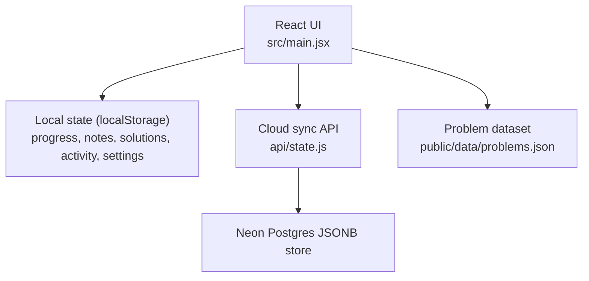
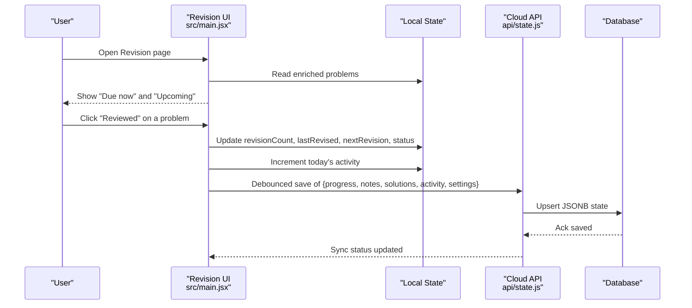
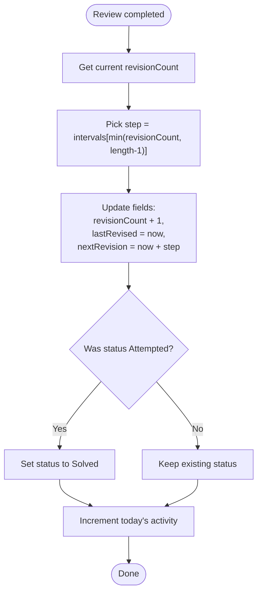
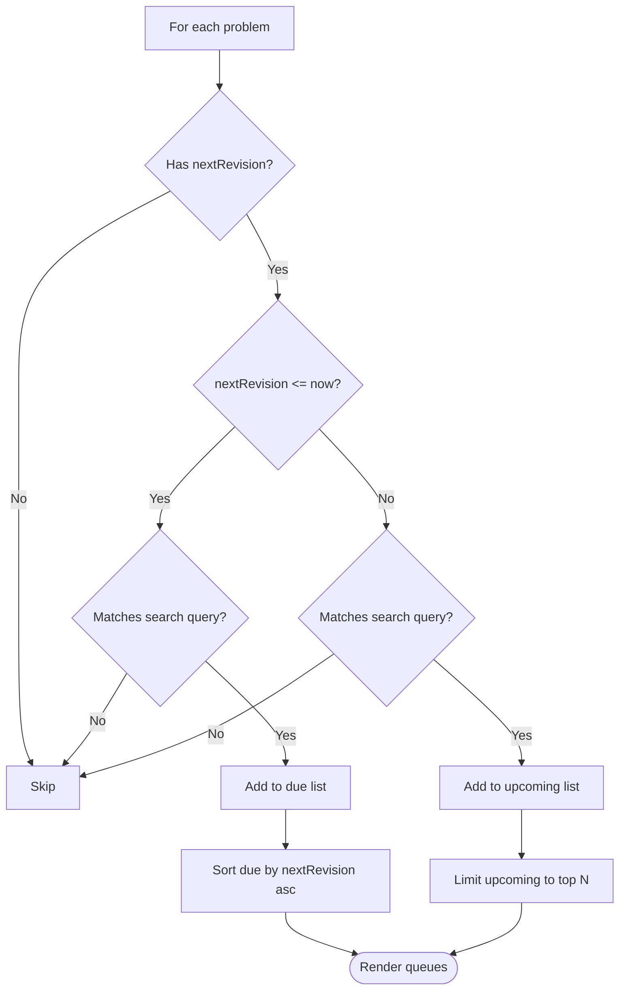
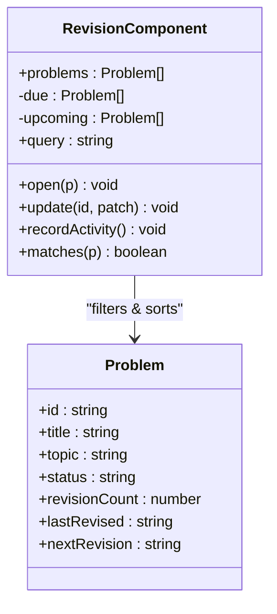
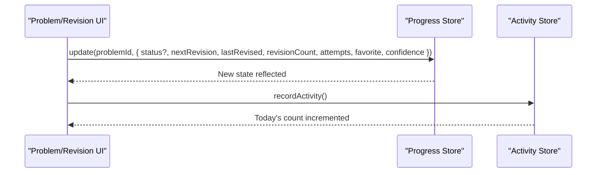
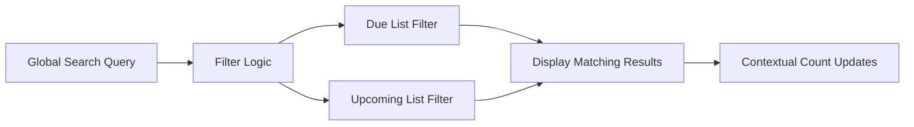
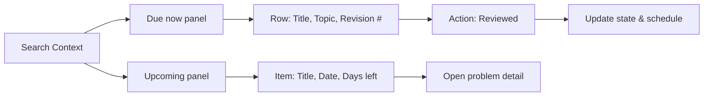
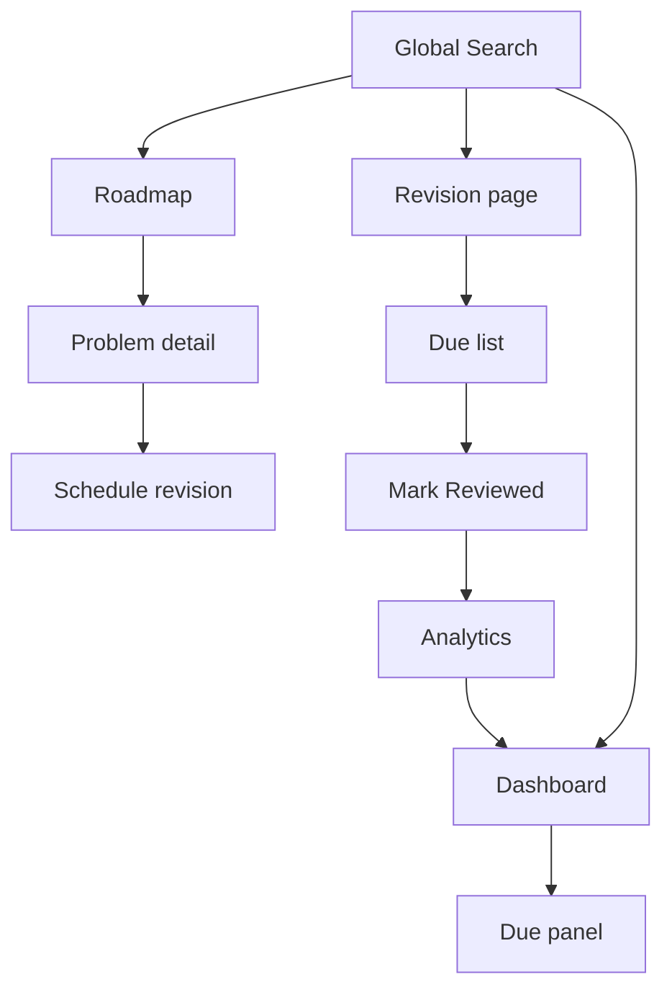
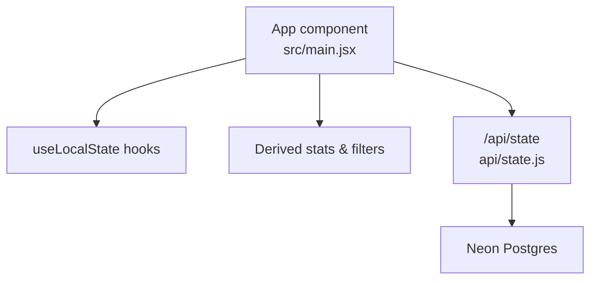

# Revision System

<cite>
**Referenced Files in This Document**
- [main.jsx](file://src/main.jsx)
- [state.js](file://api/state.js)
- [README.md](file://README.md)
</cite>

## Update Summary
**Changes Made**
- Updated Global Search Integration section to document the new search functionality across revision categories
- Enhanced Due Calculation Logic section to include search filtering capabilities
- Updated Visual Design section to reflect search-aware UI elements
- Added new section on Search Integration for comprehensive coverage of the feature

## Table of Contents
1. [Introduction](#introduction)
2. [Project Structure](#project-structure)
3. [Core Components](#core-components)
4. [Architecture Overview](#architecture-overview)
5. [Detailed Component Analysis](#detailed-component-analysis)
6. [Dependency Analysis](#dependency-analysis)
7. [Performance Considerations](#performance-considerations)
8. [Troubleshooting Guide](#troubleshooting-guide)
9. [Conclusion](#conclusion)

## Introduction
This document explains the spaced repetition revision system used by the DSA Tracker. It covers the scheduling algorithm with fixed intervals, how due problems are calculated, the revision completion workflow, queue management for upcoming and due items, activity tracking integration, and the update function that advances revision counts, next revision dates, and status progression. It also describes the visual design of due vs upcoming sections, the review button behavior, and how revisions fit into the overall learning workflow. **Updated**: The system now integrates with global search, allowing users to find and manage revision tasks more efficiently across due and upcoming categories.

## Project Structure
The revision system is implemented as part of a single-page React application. The core logic lives in the main application file, while cloud persistence is handled by a serverless API route. Problem data is bundled locally and loaded at runtime.

**Diagram sources**
- [main.jsx:47-115](file://src/main.jsx#L47-L115)
- [state.js:23-50](file://api/state.js#L23-L50)

**Section sources**
- [main.jsx:47-115](file://src/main.jsx#L47-L115)
- [state.js:23-50](file://api/state.js#L23-L50)
- [README.md:5-17](file://README.md#L5-L17)

## Core Components
- Spaced repetition schedule: Fixed intervals of 1, 3, 7, 14, and 30 days define when the next revision should occur after each review.
- Due calculation: A problem is due if it has a scheduled next revision date that is on or before the current time.
- Upcoming list: Problems with future next revision dates are shown as upcoming, sorted by soonest first and limited to a small number for quick scanning.
- Completion workflow: Marking a problem as reviewed increments the revision count, updates last revised timestamp, schedules the next revision using the appropriate interval, and promotes status from Attempted to Solved when applicable. Activity is recorded for the current day.
- Update function: Centralized patching of progress fields including status, attempts, confidence, revision count, last revised, and next revision date.
- **Global search integration**: The revision system now supports filtering by search queries across both due and upcoming categories, enabling users to quickly locate specific revision tasks.

**Section sources**
- [main.jsx:12-12](file://src/main.jsx#L12-L12)
- [main.jsx:247-248](file://src/main.jsx#L247-L248)
- [main.jsx:442-455](file://src/main.jsx#L442-L455)
- [main.jsx:476-480](file://src/main.jsx#L476-L480)
- [main.jsx:499-500](file://src/main.jsx#L499-L500)

## Architecture Overview
The revision system integrates three layers:
- UI layer: Renders due and upcoming lists, provides "Reviewed" actions, and exposes per-problem scheduling controls.
- State layer: Maintains local state for progress, notes, solutions, activity, and settings; computes derived values like stats and filtered lists.
- Persistence layer: Optionally syncs state to a cloud database via an authenticated API endpoint.

**Diagram sources**
- [main.jsx:247-248](file://src/main.jsx#L247-L248)
- [main.jsx:100-113](file://src/main.jsx#L100-L113)
- [state.js:23-50](file://api/state.js#L23-L50)

## Detailed Component Analysis

### Spaced Repetition Algorithm
- Intervals: The system uses a fixed array of day intervals: 1, 3, 7, 14, 30.
- Next revision computation: After a review, the next revision date is computed by adding the current interval based on the current revision count. If the count exceeds the number of intervals, the last interval is used.
- Status promotion: When marking a problem as reviewed, if its status was Attempted, it advances to Solved.

**Diagram sources**
- [main.jsx:12-12](file://src/main.jsx#L12-L12)
- [main.jsx:247-248](file://src/main.jsx#L247-L248)

**Section sources**
- [main.jsx:12-12](file://src/main.jsx#L12-L12)
- [main.jsx:247-248](file://src/main.jsx#L247-L248)

### Due Calculation Logic
- A problem is considered due if it has a next revision date and that date is less than or equal to the current time.
- Due list sorting: Problems are sorted by next revision date ascending so the most overdue appear first.
- **Search filtering**: Both due and upcoming lists now support filtering by search queries, matching against problem titles, topics, and patterns.

**Diagram sources**
- [main.jsx:247-248](file://src/main.jsx#L247-L248)
- [main.jsx:499-500](file://src/main.jsx#L499-L500)

**Section sources**
- [main.jsx:247-248](file://src/main.jsx#L247-L248)
- [main.jsx:499-500](file://src/main.jsx#L499-L500)

### Revision Queue Management
- Due now: Displays all problems whose next revision is due or overdue, sorted by earliest due date. Each row shows title, topic, and the upcoming revision number.
- Upcoming: Displays the next ten scheduled revisions, sorted by soonest first, showing the scheduled date and days until due.
- **Search integration**: Both queues respond to global search queries, filtering results in real-time across title, topic, and pattern fields.

**Diagram sources**
- [main.jsx:247-248](file://src/main.jsx#L247-L248)
- [main.jsx:499-500](file://src/main.jsx#L499-L500)

**Section sources**
- [main.jsx:247-248](file://src/main.jsx#L247-L248)
- [main.jsx:499-500](file://src/main.jsx#L499-L500)

### Update Function and Status Progression
- The central update function patches a problem's progress entry with provided fields.
- When marking a problem as reviewed:
  - Increments revisionCount.
  - Sets lastRevised to the current timestamp.
  - Computes nextRevision using the current interval.
  - Promotes status from Attempted to Solved if applicable.
  - Records activity for the current day.
- Manual scheduling: Users can reschedule a revision from the problem view, which updates nextRevision, lastRevised, and revisionCount accordingly.

**Diagram sources**
- [main.jsx:140-141](file://src/main.jsx#L140-L141)
- [main.jsx:247-248](file://src/main.jsx#L247-L248)
- [main.jsx:442-455](file://src/main.jsx#L442-L455)
- [main.jsx:476-480](file://src/main.jsx#L476-L480)

**Section sources**
- [main.jsx:140-141](file://src/main.jsx#L140-L141)
- [main.jsx:247-248](file://src/main.jsx#L247-L248)
- [main.jsx:442-455](file://src/main.jsx#L442-L455)
- [main.jsx:476-480](file://src/main.jsx#L476-L480)

### Global Search Integration
- **Unified search experience**: The global search bar works consistently across all pages, including the revision page.
- **Real-time filtering**: As users type in the search bar, both due and upcoming revision lists are filtered instantly.
- **Multi-field matching**: Search queries match against problem titles, topics, and patterns simultaneously.
- **Contextual feedback**: The due count displays the number of matching results when a search query is active.
- **Empty state handling**: Clear messages indicate when no revisions match the current search criteria.

**Diagram sources**
- [main.jsx:349-428](file://src/main.jsx#L349-L428)
- [main.jsx:499-500](file://src/main.jsx#L499-L500)

**Section sources**
- [main.jsx:349-428](file://src/main.jsx#L349-L428)
- [main.jsx:499-500](file://src/main.jsx#L499-L500)

### Visual Design: Due vs Upcoming Sections
- Due section:
  - Header indicates the number of revisions due, with contextual updates when search is active.
  - Each item includes a status indicator, title, topic, and the next revision number.
  - A "Reviewed" action button advances the revision and records activity.
- Upcoming section:
  - Shows the next scheduled revisions with their dates and days remaining.
  - Clicking an item opens the problem detail view.
- **Search-aware UI**: Both sections provide clear feedback about search context and result counts.

**Diagram sources**
- [main.jsx:247-248](file://src/main.jsx#L247-L248)
- [main.jsx:499-500](file://src/main.jsx#L499-L500)

**Section sources**
- [main.jsx:247-248](file://src/main.jsx#L247-L248)
- [main.jsx:499-500](file://src/main.jsx#L499-L500)

### Integration with Overall Learning Workflow
- Dashboard highlights due revisions and suggests continuing the roadmap.
- Analytics surfaces due counts and activity trends to guide focus.
- Problem detail view supports scheduling revisions manually and displays the "Revision ladder" to visualize progress through intervals.
- **Global navigation**: Users can access revision tasks from anywhere in the app using the global search, improving discoverability and efficiency.

**Diagram sources**
- [main.jsx:175-185](file://src/main.jsx#L175-L185)
- [main.jsx:247-248](file://src/main.jsx#L247-L248)
- [main.jsx:476-480](file://src/main.jsx#L476-L480)
- [main.jsx:578-582](file://src/main.jsx#L578-L582)
- [main.jsx:349-428](file://src/main.jsx#L349-L428)

**Section sources**
- [main.jsx:175-185](file://src/main.jsx#L175-L185)
- [main.jsx:247-248](file://src/main.jsx#L247-L248)
- [main.jsx:476-480](file://src/main.jsx#L476-L480)
- [main.jsx:578-582](file://src/main.jsx#L578-L582)
- [main.jsx:349-428](file://src/main.jsx#L349-L428)

## Dependency Analysis
- UI depends on:
  - Local state hooks for progress, notes, solutions, activity, and settings.
  - Derived computations for stats, filtering, and grouping.
  - Cloud sync API for optional persistence.
- Cloud API depends on:
  - Session validation.
  - Database connection and schema creation.
  - Sanitization of incoming state.

**Diagram sources**
- [main.jsx:29-33](file://src/main.jsx#L29-L33)
- [main.jsx:116-126](file://src/main.jsx#L116-L126)
- [state.js:23-50](file://api/state.js#L23-L50)

**Section sources**
- [main.jsx:29-33](file://src/main.jsx#L29-L33)
- [main.jsx:116-126](file://src/main.jsx#L116-L126)
- [state.js:23-50](file://api/state.js#L23-L50)

## Performance Considerations
- Filtering and sorting are performed on in-memory arrays derived from enriched problems; this is efficient for typical problem set sizes.
- Debounced cloud saves reduce network overhead during frequent edits.
- Upcoming list is capped to a small number to keep rendering lightweight.
- Local-first storage avoids unnecessary remote calls when offline.
- **Search performance**: Real-time search filtering uses efficient string matching algorithms and is optimized for responsive user experience.

## Troubleshooting Guide
- No revisions due: Ensure problems have been marked Attempted or higher and that a next revision date has been scheduled.
- Revisions not advancing: Confirm that the "Reviewed" action is triggered and that the update function applies changes to progress and activity.
- Cloud sync issues: Verify authentication and environment configuration; check sync status indicators and error messages.
- **Search not working**: Ensure the global search input is focused and that the query matches problem titles, topics, or patterns. Try clearing the search to see all results.

**Section sources**
- [main.jsx:247-248](file://src/main.jsx#L247-L248)
- [main.jsx:100-113](file://src/main.jsx#L100-L113)
- [state.js:23-50](file://api/state.js#L23-L50)
- [main.jsx:349-428](file://src/main.jsx#L349-L428)

## Conclusion
The revision system implements a simple yet effective spaced repetition schedule using fixed intervals. It clearly separates due and upcoming items, streamlines the review workflow, and integrates tightly with activity tracking and analytics. The centralized update function ensures consistent state transitions, while optional cloud sync preserves progress across devices. **Updated**: The integration with global search significantly enhances usability by allowing users to quickly locate and manage revision tasks across both due and upcoming categories from anywhere in the application. Together, these features support a focused, sustainable learning loop aligned with mastery goals.