# Roadmap Component

<cite>
**Referenced Files in This Document**
- [main.jsx](file://src/main.jsx)
- [problems.json](file://data/problems.json)
- [topics.json](file://data/topics.json)
- [patterns.json](file://data/patterns.json)
</cite>

## Update Summary
**Changes Made**
- Integrated RowExtLinks component to provide contextual action buttons on problem entries
- Added immediate access to solutions and external resources directly from roadmap rows
- Enhanced ProblemRow component with contextual action buttons for personal solutions, editorial links, LeetCode access, and video explanations
- Updated visual legend to include new contextual action indicators
- Improved user interaction patterns for quick access to supplementary resources

## Table of Contents
1. [Introduction](#introduction)
2. [Project Structure](#project-structure)
3. [Core Components](#core-components)
4. [Architecture Overview](#architecture-overview)
5. [Detailed Component Analysis](#detailed-component-analysis)
6. [Dependency Analysis](#dependency-analysis)
7. [Performance Considerations](#performance-considerations)
8. [Troubleshooting Guide](#troubleshooting-guide)
9. [Conclusion](#conclusion)

## Introduction
This document explains the Roadmap component that organizes practice problems by topic and pattern, supports advanced filtering and sorting, and provides collapsible groups with progress indicators and search. It also documents the groupByTopicPattern utility, enhanced filter logic with confidence-based filtering, user interactions for expanding/collapsing sections, visual legend, problem row components with contextual action buttons, and navigation integration. The component now features enhanced search integration with dynamic filtering, improved collapse/expand behavior during searches, better visual feedback when search terms are active, and contextual action buttons for immediate resource access.

## Project Structure
The application is a single-page React app built with Vite. The core UI and logic live in one file, while problem data and metadata are bundled as JSON files.

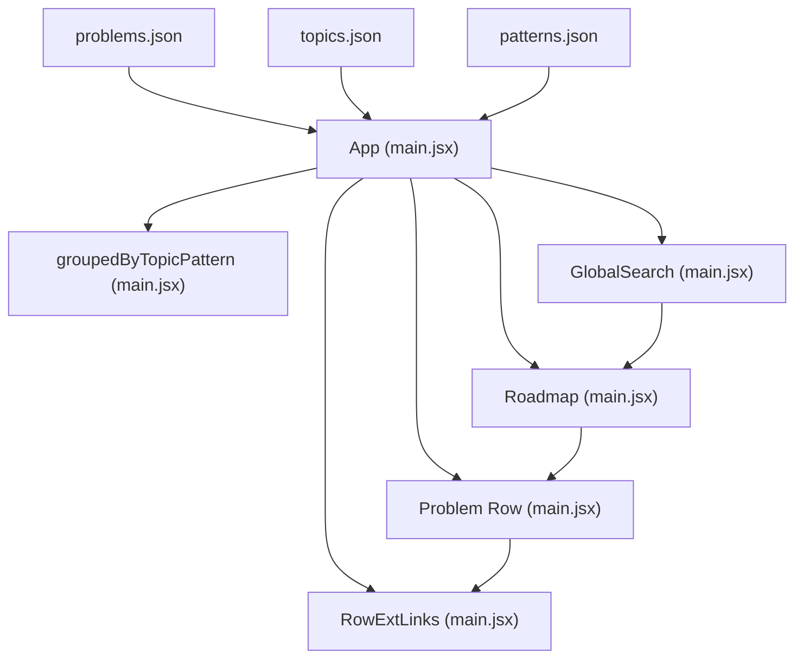

**Diagram sources**
- [main.jsx:47-173](file://src/main.jsx#L47-L173)
- [main.jsx:190-245](file://src/main.jsx#L190-L245)
- [main.jsx:349-428](file://src/main.jsx#L349-L428)
- [main.jsx:432-446](file://src/main.jsx#L432-L446)
- [problems.json:1-200](file://data/problems.json#L1-L200)
- [topics.json:1-20](file://data/topics.json#L1-L20)
- [patterns.json:1-91](file://data/patterns.json#L1-L91)

**Section sources**
- [main.jsx:1-173](file://src/main.jsx#L1-L173)
- [problems.json:1-200](file://data/problems.json#L1-L200)
- [topics.json:1-20](file://data/topics.json#L1-L20)
- [patterns.json:1-91](file://data/patterns.json#L1-L91)

## Core Components
- App shell: loads problem data, manages global state (progress, notes, solutions, activity, settings), search query, and page routing between Dashboard, Roadmap, Revision, Patterns, Analytics, Settings, and Problem detail.
- **Enhanced GlobalSearch**: Provides cross-page search functionality with keyboard shortcuts (/ key), result grouping, and navigation to problems, patterns, and LLD chapters.
- Roadmap: renders grouped topics and patterns, filters/sorts with confidence support, shows counts and legend, and handles collapse/expand toggles with search-aware behavior.
- ProblemRow: displays a single problem entry with status dot, title, topic/pattern, difficulty badge, optional tags, and contextual action buttons; clicking opens the problem detail.
- **RowExtLinks**: provides contextual action buttons for immediate access to personal solutions, editorial links, LeetCode problems, and video explanations directly from problem rows.
- groupByTopicPattern: utility to organize a list into nested topic → pattern → problems structure.

Key responsibilities:
- Hierarchical grouping by topic and pattern
- Advanced filtering by topic, status, difficulty, pattern, confidence, favorites
- Sorting by order, title, difficulty, weakest confidence, strongest confidence
- Collapsible topic and pattern groups with search-aware defaults
- Progress indicators per group
- Search across title, topic, and pattern with real-time filtering
- Contextual action buttons for immediate resource access
- Navigation to problem detail and pattern groups

**Section sources**
- [main.jsx:47-173](file://src/main.jsx#L47-L173)
- [main.jsx:190-245](file://src/main.jsx#L190-L245)
- [main.jsx:349-428](file://src/main.jsx#L349-L428)
- [main.jsx:432-446](file://src/main.jsx#L432-L446)
- [main.jsx:188-189](file://src/main.jsx#L188-L189)

## Architecture Overview
The Roadmap view is rendered conditionally based on the current page. It receives precomputed enriched problems, available topics, patterns, and filter state from the parent App. Filtering and grouping are computed via memoized values to avoid unnecessary re-renders. The enhanced search system integrates globally across all pages while providing specific filtering for the roadmap view. The RowExtLinks component enhances problem rows with contextual actions that don't require navigation to the full problem view.

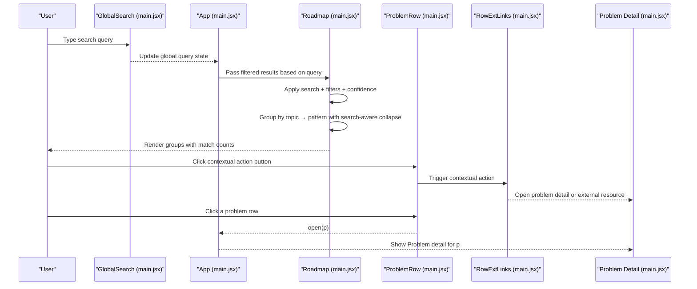

**Diagram sources**
- [main.jsx:47-173](file://src/main.jsx#L47-L173)
- [main.jsx:349-428](file://src/main.jsx#L349-L428)
- [main.jsx:127-139](file://src/main.jsx#L127-L139)
- [main.jsx:190-245](file://src/main.jsx#L190-L245)
- [main.jsx:432-446](file://src/main.jsx#L432-L446)
- [main.jsx:188-189](file://src/main.jsx#L188-L189)

## Detailed Component Analysis

### Enhanced GlobalSearch Component
The global search component provides cross-page search functionality with intelligent result grouping and navigation:

- **Keyboard Shortcuts**: Press "/" to focus search from anywhere (unless already typing in input fields)
- **Real-time Results**: Shows up to 7 problem matches, 4 pattern matches, and 3 LLD chapter matches
- **Result Ranking**: Prioritizes exact title matches and mastered problems
- **Grouped Display**: Organizes results by type (Problems, Patterns, LLD Lab) with section headers
- **Navigation Integration**: Clicking results navigates to appropriate destinations (problem details, pattern groups, or LLD chapters)
- **Accessibility**: Full keyboard navigation with arrow keys and Enter selection

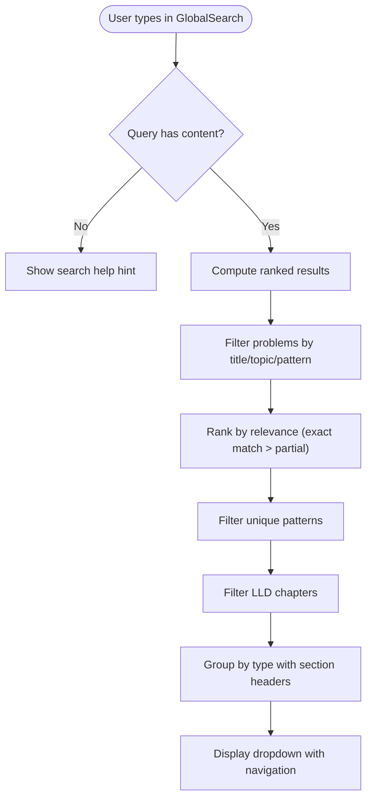

**Diagram sources**
- [main.jsx:349-428](file://src/main.jsx#L349-L428)

**Section sources**
- [main.jsx:349-428](file://src/main.jsx#L349-L428)

### RowExtLinks Component
The RowExtLinks component provides contextual action buttons directly on problem rows, enabling immediate access to supplementary resources without navigating to the full problem view:

- **Personal Solution Access**: PenLine icon links to saved personal solutions for the problem
- **Editorial Solution Link**: FileText icon opens TakeUForward editorial solutions in new tabs
- **LeetCode Integration**: Code2 icon provides direct access to LeetCode problems
- **Video Explanation**: Play icon opens video explanations for problem walkthroughs
- **Contextual Actions**: Buttons appear only when relevant resources are available
- **Event Handling**: Prevents event propagation to avoid triggering row click actions

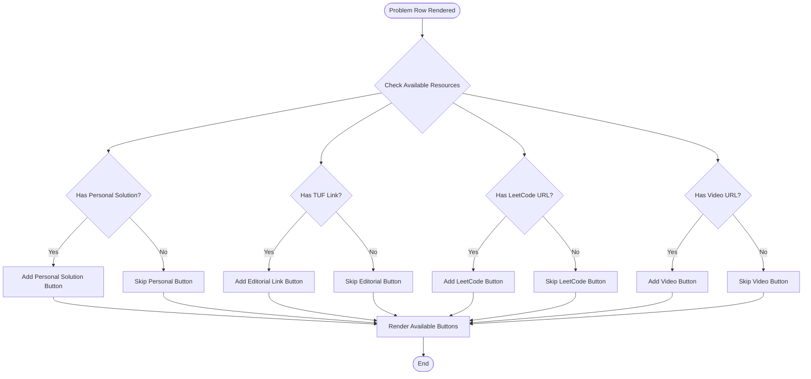

**Diagram sources**
- [main.jsx:432-446](file://src/main.jsx#L432-L446)

**Section sources**
- [main.jsx:432-446](file://src/main.jsx#L432-L446)

### groupByTopicPattern Utility
Organizes an array of problems into a nested object keyed by topic, then by pattern, containing arrays of problems.

- Input: list of problem objects with topic and pattern fields
- Output: { [topic]: { [pattern]: [problems...] } }
- Complexity: O(n) time, O(n) space where n is number of problems

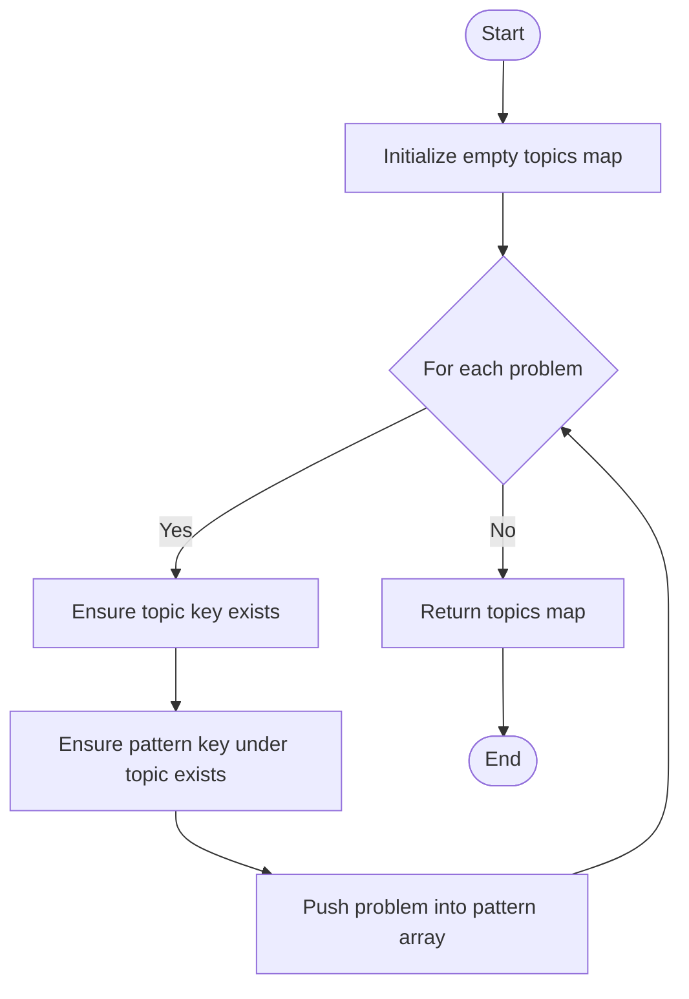

**Diagram sources**
- [main.jsx:448-455](file://src/main.jsx#L448-L455)

**Section sources**
- [main.jsx:448-455](file://src/main.jsx#L448-L455)

### Enhanced Filtering and Sorting Logic
Filtering combines multiple criteria including the new confidence-based filtering and search integration:

- **Text search**: Real-time filtering across title, topic, and pattern fields
- Topic selector
- Status selector  
- Difficulty selector
- Pattern selector (derived from selected topic)
- Confidence selector (Weak, Learning, Strong, Interview Ready, Not set)
- Favorites toggle

Sorting options now include:
- Order (default)
- Title (alphabetical)
- Difficulty (Easy → Medium → Hard)
- Weakest (problems marked Weak first)
- **Strongest** (problems with highest confidence first - NEW)

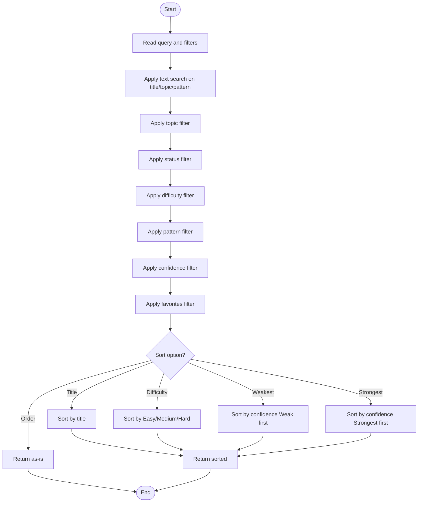

**Updated** Enhanced filtering now includes confidence-based filtering with support for "Not set" cases and a new 'Strongest' sort option using confidence ranking.

**Diagram sources**
- [main.jsx:256-270](file://src/main.jsx#L256-L270)

**Section sources**
- [main.jsx:256-270](file://src/main.jsx#L256-L270)

### Filter Validation and Sanitization
The system now includes robust filter validation through the `sanitizeFilters()` function:
- Validates filter structure and types
- Ensures only valid filter values are accepted
- Supports all confidence levels: "🔴 Weak", "🟡 Learning", "🟢 Strong", "🔵 Interview Ready", "Not set"
- Validates sort options including the new "Strongest" option
- Provides default values for missing or invalid filters

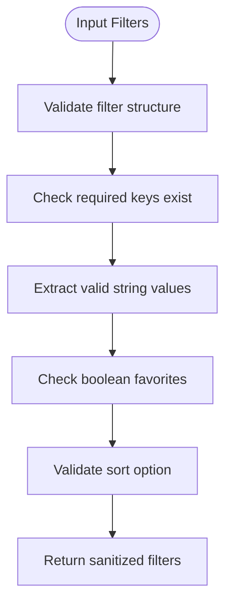

**Diagram sources**
- [main.jsx:84-93](file://src/main.jsx#L84-L93)

**Section sources**
- [main.jsx:84-93](file://src/main.jsx#L84-L93)

### Enhanced Roadmap Rendering and Grouping
The Roadmap component now features enhanced search integration with improved collapse/expand behavior:

- Computes filtered list once using memoization with confidence support
- Groups filtered problems by topic and pattern
- **Enhanced Collapse Behavior**: During searches, pattern sections automatically expand to show matching results unless manually collapsed
- Renders collapsible topic blocks with solved/total counts
- Within each topic, renders collapsible pattern blocks with their own counts
- Displays search match counts and active search indicators
- Renders problem rows inside expanded patterns with contextual action buttons
- Displays a legend indicating status dots for solved, not started, and weak

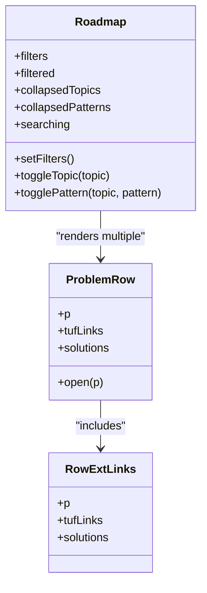

**Diagram sources**
- [main.jsx:457-513](file://src/main.jsx#L457-L513)
- [main.jsx:446-446](file://src/main.jsx#L446-L446)
- [main.jsx:432-446](file://src/main.jsx#L432-L446)

**Section sources**
- [main.jsx:457-513](file://src/main.jsx#L457-L513)

### Enhanced User Interaction Patterns
- **Global Search**: Search input updates a global query used by filtering across all pages
- Filter dropdowns update roadmapFilters state; pattern options are constrained by selected topic
- **New**: Confidence filter dropdown allows filtering by confidence level or "Not set"
- **New**: Sort dropdown includes "Strongest" option for ordering by confidence
- Favorites toggle filters to only favorite problems
- Sorting changes ordering without altering visibility
- **Enhanced**: Topic header toggles expand/collapse all patterns within that topic
- **Enhanced**: Pattern header toggles expand/collapse its problem list with search-aware defaults
- **Enhanced**: Contextual action buttons provide immediate access to resources without navigation
- Clicking a problem row navigates to the Problem detail page
- **New**: Keyboard shortcuts (/ to focus search, arrow keys for navigation, Enter to select)

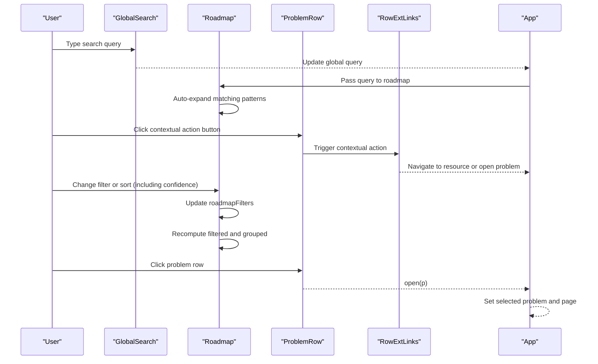

**Diagram sources**
- [main.jsx:349-428](file://src/main.jsx#L349-L428)
- [main.jsx:256-270](file://src/main.jsx#L256-L270)
- [main.jsx:457-513](file://src/main.jsx#L457-L513)
- [main.jsx:432-446](file://src/main.jsx#L432-L446)
- [main.jsx:188-189](file://src/main.jsx#L188-L189)

### Visual Legend and Progress Indicators
- Legend shows status semantics for dots: done (Solved/Mastered), todo (Not Started), weak (confidence Weak)
- Topic block shows solved/total count
- Pattern block shows solved/count for its problems
- ProblemRow shows a small status dot aligned with the problem's current status
- **Enhanced**: Contextual action buttons appear next to problem entries for immediate resource access
- **Enhanced**: Confidence levels are now visible in analytics and can be filtered
- **Enhanced**: Active search indicators showing match counts and search terms
- **Enhanced**: Visual feedback when search terms are active with highlighted match counts

**Section sources**
- [main.jsx:474-482](file://src/main.jsx#L474-L482)
- [main.jsx:494-509](file://src/main.jsx#L494-L509)
- [main.jsx:446-446](file://src/main.jsx#L446-L446)
- [main.jsx:432-446](file://src/main.jsx#L432-L446)

### Data Model and Enrichment
- Problems are loaded from bundled JSON and enriched with local progress (status, confidence, nextRevision, etc.)
- Topics and patterns are derived from the dataset; pattern options are scoped to the selected topic
- **Enhanced**: Confidence system includes four levels: Weak, Learning, Strong, Interview Ready
- Enriched problems feed filtering, grouping, and rendering
- **Enhanced**: Global search works across enriched problem data for comprehensive results
- **Enhanced**: RowExtLinks uses enriched problem data to determine available contextual actions

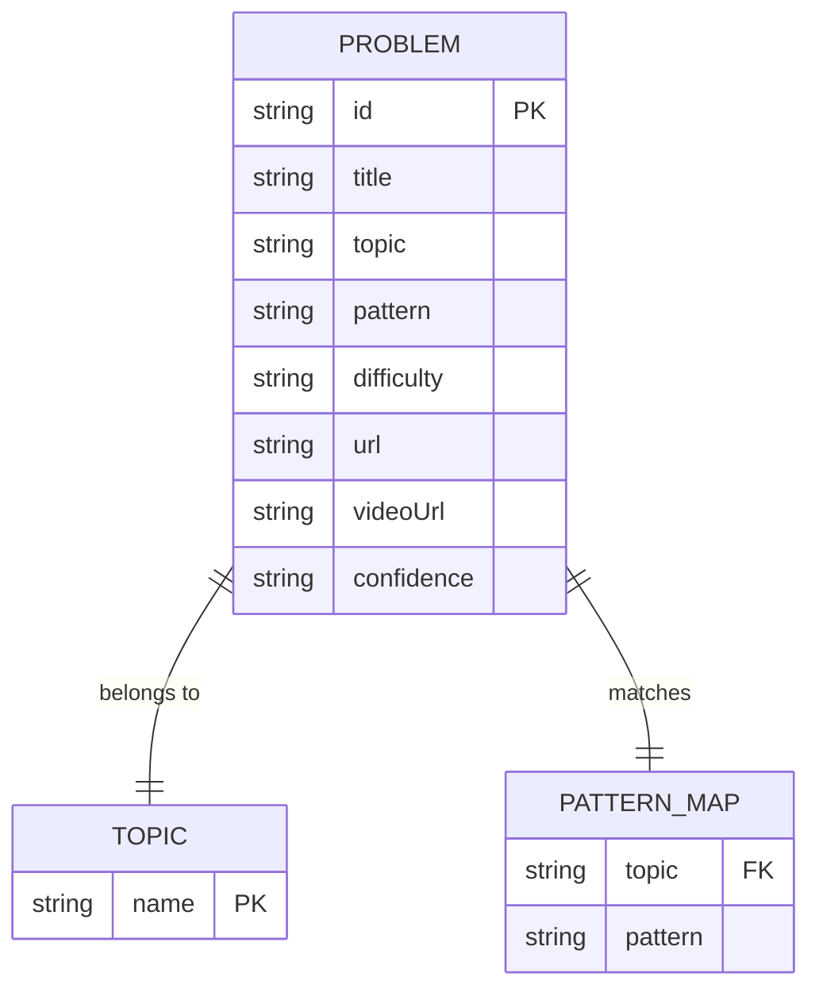

**Diagram sources**
- [problems.json:1-200](file://data/problems.json#L1-L200)
- [topics.json:1-20](file://data/topics.json#L1-L20)
- [patterns.json:1-91](file://data/patterns.json#L1-L91)

**Section sources**
- [main.jsx:47-115](file://src/main.jsx#L47-L115)
- [problems.json:1-200](file://data/problems.json#L1-L200)
- [topics.json:1-20](file://data/topics.json#L1-L20)
- [patterns.json:1-91](file://data/patterns.json#L1-L91)

## Dependency Analysis
- App depends on:
  - Local storage hooks for progress, notes, solutions, activity, settings
  - Bundled JSON for problems, solutions, tuf-links
  - API routes for cloud sync (auth, state)
- **Enhanced GlobalSearch** depends on:
  - App-provided enriched problems, pattern groups, and LLD chapters
  - Navigation functions for opening problems and navigating to patterns/chapters
- Roadmap depends on:
  - App-provided enriched problems, topics, patterns, filters
  - groupByTopicPattern utility
  - ProblemRow component
  - **Enhanced**: Confidence filtering and sorting logic
  - **Enhanced**: Query state for search-aware collapse behavior
- ProblemRow depends on:
  - Problem object shape (id, title, topic, pattern, difficulty, status, favorite, confidence)
  - **Enhanced**: RowExtLinks component for contextual actions
  - **Enhanced**: tufLinks and solutions data for contextual action availability
- RowExtLinks depends on:
  - Problem object with URL and videoUrl properties
  - tufLinks data for editorial solution links
  - solutions data for personal solution detection

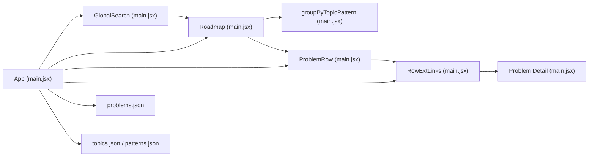

**Diagram sources**
- [main.jsx:47-173](file://src/main.jsx#L47-L173)
- [main.jsx:349-428](file://src/main.jsx#L349-L428)
- [main.jsx:190-245](file://src/main.jsx#L190-L245)
- [main.jsx:432-446](file://src/main.jsx#L432-L446)
- [problems.json:1-200](file://data/problems.json#L1-L200)
- [topics.json:1-20](file://data/topics.json#L1-L20)
- [patterns.json:1-91](file://data/patterns.json#L1-L91)

**Section sources**
- [main.jsx:47-173](file://src/main.jsx#L47-L173)
- [main.jsx:349-428](file://src/main.jsx#L349-L428)
- [main.jsx:190-245](file://src/main.jsx#L190-L245)
- [main.jsx:432-446](file://src/main.jsx#L432-L446)

## Performance Considerations
- Memoization:
  - Enriched problems computed once per change in problems or progress
  - Stats computed once per change in enriched set
  - Filtered list computed once per change in enriched, query, or filters (including confidence)
  - Grouped results computed once per change in filtered list
  - **Enhanced**: Global search results computed once per change in query, problems, pattern groups, and chapters
  - **Enhanced**: RowExtLinks computed efficiently per problem row with conditional rendering
- Filtering complexity:
  - Linear scan over enriched problems per filter change (now includes confidence checks)
  - **Enhanced**: Global search performs efficient filtering with ranking algorithm
- Grouping complexity:
  - Linear pass over filtered list to build nested structure
- **Enhanced**: Confidence-based filtering adds minimal overhead due to simple string comparisons
- **Enhanced**: Search-aware collapse behavior reduces unnecessary re-renders by maintaining collapse state
- **Enhanced**: RowExtLinks uses conditional rendering to minimize DOM operations when no contextual actions are available
- Recommendations:
  - Keep filter set minimal to reduce recomputation
  - Avoid deep nesting beyond topic → pattern unless necessary
  - Consider virtualization if problem lists grow very large
  - **Enhanced**: Global search limits results to prevent performance issues with large datasets
  - **Enhanced**: RowExtLinks prevents event propagation to avoid unnecessary re-renders

[No sources needed since this section provides general guidance]

## Troubleshooting Guide
- No problems match filters:
  - Verify that at least one filter is set to All or matches existing data
  - Check that the selected topic has associated patterns
  - **New**: Check confidence filter settings - "Not set" only shows problems without confidence values
  - **New**: Clear search query if no results appear during search
- Pattern options reset:
  - If a selected pattern becomes invalid after changing topic, it resets to All automatically
- Cloud sync errors:
  - Auth failures show error messages in Settings
  - Sync status reflects checking, syncing, synced, error, or signed-out states
- Data loading issues:
  - If problem data fails to load, a toast message indicates failure
- **New**: Filter validation issues:
  - Invalid filter values are automatically sanitized to defaults
  - Confidence values must match exact strings: "🔴 Weak", "🟡 Learning", "🟢 Strong", "🔵 Interview Ready"
- **New**: Search functionality issues:
  - Press "/" key to focus search if keyboard shortcut doesn't work
  - Search results may be limited to top matches (7 problems, 4 patterns, 3 chapters)
  - Clear search with Escape key to return to normal filtering
- **New**: Contextual action button issues:
  - Action buttons only appear when corresponding resources are available
  - Personal solution button requires saved approaches for the problem
  - External links open in new tabs to maintain app context
  - Event propagation is prevented to avoid triggering row navigation

**Section sources**
- [main.jsx:151-155](file://src/main.jsx#L151-L155)
- [main.jsx:90-99](file://src/main.jsx#L90-L99)
- [main.jsx:586-605](file://src/main.jsx#L586-L605)
- [main.jsx:84-93](file://src/main.jsx#L84-L93)
- [main.jsx:349-428](file://src/main.jsx#L349-L428)
- [main.jsx:432-446](file://src/main.jsx#L432-L446)

## Conclusion
The Roadmap component provides a clear, hierarchical view of problems organized by topic and pattern, with powerful enhanced filtering including confidence-based filtering and sorting capabilities. The new global search functionality seamlessly integrates across all pages while providing specific filtering for the roadmap view. Enhanced collapse/expand behavior during searches automatically reveals matching content, while the new 'Strongest' sort option and confidence filtering system allow users to focus on problems based on their mastery level. The integrated RowExtLinks component enhances the user experience by providing contextual action buttons directly on problem rows, enabling immediate access to personal solutions, editorial links, LeetCode problems, and video explanations without requiring navigation to the full problem view. The component integrates seamlessly with the rest of the app through shared state and navigation, offering progress indicators, contextual actions, and a consistent user experience for tracking learning and mastery.

[No sources needed since this section summarizes without analyzing specific files]