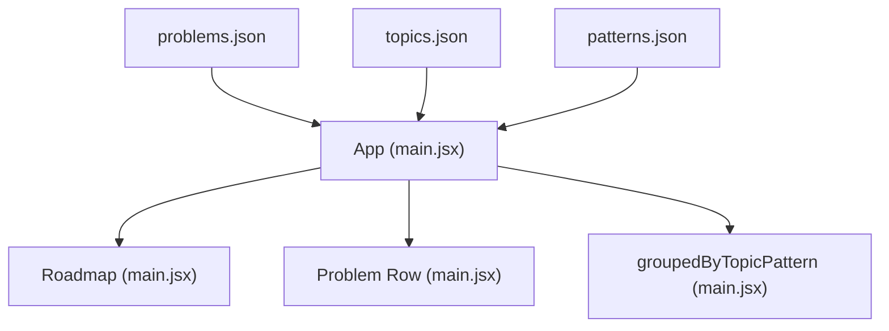
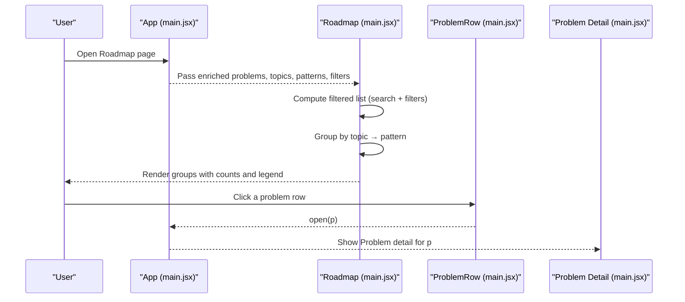
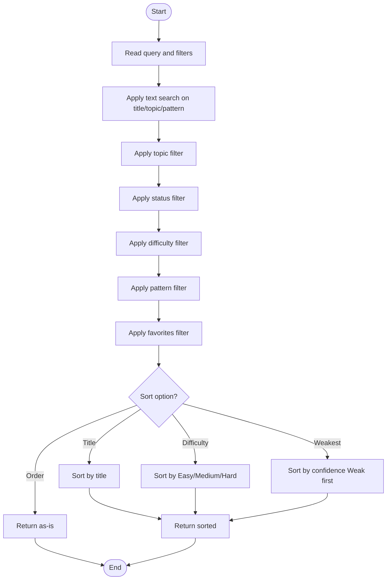
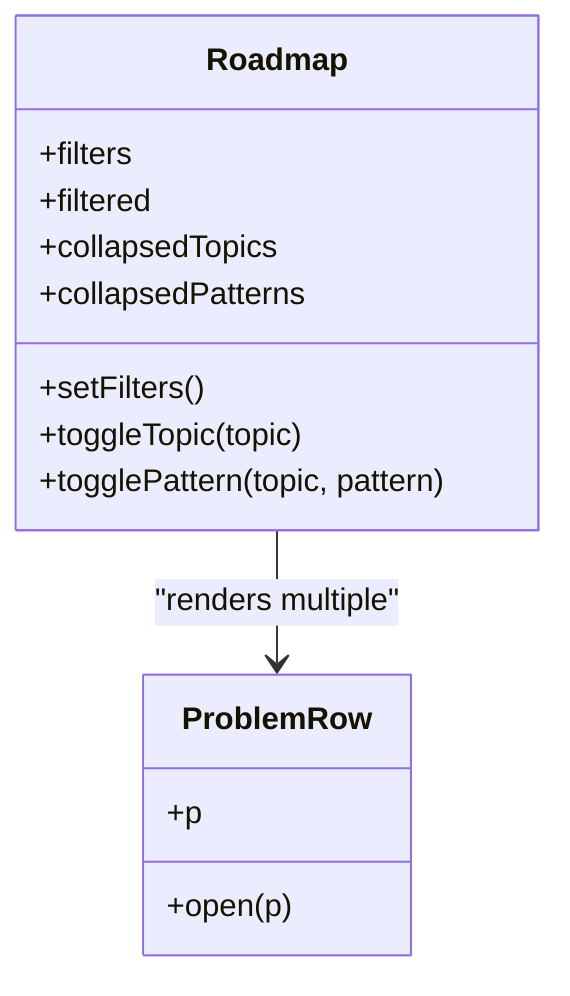
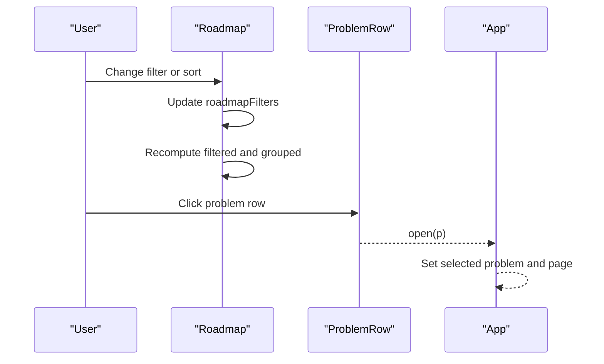
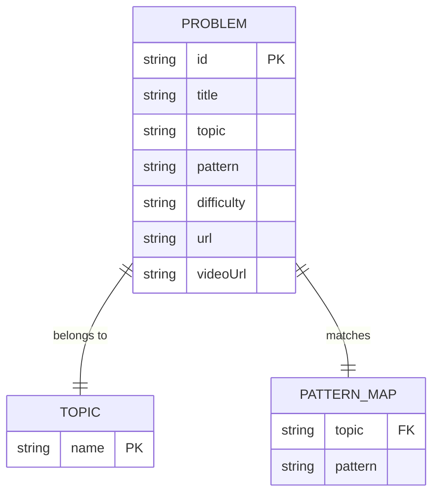
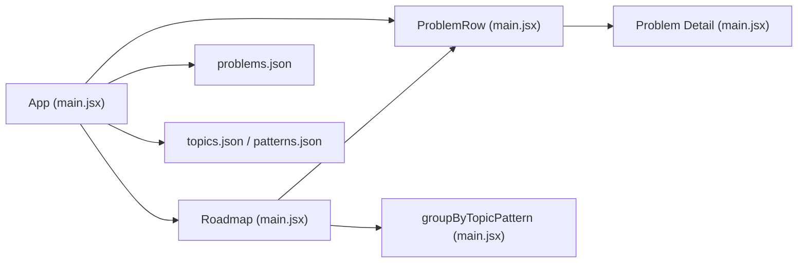

# Roadmap Component

<cite>
**Referenced Files in This Document**
- [main.jsx](file://src/main.jsx)
- [problems.json](file://data/problems.json)
- [topics.json](file://data/topics.json)
- [patterns.json](file://data/patterns.json)
</cite>

## Table of Contents
1. [Introduction](#introduction)
2. [Project Structure](#project-structure)
3. [Core Components](#core-components)
4. [Architecture Overview](#architecture-overview)
5. [Detailed Component Analysis](#detailed-component-analysis)
6. [Dependency Analysis](#dependency-analysis)
7. [Performance Considerations](#performance-considerations)
8. [Troubleshooting Guide](#troubleshooting-guide)
9. [Conclusion](#conclusion)

## Introduction
This document explains the Roadmap component that organizes practice problems by topic and pattern, supports filtering and sorting, and provides collapsible groups with progress indicators and search. It also documents the groupByTopicPattern utility, filter logic, user interactions for expanding/collapsing sections, visual legend, problem row components, and navigation integration.

## Project Structure
The application is a single-page React app built with Vite. The core UI and logic live in one file, while problem data and metadata are bundled as JSON files.

**Diagram sources**
- [main.jsx:47-173](file://src/main.jsx#L47-L173)
- [main.jsx:190-245](file://src/main.jsx#L190-L245)
- [problems.json:1-200](file://data/problems.json#L1-L200)
- [topics.json:1-20](file://data/topics.json#L1-L20)
- [patterns.json:1-91](file://data/patterns.json#L1-L91)

**Section sources**
- [main.jsx:1-173](file://src/main.jsx#L1-L173)
- [problems.json:1-200](file://data/problems.json#L1-L200)
- [topics.json:1-20](file://data/topics.json#L1-L20)
- [patterns.json:1-91](file://data/patterns.json#L1-L91)

## Core Components
- App shell: loads problem data, manages global state (progress, notes, solutions, activity, settings), search query, and page routing between Dashboard, Roadmap, Revision, Patterns, Analytics, Settings, and Problem detail.
- Roadmap: renders grouped topics and patterns, filters/sorts, shows counts and legend, and handles collapse/expand toggles.
- ProblemRow: displays a single problem entry with status dot, title, topic/pattern, difficulty badge, and optional tags; clicking opens the problem detail.
- groupByTopicPattern: utility to organize a list into nested topic → pattern → problems structure.

Key responsibilities:
- Hierarchical grouping by topic and pattern
- Filtering by topic, status, difficulty, pattern, favorites
- Sorting by order, title, difficulty, weakest confidence
- Collapsible topic and pattern groups
- Progress indicators per group
- Search across title, topic, and pattern
- Navigation to problem detail

**Section sources**
- [main.jsx:47-173](file://src/main.jsx#L47-L173)
- [main.jsx:190-245](file://src/main.jsx#L190-L245)
- [main.jsx:188-189](file://src/main.jsx#L188-L189)

## Architecture Overview
The Roadmap view is rendered conditionally based on the current page. It receives precomputed enriched problems, available topics, patterns, and filter state from the parent App. Filtering and grouping are computed via memoized values to avoid unnecessary re-renders.

**Diagram sources**
- [main.jsx:47-173](file://src/main.jsx#L47-L173)
- [main.jsx:127-139](file://src/main.jsx#L127-L139)
- [main.jsx:190-245](file://src/main.jsx#L190-L245)
- [main.jsx:188-189](file://src/main.jsx#L188-L189)

## Detailed Component Analysis

### groupByTopicPattern Utility
Organizes an array of problems into a nested object keyed by topic, then by pattern, containing arrays of problems.

- Input: list of problem objects with topic and pattern fields
- Output: { [topic]: { [pattern]: [problems...] } }
- Complexity: O(n) time, O(n) space where n is number of problems

**Diagram sources**
- [main.jsx:190-197](file://src/main.jsx#L190-L197)

**Section sources**
- [main.jsx:190-197](file://src/main.jsx#L190-L197)

### Filtering and Sorting Logic
Filtering combines:
- Text search across title, topic, and pattern
- Topic selector
- Status selector
- Difficulty selector
- Pattern selector (derived from selected topic)
- Favorites toggle

Sorting options:
- Order (default)
- Title (alphabetical)
- Difficulty (Easy → Medium → Hard)
- Weakest (problems marked Weak first)

**Diagram sources**
- [main.jsx:127-139](file://src/main.jsx#L127-L139)

**Section sources**
- [main.jsx:127-139](file://src/main.jsx#L127-L139)

### Roadmap Rendering and Grouping
- Computes filtered list once using memoization
- Groups filtered problems by topic and pattern
- Renders collapsible topic blocks with solved/total counts
- Within each topic, renders collapsible pattern blocks with their own counts
- Renders problem rows inside expanded patterns
- Displays a legend indicating status dots for solved, not started, and weak

**Diagram sources**
- [main.jsx:199-245](file://src/main.jsx#L199-L245)
- [main.jsx:188-189](file://src/main.jsx#L188-L189)

**Section sources**
- [main.jsx:199-245](file://src/main.jsx#L199-L245)

### User Interaction Patterns
- Search input updates a global query used by filtering
- Filter dropdowns update roadmapFilters state; pattern options are constrained by selected topic
- Favorites toggle filters to only favorite problems
- Sorting changes ordering without altering visibility
- Topic header toggles expand/collapse all patterns within that topic
- Pattern header toggles expand/collapse its problem list
- Clicking a problem row navigates to the Problem detail page

**Diagram sources**
- [main.jsx:127-139](file://src/main.jsx#L127-L139)
- [main.jsx:199-245](file://src/main.jsx#L199-L245)
- [main.jsx:188-189](file://src/main.jsx#L188-L189)

### Visual Legend and Progress Indicators
- Legend shows status semantics for dots: done (Solved/Mastered), todo (Not Started), weak (confidence Weak)
- Topic block shows solved/total count
- Pattern block shows solved/count for its problems
- ProblemRow shows a small status dot aligned with the problem’s current status

**Section sources**
- [main.jsx:209-218](file://src/main.jsx#L209-L218)
- [main.jsx:219-243](file://src/main.jsx#L219-L243)
- [main.jsx:188-189](file://src/main.jsx#L188-L189)

### Data Model and Enrichment
- Problems are loaded from bundled JSON and enriched with local progress (status, confidence, nextRevision, etc.)
- Topics and patterns are derived from the dataset; pattern options are scoped to the selected topic
- Enriched problems feed filtering, grouping, and rendering

**Diagram sources**
- [problems.json:1-200](file://data/problems.json#L1-L200)
- [topics.json:1-20](file://data/topics.json#L1-L20)
- [patterns.json:1-91](file://data/patterns.json#L1-L91)

**Section sources**
- [main.jsx:47-115](file://src/main.jsx#L47-L115)
- [problems.json:1-200](file://data/problems.json#L1-L200)
- [topics.json:1-20](file://data/topics.json#L1-L20)
- [patterns.json:1-91](file://data/patterns.json#L1-L91)

## Dependency Analysis
- App depends on:
  - Local storage hooks for progress, notes, solutions, activity, settings
  - Bundled JSON for problems, solutions, tuf-links
  - API routes for cloud sync (auth, state)
- Roadmap depends on:
  - App-provided enriched problems, topics, patterns, filters
  - groupByTopicPattern utility
  - ProblemRow component
- ProblemRow depends on:
  - Problem object shape (id, title, topic, pattern, difficulty, status, favorite)

**Diagram sources**
- [main.jsx:47-173](file://src/main.jsx#L47-L173)
- [main.jsx:190-245](file://src/main.jsx#L190-L245)
- [problems.json:1-200](file://data/problems.json#L1-L200)
- [topics.json:1-20](file://data/topics.json#L1-L20)
- [patterns.json:1-91](file://data/patterns.json#L1-L91)

**Section sources**
- [main.jsx:47-173](file://src/main.jsx#L47-L173)
- [main.jsx:190-245](file://src/main.jsx#L190-L245)

## Performance Considerations
- Memoization:
  - Enriched problems computed once per change in problems or progress
  - Stats computed once per change in enriched set
  - Filtered list computed once per change in enriched, query, or filters
  - Grouped results computed once per change in filtered list
- Filtering complexity:
  - Linear scan over enriched problems per filter change
- Grouping complexity:
  - Linear pass over filtered list to build nested structure
- Recommendations:
  - Keep filter set minimal to reduce recomputation
  - Avoid deep nesting beyond topic → pattern unless necessary
  - Consider virtualization if problem lists grow very large

[No sources needed since this section provides general guidance]

## Troubleshooting Guide
- No problems match filters:
  - Verify that at least one filter is set to All or matches existing data
  - Check that the selected topic has associated patterns
- Pattern options reset:
  - If a selected pattern becomes invalid after changing topic, it resets to All automatically
- Cloud sync errors:
  - Auth failures show error messages in Settings
  - Sync status reflects checking, syncing, synced, error, or signed-out states
- Data loading issues:
  - If problem data fails to load, a toast message indicates failure

**Section sources**
- [main.jsx:151-155](file://src/main.jsx#L151-L155)
- [main.jsx:90-99](file://src/main.jsx#L90-L99)
- [main.jsx:586-605](file://src/main.jsx#L586-L605)

## Conclusion
The Roadmap component provides a clear, hierarchical view of problems organized by topic and pattern, with powerful filtering, sorting, and collapsible sections. It integrates seamlessly with the rest of the app through shared state and navigation, offering progress indicators and a consistent user experience for tracking learning and mastery.

[No sources needed since this section summarizes without analyzing specific files]