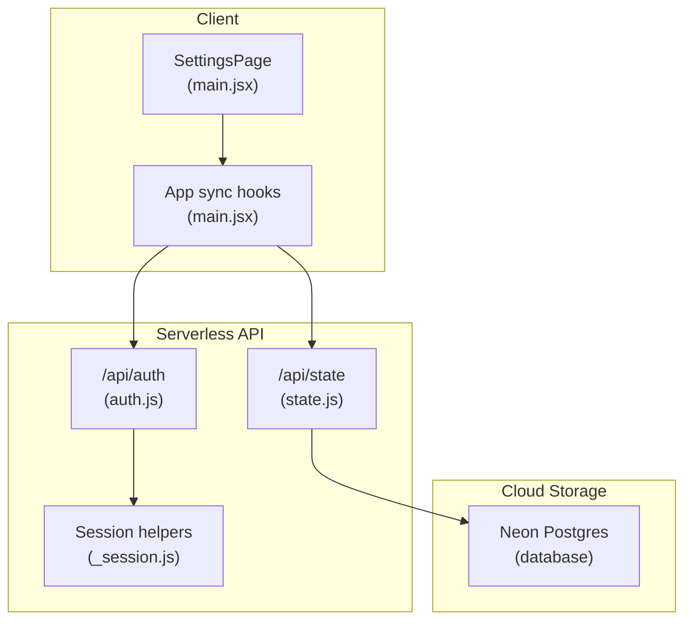
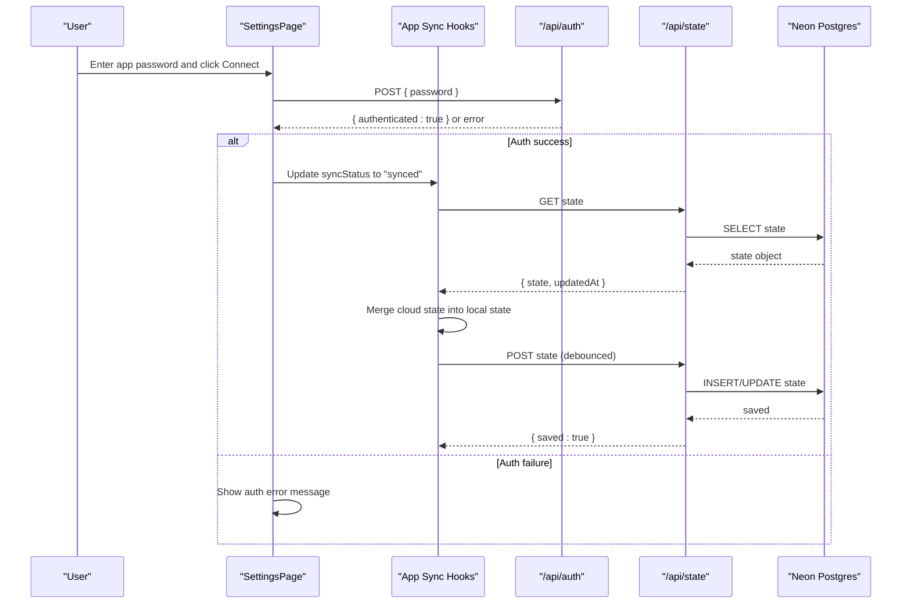
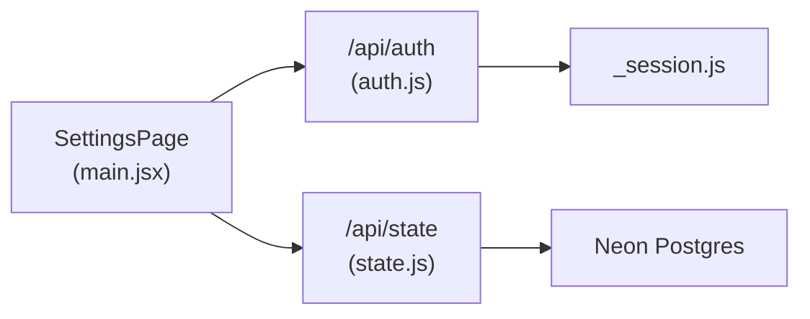

# Settings Component

<cite>
**Referenced Files in This Document**
- [main.jsx](file://src/main.jsx)
- [auth.js](file://api/auth.js)
- [_session.js](file://api/_session.js)
- [state.js](file://api/state.js)
- [README.md](file://README.md)
</cite>

## Table of Contents
1. [Introduction](#introduction)
2. [Project Structure](#project-structure)
3. [Core Components](#core-components)
4. [Architecture Overview](#architecture-overview)
5. [Detailed Component Analysis](#detailed-component-analysis)
6. [Dependency Analysis](#dependency-analysis)
7. [Performance Considerations](#performance-considerations)
8. [Troubleshooting Guide](#troubleshooting-guide)
9. [Conclusion](#conclusion)
10. [Appendices](#appendices)

## Introduction
This document explains the Settings component and its role in configuration and data management for the DSA Tracker application. It covers:
- Cloud sync authentication with password-based login
- Connection status management and data synchronization workflow
- Backup and restore via JSON export/import
- Daily goal configuration and theme switching (light/dark)
- Reset functionality, privacy considerations, and help information about how the tracker works
- Error handling for authentication failures and sync issues

The Settings UI is implemented as a page within the main application and integrates with serverless API routes to authenticate users and synchronize local state to a cloud database.

## Project Structure
The Settings feature spans both client-side React code and serverless API endpoints:
- Client-side: The Settings page and sync logic live in the main application file.
- Server-side: Authentication and state persistence are handled by Vercel Functions under the api directory.

**Diagram sources**
- [main.jsx:656-677](file://src/main.jsx#L656-L677)
- [auth.js:1-30](file://api/auth.js#L1-L30)
- [_session.js:1-60](file://api/_session.js#L1-L60)
- [state.js:1-64](file://api/state.js#L1-L64)

**Section sources**
- [main.jsx:656-677](file://src/main.jsx#L656-L677)
- [auth.js:1-30](file://api/auth.js#L1-L30)
- [_session.js:1-60](file://api/_session.js#L1-L60)
- [state.js:1-64](file://api/state.js#L1-L64)

## Core Components
- SettingsPage: Renders cloud sync controls, data & privacy options, daily goal input, backup import/export, reset, and help content.
- App-level sync hooks: Manage authentication checks, sign-in/sign-out flows, and periodic saving of local state to the cloud.
- API endpoints:
  - /api/auth: Password-based login, session creation, logout, and auth status check.
  - /api/state: Load and save user state to Neon Postgres.

Key responsibilities:
- Authenticate using a single app password configured on the server.
- Maintain connection status states: signed-out, checking, synced, syncing, error, unavailable.
- Persist settings such as dailyGoal and theme locally and to the cloud.
- Provide backup/restore via JSON files and a safe reset option.

**Section sources**
- [main.jsx:656-677](file://src/main.jsx#L656-L677)
- [main.jsx:93-146](file://src/main.jsx#L93-L146)
- [auth.js:1-30](file://api/auth.js#L1-L30)
- [state.js:1-64](file://api/state.js#L1-L64)

## Architecture Overview
The Settings component orchestrates a secure, simple sync flow:
- On app load, it checks if a valid session exists. If so, it loads cloud state; otherwise, it remains in local-only mode.
- When connecting, the user enters an app password. The server validates it against a secret environment variable and issues an HTTP-only session cookie.
- After successful authentication, the app loads any existing cloud state and merges it into local state.
- Changes made locally are debounced and saved to the cloud periodically.
- Users can disconnect at any time, reverting to local-only mode.

**Diagram sources**
- [main.jsx:106-132](file://src/main.jsx#L106-L132)
- [main.jsx:133-146](file://src/main.jsx#L133-L146)
- [auth.js:8-29](file://api/auth.js#L8-L29)
- [state.js:40-63](file://api/state.js#L40-L63)

## Detailed Component Analysis

### SettingsPage: Configuration and Data Management
Responsibilities:
- Cloud sync connect/disconnect with password input and error display.
- Data & Privacy:
  - Export backup as JSON (progress, notes, solutions, activity, settings).
  - Import backup from JSON with validation and merging.
  - Reset local data with confirmation.
- Daily goal configuration: numeric input constrained to a reasonable range.
- Theme switching: toggles between light and dark modes.
- Help section explaining revision spacing, mastery, and backup guidance.

Behavioral highlights:
- Before connecting to cloud sync when local data exists, the user is warned that cloud data may replace local data.
- Export creates a downloadable JSON file with versioning and timestamp metadata.
- Import validates structure and safely updates only recognized fields; invalid backups show an error toast.
- Reset clears progress, notes, solutions, and activity after confirmation.

**Section sources**
- [main.jsx:656-677](file://src/main.jsx#L656-L677)
- [main.jsx:190-193](file://src/main.jsx#L190-L193)

### Cloud Sync Authentication System
Flow:
- The client calls /api/auth with a password.
- The server compares the provided password against a server-side secret using constant-time comparison to prevent timing attacks.
- On success, the server sets an HTTP-only session cookie with an expiration and signature.
- Subsequent requests to /api/state require a valid session; otherwise, they return an unauthorized response.

Security considerations:
- Single-user design: one app password shared across devices.
- Session cookie is HttpOnly and Secure in production environments.
- Environment variables for secrets must not be exposed to the client.

Error handling:
- Incorrect password returns a 401 with an error message.
- Missing server secrets return 500 errors indicating misconfiguration.

**Section sources**
- [auth.js:8-29](file://api/auth.js#L8-L29)
- [_session.js:1-60](file://api/_session.js#L1-L60)
- [main.jsx:106-132](file://src/main.jsx#L106-L132)

### Connection Status Management
States managed by the app:
- signed-out: No active session; local-only mode.
- checking: Initial authentication check in progress.
- synced: Successfully connected and last save succeeded.
- syncing: Saving changes to the cloud.
- error: Last save failed; user should retry later.
- unavailable: Cloud service unreachable.

Transitions:
- On app start, the client checks /api/auth to determine session validity.
- On sign-in, status moves to synced after loading cloud state.
- Periodic saves update status to syncing and then to synced or error based on outcome.
- Sign-out resets to signed-out.

**Section sources**
- [main.jsx:90-132](file://src/main.jsx#L90-L132)
- [main.jsx:133-146](file://src/main.jsx#L133-L146)

### Data Synchronization Workflow
- Local state includes progress, notes, solutions, activity, and settings.
- On change, a short delay triggers a POST to /api/state with the current state snapshot.
- The server sanitizes incoming state to ensure only expected fields are persisted and merges defaults for settings.
- On sign-in, the app fetches the latest cloud state and merges it into local state, ensuring consistency across devices.

Data model:
- Progress: per-problem status, confidence, attempts, revision schedule.
- Notes: structured learning notes per problem.
- Solutions: approaches with explanations and code.
- Activity: daily counts keyed by date.
- Settings: dailyGoal and theme.

**Section sources**
- [main.jsx:93-105](file://src/main.jsx#L93-L105)
- [main.jsx:133-146](file://src/main.jsx#L133-L146)
- [state.js:1-21](file://api/state.js#L1-L21)
- [state.js:40-63](file://api/state.js#L40-L63)

### Backup and Restore Functionality
- Export: Creates a JSON file containing version, progress, notes, solutions, activity, settings, and exportedAt timestamp. Downloaded via a Blob URL.
- Import: Reads a JSON file, validates structure, and merges recognized fields back into local state. Invalid backups trigger an error toast.
- Safety: Import does not overwrite settings unless present in the backup; dailyGoal is clamped to a safe range.

Use cases:
- Before clearing browser storage or moving devices.
- As an additional backup layer alongside cloud sync.

**Section sources**
- [main.jsx:190-193](file://src/main.jsx#L190-L193)
- [README.md:56-59](file://README.md#L56-L59)

### Daily Goal Configuration
- The daily goal determines how many activities count toward the day’s target.
- Stored in settings and reflected in the dashboard’s “Today” indicator.
- Input is constrained to a minimum and maximum value to avoid unrealistic goals.

**Section sources**
- [main.jsx:79](file://src/main.jsx#L79)
- [main.jsx:228](file://src/main.jsx#L228)
- [main.jsx:676](file://src/main.jsx#L676)

### Theme Switching (Light/Dark Mode)
- The theme setting toggles between light and dark modes.
- Applied via a class on the root element to control CSS themes.
- Persists in settings and syncs to the cloud when connected.

**Section sources**
- [main.jsx:79](file://src/main.jsx#L79)
- [main.jsx:207](file://src/main.jsx#L207)
- [state.js:4](file://api/state.js#L4)

### Reset Functionality
- Resets all local progress, notes, solutions, and activity after confirmation.
- When connected to cloud sync, the reset affects the local copy; subsequent sync will reconcile with the cloud.
- Recommended to export a backup before resetting.

**Section sources**
- [main.jsx:192-193](file://src/main.jsx#L192-L193)
- [main.jsx:676](file://src/main.jsx#L676)

### Privacy Considerations
- Single-user design: one app password for all devices. Do not share the password.
- Session cookies are HTTP-only and secured in production.
- Local data persists in the browser even when cloud sync is enabled, providing offline access.
- Export backups contain sensitive progress and notes; store them securely.

**Section sources**
- [README.md:35-50](file://README.md#L35-L50)
- [_session.js:1-60](file://api/_session.js#L1-L60)

### Help Information: How the Tracker Works
- Revision: Spaced repetition schedule (1, 3, 7, 14, 30 days) encourages long-term retention.
- Mastery: Marking a problem as mastered indicates interview readiness and adjusts review cadence.
- Backup: Regular exports protect against device/browser-specific storage limitations.

**Section sources**
- [main.jsx:676](file://src/main.jsx#L676)

## Dependency Analysis
The Settings feature depends on:
- Client-side state management for local persistence and UI interactions.
- Serverless API routes for authentication and state persistence.
- Neon Postgres for cloud storage.

**Diagram sources**
- [main.jsx:656-677](file://src/main.jsx#L656-L677)
- [auth.js:1-30](file://api/auth.js#L1-L30)
- [_session.js:1-60](file://api/_session.js#L1-L60)
- [state.js:1-64](file://api/state.js#L1-L64)

**Section sources**
- [main.jsx:656-677](file://src/main.jsx#L656-L677)
- [auth.js:1-30](file://api/auth.js#L1-L30)
- [_session.js:1-60](file://api/_session.js#L1-L60)
- [state.js:1-64](file://api/state.js#L1-L64)

## Performance Considerations
- Debounced saves reduce network overhead by batching changes before syncing to the cloud.
- Sanitization on the server ensures only expected fields are stored, minimizing payload size and risk.
- Local-first approach keeps the app responsive even when the cloud is unavailable.

[No sources needed since this section provides general guidance]

## Troubleshooting Guide
Common issues and resolutions:
- Authentication failures:
  - Incorrect password: Verify the app password matches the server configuration.
  - Missing secrets: Ensure APP_ACCESS_PASSWORD and SESSION_SECRET are set on the server.
- Sync issues:
  - Database not configured: Ensure DATABASE_URL is set for the serverless function.
  - Network errors: Check connectivity and retry; status will reflect “error” until resolved.
- Storage errors:
  - Browser storage unavailable: An event is dispatched to notify the user; export a backup promptly.
- Session expired:
  - Re-authenticate via Settings → Cloud sync to refresh the session cookie.

Operational tips:
- Use the built-in Export feature to create backups before clearing browser data or troubleshooting.
- Monitor the sync status indicator in the sidebar to understand current state.

**Section sources**
- [auth.js:16-29](file://api/auth.js#L16-L29)
- [_session.js:6-14](file://api/_session.js#L6-L14)
- [state.js:40-63](file://api/state.js#L40-L63)
- [main.jsx:123-152](file://src/main.jsx#L123-L152)

## Conclusion
The Settings component provides a robust, user-friendly interface for managing configuration and data in the DSA Tracker. It supports secure cloud sync with password-based authentication, reliable backup and restore, configurable daily goals, and theme switching. The architecture emphasizes local-first operation with optional cloud persistence, clear connection status feedback, and comprehensive error handling to ensure a smooth user experience.

[No sources needed since this section summarizes without analyzing specific files]

## Appendices

### API Endpoints Reference
- POST /api/auth
  - Purpose: Authenticate with app password and issue session cookie.
  - Request body: { password }
  - Responses:
    - 200: { authenticated: true }
    - 401: { error: "Incorrect password" }
    - 500: { error: "APP_ACCESS_PASSWORD is not configured" } or { error: "SESSION_SECRET is not configured" }
- GET /api/auth
  - Purpose: Check if a valid session exists.
  - Response: { authenticated: boolean }
- DELETE /api/auth
  - Purpose: Clear session cookie (sign out).
  - Response: 204 No Content
- GET /api/state
  - Purpose: Load cloud state. Requires valid session.
  - Response: { state, updatedAt }
- POST /api/state
  - Purpose: Save cloud state. Requires valid session.
  - Request body: { state }
  - Response: { saved: true }

**Section sources**
- [auth.js:8-29](file://api/auth.js#L8-L29)
- [state.js:40-63](file://api/state.js#L40-L63)