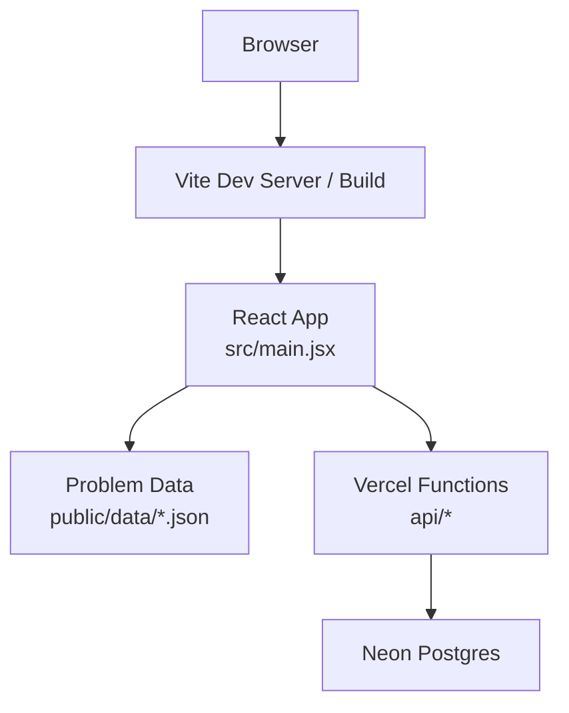
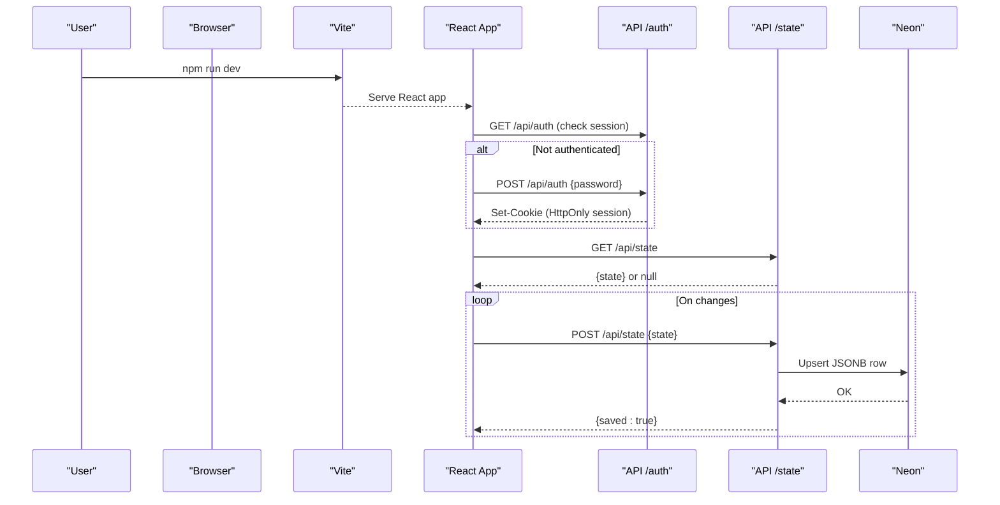
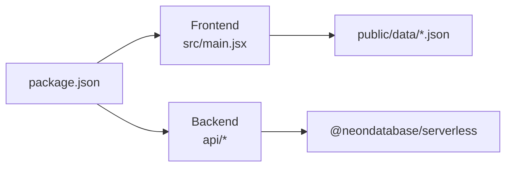

# Getting Started

<cite>
**Referenced Files in This Document**
- [package.json](file://package.json)
- [README.md](file://README.md)
- [index.html](file://index.html)
- [src/main.jsx](file://src/main.jsx)
- [api/auth.js](file://api/auth.js)
- [api/state.js](file://api/state.js)
- [api/_session.js](file://api/_session.js)
- [scripts/prepare-data.mjs](file://scripts/prepare-data.mjs)
</cite>

## Table of Contents
1. Introduction
2. Project Structure
3. Core Components
4. Architecture Overview
5. Detailed Component Analysis
6. Dependency Analysis
7. Performance Considerations
8. Troubleshooting Guide
9. Conclusion
10. Appendices

## Introduction
DSA Tracker is a local-first React/Vite application for the Striver A2Z DSA Sheet. It works fully offline by bundling problem data and keeps progress, notes, solutions, activity, and settings in your browser until you connect cloud sync. You can build and preview the app locally, deploy to Vercel, and optionally enable multi-device sync with a Neon database.

## Project Structure
At a high level:
- The UI is a single-page React app built with Vite.
- Problem data ships with the repository under public/data and can be regenerated from raw sources using a script.
- Cloud sync uses serverless functions under api/ that authenticate via an HTTP-only session cookie and persist state to a Neon Postgres database.

**Diagram sources**
- [package.json:5-10](file://package.json#L5-L10)
- [src/main.jsx:7-12](file://src/main.jsx#L7-L12)
- [api/state.js:1-5](file://api/state.js#L1-L5)

**Section sources**
- [package.json:1-21](file://package.json#L1-L21)
- [README.md:1-59](file://README.md#L1-L59)
- [index.html:1-3](file://index.html#L1-L3)

## Core Components
- Development scripts: dev, build, preview, prepare-data, extract-tuf-links.
- Frontend: React components manage problems, progress, notes, solutions, activity, and settings; also handles cloud sync state persistence and authentication.
- Backend (Vercel Functions):
  - Authentication endpoint issues and validates an HTTP-only session cookie based on a configured app password.
  - State endpoint reads/writes JSONB state to a Neon table created at runtime.

Key responsibilities:
- Local-first storage: All user data is persisted in localStorage and synced to the cloud when connected.
- Spaced revision scheduling: Problems are scheduled for review after 1, 3, 7, 14, and 30 days.
- Filtering and analytics: Dashboard, roadmap, patterns, and analytics views aggregate progress and activity.

**Section sources**
- [package.json:5-10](file://package.json#L5-L10)
- [src/main.jsx:29-114](file://src/main.jsx#L29-L114)
- [api/auth.js:8-23](file://api/auth.js#L8-L23)
- [api/state.js:23-50](file://api/state.js#L23-L50)

## Architecture Overview
The app runs entirely in the browser. When cloud sync is enabled, it authenticates with a secret password and then synchronizes local state to a Neon database through Vercel Functions.

**Diagram sources**
- [src/main.jsx:64-113](file://src/main.jsx#L64-L113)
- [api/auth.js:8-23](file://api/auth.js#L8-L23)
- [api/state.js:23-50](file://api/state.js#L23-L50)
- [api/_session.js:29-49](file://api/_session.js#L29-L49)

## Detailed Component Analysis

### Installation and Environment Setup
- Install dependencies:
  - Run npm install to install all packages defined in package.json.
- Node.js compatibility:
  - The project uses modern ESM scripts and Vite. Use a recent LTS Node.js version (Node 18+ recommended).
- Start development server:
  - Run npm run dev to start the Vite dev server with hot module replacement.
- Build and preview production assets:
  - Run npm run build to create optimized static assets.
  - Run npm run preview to serve the built output locally.

Notes:
- The app bundles problem data from public/data, so dev and build work fully offline.
- If you modify the raw dataset, regenerate bundled data using npm run prepare-data.

**Section sources**
- [package.json:5-10](file://package.json#L5-L10)
- [README.md:21-33](file://README.md#L21-L33)
- [scripts/prepare-data.mjs:1-7](file://scripts/prepare-data.mjs#L1-L7)

### Initial Configuration (Local Development)
- No environment variables are required for local development.
- Problem data is pre-bundled; if you update raw data, rebuild with npm run prepare-data.
- To test API routes locally alongside the UI, use vercel dev after linking the project; plain npm run dev serves only the Vite interface.

**Section sources**
- [README.md:52-53](file://README.md#L52-L53)
- [scripts/prepare-data.mjs:737-748](file://scripts/prepare-data.mjs#L737-L748)

### First-Time User Tutorial
- Open the app in your browser after running npm run dev.
- Navigate using the left sidebar:
  - Dashboard: overview of streaks, due revisions, weak problems, and next steps.
  - A2Z Roadmap: browse problems grouped by topic and pattern; filter by status, difficulty, pattern, favorites, and sort order.
  - Revision: see what’s due now and upcoming reviews.
  - Patterns: view completion per pattern across topics.
  - Analytics: charts for activity, status breakdown, confidence mix, and topic progress.
  - Settings: export/import backups, daily goal, theme, and cloud sync connection.
- Marking a problem:
  - Open a problem from the roadmap or dashboard.
  - Choose a status: Attempted, Solved, or Mastered. Reset returns to Not Started.
  - Adjust confidence levels and schedule revisions.
- Tracking progress:
  - Notes capture insights, mistakes, approach, complexity, and interview cues.
  - Solutions tab supports multiple approaches with explanation and code fields.
  - Activity is recorded each time you mark a problem or complete a revision.

**Section sources**
- [src/main.jsx:47-173](file://src/main.jsx#L47-L173)
- [src/main.jsx:175-249](file://src/main.jsx#L175-L249)
- [src/main.jsx:383-583](file://src/main.jsx#L383-L583)

### Build Process and Preview
- Build:
  - npm run build compiles the React app into static assets suitable for hosting.
- Preview:
  - npm run preview serves the built files locally to verify the production bundle.

**Section sources**
- [package.json:5-10](file://package.json#L5-L10)
- [README.md:28-33](file://README.md#L28-L33)

### Cloud Sync Setup (Multi-Device)
Cloud sync is designed for one user. It uses a single app password stored as a Vercel secret and an HTTP-only session cookie.

Steps:
1. Create or connect a Neon Postgres database in Vercel Storage. Ensure DATABASE_URL is available as an environment variable.
2. Add these secrets in Vercel Project Settings for Production, Preview, and Development:
   - DATABASE_URL: Neon pooled connection string.
   - APP_ACCESS_PASSWORD: a strong password you will enter in Settings on each device.
   - SESSION_SECRET: a random 32+ character value generated with openssl rand -base64 32.
3. Deploy the project as a Vite project. The api/ directory deploys automatically as Vercel Functions.
4. Connect your first device:
   - Open Settings → Cloud sync, enter APP_ACCESS_PASSWORD, and click Connect.
   - Your existing browser data becomes the initial Neon record.
5. Connect additional devices:
   - Enter the same APP_ACCESS_PASSWORD to load and continue using the same record.

Important behaviors:
- Changes are saved with a short delay; concurrent edits on two devices resolve with last-write-wins.
- For local testing of API routes, use vercel dev after linking the project.

Security notes:
- APP_ACCESS_PASSWORD and SESSION_SECRET must not start with VITE_; they are server-only secrets.
- Session cookies are HttpOnly and signed using SESSION_SECRET.

**Section sources**
- [README.md:35-54](file://README.md#L35-L54)
- [api/auth.js:16-22](file://api/auth.js#L16-L22)
- [api/state.js:23-49](file://api/state.js#L23-L49)
- [api/_session.js:6-14](file://api/_session.js#L6-L14)
- [api/_session.js:29-49](file://api/_session.js#L29-L49)
- [src/main.jsx:64-113](file://src/main.jsx#L64-L113)

## Dependency Analysis
- Frontend dependencies include React, ReactDOM, Vite, and Lucide icons.
- Backend dependencies include @neondatabase/serverless for Neon access and Node crypto for session signing.
- The app loads problem metadata from bundled JSON files and optional TUF links.

**Diagram sources**
- [package.json:12-19](file://package.json#L12-L19)
- [src/main.jsx:7-12](file://src/main.jsx#L7-L12)
- [api/state.js:1-2](file://api/state.js#L1-L2)

**Section sources**
- [package.json:12-19](file://package.json#L12-L19)
- [src/main.jsx:7-12](file://src/main.jsx#L7-L12)
- [api/state.js:1-2](file://api/state.js#L1-L2)

## Performance Considerations
- The app is local-first; most operations are fast and do not require network calls unless cloud sync is active.
- Cloud saves are debounced to reduce unnecessary writes.
- Problem data is bundled; avoid large custom datasets in public/data to keep startup fast.
- Use filters and sorting in the roadmap to limit rendering cost when browsing many problems.

[No sources needed since this section provides general guidance]

## Troubleshooting Guide
Common issues and resolutions:
- Cannot connect cloud sync:
  - Verify DATABASE_URL, APP_ACCESS_PASSWORD, and SESSION_SECRET are set in Vercel for the correct environment.
  - Ensure the API routes are deployed (api/ folder) and accessible.
  - Check browser console for network errors and confirm the session cookie is set.
- Database errors:
  - Confirm Neon credentials are valid and the database is reachable.
  - The state endpoint creates the table automatically; ensure no schema conflicts exist.
- Local API testing:
  - Use vercel dev to run both UI and API routes locally; plain npm run dev does not serve Vercel Functions.
- Data integrity:
  - Export backups regularly from Settings. Import restores previous states.

**Section sources**
- [README.md:35-54](file://README.md#L35-L54)
- [api/auth.js:16-22](file://api/auth.js#L16-L22)
- [api/state.js:23-49](file://api/state.js#L23-L49)
- [api/_session.js:6-14](file://api/_session.js#L6-L14)
- [src/main.jsx:64-113](file://src/main.jsx#L64-L113)

## Conclusion
You can run DSA Tracker locally without any external services, track progress offline, and optionally enable cloud sync for multi-device usage. Follow the installation steps, explore the roadmap and revision tools, and connect cloud sync when ready. Regularly export backups to safeguard your progress.

[No sources needed since this section summarizes without analyzing specific files]

## Appendices

### Quick Commands
- Install: npm install
- Develop: npm run dev
- Build: npm run build
- Preview: npm run preview
- Prepare data: npm run prepare-data

**Section sources**
- [package.json:5-10](file://package.json#L5-L10)
- [README.md:21-33](file://README.md#L21-L33)