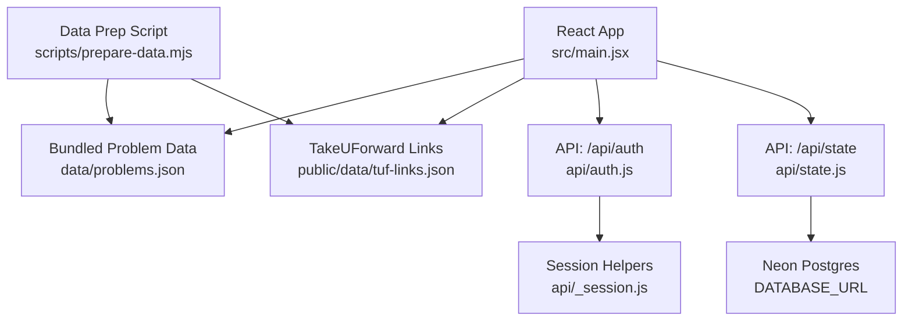
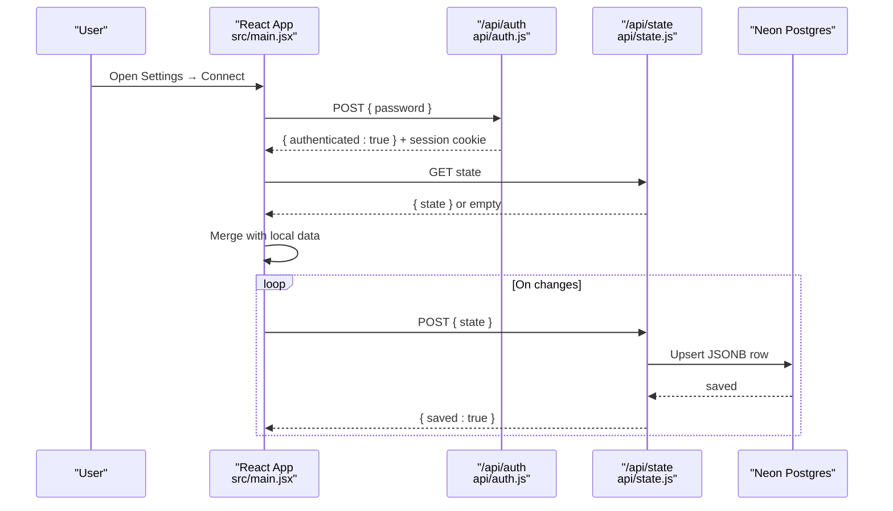
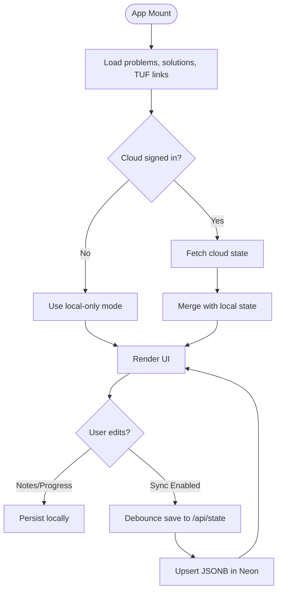
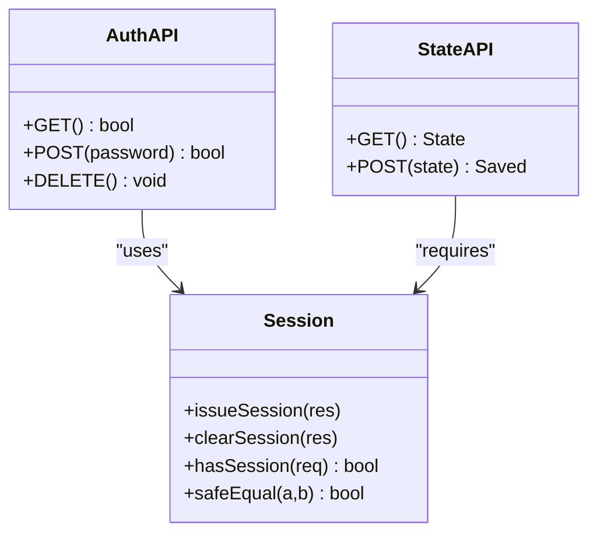
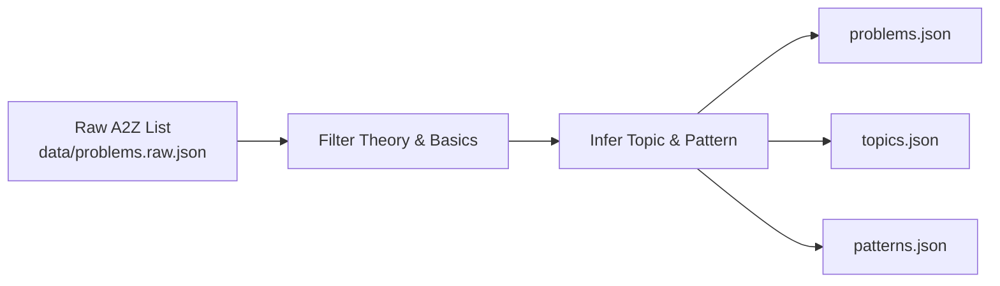
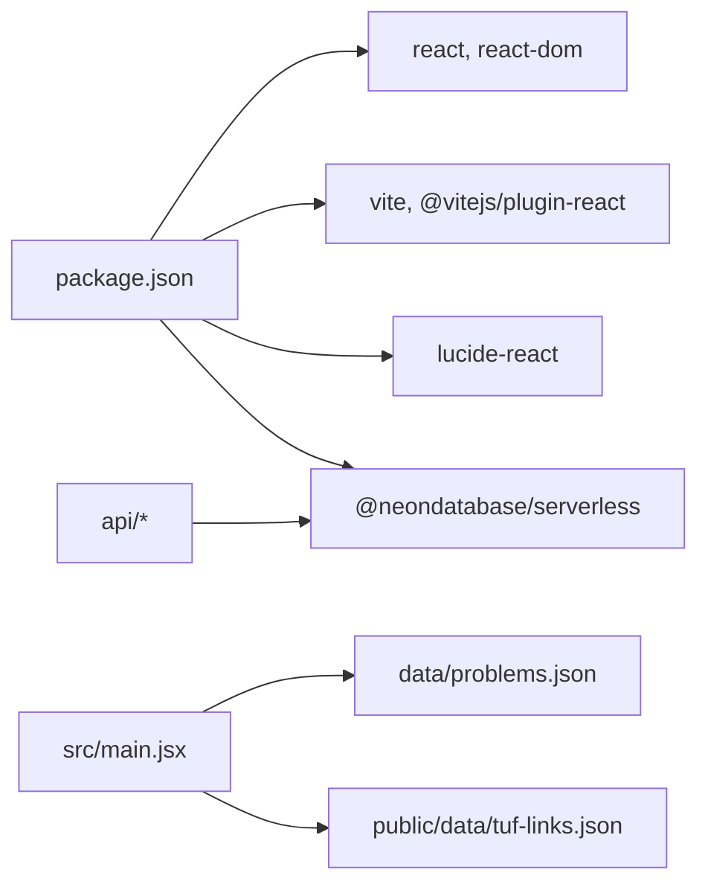

# Project Overview

<cite>
**Referenced Files in This Document**
- [README.md](file://README.md)
- [package.json](file://package.json)
- [src/main.jsx](file://src/main.jsx)
- [api/auth.js](file://api/auth.js)
- [api/state.js](file://api/state.js)
- [api/_session.js](file://api/_session.js)
- [scripts/prepare-data.mjs](file://scripts/prepare-data.mjs)
- [data/problems.json](file://data/problems.json)
- [public/data/tuf-links.json](file://public/data/tuf-links.json)
</cite>

## Table of Contents
1. [Introduction](#introduction)
2. [Project Structure](#project-structure)
3. [Core Components](#core-components)
4. [Architecture Overview](#architecture-overview)
5. [Detailed Component Analysis](#detailed-component-analysis)
6. [Dependency Analysis](#dependency-analysis)
7. [Performance Considerations](#performance-considerations)
8. [Troubleshooting Guide](#troubleshooting-guide)
9. [Conclusion](#conclusion)

## Introduction
DSA Tracker is a local-first React/Vite application designed to help learners systematically practice and master problems from the Striver A2Z DSA Sheet (TakeUForward). It focuses on problem tracking, spaced repetition, optional cloud synchronization, and analytics to support consistent learning and interview readiness.

Key value propositions:
- Local-first design: works fully offline with bundled problem data; progress, notes, solutions, activity, and settings persist in the browser until you choose to sync.
- Spaced repetition: built-in revision scheduling that moves problems further into the future as you review them, reinforcing long-term retention.
- Cloud sync (optional): connect one device at a time using a single app password to synchronize your state to a Neon Postgres database via serverless functions.
- Analytics: dashboards for completion, streaks, topic mastery, confidence levels, and recent activity to guide focused study.
- TakeUForward integration: problems are grouped by official A2Z topics and subcategory patterns, with links to TakeUForward resources where available.

Target audience:
- DSA learners preparing for coding interviews who want a structured, self-paced, and trackable approach aligned with the A2Z curriculum.

**Section sources**
- [README.md:1-19](file://README.md#L1-L19)

## Project Structure
The project is organized into a client-side React/Vite app, a small serverless API layer for authentication and cloud persistence, and curated datasets for problems and TakeUForward links.

**Diagram sources**
- [src/main.jsx:47-113](file://src/main.jsx#L47-L113)
- [api/auth.js:8-23](file://api/auth.js#L8-L23)
- [api/state.js:23-49](file://api/state.js#L23-L49)
- [api/_session.js:1-54](file://api/_session.js#L1-L54)
- [scripts/prepare-data.mjs:1-768](file://scripts/prepare-data.mjs#L1-L768)
- [data/problems.json:1-200](file://data/problems.json#L1-L200)
- [public/data/tuf-links.json:1-200](file://public/data/tuf-links.json#L1-L200)

**Section sources**
- [package.json:1-21](file://package.json#L1-L21)
- [README.md:21-55](file://README.md#L21-L55)

## Core Components
- Problem catalog and grouping: Curated A2Z problems with topic and pattern metadata enable filtering, roadmap navigation, and pattern-based learning.
- Progress and notes: Track status (Not Started, Attempted, Solved, Mastered), confidence levels, attempts, favorites, and per-problem learning notes.
- Spaced repetition scheduler: Automatic next-revision dates based on a fixed interval schedule; due items surface in Revision view.
- Analytics dashboard: Completion rates, streaks, topic breakdowns, difficulty distribution, and last-14-days activity.
- Optional cloud sync: Secure sign-in with an app password; state persisted to Neon via serverless endpoints.

How it integrates with TakeUForward:
- Problems are grouped by A2Z topics and official subcategory patterns inferred from titles.
- Per-problem links to TakeUForward blogs or problem pages are provided via a bundled mapping.

**Section sources**
- [src/main.jsx:47-173](file://src/main.jsx#L47-L173)
- [scripts/prepare-data.mjs:55-768](file://scripts/prepare-data.mjs#L55-L768)
- [public/data/tuf-links.json:1-200](file://public/data/tuf-links.json#L1-L200)

## Architecture Overview
The app runs entirely in the browser with local storage for all user data by default. When cloud sync is enabled, a minimal serverless backend authenticates sessions and persists a single JSON state object to Neon.

**Diagram sources**
- [src/main.jsx:64-113](file://src/main.jsx#L64-L113)
- [api/auth.js:8-23](file://api/auth.js#L8-L23)
- [api/state.js:23-49](file://api/state.js#L23-L49)

## Detailed Component Analysis

### Frontend Application (React/Vite)
- Single-file app orchestrating views: Dashboard, A2Z Roadmap, Revision, Patterns, Analytics, Settings, and Problem detail.
- Local state management via localStorage-backed hooks; enriched problem list merges progress into each item.
- Spaced repetition logic schedules next revisions using a fixed interval sequence and surfaces due items.
- Filtering and sorting across topic, status, difficulty, pattern, favorites, and sort order.
- Analytics compute topic/difficulty breakdowns, confidence mix, and last-14-days activity.

**Diagram sources**
- [src/main.jsx:47-113](file://src/main.jsx#L47-L113)
- [src/main.jsx:115-173](file://src/main.jsx#L115-L173)

**Section sources**
- [src/main.jsx:47-609](file://src/main.jsx#L47-L609)

### Serverless API (Authentication and State)
- Authentication: Validates a single app password, issues an HTTP-only session cookie, and exposes a check endpoint.
- State persistence: Requires authentication, creates a table if needed, reads/writes a single JSONB record representing all tracker state.
- Session helpers: Signed cookies with HMAC verification and expiration handling.

**Diagram sources**
- [api/auth.js:8-23](file://api/auth.js#L8-L23)
- [api/state.js:23-49](file://api/state.js#L23-L49)
- [api/_session.js:1-54](file://api/_session.js#L1-L54)

**Section sources**
- [api/auth.js:1-24](file://api/auth.js#L1-L24)
- [api/state.js:1-51](file://api/state.js#L1-L51)
- [api/_session.js:1-54](file://api/_session.js#L1-L54)

### Data Preparation and Curriculum Integration
- The prepare script curates raw problems, removes theory/intro entries, infers TakeUForward subcategory patterns, and outputs normalized problem lists, topics, and pattern catalogs.
- Output files are consumed by the app to provide offline-first problem browsing and analytics.

**Diagram sources**
- [scripts/prepare-data.mjs:8-18](file://scripts/prepare-data.mjs#L8-L18)
- [scripts/prepare-data.mjs:55-768](file://scripts/prepare-data.mjs#L55-L768)

**Section sources**
- [scripts/prepare-data.mjs:1-768](file://scripts/prepare-data.mjs#L1-L768)

## Dependency Analysis
- Frontend dependencies: React, Vite, Lucide icons.
- Backend dependencies: Neon serverless driver for Postgres.
- Data dependencies: Bundled problem sets and TakeUForward link mappings.

**Diagram sources**
- [package.json:1-21](file://package.json#L1-L21)
- [src/main.jsx:47-113](file://src/main.jsx#L47-L113)
- [api/state.js:1-51](file://api/state.js#L1-L51)

**Section sources**
- [package.json:1-21](file://package.json#L1-L21)

## Performance Considerations
- Offline-first: All problem data is bundled; no network calls required for core usage.
- Local persistence: Frequent writes to localStorage are lightweight; cloud sync is debounced to reduce requests.
- Efficient filtering: In-memory filtering and grouping over the problem set scales well for typical A2Z sizes.
- Minimal backend: Single JSONB row reduces database complexity and query overhead.

[No sources needed since this section provides general guidance]

## Troubleshooting Guide
- Cannot load problem data: Ensure the dev/build process includes public/data assets; errors will show a toast when fetch fails.
- Cloud sync unavailable:
  - Verify DATABASE_URL is configured in environment variables.
  - Ensure APP_ACCESS_PASSWORD and SESSION_SECRET are set.
  - Use vercel dev to test API routes locally; plain npm run dev serves only the frontend.
- Sync conflicts: If editing two devices simultaneously, the last completed save wins. Export backups regularly to avoid loss.
- Session issues: Clearing cookies or changing devices requires re-authentication with the app password.

**Section sources**
- [README.md:35-55](file://README.md#L35-L55)
- [api/state.js:23-49](file://api/state.js#L23-L49)
- [api/auth.js:8-23](file://api/auth.js#L8-L23)

## Conclusion
DSA Tracker offers a focused, local-first learning experience aligned with the Striver A2Z curriculum. It combines problem tracking, spaced repetition, and analytics with optional cloud synchronization to help learners build consistency, identify weak areas, and achieve interview-ready mastery. Its simple architecture—React/Vite frontend, minimal serverless API, and Neon database—keeps setup straightforward while delivering powerful learning outcomes.

[No sources needed since this section summarizes without analyzing specific files]