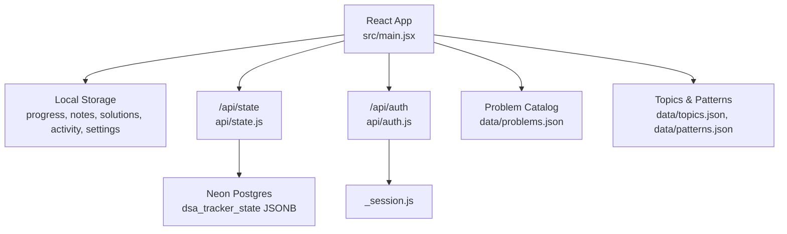
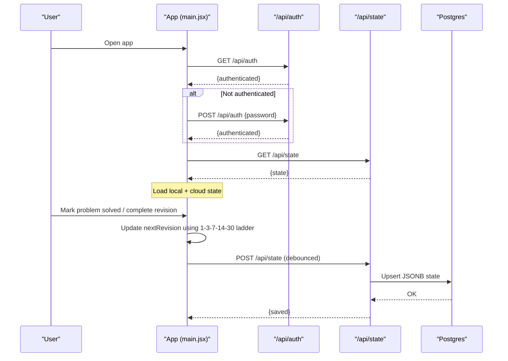
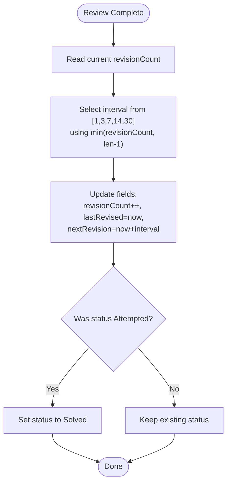
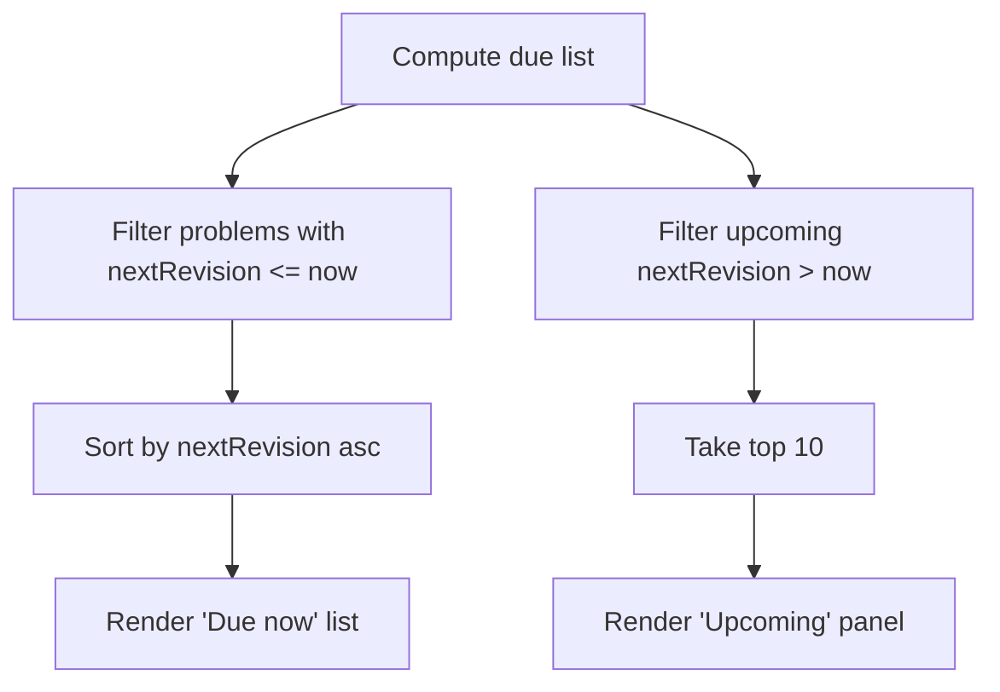
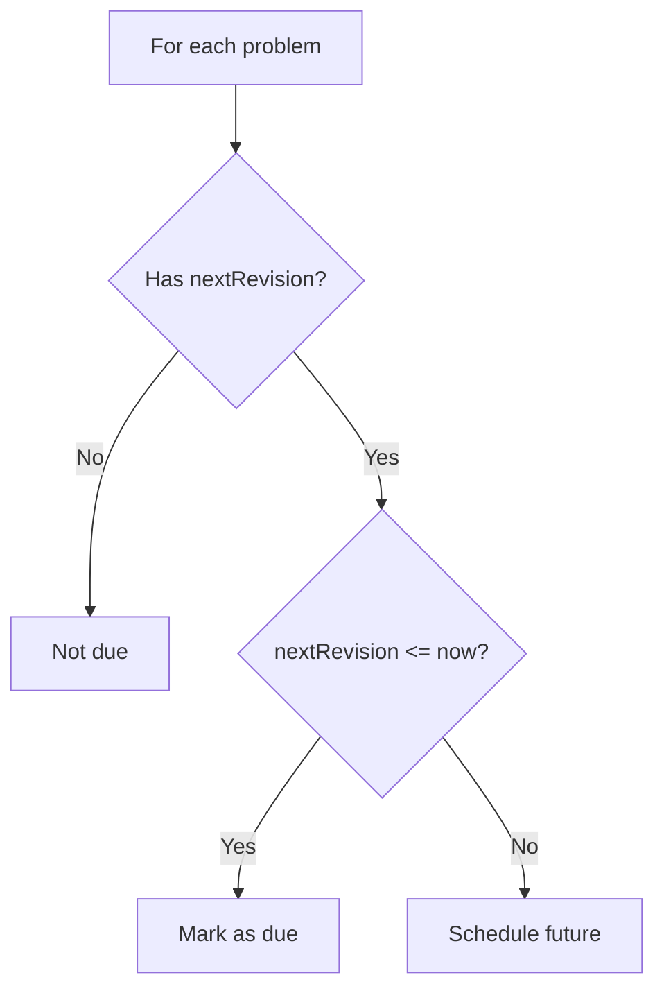
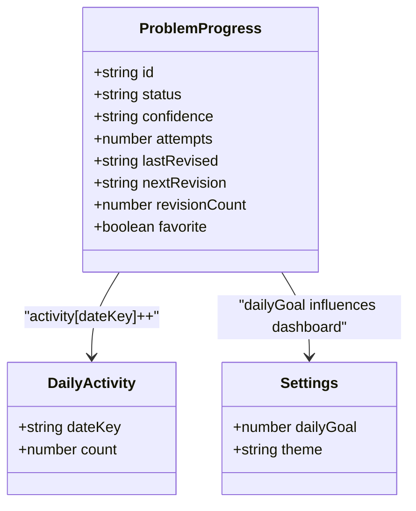
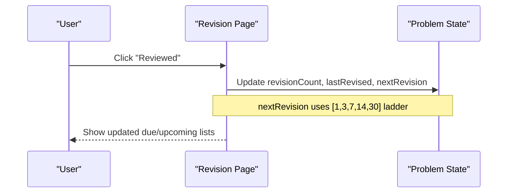
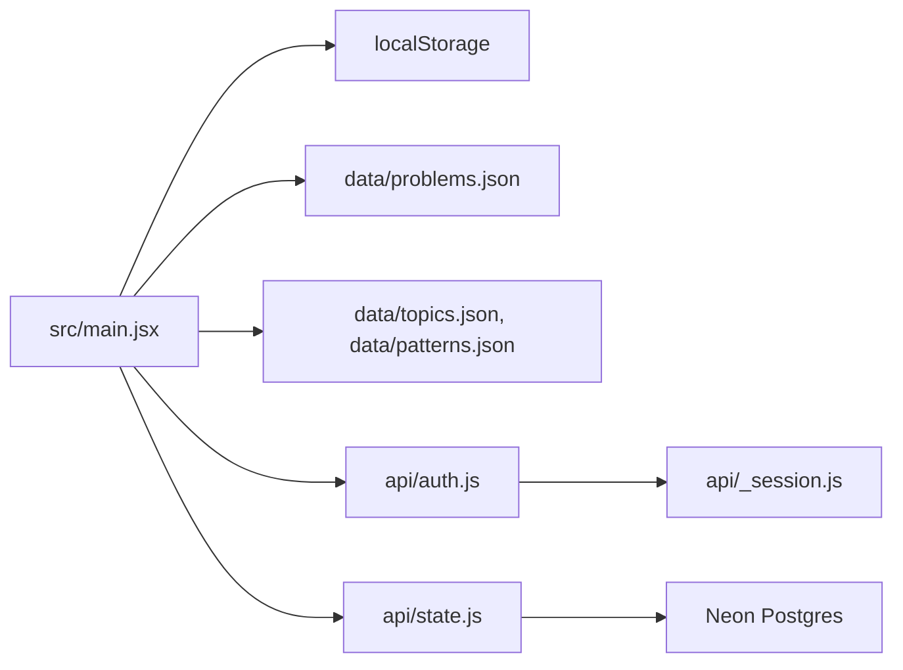

# Spaced Repetition System

<cite>
**Referenced Files in This Document**
- [main.jsx](file://src/main.jsx)
- [state.js](file://api/state.js)
- [auth.js](file://api/auth.js)
- [_session.js](file://api/_session.js)
- [problems.json](file://data/problems.json)
- [topics.json](file://data/topics.json)
- [patterns.json](file://data/patterns.json)
</cite>

## Table of Contents
1. [Introduction](#introduction)
2. [Project Structure](#project-structure)
3. [Core Components](#core-components)
4. [Architecture Overview](#architecture-overview)
5. [Detailed Component Analysis](#detailed-component-analysis)
6. [Dependency Analysis](#dependency-analysis)
7. [Performance Considerations](#performance-considerations)
8. [Troubleshooting Guide](#troubleshooting-guide)
9. [Conclusion](#conclusion)
10. [Appendices](#appendices)

## Introduction
This document explains the spaced repetition system implemented for DSA skill retention. The system schedules problem reviews using a fixed 1-3-7-14-30 day interval ladder, maintains a revision queue, calculates due problems, and tracks progress locally with optional cloud sync. It adapts to user performance by advancing revision steps on successful reviews and integrates with the broader learning workflow (attempt → record → revise).

## Project Structure
The application is a local-first React/Vite app with an optional serverless API for cloud sync. Core logic lives in the frontend; the backend persists state to a Neon Postgres database behind authentication.

**Diagram sources**
- [main.jsx:47-173](file://src/main.jsx#L47-L173)
- [state.js:23-50](file://api/state.js#L23-L50)
- [auth.js:8-23](file://api/auth.js#L8-L23)
- [_session.js:29-51](file://api/_session.js#L29-L51)
- [problems.json:1-20](file://data/problems.json#L1-L20)
- [topics.json:1-20](file://data/topics.json#L1-L20)
- [patterns.json:1-91](file://data/patterns.json#L1-L91)

**Section sources**
- [main.jsx:47-173](file://src/main.jsx#L47-L173)
- [state.js:23-50](file://api/state.js#L23-L50)
- [auth.js:8-23](file://api/auth.js#L8-L23)
- [_session.js:29-51](file://api/_session.js#L29-L51)
- [problems.json:1-20](file://data/problems.json#L1-L20)
- [topics.json:1-20](file://data/topics.json#L1-L20)
- [patterns.json:1-91](file://data/patterns.json#L1-L91)

## Core Components
- Spaced repetition schedule: Fixed intervals [1, 3, 7, 14, 30] days define the revision ladder. Each review advances the step index based on current revision count.
- Revision queue management: Problems are considered due when their nextRevision timestamp is less than or equal to the current time. The queue sorts by earliest due date.
- Due calculation logic: A problem is due if it has a nextRevision set and that date/time is in the past or present.
- Progress tracking: Per-problem fields include status, confidence, attempts, lastRevised, nextRevision, and revisionCount. Activity is tracked per day to compute streaks and daily goals.
- Cloud sync: Optional persistence of progress, notes, solutions, activity, and settings via authenticated endpoints.

Key algorithm parameters and customization:
- Intervals: [1, 3, 7, 14, 30] days.
- Status transitions: Marking a problem updates lastRevised, nextRevision, revisionCount, attempts, and optionally confidence.
- Daily goal: Configurable number of activities per day.
- Theme and other UI preferences stored in settings.

**Section sources**
- [main.jsx:12-12](file://src/main.jsx#L12-L12)
- [main.jsx:116-126](file://src/main.jsx#L116-L126)
- [main.jsx:247-248](file://src/main.jsx#L247-L248)
- [main.jsx:442-455](file://src/main.jsx#L442-L455)
- [main.jsx:479-479](file://src/main.jsx#L479-L479)
- [main.jsx:586-606](file://src/main.jsx#L586-L606)

## Architecture Overview
The spaced repetition system runs primarily in the browser. When enabled, changes are synced to a secure cloud store after a short delay. Authentication ensures only the owner can read/write state.

**Diagram sources**
- [main.jsx:64-113](file://src/main.jsx#L64-L113)
- [auth.js:8-23](file://api/auth.js#L8-L23)
- [state.js:23-50](file://api/state.js#L23-L50)
- [_session.js:29-51](file://api/_session.js#L29-L51)

## Detailed Component Analysis

### Spaced Repetition Algorithm
- Interval ladder: [1, 3, 7, 14, 30] days.
- Step selection: For a given revisionCount, the next interval is chosen by indexing into the ladder with min(revisionCount, length-1).
- On review completion:
  - Increment revisionCount.
  - Set lastRevised to now.
  - Compute nextRevision = now + interval[step].
  - If status was Attempted, advance to Solved.
- On manual scheduling:
  - Same update as above without incrementing attempts.

**Diagram sources**
- [main.jsx:247-248](file://src/main.jsx#L247-L248)
- [main.jsx:442-455](file://src/main.jsx#L442-L455)
- [main.jsx:479-479](file://src/main.jsx#L479-L479)

**Section sources**
- [main.jsx:12-12](file://src/main.jsx#L12-L12)
- [main.jsx:247-248](file://src/main.jsx#L247-L248)
- [main.jsx:442-455](file://src/main.jsx#L442-L455)
- [main.jsx:479-479](file://src/main.jsx#L479-L479)

### Revision Queue Management
- Due set: All problems where nextRevision exists and is less than or equal to current time.
- Sorting: By ascending nextRevision so the most overdue appear first.
- Upcoming preview: Next 10 scheduled revisions shown with dates and days until due.

**Diagram sources**
- [main.jsx:116-126](file://src/main.jsx#L116-L126)
- [main.jsx:177-178](file://src/main.jsx#L177-L178)
- [main.jsx:247-248](file://src/main.jsx#L247-L248)

**Section sources**
- [main.jsx:116-126](file://src/main.jsx#L116-L126)
- [main.jsx:177-178](file://src/main.jsx#L177-L178)
- [main.jsx:247-248](file://src/main.jsx#L247-L248)

### Due Problem Calculation Logic
- A problem is due if:
  - It has a nextRevision field set.
  - The timestamp is less than or equal to the current time.
- The dashboard and analytics pages compute counts using this rule.

**Diagram sources**
- [main.jsx:116-126](file://src/main.jsx#L116-L126)
- [main.jsx:177-178](file://src/main.jsx#L177-L178)

**Section sources**
- [main.jsx:116-126](file://src/main.jsx#L116-L126)
- [main.jsx:177-178](file://src/main.jsx#L177-L178)

### Progress Tracking Mechanisms
- Per-problem metadata:
  - status: Not Started | Attempted | Solved | Mastered
  - confidence: Weak | Learning | Strong | Interview Ready
  - attempts: incremented when marking non-Not Started
  - lastRevised: timestamp of last review
  - nextRevision: scheduled next review date/time
  - revisionCount: number of completed reviews
- Daily activity:
  - Count of activities per day used to show today’s progress vs dailyGoal and to compute streaks.
- Settings:
  - dailyGoal: target activities per day
  - theme: light/dark

**Diagram sources**
- [main.jsx:47-54](file://src/main.jsx#L47-L54)
- [main.jsx:140-141](file://src/main.jsx#L140-L141)
- [main.jsx:442-455](file://src/main.jsx#L442-L455)
- [main.jsx:586-606](file://src/main.jsx#L586-L606)

**Section sources**
- [main.jsx:47-54](file://src/main.jsx#L47-L54)
- [main.jsx:140-141](file://src/main.jsx#L140-L141)
- [main.jsx:442-455](file://src/main.jsx#L442-L455)
- [main.jsx:586-606](file://src/main.jsx#L586-L606)

### Handling Missed Revisions and Schedule Adaptation
- Missed items remain in the due list until reviewed; they accumulate at the top of the queue sorted by earliest due date.
- After completing a review, the next revision is rescheduled further out using the same interval ladder, preventing immediate re-due.
- Manual “Schedule revision” action allows resetting the next revision to the next interval step without changing attempts.

**Diagram sources**
- [main.jsx:247-248](file://src/main.jsx#L247-L248)
- [main.jsx:479-479](file://src/main.jsx#L479-L479)

**Section sources**
- [main.jsx:247-248](file://src/main.jsx#L247-L248)
- [main.jsx:479-479](file://src/main.jsx#L479-L479)

### Integration with Learning Workflow
- Attempt → Record → Revise loop is emphasized in the dashboard and problem page.
- Notes and solutions capture insights, mistakes, approaches, and complexity to support high-quality reviews.
- Confidence levels help prioritize weak areas in analytics and roadmap views.

**Section sources**
- [main.jsx:175-185](file://src/main.jsx#L175-L185)
- [main.jsx:383-583](file://src/main.jsx#L383-L583)

## Dependency Analysis
The spaced repetition logic depends on:
- Local state stores (localStorage) for progress, notes, solutions, activity, settings.
- Problem catalog and topic/pattern metadata for display and filtering.
- Optional cloud endpoints for authentication and state persistence.

**Diagram sources**
- [main.jsx:47-173](file://src/main.jsx#L47-L173)
- [auth.js:8-23](file://api/auth.js#L8-L23)
- [_session.js:29-51](file://api/_session.js#L29-L51)
- [state.js:23-50](file://api/state.js#L23-L50)
- [problems.json:1-20](file://data/problems.json#L1-L20)
- [topics.json:1-20](file://data/topics.json#L1-L20)
- [patterns.json:1-91](file://data/patterns.json#L1-L91)

**Section sources**
- [main.jsx:47-173](file://src/main.jsx#L47-L173)
- [auth.js:8-23](file://api/auth.js#L8-L23)
- [_session.js:29-51](file://api/_session.js#L29-L51)
- [state.js:23-50](file://api/state.js#L23-L50)
- [problems.json:1-20](file://data/problems.json#L1-L20)
- [topics.json:1-20](file://data/topics.json#L1-L20)
- [patterns.json:1-91](file://data/patterns.json#L1-L91)

## Performance Considerations
- Client-side computations: Filtering and sorting the problem list for due/upcoming sets are O(n) per render; acceptable for typical catalog sizes.
- Debounced sync: Cloud saves are delayed to reduce network overhead during rapid edits.
- Local storage writes: Persisted on every state change; consider batching if dataset grows significantly.

[No sources needed since this section provides general guidance]

## Troubleshooting Guide
- Cloud sync not connecting:
  - Ensure APP_ACCESS_PASSWORD and SESSION_SECRET are configured on the server.
  - Verify session cookie handling and environment variables.
- Save failures:
  - Check DATABASE_URL configuration and network connectivity.
  - Review error responses from /api/state.
- Missing revisions:
  - Confirm nextRevision is set and timestamps are correct.
  - Use manual “Schedule revision” to reset next due date if needed.

**Section sources**
- [auth.js:16-22](file://api/auth.js#L16-L22)
- [_session.js:6-14](file://api/_session.js#L6-L14)
- [state.js:23-50](file://api/state.js#L23-L50)
- [main.jsx:64-113](file://src/main.jsx#L64-L113)

## Conclusion
The spaced repetition system implements an evidence-based 1-3-7-14-30 day interval schedule to optimize long-term retention of DSA skills. It maintains a clear revision queue, calculates due problems deterministically, and tracks progress through structured fields and daily activity. With optional cloud sync, users can persist and continue their learning across devices while keeping a robust local-first experience.

[No sources needed since this section summarizes without analyzing specific files]

## Appendices

### Mathematical Foundation and Effectiveness
- Spaced repetition leverages the forgetting curve: reviewing material just before it is likely to be forgotten strengthens memory traces and extends the interval until the next review.
- The fixed interval schedule approximates optimal spacing for durable retention, balancing cognitive load and recall effort.
- For DSA skills, repeated retrieval practice with increasing delays supports pattern recognition, solution fluency, and interview readiness.

[No sources needed since this section provides conceptual background]

### Customization Options
- Interval ladder: Currently fixed to [1, 3, 7, 14, 30] days.
- Daily goal: Adjustable via settings to tailor workload.
- Confidence levels: Allow focusing on weak areas.
- Notes and solutions: Encourage deeper encoding and elaborative rehearsal.

**Section sources**
- [main.jsx:12-12](file://src/main.jsx#L12-L12)
- [main.jsx:586-606](file://src/main.jsx#L586-L606)